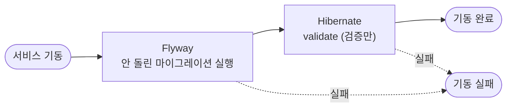

# DB 마이그레이션 (Flyway)

JPA 서비스(member / file / notification)의 테이블 구조를 Flyway로 관리하는 방식을 정리한 문서입니다.

---

## 1. 도입 배경

#359 전까지는 Hibernate `ddl-auto=update`가 기동할 때마다 엔티티를 보고 테이블을 알아서 맞췄다.
처음엔 편하지만, 서비스가 자라면서 아래 문제들이 실제로 쌓였다.

| 문제 | update에서 일어난 일 | Flyway에서는 |
|---|---|---|
| **추가만 할 줄 안다** | 테이블·컬럼 추가는 되지만 컬럼 삭제, 이름 변경, 타입 변경, NOT NULL 추가, 제약·인덱스 삭제는 못 한다. 엔티티에서 지운 컬럼(예: `file.link_token`)도 DB에 계속 남았다 | 원하는 DDL을 SQL로 그대로 쓴다 |
| **땜질용 Java 코드가 쌓임** | update가 못 하는 변경마다 기동 시 도는 수동 마이그레이션 클래스를 만들었다. file-service에만 5개 — `directory`→`is_directory` 이름 변경, 옛 유니크 제약·인덱스 삭제, `trashed_at`·`granted_role` 값 채우기, `file.favorite` → `file_favorite` 이전 | 한 번 실행되면 기록이 남아 다시 안 돈다. 데이터 이전도 같은 SQL 파일에 |
| **어쩔 수 없이 nullable** | 행이 있는 테이블에 NOT NULL 컬럼을 추가하지 못해서, 앱은 항상 값을 넣는데도 DB는 nullable인 컬럼이 생겼다 | 값 채우기 → NOT NULL을 한 파일에서 순서대로 |
| **스키마 변경이 리뷰에 안 보임** | 엔티티 diff만 보고 DB에 무슨 DDL이 나갈지 추측해야 했다 | PR에 실행될 SQL이 그대로 보인다 |
| **DB 상태를 알 수 없음** | 어떤 DB가 어떤 변경까지 받았는지 기록이 없다. 기동 순서·시점에 따라 로컬마다 스키마가 조금씩 달랐다 | `flyway_schema_history`에 버전별 적용 기록 |
| **운영에서 쓸 수 없음** | 앱이 기동하면서 운영 DB를 마음대로 바꾸는 구조라, 실패하면 반쯤 바뀐 채로 남을 수 있다. AWS(RDS) 이관 전에 반드시 끄기로 한 항목(`.docs/aws-migration.md`) | 검증된 SQL만 정해진 순서로. 앱은 validate만 |
| **테스트와 운영의 스키마가 다름** | 테스트는 H2 + `create-drop`이라 운영과 다른 스키마에서 통과할 수 있었다 | 테스트도 같은 마이그레이션으로 만든 Postgres 스키마에서 돈다(6장) |

**Liquibase가 아니라 Flyway를 고른 이유** — 둘 다 표준 도구다. Liquibase는 XML/YAML로 DB 종류와 무관하게 쓰고 롤백까지
정의할 수 있지만 그만큼 배울 게 많다. 이 프로젝트는 Postgres 하나만 쓰고 SQL을 직접 읽고 쓰는 편이 리뷰하기 쉬워서,
순수 SQL 파일 + 버전 번호가 전부인 Flyway가 더 맞았다. Spring Boot가 기본 지원해서 설정도 거의 필요 없다.

---

## 2. 한눈에 보기



- Flyway는 `db/migration`(dev 프로필이면 `db/seed`까지)에서 `flyway_schema_history`에 없는 파일만 버전 순서대로 실행한다.
  이미 적용된 파일이 수정됐거나(체크섬 불일치) SQL이 실패하면 기동이 멈춘다.
- 스키마를 바꾸는 유일한 방법은 **새 마이그레이션 파일을 추가하는 것**. 엔티티만 고치면 validate에서 기동이 막힌다.
- 서비스마다 자기 DB, 자기 마이그레이션, 자기 `flyway_schema_history`를 가진다(서비스 간 공유 없음).
- 같은 서비스를 여러 대 동시에 띄워도 Flyway가 DB 락을 잡아서 한 대만 마이그레이션을 실행한다.

---

## 3. 구성

| 위치 | 역할 |
|---|---|
| `common/infrastructure/jpa/build.gradle` | `spring-boot-starter-flyway` + `flyway-database-postgresql` (Flyway 12.4). JPA 모듈을 쓰는 서비스는 자동으로 Flyway 포함 |
| `common/infrastructure/jpa/src/main/resources/application-jpa.yml` | `ddl-auto: validate`, `dev` 프로필일 때만 `flyway.locations`에 `db/seed` 추가 |
| `services/<svc>/src/main/resources/db/migration/` | 운영 포함 모든 환경에 적용되는 스키마 마이그레이션 |
| `services/<svc>/src/main/resources/db/seed/` | 로컬 개발용 데이터(테스트 유저). `dev` 프로필에서만 적용 |
| `.docker/init/01_postgres_init.sh` | DB와 서비스별 계정 생성만 담당. 테이블·데이터는 만들지 않음 |
| `services/<svc>/src/test/resources/config/application.yml` | 테스트 DB를 Testcontainers Postgres로 지정 (6장) |

역할 분리:

- **init 스크립트** — "DB와 계정이 존재한다"까지. Postgres 볼륨이 비어 있을 때 한 번만 실행된다.
  Flyway는 이미 있는 DB에 접속해서 테이블만 만들 수 있고 DB·로그인 계정은 못 만들기 때문에 여전히 필요하다(서비스 계정에 슈퍼유저 권한을 줄 순 없음). AWS 이관 후엔 RDS의 DB·계정을 Terraform이 만들고, 이 스크립트는 로컬 전용이 된다.
- **Flyway** — "테이블이 이 모양이다"와 dev 시드 데이터.
- **Hibernate** — 검증만.

---

## 4. 새 마이그레이션 추가하기

### 절차

1. `services/<svc>/src/main/resources/db/migration/`에 다음 버전 파일을 만든다. 예: `V2__add_file_description.sql`
2. 같은 커밋에서 엔티티도 고친다. **SQL과 엔티티는 항상 같은 PR에 함께.**
3. `./gradlew :services:<svc>:test` — persistence 테스트가 새 마이그레이션을 적용한 Postgres에서 validate까지 돈다.
   엔티티와 SQL이 어긋나면 여기서 `Schema validation: ...`으로 실패한다.
4. 로컬 서비스를 다시 띄우면 Flyway가 V2만 추가로 실행한다(`make reset` 불필요).

### 파일 이름 규칙

- `V<버전>__<설명>.sql` — 밑줄 **두 개**. 설명은 소문자 snake_case.
- 버전은 서비스 안에서 증가하기만 한다. 서비스끼리는 버전이 겹쳐도 된다(DB가 따로라서).
- `V1_1`처럼 소수 버전은 dev 시드용으로 쓰고 있다. 스키마 마이그레이션은 정수(V2, V3…)로.

### 반드시 지킬 것

- **한 번이라도 적용된 파일은 절대 수정하지 않는다.** Flyway가 파일 체크섬을 기록해두기 때문에, 내용이 바뀌면
  기동할 때 `Migration checksum mismatch`로 실패한다. 고칠 게 있으면 새 버전 파일로.
- 파일을 지우거나 이름을 바꾸지 않는다. 같은 이유로 validate에 걸린다.
- 운영 데이터가 있는 테이블을 바꿀 때는 5장의 패턴을 따른다.

### dev 시드를 바꾸고 싶을 때

시드도 버전 파일이라 수정하면 체크섬이 어긋난다. 새 파일(`V2_1__seed_...sql`처럼 해당 스키마 버전 뒤)을 추가하거나,
로컬 전용이니 `make reset`으로 DB를 비우고 기존 파일을 고치는 것도 괜찮다. 단 후자는 모든 팀원이 reset해야 한다.

---

## 5. 자주 하는 변경 레시피

**컬럼 추가 (nullable)** — 그냥 추가하면 된다.

```sql
alter table file add column description varchar(500);
```

**NOT NULL 컬럼 추가 / 기존 컬럼을 NOT NULL로** — 이미 있는 행 때문에 한 번에 안 된다. 기본값을 채운 뒤 제약을 건다.

```sql
alter table file add column description varchar(500);
update file set description = '' where description is null;
alter table file alter column description set not null;
```

**컬럼 이름 변경 / 타입 변경 (무중단 배포)** — expand/contract 패턴. 옛 버전과 새 버전 앱이 잠시 같이 떠 있어도 깨지지 않게 단계를 나눈다.

1. V_n: 새 컬럼 추가 (nullable)
2. 앱 배포: 옛 컬럼과 새 컬럼에 둘 다 쓰고, 읽기는 새 컬럼 우선
3. V_n+1: 기존 데이터를 새 컬럼으로 복사 (backfill)
4. 앱 배포: 새 컬럼만 사용
5. V_n+2: 옛 컬럼 삭제

로컬처럼 잠깐 멈춰도 되는 환경이면 `alter table ... rename column` 한 줄로 끝내도 된다. 운영 무중단이 필요할 때만 위 순서.

**인덱스 추가** — 작은 테이블은 그냥 `create index`. 운영에서 큰 테이블에 걸 때는 쓰기를 막지 않는 `create index concurrently`를
써야 하는데, 이건 트랜잭션 안에서 못 돈다. 이 경우 같은 이름의 설정 파일(`V3__add_index.sql.conf`)에
`executeInTransaction=false`를 넣어서 그 파일만 트랜잭션 없이 실행한다.

**enum 값 추가** — 엔티티의 `@Enumerated(STRING)` 컬럼에는 허용 값 check 제약이 걸려 있다
(예: `file.status in ('PENDING', 'UPLOADED', 'TRASHED', 'DELETED')`). enum에 값을 추가하면 제약도 교체해야 한다.

```sql
alter table file drop constraint file_status_check;
alter table file add constraint file_status_check
    check (status in ('PENDING', 'UPLOADED', 'TRASHED', 'DELETED', 'ARCHIVED'));
```

제약 이름은 Postgres가 자동으로 붙인 것(`<테이블>_<컬럼>_check`)이다. `\d file`로 확인할 것.

---

## 6. 테스트

- H2는 쓰지 않는다. JPA 테스트(`@DataJpaTest`)는 전부 **Testcontainers로 띄운 실제 Postgres 18**에서 돈다.
- 설정은 서비스별 `src/test/resources/config/application.yml` 하나뿐이다.

  ```yaml
  spring:
    datasource:
      url: jdbc:tc:postgresql:18-alpine:///test   # 첫 연결 때 컨테이너가 자동으로 뜸
    test:
      database:
        replace: none                              # @DataJpaTest가 DB를 H2로 바꿔치기하지 않게
  ```

  `config/application.yml`은 main의 `application.yml` 위에 덮어씌워지는 위치라, main 설정을 가리지 않고 datasource만 바꾼다.
- 그래서 모든 persistence 테스트가 **Flyway로 만든 실제 스키마 + `ddl-auto: validate`** 위에서 돈다.
  엔티티가 마이그레이션과 어긋나면 테스트 전체가 실패한다. 운영에서 기동 실패할 문제를 테스트에서 먼저 잡는 구조.
- dev 전용 `db/seed`는 테스트에서 적용하지 않는다. 시드는 로컬 전용이라, 깨지면 다음 로컬 기동에서 바로 드러나는 것으로 충분하다고 봤다.
- **`./gradlew test`를 돌리려면 Docker가 켜져 있어야 한다.** 컨테이너 기동으로 서비스당 4~7초 정도 늘어난다.

---

## 7. 한계와 후속 과제

- **앱이 뜰 때 마이그레이션 실행** — 지금 규모에선 표준적인 방식. 규모가 커지거나 AWS(ECS)로 가면 보통 배포 파이프라인에서
  마이그레이션을 따로 실행(CI 단계나 ECS 일회성 태스크)하고 앱은 validate만 하게 바꾼다.
- **DB 계정 분리 안 됨** — 서비스 계정이 테이블 소유자라 앱이 스키마 변경 권한까지 갖는다. 운영(RDS)에서는
  마이그레이션 계정(DDL 가능)과 앱 계정(데이터 읽기·쓰기만)을 나누는 게 정석. `.docs/aws-migration.md` 단계에서 같이 처리 예정.
- **H2 테스트 제거로 Docker 필수** — CI를 만들 때 Docker를 쓸 수 있는 러너(GitHub Actions ubuntu 러너는 기본 지원)를 쓸 것.
