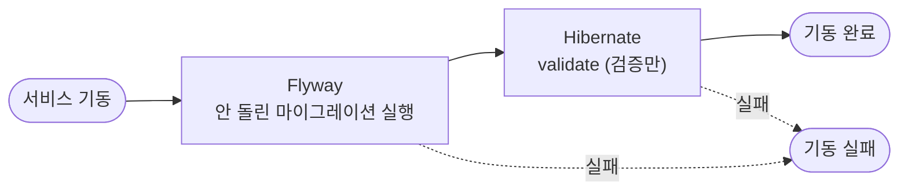

# DB 마이그레이션 (Flyway)

JPA 서비스(member, file, notification, auth)의 테이블 구조를 Flyway로 관리하는 방식을 정리한 문서다.
코드가 기준이다. 공통 설정은 `common/infrastructure/jpa`, 마이그레이션은 서비스마다 `src/main/resources/db/migration`에 있다.

---

## 목차

- [1. 왜 Flyway인가](#1-왜-flyway인가)
- [2. 동작 순서](#2-동작-순서)
- [3. 구성](#3-구성)
- [4. 새 마이그레이션 추가하기](#4-새-마이그레이션-추가하기)
- [5. 자주 하는 변경 레시피](#5-자주-하는-변경-레시피)
- [6. 테스트](#6-테스트)
- [7. 한계와 후속 과제](#7-한계와-후속-과제)

---

## 1. 왜 Flyway인가

스키마를 Hibernate가 엔티티를 보고 알아서 바꾸게(`ddl-auto=update`) 두지 않고, 사람이 쓴 SQL 파일로만 바꾼다.

- 컬럼 삭제, 이름 변경, 타입 변경, NOT NULL 추가, 데이터 이전까지 전부 SQL로 다룰 수 있다. `ddl-auto=update`는 컬럼을 추가하는 것밖에 못 한다.
- 어떤 DB에 어느 버전까지 적용됐는지 기록이 남고, 모든 환경이 같은 순서로 같은 스키마에 도달한다.
- 실행될 SQL이 PR에 그대로 보여서 리뷰할 수 있다.
- 앱이 운영 DB를 마음대로 바꾸지 않는다. 검증된 SQL만 적용되고, 앱은 스키마가 맞는지 확인만 한다.
- 테스트도 운영과 같은 마이그레이션으로 만든 스키마 위에서 돈다(6장).

Flyway는 SQL 파일과 버전 번호만으로 동작해서 단순하고, Spring Boot가 기본으로 지원한다.

---

## 2. 동작 순서



의존성만 있으면 Spring Boot가 기동하면서 알아서 실행한다. 코드에서 Flyway를 직접 부르는 곳은 없다.

1. 클래스패스에 Flyway가, 빈에 DataSource가 있으면 자동 설정이 켜진다.
2. `src/main/resources/db/migration`에서 SQL을 찾는다. dev 프로필이면 `db/seed`도 같이 본다.
3. `flyway_schema_history` 테이블이 없으면 만들고 DB 락을 잡는다. 여러 대가 동시에 떠도 한 대만 진행한다.
4. 이미 적용된 파일의 체크섬을 비교한다. 다르면 기동이 실패한다.
5. 아직 안 돌린 파일만 버전 순서대로 실행한다. 파일마다 트랜잭션 하나이고, 성공하면 이력에 한 줄 남긴다.
6. Flyway가 끝나면 Hibernate가 엔티티와 테이블을 비교한다(`ddl-auto: validate`). 다르면 기동이 실패한다.

새 서비스에 붙일 때는 `common:infrastructure:jpa`에 의존하고 `db/migration/V1__init.sql`만 만들면 된다. Flyway, Postgres 지원 모듈(`flyway-database-postgresql`), `ddl-auto: validate`는 공통 모듈에 이미 들어 있다.

---

## 3. 구성

| 위치 | 역할 |
|---|---|
| `common/infrastructure/jpa/build.gradle` | `spring-boot-starter-flyway`와 `flyway-database-postgresql` (Flyway 12.4). JPA 모듈을 쓰는 서비스는 자동으로 Flyway가 들어간다 |
| `common/infrastructure/jpa/src/main/resources/application-jpa.yml` | `ddl-auto: validate`. `dev` 프로필일 때만 `flyway.locations`에 `db/seed`를 더한다 |
| `services/<서비스>/src/main/resources/db/migration/` | 모든 환경(운영 포함)에 적용되는 스키마 마이그레이션 |
| `services/<서비스>/src/main/resources/db/seed/` | 로컬 개발용 데이터. `dev` 프로필에서만 적용된다 |
| `.docker/postgres/postgres_init.sh` | DB와 서비스별 로그인만 만든다. 테이블과 데이터는 만들지 않는다 |
| `services/<서비스>/src/test/resources/config/application.yml` | 테스트 DB를 Testcontainers Postgres로 지정한다(6장) |

dev 시드는 지금 두 서비스에 있다.

| 서비스 | 파일 | 내용 |
|---|---|---|
| member | `V1_1__seed_test_users.sql` | 테스트 계정 `test@naver.com`, `test2@naver.com` |
| file | `V1_1__seed_test_namespaces.sql` | 두 계정의 드라이브 네임스페이스 (용량 20 GiB) |

각자 하는 일은 이렇게 나뉜다.

- **init 스크립트**는 DB와 로그인이 있다는 데까지만 책임진다. Postgres 볼륨이 비어 있을 때 한 번만 돈다. Flyway는 이미 있는 DB에 접속해서 테이블을 만들 수는 있어도 DB나 로그인을 만들지는 못한다. 서비스 로그인에 슈퍼유저 권한을 줄 수도 없어서 이 스크립트가 따로 있다. AWS에서도 같은 스크립트를 일회성 ECS 태스크로 돌린다([003-aws-migration.md 1-5](003-aws-migration.md#1-5-db)).
- **Flyway**는 테이블 모양과 dev 시드 데이터를 책임진다.
- **Hibernate**는 검증만 한다.

### 공통 모듈이 쓰는 테이블

`outbox_event`와 `processed_event`는 공통 모듈(`common:infrastructure:messaging`)의 엔티티가 매핑하지만, 테이블은 그걸 켠 서비스가 각자 자기 마이그레이션으로 만든다. 서비스마다 DB가 따로라서 공통 모듈이 대신 만들어 줄 수 없기 때문이다.

| 테이블 | 켜는 설정 | 있는 서비스 |
|---|---|---|
| `outbox_event` | `modudrive.messaging.outbox.enabled` | member, file, auth |
| `processed_event` | `modudrive.messaging.idempotency.enabled` | file, notification (mail은 DB가 없어 Redis를 쓴다) |

그래서 공통 엔티티의 컬럼을 바꾸면 그 테이블이 있는 서비스 전부에 같은 내용의 마이그레이션을 넣어야 한다. 하나라도 빠지면 그 서비스만 기동할 때 validate에서 실패한다. 버전 번호는 서비스마다 다를 수 있다(예: `outbox_event`의 `topic` 컬럼을 `queue`로 바꾼 건 file의 V5, member의 V4).

---

## 4. 새 마이그레이션 추가하기

### 절차

1. `services/<서비스>/src/main/resources/db/migration/`에 다음 버전 파일을 만든다. 예: `V9__add_file_description.sql`
2. 같은 커밋에서 엔티티도 고친다. SQL과 엔티티는 항상 같은 PR에 들어가야 한다.
3. `./gradlew :services:<서비스>:test`를 돌린다. persistence 테스트가 새 마이그레이션을 적용한 Postgres 위에서 validate까지 돈다. 엔티티와 SQL이 어긋나면 `Schema validation: ...`으로 실패한다.
4. 로컬 서비스를 다시 띄우면 Flyway가 새 파일만 추가로 실행한다. `make reset`은 필요 없다.

### 파일 이름 규칙

- `V<버전>__<설명>.sql`. 밑줄은 두 개이고, 설명은 소문자 snake_case로 쓴다.
- 버전은 서비스 안에서 커지기만 한다. 서비스끼리는 버전이 겹쳐도 상관없다(DB가 따로다).
- `V1_1`처럼 소수점 버전은 dev 시드에 쓰고 있다. 스키마 마이그레이션은 정수(V2, V3 …)로 쓴다.

### 반드시 지킬 것

- 한 번이라도 적용된 파일은 절대 고치지 않는다. Flyway가 체크섬을 기록해 두기 때문에 내용이 바뀌면 기동할 때 `Migration checksum mismatch`로 실패한다. 고칠 게 있으면 새 버전 파일을 만든다.
- 파일을 지우거나 이름을 바꾸지 않는다. 같은 이유로 실패한다.
- 운영에 데이터가 있는 테이블을 바꿀 때는 5장의 패턴을 따른다. 배포 중에는 옛 코드와 새 코드가 같은 스키마를 잠시 같이 쓴다([003-aws-migration.md 2-3](003-aws-migration.md#2-3-자동-배포)).

### dev 시드를 바꾸고 싶을 때

시드도 버전 파일이라 고치면 체크섬이 어긋난다. 새 파일을 추가하거나(`V9_1__seed_...sql`처럼 해당 스키마 버전 뒤에), 로컬 전용이니 `make reset`으로 DB를 비우고 기존 파일을 고쳐도 된다. 다만 뒤의 방법은 모든 사람이 reset해야 한다.

---

## 5. 자주 하는 변경 레시피

### 컬럼 추가 (nullable)

그냥 추가하면 된다.

```sql
alter table file add column description varchar(500);
```

### NOT NULL 컬럼 추가, 기존 컬럼을 NOT NULL로

이미 있는 행 때문에 한 번에 안 된다. 값을 채운 뒤 제약을 건다.

```sql
alter table file add column description varchar(500);
update file set description = '' where description is null;
alter table file alter column description set not null;
```

### 컬럼 이름 변경, 타입 변경 (무중단 배포)

expand/contract 패턴으로 단계를 나눈다. 옛 버전 앱과 새 버전 앱이 잠시 같이 떠 있어도 깨지지 않게 하려는 것이다.

1. V_n: 새 컬럼을 추가한다 (nullable).
2. 앱 배포: 옛 컬럼과 새 컬럼에 둘 다 쓰고, 읽을 때는 새 컬럼을 먼저 본다.
3. V_n+1: 기존 데이터를 새 컬럼으로 복사한다 (backfill).
4. 앱 배포: 새 컬럼만 쓴다.
5. V_n+2: 옛 컬럼을 지운다.

컬럼 삭제도 같은 이유로 두 번에 나눈다. 먼저 컬럼을 안 쓰는 코드를 배포하고, 그다음 배포에서 컬럼을 지운다.

로컬처럼 잠깐 멈춰도 되는 환경이면 `alter table ... rename column` 한 줄로 끝내도 된다. 위 순서는 운영에서 무중단이 필요할 때만 쓴다.

### 인덱스 추가

작은 테이블은 그냥 `create index`로 만든다. 운영의 큰 테이블에는 쓰기를 막지 않는 `create index concurrently`를 써야 하는데, 이건 트랜잭션 안에서 돌 수 없다. 이럴 땐 같은 이름의 설정 파일(`V9__add_index.sql.conf`)에 `executeInTransaction=false`를 넣어 그 파일만 트랜잭션 없이 실행한다.

### enum 값 추가

엔티티의 `@Enumerated(STRING)` 컬럼에는 허용 값을 검사하는 check 제약이 걸려 있다. 예를 들어 `file.status`는 `('PENDING', 'UPLOADED', 'TRASHED', 'DELETED')`만 받는다. enum에 값을 추가하면 제약도 바꿔야 한다.

```sql
alter table file drop constraint file_status_check;
alter table file add constraint file_status_check
    check (status in ('PENDING', 'UPLOADED', 'TRASHED', 'DELETED', 'ARCHIVED'));
```

제약 이름은 두 가지다. `V1__init.sql`에서 컬럼 옆에 `check (...)`로만 적은 건 Postgres가 `<테이블>_<컬럼>_check`로 이름을 붙인다. 나중 마이그레이션에서 `add constraint`로 붙인 건 거기 적은 이름이다(예: `outbox_event_status_check`). 헷갈리면 `\d <테이블>`로 확인한다.

---

## 6. 테스트

H2는 쓰지 않는다. JPA 테스트(`@DataJpaTest`)는 전부 Testcontainers로 띄운 실제 Postgres 18에서 돈다. 설정은 서비스마다 `src/test/resources/config/application.yml` 하나뿐이다.

```yaml
spring:
  datasource:
    url: jdbc:tc:postgresql:18-alpine:///test   # 첫 연결 때 컨테이너가 자동으로 뜬다
  test:
    database:
      replace: none                              # @DataJpaTest가 DB를 H2로 바꿔치기하지 않게
```

`config/application.yml`은 main의 `application.yml` 위에 덮어씌워지는 위치라서, main 설정은 그대로 두고 datasource만 바꾼다.

- 모든 persistence 테스트가 Flyway로 만든 실제 스키마와 `ddl-auto: validate` 위에서 돈다. 엔티티가 마이그레이션과 어긋나면 테스트가 실패한다. 운영에서 기동이 실패할 문제를 테스트에서 먼저 잡는 구조다.
- dev 전용 `db/seed`는 테스트에서 적용하지 않는다. 시드는 로컬에서만 쓰니, 깨지면 다음 로컬 기동에서 바로 드러나는 것으로 충분하다.
- `./gradlew test`를 돌리려면 Docker가 켜져 있어야 한다. CI(GitHub Actions의 ubuntu 러너)에는 Docker가 있어서 배포 전 테스트도 같은 방식으로 돈다.

---

## 7. 한계와 후속 과제

- **앱이 뜰 때 마이그레이션이 돈다.** AWS에서도 새 태스크가 뜨면서 Flyway가 돈다. 그래서 스키마 변경은 이전 코드와 새 코드 모두에서 동작해야 하고(5장), 마이그레이션이 실패하면 그 배포는 서킷 브레이커가 되돌린다. 규모가 커지면 배포 파이프라인에서 마이그레이션을 따로 돌리고(CI 단계나 ECS 일회성 태스크) 앱은 validate만 하도록 바꾸는 게 보통이다.
- **DB 계정이 하나다.** 서비스 로그인이 DB 소유자라서 앱이 스키마를 바꿀 권한까지 갖는다. 정석은 마이그레이션 계정(DDL 가능)과 앱 계정(데이터 읽기·쓰기만)을 나누는 것이다.
