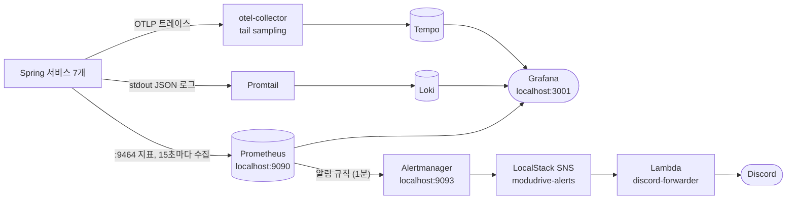
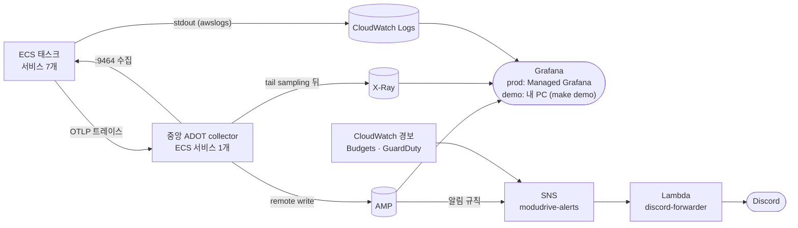
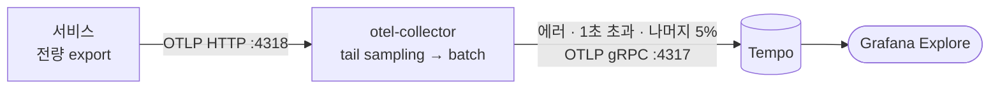

# 모니터링

지표, 로그, 트레이스를 모으고, 알림을 보내고, 문제가 생겼을 때 원인까지 따라가는 방법을 정리한 문서다.
1장에서 로컬과 운영(AWS) 구성을 나란히 보여 주고, 2장부터는 로컬 기준으로 설명한다. 운영 쪽 상세는 [003-aws-migration.md 1-13](003-aws-migration.md#1-13-모니터링과-알림)에 있다.
코드가 기준이다. 로컬 설정은 `.docker/observability/`, AWS는 `.infra/monitoring.tf`, 앱 쪽은 `common/infrastructure/observability`를 같이 보면서 읽으면 된다.

---

## 목차

- [1. 구성](#1-구성)
  - [1-1. 로컬](#1-1-로컬)
  - [1-2. 운영 (AWS)](#1-2-운영-aws)
  - [1-3. 설정 파일](#1-3-설정-파일)
- [2. 지표](#2-지표)
  - [2-1. 액추에이터](#2-1-액추에이터)
  - [2-2. Prometheus](#2-2-prometheus)
  - [2-3. 요청 지표](#2-3-요청-지표)
- [3. 로그](#3-로그)
  - [3-1. 형식](#3-1-형식)
  - [3-2. Promtail과 Loki](#3-2-promtail과-loki)
- [4. 트레이싱](#4-트레이싱)
  - [4-1. 앱과 collector](#4-1-앱과-collector)
  - [4-2. 샘플링](#4-2-샘플링)
  - [4-3. 서비스 사이 전파](#4-3-서비스-사이-전파)
  - [4-4. span에 담기는 것](#4-4-span에-담기는-것)
- [5. 문제 찾기](#5-문제-찾기)
  - [5-1. 오류 코드로](#5-1-오류-코드로)
  - [5-2. 알림에서](#5-2-알림에서)
  - [5-3. 사용자와 시간으로](#5-3-사용자와-시간으로)
  - [5-4. 신호 사이 이동](#5-4-신호-사이-이동)
- [6. 알림](#6-알림)
- [7. Grafana](#7-grafana)
- [8. 실행과 운영 메모](#8-실행과-운영-메모)

---

## 1. 구성

앱 코드와 설정은 로컬과 운영이 같다. 서비스는 어디서든 `:9464`로 지표를 내놓고, stdout에 JSON 로그를 찍고, `otel-collector:4318`로 트레이스를 보낸다. 그걸 받아 가는 쪽만 다르다.

### 1-1. 로컬



| 신호 | 수집 | 저장 | 보는 곳 |
|---|---|---|---|
| 지표 | Prometheus가 서비스마다 `:9464/actuator/prometheus`를 15초마다 긁는다 | Prometheus (`prometheus_data`) | Grafana, `localhost:9090` |
| 로그 | Promtail이 docker socket으로 컨테이너를 찾아 stdout을 긁는다 | Loki (`loki_data`, 72시간) | Grafana → Loki |
| 트레이스 | 서비스 → otel-collector(tail sampling) → Tempo | Tempo (`tempo_data`) | Grafana → Tempo |
| 알림 | Prometheus 규칙 → Alertmanager → SNS → Lambda | | Discord, `localhost:9093` |

### 1-2. 운영 (AWS)

저장과 조회는 전부 AWS 관리형 서비스에 맡기고, 직접 띄우는 건 중앙 ADOT collector 하나뿐이다.



| | 로컬 | 운영 |
|---|---|---|
| 지표 | Prometheus가 고정 주소 7개를 15초마다 수집 | collector의 `ecs_observer`가 태스크를 찾아 수집(demo 60초, prod 30초)해 AMP로 보낸다. 알림과 기본 화면에 쓰는 지표만 남긴다 |
| 로그 | Promtail → Loki, 72시간 | `awslogs` 드라이버 → CloudWatch Logs, 14일. 검색은 Logs Insights |
| 트레이스 | otel-collector → Tempo | 같은 tail sampling을 거쳐 ADOT collector → X-Ray |
| 알림 | Prometheus 규칙 → Alertmanager → LocalStack SNS → Lambda | AMP 알림 규칙 → SNS → Lambda. 규칙, 양식, Lambda 코드가 로컬과 같다. CloudWatch 경보(큐 대기, ALB 5xx, gateway 헬스, NAT), Budgets, GuardDuty도 같은 토픽으로 들어온다 |
| 화면 | Grafana `localhost:3001` | prod는 Managed Grafana, demo는 내 PC의 Grafana(`make demo`, [003-aws-migration.md 3-4](003-aws-migration.md#3-4-지표로그트레이스-보기)) |
| 설정 | `.docker/observability/` | `.infra/monitoring.tf`, `.infra/monitoring/` |

운영에서 알아 둘 것들이다.

- `service` 라벨은 로컬이 스크레이프 주소에서, 운영이 컨테이너 이름에서 붙이는데 값이 같아서(`member-service`) 알림 규칙을 그대로 쓴다. 운영에만 있는 규칙은 `ServiceNoTasks` 하나다. ECS에서는 죽은 태스크가 `up = 0`으로 남지 않고 수집 대상에서 사라지기 때문이다.
- collector를 태스크마다 사이드카로 붙이지 않고 한 대만 두는 건 tail sampling 때문이다. 한 trace의 span이 같은 collector에 모여야 "에러 trace는 전부 남긴다"가 지켜진다. 두 대 이상이 필요해지면 앞단 collector가 traceID 기준으로 나눠 보내는 2단 구성으로 바꾼다.
- collector의 Service Connect 이름이 로컬과 같은 `otel-collector:4318`이라 앱의 트레이스 설정도 바꿀 게 없다.
- ALB는 W3C `traceparent`가 아니라 `X-Amzn-Trace-Id`를 붙인다. 그래서 trace는 gateway에서 시작하고, ALB 구간은 ALB 접근 로그(prod만)로 본다.
- 처음 띄운 뒤에는 X-Ray가 앱의 W3C trace ID를 그대로 받는지 확인한다. 이 ID는 앞 32비트가 타임스탬프가 아니라서, 거절되면 X-Ray ID 생성기를 설정해야 한다.

### 1-3. 설정 파일

| 파일 | 내용 |
|---|---|
| `.docker/docker-compose.observability.yml` | 로컬 스택 전체 (compose 프로젝트 `modudrive-observability`) |
| `.docker/observability/*.yaml`, `*.yml` | 컴포넌트별 설정. 디렉터리째 `/etc/modudrive`로 마운트한다(8장) |
| `.docker/observability/otel-collector-config.yaml` | tail sampling 정책 |
| `.docker/observability/alert-rules.yaml` | 알림 규칙 7개 |
| `.docker/observability/alertmanager.yml` | 알림 묶음, 재발송, 채널 |
| `.docker/observability/grafana/datasources/datasources.yaml` | Grafana 데이터소스 (Prometheus, Tempo, Loki와 그 사이 링크) |
| `.docker/localstack/init-aws.sh` | 알림용 SNS 토픽, Lambda, 웹후크 SSM 파라미터 |
| `common/infrastructure/observability` | 앱 쪽 공통 모듈. 의존성과 `application-observability.yml`, `UserIdObservationFilter` |

모든 서비스가 공통 모듈에 의존하고, 각자 `application.yml`의 `spring.config.import`로 `classpath:application-observability.yml`을 불러온다.

---

## 2. 지표

### 2-1. 액추에이터

액추에이터는 앱 포트와 분리된 관리 포트 9464(`management.server.port`)에서 돈다. 열어 둔 엔드포인트는 `health`와 `prometheus` 두 개뿐이다. 의존성은 `spring-boot-starter-actuator`와 `micrometer-registry-prometheus`다.

9464는 호스트에 퍼블리시하지 않아서 docker 네트워크 안에서만 닿는다. 그래서 액추에이터에는 앱 인증을 걸지 않았다. 네트워크 격리가 보안을 맡는 셈이다. gateway는 WebFlux라 Security 필터가 관리 포트에도 걸리기 때문에 `SecurityConfig`에서 `/actuator/**`를 permitAll로 열어 뒀다. 관리 포트가 분리돼 있으니 공개 포트(10001)에서 `/actuator/**`는 어차피 404다.

### 2-2. Prometheus

`prom/prometheus`, `localhost:9090`.

- 대상 7개를 `prometheus.yml`의 `static_configs`에 `<서비스>:9464`로 적어 뒀다. 서비스를 추가하면 여기도 추가해야 한다.
- 스크레이프 주소에서 포트를 떼어 `service` 라벨을 붙인다(`member-service:9464` → `member-service`). 알림 규칙과 Discord 메시지가 이 라벨로 서비스를 가리킨다.
- 서비스를 여러 개 띄우면 컨테이너 DNS가 하나만 잡힐 수 있다. 그땐 `dns_sd_configs`나 `docker_sd_configs`로 바꾼다.
- `--enable-feature=exemplar-storage`로 exemplar를 저장한다(5-2).
- `--web.external-url=http://localhost:9090`. 알림에 붙는 "어느 규칙에서 왔나" 링크가 이 주소로 만들어진다.

### 2-3. 요청 지표

`application-observability.yml`의 `management.metrics.distribution.slo`로 요청 시간을 히스토그램으로 낸다. 버킷은 100ms, 300ms, 1s, 3s, 10s다.

- `http.server.requests`(각 서비스)와 `spring.cloud.gateway.requests`(gateway의 경로별) 두 가지다.
- 백분위 히스토그램(버킷 70개쯤) 대신 버킷 다섯 개만 둔 건 시계열 수 때문이다. Prometheus도, AWS의 AMP(샘플 수 과금)도 시계열 수만큼 비용이 든다.
- 1s 버킷은 "느린 요청" 알림이 읽고, collector가 1초 넘는 trace를 전부 남기는 기준(4-2)과도 같다. 이 버킷을 빼면 알림이 조용히 멈춘다.

DB 쿼리 계측(4-4)을 붙이면서 JDBC 지표도 같이 생긴다. `jdbc_query_seconds`(쿼리 시간), `jdbc_connection_seconds`(커넥션을 잡고 있던 시간), `jdbc_connections_active`·`idle`(풀 상태) 같은 것들이다. 레이블은 DB 이름, 드라이버, 풀 이름, 에러 여부 정도라 쿼리가 늘어도 시계열은 늘지 않는다. AWS에서는 collector가 이 지표를 걸러 내서 AMP에는 가지 않는다(커넥션 풀은 `hikaricp_connections_*`로 본다).

업로드·다운로드 성공률 지표는 따로 만들지 않았다. storage-service가 서버에서 직접 S3에 올리므로(presigned URL이 아니다) 실패가 전부 `http_server_requests_seconds_count{uri=..., outcome=...}`에 이미 잡힌다.

지표 레이블에는 userId나 fileId 같은 고유값을 넣지 않는다. 사용자마다 시계열이 하나씩 생겨 Prometheus가 감당하지 못한다. 고유값은 span 태그와 로그 필드에만 둔다.

---

## 3. 로그

### 3-1. 형식

`logging.structured.format.console: ecs`로 콘솔 로그를 한 줄짜리 JSON으로 찍는다. `traceId`, `spanId`, `userId`가 최상위 필드라서 바로 검색된다.

```logql
{service="file-service"} | json | traceId="<32자리>"
{service="file-service"} | json | userId="<uuid>"
```

`docker logs`로 볼 때는 `docker logs <컨테이너> | jq -r .message`가 읽기 편하다.

로그는 샘플링하지 않는다. trace가 버려진 정상 요청도 로그에는 `traceId`가 그대로 남는다.

### 3-2. Promtail과 Loki

`grafana/promtail`, `grafana/loki`.

- Promtail은 `docker_sd_configs`로 5초마다 컨테이너를 다시 찾는다. 서비스가 몇 개 뜨든 설정을 고칠 필요가 없다.
- 라벨은 `container`(컨테이너 이름)와 `service`(compose 서비스 이름) 두 개다. Grafana에서 `{service="file-service"}`처럼 조회한다.
- infra와 observability 컨테이너 로그(postgres, localstack, loki 자신 등)도 전부 모인다.
- Loki는 단일 노드에 파일시스템 저장이다. `retention_period: 72h`는 compactor의 `retention_enabled`가 켜져 있어야 실제로 지워진다. 없으면 끝없이 쌓인다.
- Promtail은 `/var/run/docker.sock`을 마운트한다. 사실상 호스트 root 권한이라 로컬 개발에서만 쓴다.

---

## 4. 트레이싱

요청 하나가 서비스들을 어떻게 지나갔는지 trace로 남긴다. 앱은 trace를 하나도 거르지 않고 내보내고(`management.tracing.sampling.probability: 1.0`), 무엇을 남길지는 collector가 정한다.



### 4-1. 앱과 collector

앱 쪽은 공통 모듈 `common/infrastructure/observability`에 들어 있다.

| 의존성 | 하는 일 |
|---|---|
| `spring-boot-micrometer-tracing-opentelemetry` | Boot 4의 트레이싱 auto-config. 이게 없으면 Tracer 빈이 안 생겨 span이 하나도 안 나가는데, 에러도 나지 않는다 |
| `micrometer-tracing-bridge-otel` | Micrometer Observation을 OpenTelemetry span으로 바꾼다 |
| `opentelemetry-exporter-otlp` | collector로 OTLP를 보낸다 |

보낼 곳은 `management.opentelemetry.tracing.export.otlp.endpoint`다(Boot 3의 `management.otlp.tracing.endpoint`는 Boot 4에서 조용히 무시된다). 기본값은 `http://otel-collector:4318/v1/traces`이고, IDE에서 서비스를 직접 띄울 땐 `OTEL_EXPORTER_OTLP_ENDPOINT=http://localhost:4318`로 바꾼다. 앱은 비동기로 보내고 실패하면 버리기 때문에 collector가 죽어도 서비스에는 영향이 없다.

collector는 `otel/opentelemetry-collector-contrib`이고 호스트에는 `127.0.0.1:4317/4318`로만 연다(IDE에서 띄운 서비스가 붙을 때 쓴다). 파이프라인은 traces 하나뿐이다. `otlp`로 받아 `tail_sampling`과 `batch`를 거쳐 Tempo로 보낸다. 지표는 Prometheus가 직접 긁으므로 collector에 metrics 파이프라인은 없다.

Tempo는 `grafana/tempo` monolithic 모드에 로컬 파일시스템(`/var/tempo`)을 쓴다. 호스트 포트는 없고 Grafana로만 본다.

### 4-2. 샘플링

trace를 전부 남기면 저장량이 감당이 안 되고, 앞단에서 고정 비율로 자르면(head sampling) 정작 필요한 에러 trace가 거의 다 빠진다. 그래서 trace가 끝난 뒤 내용을 보고 고르는 tail sampling을 쓴다. 아래 정책 중 하나라도 걸리면 남긴다.

| 정책 | 조건 | 이유 |
|---|---|---|
| `errors` | 에러 상태 span이 하나라도 있음 | 장애 분석에 쓰는 trace는 빠짐없이 있어야 한다 |
| `slow-requests` | 1초 넘게 걸림 | 느린 요청 알림(1초 기준)에 걸린 요청은 trace가 반드시 남는다 |
| `baseline-sample` | 나머지 중 5% | 정상 요청이 어떻게 생겼는지 비교할 표본 |

`decision_wait`는 30초다. trace의 첫 span이 도착한 뒤 이만큼 기다렸다가 판단한다. gateway 타임아웃(15초)보다 길게 잡아야 느린 요청의 늦게 오는 span까지 모인 뒤에 판단할 수 있다.

정상 요청은 5%만 남으므로, trace가 이어지는지 확인하는 테스트를 할 때는 collector 설정에서 `sampling_percentage: 100`, `decision_wait: 5s`로 잠깐 바꾸고 `restart otel-collector` 한 뒤 끝나면 되돌린다.

### 4-3. 서비스 사이 전파

trace가 서비스를 넘어가려면 호출할 때 `traceparent` 헤더(W3C)가 따라가야 한다. 경로마다 필요한 게 다르다.

| 경로 | 어떻게 이어지나 |
|---|---|
| gateway → 서비스 (WebClient, Netty) | 별도 설정 없이 이어진다 |
| 서비스 → 서비스 (Feign) | `feign-micrometer`가 있어야 계측되고 헤더가 실린다(`common:infrastructure:spring-cloud`). 없으면 받는 쪽에서 trace가 새로 시작된다 |
| 서비스 → SQS → 서비스 | outbox에 헤더를 같이 저장하고, relay가 보낼 때 Observation을 열고, 컨슈머가 이어받는다. `application-sqs.yml`의 SQS observation이 켜져 있어야 한다([005 메시징](../spec/005-messaging-spec.md) 6장) |
| gateway 안 (WebFlux) | `spring.reactor.context-propagation: auto`. 없으면 스레드가 바뀌면서 로그의 `traceId`가 빈다 |

### 4-4. span에 담기는 것

trace를 찾아도 "file-service 3초"에서 끝나면 원인을 알 수 없다. 그 안에서 어떤 쿼리와 어떤 외부 호출이 시간을 잡아먹었는지가 보여야 한다.

| 무엇 | 어디서 | 메모 |
|---|---|---|
| HTTP 요청 | Spring 기본 계측 | 서버 span, 클라이언트 span |
| DB 커넥션과 쿼리 | `datasource-micrometer-spring-boot`(`common:infrastructure:jpa`), `jdbc.includes: connection, query` | 커넥션 span에 풀 대기 시간이 들어간다. SQL은 파라미터가 `?`로 남는다(값은 개인정보일 수 있어 남기지 않는다) |
| S3 호출 | storage-service `S3Config`의 `opentelemetry-aws-sdk-2.2` | 업로드 trace 안에 `S3.PutObject` 같은 span이 생긴다. 버전은 Boot BOM의 OpenTelemetry API(1.62)에 맞춘 2.28.1이다 |
| 사용자 | `UserIdObservationFilter`(`common:infrastructure:observability`) | 서버 span 태그 `user.id`, 로그 필드 `userId`. gateway가 넘겨 준 `X_USER_ID` 헤더에서 읽는다 |

- 부모 없는 쿼리는 span을 만들지 않는다(`JdbcObservationConfig`). outbox relay가 1초마다 테이블을 보고 Flyway가 기동 때 쿼리를 돌리는데, 이게 전부 span 하나짜리 trace가 되면 진짜 trace가 묻힌다.
- `user.id`와 `userId`는 servlet 서비스에만 붙는다. gateway(WebFlux)에는 없고, storage → file처럼 gateway를 거치지 않은 내부 호출에도 없다(헤더를 넘기지 않으므로).

---

## 5. 문제 찾기

문제를 알게 되는 경로는 셋이고, 셋 다 trace와 로그까지 갈 수 있다.

### 5-1. 오류 코드로

사용자가 화면의 "오류 코드"를 알려 준 경우다.

gateway는 모든 응답에 `X-Trace-Id` 헤더를 붙인다(`TraceIdResponseFilter`). 401, CSRF 403, fallback 응답도 마찬가지다. CORS `exposedHeaders`에 들어 있어서 WEB이 읽을 수 있고, WEB은 5xx 알림에 이 값을 "오류 코드"로 보여 준다.

그 값으로 Loki에서 `{service=~".+"} | json | traceId="<값>"`을 찾거나 Tempo에서 trace ID로 바로 연다. 정상 요청이라 trace가 샘플링에서 빠졌더라도 로그는 남아 있다.

### 5-2. 알림에서

"요청 실패율 높음"이나 "느린 요청 많음" 알림을 받은 경우다.

요청 지표는 히스토그램 버킷마다 그 버킷에 들어간 요청 하나의 trace ID를 같이 저장한다(exemplar). Grafana Explore에서 `spring_cloud_gateway_requests_seconds_bucket` 그래프를 띄우면 점이 찍혀 있고, 튀는 시점의 점을 누르면 그 요청의 trace가 Tempo에서 열린다.

- 설정은 세 군데다: `application-observability.yml`의 `slo` 버킷(2-3), Prometheus `--enable-feature=exemplar-storage`, Grafana Prometheus 데이터소스의 `exemplarTraceIdDestinations`.
- exemplar는 샘플링에 남은 trace만 열린다. 빠른 버킷의 점은 95%가 버려진 정상 요청이라 "trace not found"가 흔하다. 1초 넘는 버킷과 에러는 collector가 전부 남기므로 장애 때 누를 점은 열린다.
- "느린 요청 많음" 알림에는 바로 붙여 넣을 TraceQL이 들어 있다: `{ resource.service.name = "<서비스>" && kind = server && duration > 1s }`.

### 5-3. 사용자와 시간으로

"어제 10시쯤 업로드가 안 됐어요"처럼 오류 코드 없이 들어온 경우다.

- Tempo: `{ span.user.id = "<uuid>" }`에 시간 범위를 건다.
- Loki: `{service="file-service"} | json | userId="<uuid>"`.

### 5-4. 신호 사이 이동

| 방향 | 로컬 (Grafana 데이터소스 링크) | 운영 |
|---|---|---|
| 로그 → trace | Loki가 로그 JSON의 `"traceId":"<32자리>"`를 정규식으로 뽑아 TraceID 링크를 만든다 | 로그의 `traceId` 앞 8자리 뒤에 `-`를 넣고 `1-`을 붙이면 X-Ray trace ID다 |
| trace → 로그 | Tempo의 `tracesToLogsV2`로 그 traceId의 로그로 넘어간다 | X-Ray trace ID에서 `1-`과 `-`를 빼고 Logs Insights에서 `filter traceId = "..."` |
| 지표 → trace | exemplar (5-2) | Managed Grafana나 `make demo`의 Grafana에서 같은 방식 |

---

## 6. 알림

규칙, 문구, 채널, 알림별 대응은 [007 디스코드 알림 스펙](../spec/007-discord-alert-spec.md)이 기준이다. 여기서는 로컬에서 어떻게 돌아가는지만 적는다.

알림은 운영과 같은 길로 나간다. Prometheus가 1분마다 `alert-rules.yaml`을 평가해 Alertmanager로 넘기고, Alertmanager는 알림 이름별로 묶어 LocalStack SNS(`modudrive-alerts`)에 올린다. SNS가 Lambda(`modudrive-discord-forwarder`)를 부르면 Lambda가 웹후크 URL을 LocalStack SSM에서 읽어 Discord로 보낸다. Lambda 코드(`.infra/monitoring/discord_forwarder.py`)와 메시지 양식(`.infra/monitoring/discord.tmpl`)은 운영과 같은 파일이다.

| 보는 것 | 어디서 |
|---|---|
| 규칙 상태 (Pending, Firing) | `localhost:9090/alerts` |
| 지금 울리는 알림, 일시 중지(silence) | `localhost:9093` |
| Lambda가 Discord로 보냈는지 | `docker logs modudrive-infra-localstack-1`에서 `invocations/.../response`(성공) 또는 `.../error` |

- 웹후크 URL은 `.docker/.env`의 `DISCORD_*_WEBHOOK_URL`에 넣는다. LocalStack이 뜰 때 SSM으로 들어가므로, 바꾼 뒤엔 LocalStack을 다시 띄운다.
- LocalStack이 내려가 있으면 SNS 발행이 실패하고 Alertmanager가 재시도한다. Lambda가 Discord 전송에 실패하면 LocalStack이 비동기 호출을 재시도한다.
- LocalStack은 Lambda를 컨테이너로 띄우기 때문에 docker socket을 마운트한다. 처음 뜰 때는 Lambda 런타임 이미지를 받느라 init이 30초쯤 더 걸리고, 그동안 healthcheck가 잠깐 unhealthy로 보인다.

---

## 7. Grafana

`grafana/grafana`, `localhost:3001`. 3000은 ModuDrive-WEB(Vite)이 쓴다.

- 익명 사용자는 Viewer로 들어온다. admin 비밀번호는 `GRAFANA_ADMIN_PASSWORD`다.
- 대시보드는 프로비저닝하지 않는다. Explore에서 직접 조회한다.
- 알림은 Grafana에서 보내지 않는다(6장). Grafana는 보는 화면이다.
- 데이터소스 사이 링크는 5-4에 있다.

AWS demo 스택을 볼 때 쓰는 Grafana는 이것과 별개다(`make demo`, `localhost:3002`, [003-aws-migration.md 3-4](003-aws-migration.md#3-4-지표로그트레이스-보기)).

---

## 8. 실행과 운영 메모

```bash
make observability   # 이 스택만 띄운다 (modudrive_network가 필요해서 make network가 먼저 돈다)
make service         # infra + observability + 서비스 전부
make reset           # 볼륨을 전부 지우고 다시 띄운다 (지표, 로그, 트레이스도 사라진다)
```

### 설정은 디렉터리째 마운트한다

`./observability` 디렉터리를 통째로 `/etc/modudrive`에 마운트하고, 컴포넌트마다 `--config` 플래그로 그 안의 파일을 가리킨다. 설정을 고친 뒤엔 `docker compose ... restart <서비스>`만 하면 된다.

파일 하나만 bind mount하면 안 된다. 그런 마운트는 컨테이너를 만들 때의 inode에 묶이는데, 에디터 저장이나 `git checkout`, `sed -i`는 파일을 새 inode로 바꿔 끼운다. 그러면 컨테이너가 옛 내용을 보거나 재시작할 때 파일을 못 찾아 기동에 실패한다. 새 설정 파일을 추가할 때도 같은 디렉터리에 넣는다.

### 알려진 갭

- gateway는 Prometheus가 15초마다 `/actuator/prometheus`를 긁는 요청도 trace로 남긴다. 5% 표본에 걸린 것들이 Tempo에 섞여 보인다. 거슬리면 `ObservationPredicate`로 actuator 경로를 빼면 된다.
- collector 설정의 exporter 이름 `otlp/tempo`가 deprecated 경고를 낸다(`"otlp" alias is deprecated; use "otlp_grpc"`). 동작에는 문제가 없다.
