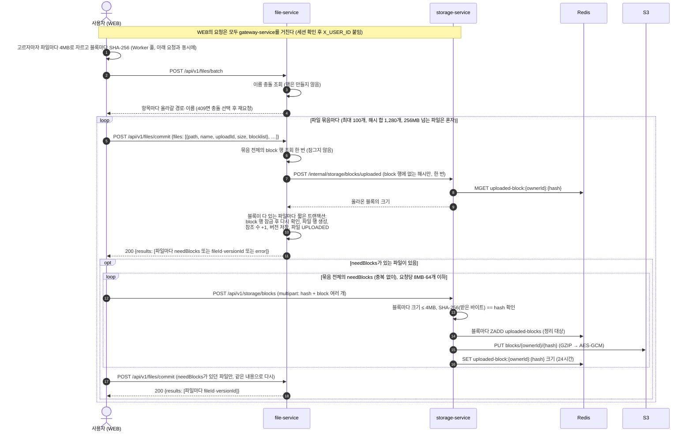
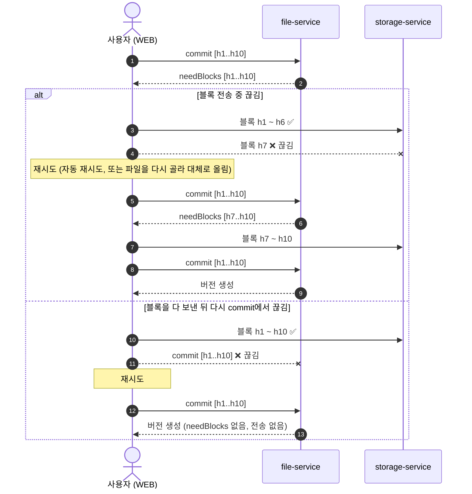
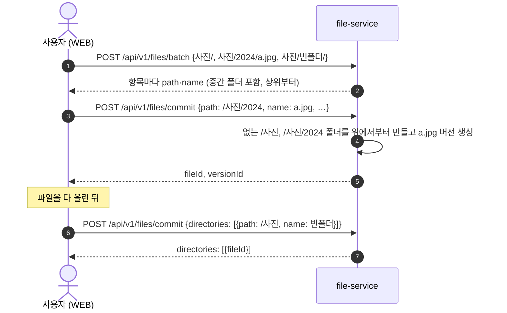

# 파일 업로드 스펙

이 문서는 파일 업로드가 어떻게 동작하는지 정의합니다.

⚠️ 이 문서가 기준입니다. 코드가 이 문서와 다르면 코드를 고치고, 동작을 바꾸려면 이 문서를 먼저 고칩니다.

> 참고: [Dropbox — Streaming File Synchronization](https://dropbox.tech/infrastructure/streaming-file-synchronization).

---

## 목차

- [1. 구성 요소](#1-구성-요소)
- [2. 파일 업로드](#2-파일-업로드)
  - [2-1. 이어 올리기](#2-1-이어-올리기)
  - [2-2. 폴더 업로드](#2-2-폴더-업로드)
  - [2-3. 블록 정리](#2-3-블록-정리)

---

## 1. 구성 요소

| 구성 요소 | 역할 |
|---|---|
| **WEB** | 파일을 블록으로 나눠 서버에 없는 블록만 보낸다 |
| **gateway-service** | 세션을 확인하고 요청을 서비스로 넘긴다 |
| **file-service** | 파일·버전 메타데이터를 관리하고 업로드를 확정한다 |
| **storage-service** | 블록을 S3에 저장한다 |
| **S3** | 블록 저장 |
| **Redis** | 아직 확정되지 않은 블록 기록 (세션과 다른 storage 전용 Redis, [006 2-4-6](006-resilience-spec.md#2-4-6-redis-분리)) |
| **file_db** | 파일·버전·블록 메타데이터 저장 |

---

## 2. 파일 업로드

파일은 **4MB 블록의 해시 목록(blocklist)** 이다. WEB이 해시 목록으로 commit하면 file-service가 서버에 없는 블록을 알려 주고, WEB은 그것만 보낸 뒤 다시 commit한다. 크기에 따른 업로드 방식 구분은 없다.

파일 행은 **commit이 버전을 만들 때** 생긴다. 그 전의 batch는 이름 충돌만 조회하고 아무것도 만들지 않는다. 그래서 업로드가 끝나지 않은 파일(`PENDING`)이 목록에 남지 않는다. 폴더를 올릴 때는 [2-2](#2-2-폴더-업로드)를 따른다.

1. **충돌 조회** — `POST /api/v1/files/batch`. 고른 항목 전체의 이름 충돌을 확인한다. **행은 만들지 않는다.**
   - 선택하지 않은 충돌이 있으면 409 `FILE_BATCH_CONFLICT` + 충돌한 이름 목록. 사용자가 `REPLACE`/`KEEP_BOTH`/`SKIP`을 고르면 `resolutions`에 담아 다시 보낸다.
   - 200이면 항목마다 실제로 올라갈 `path`·`name`(`KEEP_BOTH`면 번호 붙은 이름)과 `replaced`(같은 이름의 기존 파일을 대체하면 true, 그 파일의 `fileId`)를 돌려준다. `SKIP`한 항목은 빠진다.
   - 조회일 뿐이라 그 사이 다른 업로드가 같은 이름을 차지할 수 있다. 그때는 commit이 그 자리의 파일에 새 버전을 올린다 (아래 3번).
2. **해시 계산·묶기** — 파일마다 4MB씩 잘라(마지막 블록만 작음) 블록마다 SHA-256을 계산한다 (`crypto.subtle.digest`). 순서대로 늘어놓은 해시가 그 파일의 blocklist다.
   - **파일을 고르자마자** 계산을 시작한다. 1번 batch 요청과 충돌 선택 대화상자를 기다리는 동안 해시가 돌아, 그 시간이 통째로 숨는다.
   - 해시는 **Web Worker 풀**(코어 수만큼, 최대 8개)에서 계산한다. 블록 16개(64MB)씩 나눠 여러 Worker에 돌리므로 큰 파일도 코어 수만큼 빨라지고, 그동안 화면이 멈추지 않는다. Worker 하나는 블록 하나만 메모리에 둔다.
   - 고른 순서대로 계산하므로, 앞 묶음을 보내는 동안 뒤 묶음의 해시가 계속 계산된다.
   - WEB이 파일을 **묶음**(최대 100개, blocklist 길이 합 1,280개 이하)으로 나눈다. **256MB(블록 64개)를 넘는 파일은 혼자 한 묶음**이다. 묶음 안의 파일은 블록 전송이 다 끝나야 같이 완료되므로, 작은 파일이 큰 파일의 전송을 기다리지 않게 한다.
   - 파일을 읽지 못하면(도중에 삭제됨, 권한 없음) **그 파일만** 실패하고 나머지는 그대로 올린다.
3. **commit** — `POST /api/v1/files/commit`에 묶음의 파일 전부를 한 번에 보낸다. 파일마다 1번의 `path`·`name`, `uploadId`(이번 업로드 시도마다 새 UUID), `size`, `blocklist`.
   - 블록 조회는 **묶음 전체에 한 번씩**만 한다. 이미 commit된 블록은 file_db `block` 테이블로, 올라왔지만 아직 commit되지 않은 블록은 storage-service에 묻는다 (Redis 표시).
   - 이 조회는 **DB 트랜잭션 밖에서** 한다. storage-service가 느려도 file-service가 DB 커넥션·잠금을 잡고 기다리지 않는다 ([006 2-4](006-resilience-spec.md#2-4-s3-호출-storage-service)).
   - storage-service에는 `block` 테이블에 없는 해시가 있을 때만 묻는다. 이미 있는 파일만 올리면 묻지 않는다.
   - 그 조회가 실패하면(서킷 열림, 시간 초과) 요청 전체를 실패시키지 않는다. 이미 commit된 블록만으로 된 파일은 버전을 만들고, 나머지 파일만 그 503을 `error`로 답한다.
   - 응답 `results`는 요청 순서 그대로, 파일마다 셋 중 하나다.
     - `needBlocks`: 서버에 없는 블록. 이 파일은 **아무것도 만들지 않았다.**
     - `fileId`·`versionId`: 버전을 만들었다. 블록이 다 있던 파일은 여기서 끝난다 (0바이트 전송).
     - `error` (`status`·`message`): 이 파일만 실패했다 (아래 commit 검증). 다른 파일에는 영향이 없다.
   - 버전은 **파일마다 따로 짧은 트랜잭션**으로 만든다. 그 안에서 `block` 행을 잠가(commit이 끝날 때까지 참조 없는 블록 정리가 지우지 못하게) 다시 확인한다. 그 사이 정리 작업이 블록을 지웠으면 그 블록을 `needBlocks`로 답한다.
   - 버전을 만들 때 그 경로·이름에 파일이 있으면 그 파일의 새 버전이 된다 (대체). 없으면 파일 행을 새로 만든다. 만든·대체한 파일은 최근 문서함에 기록한다.
4. **블록 전송** (needBlocks가 있을 때만) — WEB이 묶음 전체의 `needBlocks`를 **중복 없이** 모아(여러 파일에 같은 블록이 있어도 한 번), `POST /api/v1/storage/blocks` 한 번에 여러 개씩 보낸다 (요청당 합 8MB·64개 이하). multipart로 `hash`와 `block`을 같은 순서로 반복한다.
   - storage-service는 블록마다 **정리 대상 등록(ZADD) → S3 PUT → 업로드 표시(SET)** 순서로 한다.
     - 표시(SET)는 반드시 PUT이 성공한 뒤다. 먼저 하면 S3에 없는 블록으로 commit이 성공해 파일이 깨진다.
     - 정리 대상 등록은 PUT보다 먼저다. PUT 뒤에 하면, PUT은 됐는데 Redis가 실패한 블록이 정리 대상에도 안 올라 S3에 영구히 남는다. 등록만 되고 PUT이 실패한 블록은 정리 작업이 없는 객체를 지우는 것으로 끝난다.
   - 요청은 **동시에 3개까지** 보낸다. 요청마다 왕복 시간을 기다리지 않고, storage-service 업로드 자리([006 2-4-4](006-resilience-spec.md#2-4-4-벌크헤드))는 다른 사용자에게 남긴다.
   - 요청 하나가 일시 중지 10분까지 실패하거나 429를 받으면 새 요청은 시작하지 않는다. 그때 블록이 빠진 파일만 실패하고, 블록이 다 간 파일은 다시 commit한다 ([2-1](#2-1-이어-올리기)).
   - storage-service는 블록마다 받은 바이트의 해시를 **다시 계산**해 함께 온 해시와 다르면 거절한다. 클라이언트가 보낸 해시는 믿지 않는다.
   - 요청 하나의 블록을 **전부 확인한 뒤에** 저장한다. 하나라도 잘못되면 아무것도 저장하지 않는다.
   - 해시가 다르거나 빈 블록, `hash`와 `block` 개수가 다름: 400 `INVALID_BLOCK`
   - 블록 하나가 4MB 초과: 413 `BLOCK_TOO_LARGE`. 요청 합이 8MB 초과이거나 64개 초과: 413 `BLOCK_BATCH_TOO_LARGE`
   - S3 장애(서킷 열림)이거나 동시 업로드 자리가 가득 참: 503 `STORAGE_UNAVAILABLE` — 기다리지 않고 바로 답한다. WEB이 자동으로 다시 보낸다 ([006 2-4](006-resilience-spec.md#2-4-s3-호출-storage-service)). 요청 중간에 실패하면 일부 블록만 저장됐을 수 있지만, 다시 보내면 덮어쓰므로 무해하다
   - 사용자당 24시간에 블록 25,600개(4MB 기준 100GB) 초과: 429 `UPLOAD_LIMIT_EXCEEDED` (`STORAGE_UPLOAD_BLOCKS_PER_WINDOW`). 블록 하나마다 센다. commit되지 않은 블록은 용량 한도에 잡히지 않으므로, 이 한도가 없으면 S3와 Redis를 무한히 채울 수 있다. WEB은 이 429를 **다시 보내지 않는다** — 업로드 경로의 429는 이것뿐이고, 24시간 창이라 몇 초 뒤 다시 보내도 같다
5. **다시 commit** (needBlocks가 있던 파일만) — 그 파일들을 같은 내용으로 한 번에 다시 보낸다. 빠진 블록이 없으면 파일마다 버전을 만든다. 그래도 빠진 블록이 있거나(그 사이 24시간이 지난 경우) 블록 전송이 끝내 실패한 파일은 WEB이 실패로 표시한다.
6. **응답** — commit 응답(`fileId`, `versionId`)이 곧 완료다. storage-service → file-service 완료 콜백은 없다.

**호출 수** (batch 1번 제외)

| 경우 | 파일마다 따로 | 묶음 |
|---|---|---|
| 새 작은 파일 1,000개 (각 10KB) | 약 3,000번 | commit 10 + 블록 2 + commit 10 = 약 22번 |
| 새 30MB 파일 1개 | commit 2 + 블록 8 = 10번 | commit 2 + 블록 4 = 6번 |
| 이미 있는 파일 100개 | commit 100번 | commit 1번 |
| 빈 폴더 1,000개 | 폴더 생성 1,000번 | commit 1번 ([2-2](#2-2-폴더-업로드)) |

**commit 검증** (file-service)

요청 전체가 실패하는 경우:

| 확인 | 실패 |
|---|---|
| 네임스페이스 있음 | 404 `NAMESPACE_NOT_FOUND` |
| 파일 0~100개, 폴더 0~1,000개, 합쳐 1개 이상, 해시 형식 (소문자 hex 64자), 파일 하나의 해시 1,280개 이하 | 400 (요청 검증) |
| 묶음 전체의 해시 합 1,280개 이하 | 400 `COMMIT_TOO_LARGE` |

파일 하나만 실패하는 경우 (`results[i].error`):

| 확인 | 실패 |
|---|---|
| `path`가 `/` 또는 정규형 절대 경로, `name`이 이름 규칙에 맞음, 둘 다 255자 이하 | 400 `INVALID_BATCH_ITEM` |
| `uploadId`로 만든 버전이 있다면 호출자의 것이고 `size`·`blocklist`도 같음 | 400 `INVALID_BLOCKLIST` |
| `size` ≤ 5GB | 413 `FILE_TOO_LARGE` |
| `blocklist` 길이 = `ceil(size / 4MB)` (빈 파일은 0) | 400 `INVALID_BLOCKLIST` |
| 마지막을 뺀 블록은 모두 정확히 4MB, 마지막은 1바이트~4MB, 합 = `size` | 400 `INVALID_BLOCKLIST` — 크기는 `block` 행·Redis 표시에 저장된 실제 값 |
| 그 자리에 폴더가 없음 (버전을 만들 때만) | 400 `FILE_ALREADY_EXISTS` |

- **같은 `uploadId`로 이미 버전이 있으면** 그 버전을 그대로 돌려준다. 응답이 유실된 commit을 다시 보내도 버전이 둘 생기지 않는다 (`file_version.upload_id` unique). 같은 commit 두 개가 동시에 와서 진 쪽이 유니크 자리(파일 자리·`upload_id`)에 걸리면, 이긴 쪽 버전을 답한다.
- **현재 버전과 내용(`size`·`blocklist`)이 같고 파일이 `UPLOADED`면** 새 버전을 만들지 않고 현재 버전을 답한다. 바뀌지 않은 파일을 다시 올려도 버전과 블록 참조가 쌓이지 않는다.
- 버전을 만드는 트랜잭션은 상위 폴더부터 대상 파일까지 **위에서부터 잠근다**(`FOR UPDATE`). 휴지통 이동도 대상 행과 그 하위 전체를 같은 순서(경로·이름 순)로 잠그고 읽는다.
  - 휴지통 이동은 진행 중인 commit을 기다린 뒤 그 결과(새 현재 버전, 새 파일)까지 휴지통으로 보낸다. 먼저 읽은 옛 현재 버전을 덮어쓰지 않고, 휴지통에 간 폴더 아래 활성 파일이 남지 않는다.
  - commit이 휴지통 이동을 기다렸다면 그 행은 더 이상 활성이 아니므로, 같은 자리에 새 폴더·파일을 만든다.
  - 그래서 영구 삭제가 읽은 버전 목록에서 빠진 버전(과 그 블록 참조)이 생기지 않는다.
  - 복원·이름 변경·이동도 대상과 하위 전체를 같은 순서로 잠근다.
  - 영구 삭제는 대상을 잠근 뒤 다시 읽어 여전히 같은 휴지통 항목일 때만 지우고, 하위는 휴지통에 있는 행만 잠근다. 같은 경로를 다시 쓰는 살아 있는 폴더까지 잠그면 commit(블록 → 행)과 순서가 엇갈리기 때문이다. 행을 tombstone으로 바꾼 뒤(여전히 `TRASHED`였을 때만) 버전·공유·즐겨찾기를 지워서, 그사이 복원된 파일은 아무것도 잃지 않는다.
  - 저장은 바뀐 컬럼만 쓴다(`@DynamicUpdate`). 그사이 commit이 바꾼 현재 버전·크기를 옛 값으로 되돌리지 않는다.
  - file-service는 open-in-view를 끈다. 켜 두면 요청 하나가 EntityManager를 공유해, 잠그고 다시 읽어도 앞서 캐시된 옛 상태를 본다.
  - Postgres가 잠금 순환을 끊으면(교착 상태) 그 파일만 503으로 실패하고 다시 보내면 된다.
- 폴더 영구 삭제는 하위 파일 전부의 버전을 모아 블록 해제를 **한 번** 한다 ([2-3](#2-3-블록-정리)).
- 같은 해시를 다시 보내면 그냥 덮어쓴다. 내용이 같으므로 무해하다.
- storage-service 메모리는 요청당 블록 합 8MB까지 쓴다 (multipart 한도 `STORAGE_MULTIPART_MAX_REQUEST_SIZE` 9MB).
- 파일 하나가 실패해도 그 파일만 실패한다. 이미 commit된 다른 파일은 남는다.
- commit은 호출자 자신의 드라이브에만 쓴다 (공유받은 폴더로는 올릴 수 없다).
- 같은 파일을 다른 폴더에 또 올리면 `needBlocks`가 비어 **0바이트 전송**으로 끝난다. 블록은 소유자별로 저장하므로(`blocks/{ownerId}/{hash}`) 중복 제거도 같은 사용자 안에서만 된다.
- 빈 파일은 블록 없이(`blocklist: []`) 한 번의 commit으로 끝난다.
- **대체 업로드**도 같은 흐름이다. 이름 충돌에서 대체를 고르면 1번이 기존 파일의 `path`·`name`을 그대로 돌려주고, commit이 그 파일의 새 버전을 만든다.
  - 이전 버전과 같은 블록은 이미 있으므로 **바뀐 블록만** `needBlocks`로 나온다. 내용이 같으면 0바이트 전송이다.
  - 이전 버전은 그대로 남고 블록을 공유한다. 새 버전이 commit되기 전까지는 이전 버전이 열린다.
  - 블록 경계가 고정 4MB라서 **앞쪽에 바이트를 끼워 넣으면** 뒤 블록이 전부 밀려 다 다시 올라간다. 덮어쓰기·뒤에 덧붙이기에서만 이득이 있다 (Dropbox도 같은 한계).

### 2-1. 이어 올리기

서버에 업로드 세션이 없다. **다시 commit하는 것이 곧 "어디까지 받았나" 조회**다.

- 블록 전송·commit이 네트워크 오류나 5xx로 실패하면 1초/2초/4초 간격으로 3번 다시 보낸다. 간격마다 0~50% 지터를 더해, S3가 복구되는 순간 모든 클라이언트가 같은 박자로 몰리지 않게 한다. 503에 `Retry-After`(10초, 서킷이 열려 있는 시간)가 오면 그보다 일찍 보내지 않는다.
- 그래도 실패하면 바로 실패로 끝내지 않고 **일시 중지**한다. 상태 패널에 "연결 대기 중 · 자동으로 다시 시도합니다"로 보이고, 30초마다(지터 포함) 다시 보내다 성공하면 그대로 이어 간다. 탭이 열려 있는 동안은 고른 `File`이 살아 있어서 다시 고를 필요가 없다. 10분이 지나도 안 되면 그 묶음의 남은 파일을 실패로 표시한다.
- 4xx는 다시 보내지 않는다. 블록 요청의 400·413(해시를 계산한 뒤 파일이 바뀌어 `INVALID_BLOCK` 등)은 그 요청의 블록이 필요한 파일만 실패시키고 나머지 요청은 계속 보낸다. 그 밖의 4xx(429 24시간 한도, 401 세션 만료 등)는 어느 요청이든 같은 결과라 나머지 블록 전송을 멈춘다. 일시 중지 중이던 다른 요청도 그때 멈춘다.
- 큰 파일은 해시가 끝나기 전 상태 패널에 "준비 중 37%"처럼 해시 진행률을 보여 준다.
- 끝내 실패한 파일을 다시 고르면 해시를 다시 계산하고 commit한다. 이미 받은 블록은 건너뛰고, 블록을 다 받은 상태였다면 그 commit 한 번으로 버전이 생긴다. WEB이 `localStorage`에 기억할 것이 없다.
- 올라온 블록은 **24시간** 안에 commit해야 한다. 그 뒤에는 Redis 표시가 사라져 `needBlocks`에 다시 나온다. commit되지 않은 채 남은 블록은 storage-service 정리 작업(1시간마다)이 올라온 지 25시간 뒤 지운다 — 그 사이 다른 업로드가 commit한 블록이면 file-service에 물어 보고 남긴다.
- storage-service가 여러 대이거나 재시작돼도 상관없다. 상태가 S3·Redis·file_db에만 있다.

### 2-2. 폴더 업로드

폴더를 고르면(또는 끌어다 놓으면) 그 안의 파일 전체가 2장 흐름으로 올라간다. 파일을 commit할 때 없는 상위 폴더가 같이 생기고, 파일이 없는 폴더만 마지막 commit에 `directories`로 보낸다.

1. **충돌 조회** — batch에 폴더와 그 안의 파일을 상대 경로로 모두 보낸다 (최대 5,000개 — 넘으면 400이고, WEB은 보내기 전에 "한 번에 5,000개까지" 안내로 거절한다. 나눠 보내지 않는다). 응답에는 요청에 없던 **중간 폴더도 상위부터** 들어 있다. 충돌은 **최상위 항목만** 묻는다. 그 아래는 새로 만들 폴더 안이라 겹칠 수 없다.
2. **파일 commit** — 2장 그대로다. 버전을 만들 때 `path`의 폴더가 없으면 **위에서부터** 만든다. 같은 묶음의 다음 파일은 그 폴더를 그대로 쓴다.
   - 상위 경로 중간에 같은 이름의 **파일**이 있으면 400 `FILE_ALREADY_EXISTS` (그 파일만 실패).
3. **남은 폴더** — 파일이 하나도 없는 폴더(빈 폴더)나 안의 파일이 전부 실패한 폴더는 파일 commit으로 생기지 않는다. WEB이 파일을 다 올린 뒤, 1번 응답의 폴더 중 아직 없는 것을 commit의 `directories`(`path`·`name`, 요청당 1,000개까지)로 한 번에 보낸다.
   - 파일과 같은 규칙이다. 없는 상위 폴더를 **위에서부터** 만들고, 이미 있는 폴더면 그대로 그 `fileId`를 답한다. 그래서 순서도, 부모 생성 실패도 따로 신경 쓸 필요가 없다.
   - 응답 `directories`는 요청 순서대로 폴더마다 `fileId` 또는 `error`. 경로·이름이 규칙에 어긋나면 400 `INVALID_BATCH_ITEM`, 그 자리나 상위 경로에 파일이 있으면 400 `FILE_ALREADY_EXISTS` — 그 폴더만 실패한다.
   - `replaced: true`인 폴더(병합 대상)는 이미 있으므로 보내지 않는다.

**최상위 폴더가 같은 이름의 폴더와 겹칠 때**

| 선택 | 동작 |
|---|---|
| `REPLACE` (대체) | 기존 폴더에 **병합**한다. 기존 폴더를 지우지 않으므로 폴더 ID·공유 설정이 그대로다. 응답의 그 폴더는 `replaced: true`와 기존 `fileId` |
| `KEEP_BOTH` | `사진 (1)`처럼 번호를 붙인 새 폴더로 올린다. 하위 항목의 경로도 바뀐 이름을 따라간다 |
| `SKIP` | 그 폴더와 하위 전체를 뺀다 |

병합되는 폴더 안의 항목 (하위 폴더로 재귀):

| 올린 항목 | 그 폴더에 이미 있는 것 | 동작 |
|---|---|---|
| 파일 | 같은 이름 파일 | 묻지 않고 **새 버전** (`replaced: true`) |
| 폴더 | 같은 이름 폴더 | 묻지 않고 **다시 병합** |
| 파일 ↔ 폴더 (종류가 다름) | | **번호 붙임** |
| 무엇이든 | 없음 | 새로 만듦 |

- 올린 쪽에 없는 기존 항목은 지우지 않는다.
- 최상위에서 폴더와 파일처럼 종류가 다르게 겹치면 묻지 않고 번호를 붙인다.
- 파일 일부가 실패해도 이미 commit된 파일과 그 폴더들은 남는다.

### 2-3. 블록 정리

블록은 두 곳에서 지운다. 둘 다 1시간마다 돈다.

| 정리 | 어디서 | 대상 | 규칙 |
|---|---|---|---|
| 참조 없는 블록 | file-service | `block.ref_count`가 0이 된 지 24시간 지난 행 | 버전을 영구 삭제하면 그 블록들의 `ref_count`를 빼고, 0이 되는 순간 `unreferenced_at`을 찍는다. 24시간 안에 같은 블록이 다시 commit되면 `ref_count`가 오르고 `unreferenced_at`이 지워져 살아난다(휴지통을 비운 직후 같은 파일을 다시 올리는 경우). 지나면 행을 지우고(`FOR UPDATE SKIP LOCKED`) 같은 트랜잭션에서 `storage-blocks-purge-requested`(outbox)를 기록한다 |
| commit되지 않은 블록 | storage-service | 올라온 지 25시간 지난 `uploaded-blocks` 항목 | [2-1](#2-1-이어-올리기). file-service에 commit됐는지 물어 commit된 블록은 남긴다 |

- storage-service는 S3 객체를 지울 때 결정 시각(`decidedAt`) 뒤에 다시 쓰인 블록은 남긴다. `HeadObject`의 `LastModified`(초 단위)를 결정 시각과 비교하고, `DeleteObject`에 `If-Match: <ETag>`를 붙여 그 사이 덮어쓰인 객체는 412로 남는다(LocalStack에서 412 확인).
- 블록 해제는 모든 버전의 해시를 합쳐 **해시 순서로** 한다. commit이 블록 행을 잠그고 참조하는 순서와 같아서, 같은 블록을 쓰는 commit과 영구 삭제가 교착 상태에 빠지지 않는다. 행이 없는 블록을 해제하면 오류 로그를 남긴다(참조 수가 어긋났다는 뜻).

