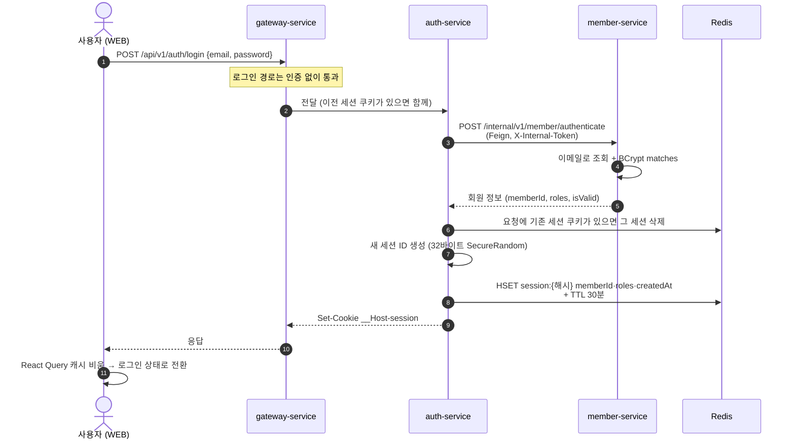
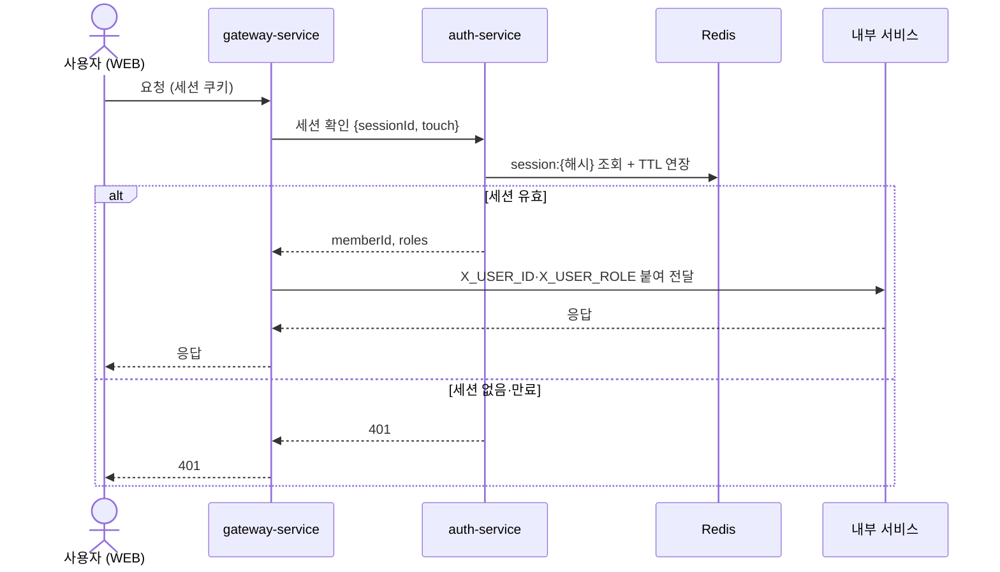
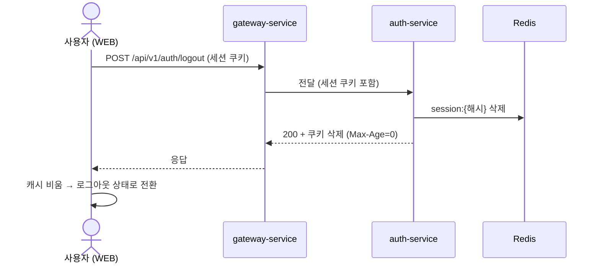

# 인증 스펙

이 문서는 로그인, 세션, 인가, 로그아웃, 서비스 간 인증이 어떻게 동작하는지 정의합니다.

⚠️ 이 문서가 기준입니다. 코드가 이 문서와 다르면 코드를 고치고, 동작을 바꾸려면 이 문서를 먼저 고칩니다.

---

## 목차

- [1. 구성 요소](#1-구성-요소)
  - [1-1. 세션](#1-1-세션)
- [2. 로그인](#2-로그인)
- [3. 요청 검증](#3-요청-검증)
  - [3-1. 검증 과정](#3-1-검증-과정)
- [4. 로그아웃](#4-로그아웃)
- [5. 서비스 간 인증](#5-서비스-간-인증)
- [6. 위협별 방어 요약](#6-위협별-방어-요약)
- [7. TODO](#7-todo)

---

## 1. 구성 요소

| 구성 요소 | 역할 |
|---|---|
| **gateway-service** | 외부에 열린 유일한 서비스. 요청의 세션 쿠키를 auth-service에 물어 확인하고, 통과하면 `X_USER_ID` / `X_USER_ROLE` 헤더를 붙여 내부 서비스로 넘긴다. 모든 변경 요청의 Origin을 검사한다 (CSRF) |
| **auth-service** | 세션 발급·확인·삭제. 사용자 DB는 없고 비밀번호 확인은 member-service에 맡긴다 |
| **member-service** | 비밀번호 확인(BCrypt, 기본 강도 10) |
| **각 내부 서비스** | 사용자 신원은 `X_USER_ID` 헤더만 믿는다. 세션 쿠키는 받지도 않는다 (게이트웨이가 지움) |
| **Redis** | 세션 저장 |
| **세션** | 로그인 상태(누가, 어떤 권한으로)를 서버에 보관하고, 쿠키의 세션 ID로 요청한 사람을 식별한다 |

- 내부 서비스는 내부 네트워크에만 있고 **외부에 포트를 열지 않는다** (외부에 열린 건 gateway뿐). 그래서 `X_USER_ID`를 위조하려면 내부 네트워크에 들어와야 한다.

### 1-1. 세션

#### 1-1-1. 세션 ID

- **32바이트 `SecureRandom` → base64url** (패딩 없음, 43자). 추측 불가능한 값이며 그 자체로는 아무 의미가 없다.
- 로그인할 때마다 **항상 새로 만든다.** 기존 ID를 이어 쓰는 경로는 없다 (세션 고정 공격 방지).
- **Redis에는 원본이 아니라 SHA-256 해시로 저장한다.** Redis 덤프·백업이 새어도 거기서 쓸 수 있는 세션 쿠키를 만들 수 없다.
- 세션 ID는 쿠키로만 오간다. URL·응답 본문·로그에 남기지 않는다.

#### 1-1-2. 세션 쿠키

auth-service가 로그인 응답에서 `Set-Cookie`로 내려준다 (`SessionCookieFactory`).

| 속성 | 값 | 이유 |
|---|---|---|
| 이름 | `__Host-session` | `__Host-` 접두어: 브라우저가 `Secure` + `Path=/` + `Domain` 없음일 때만 받아 준다 → 형제 서브도메인이 이 쿠키를 덮어쓰거나 심을 수 없다 |
| `HttpOnly` | 있음 | JS(XSS 포함)가 읽을 수 없다 |
| `Secure` | 있음 | HTTPS에서만 전송 |
| `SameSite` | `Strict` | 다른 사이트에서 시작된 요청에는 실리지 않는다 (CSRF 1차 방어). WEB과 API는 한 사이트(등록 도메인)에서만 서비스한다 |
| `Path` | `/` | 모든 API에 실린다 |
| `Domain` | 없음 | API 호스트에만 전송 (host-only) |
| `Max-Age` / `Expires` | 없음 | 만료는 Redis TTL로만 판단한다 ([1-1-4](#1-1-4-세션-만료)) — 쿠키에 수명을 두면 유휴 연장 때마다 다시 내려줘야 한다. 브라우저를 닫으면 쿠키도 사라진다 |

- auth-service(쿠키를 심음)와 gateway(쿠키를 읽음)는 common:api `SessionCookie`에 정의된 같은 이름을 쓴다. 게이트웨이는 `__Host-session`만 읽으므로 다른 이름으로 심은 쿠키는 무시된다.

#### 1-1-3. Redis 키

| 키 | 타입 | 값 | TTL |
|---|---|---|---|
| `session:{SHA-256(세션 ID) hex}` | hash | `memberId`, `roles`(쉼표 구분), `createdAt`(epoch ms) | 30분 (최대 로그인 후 12시간, [1-1-4](#1-1-4-세션-만료)) |

- 로그인 1번에 키 1개. 로그아웃은 키 삭제, 만료는 TTL이 알아서 지운다.
- 세션 확인·연장은 Lua 스크립트(`touch-session.lua`)로 **읽기 + 절대 만료 확인 + TTL 연장을 원자적으로** 한다.

#### 1-1-4. 세션 만료

| 종류 | 값 | 규칙 |
|---|---|---|
| **유휴 만료** | 30분 | 마지막 **사용자 요청**으로부터 30분 동안 요청이 없으면 만료 |
| **절대 만료** | 12시간 | 계속 사용 중이어도 로그인 12시간 뒤에는 만료 → 다시 로그인 |

- 세션 확인 때마다 TTL을 `min(30분, createdAt + 12시간 − 지금)`으로 다시 건다. 이 값이 0 이하면 키를 지우고 만료로 처리한다.
- **백그라운드 요청은 유휴 시간을 늘리지 않는다.** 알림 폴링처럼 사용자가 아무것도 안 해도 주기적으로 나가는 요청이 세션을 영원히 살려 두지 않게 하기 위함이다.
  - WEB이 이런 요청에 `X-Background-Request: true` 헤더를 붙인다.
  - 게이트웨이는 이 헤더가 있으면 세션 확인을 `touch=false`로 요청한다 → 확인만 하고 TTL은 그대로.
  - 클라이언트가 조작할 수 있는 헤더지만, 할 수 있는 일은 **자기 세션을 연장하지 않는 것**뿐이라 신뢰해도 안전하다.
- 탭을 연 채 자리를 비우면 30분 뒤 다음 요청이 401이 되고 WEB은 로그인 화면으로 간다.

---

## 2. 로그인

이메일·비밀번호를 받아 auth-service가 member-service에 확인을 맡기고, 맞으면 새 세션을 Redis에 만들고 세션 쿠키를 내려준다.

1. **요청** — 사용자가 이메일·비밀번호를 보낸다. 로그인 경로라 세션이 없어도 게이트웨이가 auth-service로 넘긴다.
2. **비밀번호 확인** — auth-service가 member-service에 이메일·비밀번호 확인을 맡긴다. 없는 이메일·틀린 비밀번호는 400, 비활성 회원은 401.
3. **이전 세션 정리** — 같은 브라우저에 이전 세션 쿠키가 남아 있으면 그 세션을 먼저 지운다. 다시 로그인해도 옛 세션이 Redis에 쌓이지 않게.
4. **새 세션 발급** — 무작위 세션 ID를 만들어 Redis에 회원 ID·권한·로그인 시각을 저장하고(30분), 세션 ID를 쿠키로 내려준다.
5. **WEB** — 이전 사용자의 화면 데이터(캐시)를 비우고 로그인 상태로 바꾼다.

> ⚠️ 알려진 문제
> - 로그인 실패 메시지가 "회원 정보를 찾을 수 없습니다" / "비밀번호가 일치하지 않습니다"로 **구분됨** — 가입 여부를 확인할 수 있다 (계정 열거). 같은 메시지·코드로 통일해야 함.
> - 로그인에 **속도 제한 없음** — 비밀번호 대입 가능.

---

## 3. 요청 검증

### 3-1. 검증 과정

게이트웨이가 요청마다 세션 쿠키를 auth-service에 물어 확인하고, 통과하면 회원 정보를 헤더로 붙여 내부 서비스로 넘긴다.

1. **요청** — 게이트웨이가 쿠키에서 세션 ID를 꺼낸다. 알림 폴링 같은 백그라운드 요청이면 세션을 연장하지 않도록 표시한다.
2. **세션 확인** — 게이트웨이가 auth-service에 세션 ID를 보내 확인을 요청한다. 요청당 1번, 3초 안에 답이 없으면 실패로 본다.
3. **Redis 조회** — auth-service가 Redis에서 세션을 찾는다. 로그인 후 12시간이 지났으면 지우고, 아니면 유휴 만료를 30분 뒤로 미룬다 (백그라운드 요청은 미루지 않는다).
4. **결과**
   - 유효 → 게이트웨이가 회원 ID와 권한을 헤더에 붙여 내부 서비스로 넘긴다.
   - 없음·만료·응답 없음 → 401.

**설계 메모**

- 세션 ID는 주소가 아니라 요청 본문에 담아 보낸다 — 접근 로그에 남지 않게.
- 게이트웨이는 확인 결과를 저장해 두지 않는다 — 로그아웃이 다음 요청부터 바로 반영되게.
- 세션 쿠키는 auth-service로 가는 요청에만 남기고, 다른 내부 서비스로 가는 요청에서는 뺀다 — 내부 서비스는 헤더의 회원 ID만 알면 되고, 쿠키를 받지 않으면 그 서비스의 로그나 버그로 세션이 새어 나갈 일도 없다.

> ⚠️ 알려진 문제
> - auth-service·Redis 장애가 **401**로 보인다 — WEB이 세션 만료로 판단해 전 사용자를 로그인 화면으로 보낸다. 세션 자체는 Redis에 남아 있으므로 복구 후 다시 로그인할 필요는 없지만, 게이트웨이가 503으로 구분하고 WEB은 503에서 로그인 화면으로 보내지 않아야 함.
> - 요청마다 게이트웨이 → auth-service HTTP 1번 — 인증된 요청의 지연·부하가 auth-service에 몰린다. 게이트웨이가 Redis를 직접 보면 한 단계를 줄일 수 있지만, 세션 규칙이 두 서비스에 나뉜다.
> - 401 응답 body가 `{status, message}`로 `ApiResponse`와 모양이 달라, 클라이언트가 두 형식을 모두 다뤄야 한다.

---

## 4. 로그아웃

그 브라우저의 세션을 Redis에서 지우고 세션 쿠키를 없앤다.

1. **요청** — 사용자가 로그아웃을 보낸다. 본문은 없고 세션 쿠키만 실린다.
2. **세션 삭제** — auth-service가 쿠키의 세션을 Redis에서 지운다. 쿠키가 없거나 세션이 이미 만료됐어도 실패하지 않는다.
3. **쿠키 삭제** — 응답에 같은 이름의 쿠키를 수명 0으로 다시 내려보내 브라우저가 지우게 한다. 세션 쿠키는 JS가 건드릴 수 없어서(HttpOnly) 이 방법으로만 지울 수 있다.
4. **WEB** — 이전 사용자의 화면 데이터(캐시)를 비우고 로그아웃 상태로 바꾼다. 요청이 실패하면 로그아웃된 것처럼 보이지 않게 오류를 알린다 — 공용 PC에 살아 있는 세션이 남지 않게.

**설계 메모**

- 로그아웃은 그 브라우저의 세션만 끊는다. 다른 기기의 세션은 그대로다.
- 세션을 지우면 그 세션으로 오는 다음 요청부터 바로 401이다 — 게이트웨이가 확인 결과를 저장해 두지 않기 때문.

---

## 5. 서비스 간 인증

### 공유 비밀 (`X-Internal-Token`)

- 모든 서비스가 같은 `INTERNAL_SERVICE_TOKEN`을 가진다. **게이트웨이도 가진다** (세션 확인 호출용).
- **받는 쪽**: member / file / storage / **auth**-service의 `InternalTokenFilter`가 `/internal/*`에만 걸림.
  - 상수 시간 비교(`MessageDigest.isEqual`).
  - 틀리면 그 서비스의 "없음" 응답을 그대로 흉내 낸다 (member `MEMBER_NOT_FOUND`, file `FILE_NOT_FOUND`, storage `FILE_NOT_FOUND_IN_STORAGE`, auth `SESSION_NOT_FOUND`) — 내부 경로가 있다는 사실도 드러내지 않는다.
  - 토큰이 비어 있으면 **서비스가 뜨지 않는다** (빈 헤더가 비밀번호가 되는 것 방지).
- **보내는 쪽**: Feign `RequestInterceptor`가 경로가 `/internal/`로 시작할 때만 헤더를 붙인다 — 비밀이 다른 경로로 새지 않게. 게이트웨이는 세션 확인 WebClient에만 붙인다.
- 게이트웨이는 `/internal/**`을 라우팅하지 않는다. 필터는 그 위의 두 번째 방어선이다 (#314, #332).

### 호출 목록

| 호출하는 쪽 → 받는 쪽 | 경로 | 인증 |
|---|---|---|
| gateway → auth | `POST /internal/v1/auth/sessions/validate` | 내부 토큰 |
| auth → member | `POST /internal/v1/member/authenticate` | 내부 토큰 |
| file → storage | `DELETE /internal/storage/{fileId}` | 내부 토큰 |
| storage → file | `/internal/files/...` (버전·zip 항목 조회, 업로드 완료 콜백) | 내부 토큰 + 원래 사용자 ID (`userId` 파라미터) |
| file → member | `GET /api/v1/member/find-by-email`, `/find` | `X_USER_ID`만 (공개 경로) |

> ⚠️ 알려진 문제
> - file → member 조회(`find-by-email`, `find`)가 공개 경로 — 로그인한 사용자라면 누구나 게이트웨이로 이메일 → 회원 조회 가능 (공유 대상 입력 UX용). 내부 호출은 `/internal/`로 분리하는 게 맞다.
> - 내부 인증이 **모든 서비스 공용 비밀 하나**이고 게이트웨이도 갖고 있다 — 한 서비스가 뚫리면 모든 내부 경로가 열린다. 서비스별 권한 구분 없음. AWS 이관 때 **서비스별 보안 그룹**으로 호출 관계를 네트워크에서 강제한다 ([aws-migration 2-13](../aws-migration.md#2-13--서비스-간-접근-제어-서비스별-보안-그룹-필수)).

---

## 6. 위협별 방어 요약

| 위협 | 방어 |
|---|---|
| XSS로 자격 증명 탈취 | 브라우저에 JS가 읽을 수 있는 자격 증명이 없다 (`HttpOnly` 쿠키만) |
| 탈취된 세션을 오래 악용 | 유휴 30분 · 절대 12시간. 로그아웃 즉시 서버에서 삭제 |
| CSRF (다른 사이트가 요청을 보내게 함) | `SameSite=Strict` + 모든 변경 요청 Origin 검사 |
| 세션 고정 | 로그인마다 새 ID, 기존 세션은 삭제 |
| 서브도메인에서 쿠키 심기·덮어쓰기 | `__Host-` 접두어 (Domain 없음, Path=/, Secure 강제) |
| 세션 ID 추측 | 256비트 무작위 |
| Redis 유출로 세션 재사용 | Redis엔 SHA-256 해시만 저장 |
| 세션 ID가 로그·URL로 유출 | 쿠키로만 전달, 검증 호출은 본문, 내부 서비스로는 쿠키를 넘기지 않음 |
| `X_USER_ID` 위조 | 게이트웨이가 항상 지우고 세션 확인 후에만 채움, 내부 서비스는 외부에 포트를 열지 않음 |
| 방치된 탭이 폴링으로 세션 유지 | 백그라운드 요청은 유휴 시간을 연장하지 않음 |

---

## 7. TODO

- [ ] 서비스 간 인증을 **VPC Lattice + IAM**으로 전환 — 각 서비스가 자기 역할로 요청에 서명하고, 정책으로 "누가 어떤 경로를 부를 수 있나"를 정한다. 공용 토큰은 AWS에서 제거한다. AWS 이관이 안정된 뒤 진행 ([aws-migration 2-13](../aws-migration.md#2-13--서비스-간-접근-제어-서비스별-보안-그룹-필수)).
- [ ] WEB 응답 헤더에 **CSP** 추가 — 우리 도메인의 스크립트만 실행되게 해서 XSS 자체를 막는다. HttpOnly 쿠키는 세션을 훔쳐 가는 것만 막고, 페이지 안에서 사용자인 척 보내는 요청은 못 막는다. 사용자가 올린 HTML·SVG 미리보기도 함께 점검한다.
