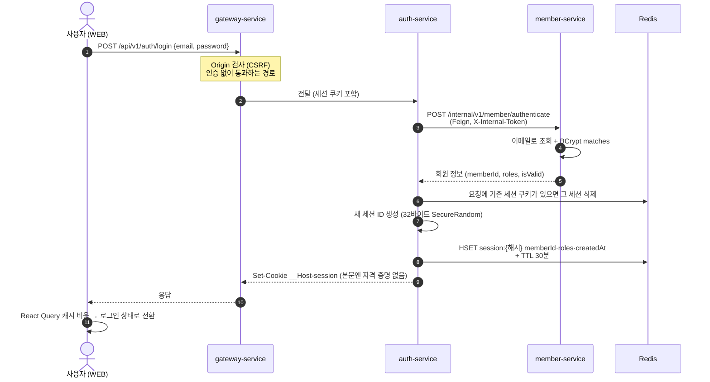
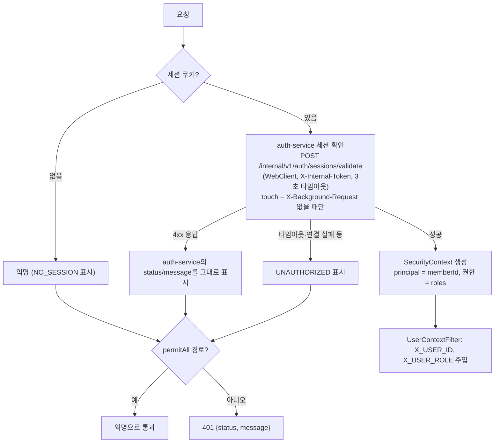

# 인증 스펙

이 문서는 로그인, 세션, 인가, 로그아웃, 서비스 간 인증이 어떻게 동작하는지 정의합니다.

⚠️ 이 문서가 기준입니다. 코드가 이 문서와 다르면 코드를 고치고, 동작을 바꾸려면 이 문서를 먼저 고칩니다.

> 기준 소스 (2026-09-25): API #430, WEB #231 — JWT(access + refresh)에서 **서버 세션**으로 전환. 바꾼 이유와 없어진 것은 [부록 A](#부록-a-jwt-방식에서-바뀌는-것).
> - API: gateway `SecurityConfig`, `CustomServerSecurityContextRepository`, `AuthClient`, `WebClientConfig`, `UserContextFilter`, `CsrfOriginGuardFilter`, `SessionCookieStripFilter`, `CustomAuthenticationEntryPoint`, `RouteConfig` / auth-service `LoginService`, `ValidateSessionService`, `LogoutService`, `RedisSessionStore`, `create-session.lua`, `touch-session.lua`, `SessionCookieFactory`, `GetSessionController`, `InternalTokenFilter`, `MemberClient` / common:api `SessionCookie`, `ValidateSessionRequest` / member-service `AuthenticateMemberService`, `InternalTokenFilter` / file·storage-service `InternalTokenFilter`
> - WEB: `lib/api-client.ts`, `stores/auth-store.ts`, `features/auth/api/get-session.ts`, `login.ts`, `logout.ts`, `features/notifications/api/list-notifications.ts`, `features/drive/components/file-preview.tsx`

알려진 문제는 각 장 끝에 **⚠️ 알려진 문제**로 적었습니다. 고칠지는 이슈로 따로 정합니다.

---

## 목차

- [1. 구성 요소](#1-구성-요소)
  - [1-1. 세션](#1-1-세션)
- [2. 로그인](#2-로그인)
  - [2-1. 장애 시 동작](#2-1-장애-시-동작)
- [3. 인가](#3-인가)
  - [3-1. 장애 시 동작](#3-1-장애-시-동작)
- [4. 로그아웃](#4-로그아웃)
- [5. WEB 동작](#5-web-동작)
- [6. 서비스 간 인증](#6-서비스-간-인증)
- [7. 위협별 방어 요약](#7-위협별-방어-요약)
- [부록 A. JWT 방식에서 바뀌는 것](#부록-a-jwt-방식에서-바뀌는-것)

---

## 1. 구성 요소

**원칙: 브라우저에는 JS가 읽을 수 있는 자격 증명을 두지 않는다.** 브라우저가 가진 것은 `HttpOnly` 세션 쿠키 하나뿐이고, 그 쿠키도 무작위 식별자일 뿐 안에 정보가 없다. 사용자 정보와 만료는 전부 서버(Redis)에 있다.

| 구성 요소 | 역할 |
|---|---|
| **gateway-service** | 외부에 열린 유일한 서비스. 요청의 세션 쿠키를 auth-service에 물어 확인하고, 통과하면 `X_USER_ID` / `X_USER_ROLE` 헤더를 붙여 내부 서비스로 넘긴다. 모든 변경 요청의 Origin을 검사한다 (CSRF) |
| **auth-service** | 세션 발급·확인·삭제. 사용자 DB는 없고 비밀번호 확인은 member-service에 맡긴다 |
| **member-service** | 비밀번호 확인(BCrypt, 기본 강도 10) |
| **각 내부 서비스** | 사용자 신원은 `X_USER_ID` 헤더만 믿는다. 세션 쿠키는 받지도 않는다 (게이트웨이가 지움) |
| **Redis** | 세션 저장 |
| **세션** | 로그인 1번 = 세션 1개. 유휴 30분, 절대 12시간 ([1-1](#1-1-세션)) |

- 내부 서비스는 compose/ECS 내부 네트워크에만 있고 **호스트 포트를 열지 않는다** (`docker-compose.service.yml`에서 `ports`는 gateway뿐). 그래서 `X_USER_ID`를 위조하려면 내부 네트워크에 들어와야 한다.
- 게이트웨이는 클라이언트가 보낸 `X_USER_ID` / `X_USER_ROLE` 헤더를 **무조건 지운 뒤**, 세션 확인에 성공한 경우에만 세션의 memberId·roles로 다시 채운다 (`UserContextFilter`). 따라서 클라이언트가 헤더를 위조해도 내부 서비스에 전달되지 않는다.

### 1-1. 세션

#### 1-1-1. 세션 ID

- **32바이트 `SecureRandom` → base64url** (패딩 없음, 43자). 추측 불가능한 값이며 그 자체로는 아무 의미가 없다.
- 로그인할 때마다 **항상 새로 만든다.** 기존 ID를 이어 쓰는 경로는 없다 (세션 고정 공격 방지).
- **Redis에는 원본이 아니라 SHA-256 해시로 저장한다.** Redis 덤프·백업이 새어도 거기서 쓸 수 있는 세션 쿠키를 만들 수 없다.
- 세션 ID는 쿠키로만 오간다. URL·응답 본문·로그에 남기지 않는다.

#### 1-1-2. 세션 쿠키

auth-service가 로그인 응답에서 `Set-Cookie`로 내려준다 (`SessionCookieFactory`).

| 속성 | 값 | 이유 |
|---|---|---|
| 이름 | `__Host-session` | `__Host-` 접두어: 브라우저가 `Secure` + `Path=/` + `Domain` 없음일 때만 받아 준다 → 형제 서브도메인이 이 쿠키를 덮어쓰거나 심을 수 없다 |
| `HttpOnly` | 항상 | JS(XSS 포함)가 읽을 수 없다 |
| `Secure` | 항상 | HTTPS에서만 전송 |
| `SameSite` | `Strict` | 다른 사이트에서 시작된 요청에는 실리지 않는다 (CSRF 1차 방어). WEB과 API는 한 사이트(등록 도메인)에서만 서비스한다 |
| `Path` | `/` | 모든 API에 실린다 |
| `Domain` | 없음 | API 호스트에만 전송 (host-only) |
| `Max-Age` / `Expires` | 없음 | 브라우저 세션 쿠키. 수명은 서버가 정한다 (1-1-4). 로그아웃 시 `Max-Age=0`으로 지움 |

- 로컬(http)에서는 `Secure`를 켤 수 없고, `__Host-` 접두어는 `Secure`를 요구하므로 **이름을 `session`으로, `Secure` 없이** 내린다. `SESSION_COOKIE_SECURE=false`일 때만 그렇다 (기본 `true`). 나머지 속성은 같다.
- 쿠키 이름은 auth-service(쿠키를 심음)와 gateway(쿠키를 읽음)가 같은 `SESSION_COOKIE_SECURE`로 정한다 (common:api `SessionCookie`). 게이트웨이는 설정된 이름의 쿠키만 읽는다 — 운영에서 접두어 없는 `session` 쿠키를 심어도 무시된다.

#### 1-1-3. Redis 키

| 키 | 타입 | 값 | TTL |
|---|---|---|---|
| `session:{SHA-256(세션 ID) hex}` | hash | `memberId`, `roles`(쉼표 구분), `createdAt`(epoch ms) | 1-1-4 규칙 |

- 로그인 1번에 키 1개. 로그아웃은 키 삭제, 만료는 TTL이 알아서 지운다.
- 세션 확인·연장은 Lua 스크립트(`touch-session.lua`)로 **읽기 + 절대 만료 확인 + TTL 연장을 원자적으로** 한다.

#### 1-1-4. 만료

| 종류 | 값 | 규칙 |
|---|---|---|
| **유휴 만료** | 30분 | 마지막 **사용자 요청**으로부터 30분 동안 요청이 없으면 만료 |
| **절대 만료** | 12시간 | 계속 사용 중이어도 로그인 12시간 뒤에는 만료 → 다시 로그인 |

- 세션 확인 때마다 TTL을 `min(30분, createdAt + 12시간 − 지금)`으로 다시 건다. 이 값이 0 이하면 키를 지우고 만료로 처리한다.
- 두 값은 설정이 아니라 코드 상수다 (`SessionPolicy.IDLE_TIMEOUT`, `ABSOLUTE_TIMEOUT`).
- `createdAt`과 "지금"은 둘 다 **Redis 서버 시계**(`TIME`)로 잰다 — auth-service 인스턴스마다 시계가 달라도 절대 만료가 흔들리지 않는다.
- **백그라운드 요청은 유휴 시간을 늘리지 않는다.** 알림 폴링처럼 사용자가 아무것도 안 해도 주기적으로 나가는 요청이 세션을 영원히 살려 두지 않게 하기 위함이다.
  - WEB이 이런 요청에 `X-Background-Request: true` 헤더를 붙인다.
  - 게이트웨이는 이 헤더가 있으면 세션 확인을 `touch=false`로 요청한다 → 확인만 하고 TTL은 그대로.
  - 클라이언트가 조작할 수 있는 헤더지만, 할 수 있는 일은 **자기 세션을 연장하지 않는 것**뿐이라 신뢰해도 안전하다.
- 탭을 연 채 자리를 비우면 30분 뒤 다음 요청이 401이 되고 WEB은 로그인 화면으로 간다 (5장).

> ⚠️ 알려진 문제
> - **회원 상태가 바뀌어도 기존 세션을 지울 수단이 없다.** 지금은 회원 비활성화·권한 변경·비밀번호 변경 기능이 없어서 문제가 되지 않는다. 이런 기능을 만들 때 `member-sessions:{memberId}`(그 회원의 세션 해시 집합) 색인을 추가하고, 변경 즉시 그 회원의 세션을 전부 지워야 한다. "모든 기기에서 로그아웃"도 같은 색인으로 만든다.

---

## 2. 로그인

이메일·비밀번호를 받아 auth-service가 member-service에 확인을 맡기고, 맞으면 새 세션을 Redis에 만들고 세션 쿠키를 내려준다. 응답 본문에는 자격 증명이 없다.

1. `POST /api/v1/auth/login {email, password}` — 인증 없음. 게이트웨이 Origin 검사는 받는다 (3장 CSRF) — 다른 사이트가 공격자 계정으로 로그인시키는 것(로그인 CSRF)을 막는다.
2. auth-service → member-service `POST /internal/v1/member/authenticate` (Feign, `X-Internal-Token`).
   - member-service가 이메일로 찾고 `BCryptPasswordEncoder.matches`로 확인.
   - 없는 이메일 → `MEMBER_NOT_FOUND`(400), 비밀번호 틀림 → `PASSWORD_NOT_MATCHED`(400). auth-service는 이 Feign 400을 **그대로 클라이언트에 전달**한다 (`GlobalExceptionHandler`의 FeignException 처리).
   - `isValid = false`면 auth-service가 `MEMBER_NOT_VALID`(401).
3. 요청에 세션 쿠키가 이미 있으면 **그 세션을 먼저 지운다.** 같은 브라우저에서 다시 로그인해도 이전 세션이 Redis에 남지 않는다.
4. 새 세션 ID를 만들고 `session:{해시}`에 memberId·roles·createdAt 저장, TTL 30분.
5. 응답: `200`, 본문 데이터 없음 + `Set-Cookie: __Host-session=…`.

### 2-1. 장애 시 동작

| 장애 | 결과 |
|---|---|
| auth-service 다운 | 게이트웨이 라우트 서킷브레이커 → fallback 503 |
| member-service 다운 | Feign connect 3초 / read 5초, 연결 실패·503은 500ms 간격 최대 3번 재시도 → 서킷브레이커(10건 중 50% 실패 시 10초 open) → `SERVICE_UNAVAILABLE` / `SERVICE_IS_OPEN` 503 |
| Redis 다운 | 세션 저장 실패 → 로그인 불가 (500) |

> ⚠️ 알려진 문제
> - 로그인 실패 메시지가 "회원 정보를 찾을 수 없습니다" / "비밀번호가 일치하지 않습니다"로 **구분됨** — 가입 여부를 확인할 수 있다 (계정 열거). 같은 메시지·코드로 통일해야 함.
> - 로그인에 **속도 제한 없음** — 비밀번호 대입 가능.

---

## 3. 인가

### 검증 과정

게이트웨이 `CustomServerSecurityContextRepository.load`가 **모든 요청**마다 돈다.

auth-service의 세션 확인 `POST /internal/v1/auth/sessions/validate` `{sessionId, touch}` (게이트웨이 전용, 내부 토큰 필요):
1. `SHA-256(sessionId)`로 `session:` 키를 찾는다.
2. `touch-session.lua`:
   - 키 없음 → 만료·로그아웃·위조 구분 없이 `SESSION_NOT_FOUND`(401)
   - `createdAt + 12시간`이 지남 → 키 삭제 + `SESSION_NOT_FOUND`
   - `touch=true`면 TTL을 `min(30분, 절대 만료까지 남은 시간)`으로 다시 건다
3. `{memberId, memberRoles}` 반환.

- 세션 ID는 URL이 아니라 **본문**으로 보낸다 — 접근 로그에 남지 않게.
- 요청마다 게이트웨이 → auth-service HTTP 1번 + Redis 1번 (스크립트 1회). 게이트웨이에 캐시는 없다 — 로그아웃이 다음 요청부터 즉시 반영되게 하기 위함.
- 에러는 모두 401: `NO_SESSION`(보호 경로에 세션 쿠키 없음), `SESSION_NOT_FOUND`. body는 `{status, message}` (`CustomAuthenticationEntryPoint`).
- `Authorization` 헤더는 보지 않는다. 보내도 무시된다.

### 세션 쿠키 전달 범위

- 게이트웨이는 `/api/v1/auth/**`(auth-service) 밖으로 라우팅하는 요청에서 **세션 쿠키를 지운다.** 내부 서비스는 신원을 `X_USER_ID`로만 받으므로 쿠키가 필요 없고, 받지 않으면 내부 서비스 로그·버그로 새어 나갈 일도 없다.

### 인증 없이 통과하는 경로 (`SecurityConfig`)

| 경로 | 이유 |
|---|---|
| `/api/v1/member/sign-up` (+ 가입 전 이메일 인증 API) | 가입 전 |
| `POST /api/v1/auth/login`, `POST /api/v1/auth/logout` | 로그인 전 / 세션이 이미 끝났어도 쿠키를 지울 수 있게 |
| `GET /api/v1/files/public/**`, `GET /api/v1/storage/public/**`, `POST /api/v1/storage/public/archive` | 링크 공유 익명 열람 ([003 공유](003-file-sharing-spec.md)) |
| Swagger (`/webjars/swagger-ui/**`, `/v3/api-docs/**`) | 문서 |
| `/actuator/**` | 관리 포트(9464)에만 있고 호스트에 안 열림 — 네트워크 격리가 방어선 |

- permitAll 경로라도 세션 쿠키가 있으면 확인하고 `X_USER_ID`를 붙인다 (로그인한 사용자가 공개 링크를 열 때 등).
- `GET /api/v1/storage/view/**`는 **더 이상 permitAll이 아니다.** `<video>`/`<audio>`의 직접 요청에도 세션 쿠키가 자동으로 실리므로 다른 경로와 똑같이 인증한다 ([002 다운로드 6장](002-file-download-spec.md#6-미리보기-인라인-보기)).
- `/internal/**`은 라우팅하지 않는다 (6장).

### CSRF

모든 인증이 쿠키로 이뤄지므로, 쿠키가 자동으로 실리는 **모든 변경 요청**을 막아야 한다. 두 겹으로 막는다.

1. **`SameSite=Strict`** (1-1-2): 브라우저가 다른 사이트에서 시작된 요청에 세션 쿠키를 싣지 않는다.
2. **게이트웨이 `CsrfOriginGuardFilter`**: 메서드가 `POST` / `PUT` / `PATCH` / `DELETE`이면 **경로와 상관없이**
   - `Origin`이 `CLIENT_URL`과 정확히 같아야 한다.
   - `Origin`이 없으면 `Referer`가 `CLIENT_URL + "/"`로 시작하거나 `CLIENT_URL`과 같아야 한다.
   - 아니면 **403** (본문 없음). 세션 확인보다 먼저 돈다.

- 브라우저는 변경 요청에 `Origin`을 스스로 붙이고, 페이지가 이를 바꿀 수 없다. 그래서 WEB은 따로 CSRF 토큰을 보낼 필요가 없다.
- `GET` / `HEAD` / `OPTIONS`는 상태를 바꾸지 않는다는 전제다. **GET으로 상태를 바꾸는 API를 만들지 않는다.**
- 결과적으로 `Origin`·`Referer`가 없는 도구(curl 등)나 게이트웨이의 Swagger UI에서 보내는 변경 요청도 403이다.

### CORS

- 허용 Origin은 `CLIENT_URL` 하나, `allowCredentials=true` (세션 쿠키 때문).
- 메서드: GET, POST, PUT, PATCH, DELETE, OPTIONS. 헤더: 전부.

### 3-1. 장애 시 동작

| 장애 | 결과 |
|---|---|
| auth-service 무응답 | 게이트웨이 WebClient connect/read/write 3초 + `Mono.timeout(3s)` → 인증 실패로 처리 → 보호 경로 **401** (#206) |
| auth-service 다운 | 위와 같이 401 → WEB이 로그인 화면으로 보냄 |
| Redis 다운 | 세션 조회 실패 → 보호 경로 401 |

> ⚠️ 알려진 문제
> - auth-service·Redis 장애가 **401**로 보인다 — WEB이 세션 만료로 판단해 전 사용자를 로그인 화면으로 보낸다. 세션 자체는 Redis에 남아 있으므로 복구 후 다시 로그인할 필요는 없지만, 게이트웨이가 503으로 구분하고 WEB은 503에서 로그인 화면으로 보내지 않아야 함.
> - 요청마다 게이트웨이 → auth-service HTTP 1번 — 인증된 요청의 지연·부하가 auth-service에 몰린다. 게이트웨이가 Redis를 직접 보면 한 단계를 줄일 수 있지만, 세션 규칙이 두 서비스에 나뉜다.
> - 401 응답 body가 `{status, message}`로 `ApiResponse`와 모양이 달라, 클라이언트가 두 형식을 모두 다뤄야 한다.

---

## 4. 로그아웃

1. `POST /api/v1/auth/logout` (세션 쿠키만). 게이트웨이 Origin 검사를 받는다 — 다른 사이트의 form이 POST해도 403.
2. 세션 쿠키가 있으면 `session:{해시}`를 지운다. 없거나 이미 만료됐어도 **실패하지 않는다.**
3. 쿠키를 `Max-Age=0`으로 지우고 `200`.

- 로그아웃은 **그 브라우저의 세션만** 끊는다. 다른 기기의 세션은 그대로다.
- 키를 지우는 즉시 그 세션으로 오는 다음 요청은 401이다 (게이트웨이 캐시 없음).

---

## 5. WEB 동작

| 상황 | 동작 |
|---|---|
| 앱 시작 (새로고침·새 탭) | `GET /api/v1/auth/session` → `200 {memberId}`면 로그인 상태, **401일 때만** 비로그인. 네트워크 오류·503은 세션에 대해 아무것도 말해 주지 않으므로 `checking`을 유지하고 3초 뒤 다시 묻는다. 확인이 끝날 때까지 보호된 화면을 그리지 않는다 |
| 로그인 성공 | React Query 캐시 비움 → 로그인 상태로 전환 (쿠키는 응답이 이미 심었다) |
| API가 401 | 비로그인 상태로 바꾸고 로그인 화면으로. **재발급 같은 재시도는 없다** |
| 로그아웃 | `POST /api/v1/auth/logout` **성공 후에만** 캐시 비움 → 첫 화면. 실패하면 로그인 상태를 유지하고 "로그아웃하지 못했습니다" 알림 — 쿠키가 HttpOnly라 JS가 지울 수 없으므로, 서버가 끝내지 못한 세션을 로그아웃된 것처럼 보여 주면 공용 PC에 살아 있는 세션이 남는다 |
| 백그라운드 폴링 (알림 개수 등) | `X-Background-Request: true` 헤더를 붙인다 (1-1-4) |
| 다운로드·텍스트/이미지 미리보기 | axios `withCredentials: true`로 Blob 요청. 인증 헤더 없음 |
| 오디오·비디오 미리보기 | `<video src="…/api/v1/storage/view/{fileId}?fileName=">` 직접 URL. 세션 쿠키가 자동으로 실린다 |

- WEB은 토큰을 어디에도 저장하지 않는다. 로그인 여부와 memberId만 메모리(zustand)에 둔다.
- 이전 버전이 남긴 `localStorage`의 `modudrive.accessToken`은 앱 시작 때 지운다.
- `GET /api/v1/auth/session`은 auth-service가 게이트웨이가 넣어 준 `X_USER_ID`를 그대로 돌려주는 API다. 세션 ID나 만료 시각은 돌려주지 않는다.

> ⚠️ 알려진 문제
> - XSS가 생기면 페이지가 열려 있는 동안에는 그 페이지 안에서 사용자인 척 요청을 보낼 수 있다 (쿠키가 자동으로 실리므로). 자격 증명을 **들고 나가는 것**은 막았지만, XSS 자체는 CSP 등 별도 조치로 막아야 한다 — WEB 배포 쪽 응답 헤더에 CSP가 아직 없다.

---

## 6. 서비스 간 인증

### 공유 비밀 (`X-Internal-Token`)

- 모든 서비스가 같은 `INTERNAL_SERVICE_TOKEN`을 가진다. **게이트웨이도 가진다** (세션 확인 호출용).
- **받는 쪽**: member / file / storage / **auth**-service의 `InternalTokenFilter`가 `/internal/*`에만 걸림.
  - 상수 시간 비교(`MessageDigest.isEqual`).
  - 틀리면 그 서비스의 "없음" 응답을 그대로 흉내 낸다 (member `MEMBER_NOT_FOUND`, file `FILE_NOT_FOUND`, storage `FILE_NOT_FOUND_IN_STORAGE`, auth `SESSION_NOT_FOUND`) — 내부 경로가 있다는 사실도 드러내지 않는다.
  - 토큰이 비어 있으면 **서비스가 뜨지 않는다** (빈 헤더가 비밀번호가 되는 것 방지).
- **보내는 쪽**: Feign `RequestInterceptor`가 경로가 `/internal/`로 시작할 때만 헤더를 붙인다 — 비밀이 다른 경로로 새지 않게. 게이트웨이는 세션 확인 WebClient에만 붙인다.
- 게이트웨이는 `/internal/**`을 라우팅하지 않는다. 필터는 그 위의 두 번째 방어선이다 (#314, #332).

### 호출 목록

| 호출하는 쪽 → 받는 쪽 | 경로 | 인증 |
|---|---|---|
| gateway → auth | `POST /internal/v1/auth/sessions/validate` | 내부 토큰 |
| auth → member | `POST /internal/v1/member/authenticate` | 내부 토큰 |
| file → storage | `DELETE /internal/storage/{fileId}` | 내부 토큰 |
| storage → file | `GET/POST /internal/files/...` (버전·zip 항목 조회) | 내부 토큰 + 원래 사용자 `X_USER_ID` |
| storage → file | `PUT /api/v1/files/{fileId}/uploaded` | `X_USER_ID`만 (공개 경로) |
| file → member | `GET /api/v1/member/find-by-email`, `/find` | `X_USER_ID`만 (공개 경로) |

> ⚠️ 알려진 문제
> - `PUT /api/v1/files/{fileId}/uploaded`(업로드 완료 콜백)가 **공개 경로**라 게이트웨이를 통해 사용자가 직접 호출할 수 있다. 소유자 확인과 s3Path 접두어 확인은 있지만 `fileSize`·`blockCount`는 클라이언트 값을 그대로 씀 → 용량 사용량을 속이거나 블록 없는 파일을 UPLOADED로 만들 수 있다. `/internal/`로 옮겨야 함.
> - file → member 조회(`find-by-email`, `find`)가 공개 경로 — 로그인한 사용자라면 누구나 게이트웨이로 이메일 → 회원 조회 가능 (공유 대상 입력 UX용). 내부 호출은 `/internal/`로 분리하는 게 맞다.
> - 내부 인증이 **모든 서비스 공용 비밀 하나**이고 게이트웨이도 갖고 있다 — 한 서비스가 뚫리면 모든 내부 경로가 열린다. 서비스별 권한 구분 없음. AWS 이관 때 **서비스별 보안 그룹**으로 호출 관계를 네트워크에서 강제한다 ([aws-migration 2-13](../aws-migration.md#2-13--서비스-간-접근-제어-서비스별-보안-그룹-필수)).

---

## 7. 위협별 방어 요약

| 위협 | 방어 |
|---|---|
| XSS로 자격 증명 탈취 | 브라우저에 JS가 읽을 수 있는 자격 증명이 없다 (`HttpOnly` 쿠키만) |
| 탈취된 세션을 오래 악용 | 유휴 30분 · 절대 12시간. 로그아웃 즉시 서버에서 삭제 |
| CSRF (다른 사이트가 요청을 보내게 함) | `SameSite=Strict` + 모든 변경 요청 Origin 검사 |
| 로그인 CSRF (공격자 계정으로 로그인시킴) | 로그인도 Origin 검사 대상 |
| 세션 고정 | 로그인마다 새 ID, 기존 세션은 삭제 |
| 서브도메인에서 쿠키 심기·덮어쓰기 | `__Host-` 접두어 (Domain 없음, Path=/, Secure 강제) |
| 세션 ID 추측 | 256비트 무작위 |
| Redis 유출로 세션 재사용 | Redis엔 SHA-256 해시만 저장 |
| 세션 ID가 로그·URL로 유출 | 쿠키로만 전달, 검증 호출은 본문, 내부 서비스로는 쿠키를 넘기지 않음 |
| `X_USER_ID` 위조 | 게이트웨이가 항상 지우고 세션 확인 후에만 채움, 내부 서비스는 호스트 포트 없음 |
| 방치된 탭이 폴링으로 세션 유지 | 백그라운드 요청은 유휴 시간을 연장하지 않음 |

---

## 부록 A. JWT 방식에서 바뀌는 것

### 왜 바꾸나

JWT 방식은 access 토큰을 `localStorage`에 두어 XSS 한 번으로 토큰을 들고 나가 최대 1시간 동안 다른 곳에서 쓸 수 있었다. 서버 세션은 브라우저에 읽을 수 있는 자격 증명을 두지 않고, 폐기가 즉시 반영된다. 우리는 게이트웨이가 요청마다 auth-service에 이미 묻고 있었기 때문에 JWT의 장점(서버 조회 없는 검증)을 쓰고 있지 않았다.

### 없어지는 것

| 영역 | 항목 |
|---|---|
| auth-service | JWT 발급·검증(`TokenManager`, jjwt 의존성), refresh 회전(`rotate-refresh-token.lua`, `RedisTokenStore`), 재발급 API(`POST /api/v1/auth/reissue`), 공개 경로였던 `POST /api/v1/auth/validate-token`, `RefreshTokenCookieFactory`, `TokenPair`·`AccessTokenClaims`·`RefreshTokenClaims` |
| Redis 키 | `refresh:{fid}`, `prev:{fid}`, `revoked:{fid}` |
| member-service | `GET /internal/v1/member/{id}/status` (재발급에서만 썼음) |
| storage-service | 스트림 토큰 (`POST /api/v1/storage/stream-token`, `RedisStreamTokenStore`, `/view`의 `streamToken` 파라미터) |
| gateway | Bearer 헤더 처리, `/storage/view/**` permitAll |
| common:api | `ValidateTokenRequest` / `ValidateTokenResponse` → 세션용으로 대체 |
| WEB | `localStorage` 토큰, 재발급 인터셉터, `issue-stream-token.ts`, 요청마다 `Authorization` 헤더 |
| 환경변수 | `JWT_SECRET_KEY`, `JWT_ACCESS_TOKEN_EXPIRATION`, `JWT_REFRESH_TOKEN_EXPIRATION`, `JWT_REFRESH_TOKEN_COOKIE_SECURE` |

### 새로 생기는 것

| 영역 | 항목 |
|---|---|
| auth-service | 세션 저장소(`session:` 키, `touch-session.lua`), `SessionCookieFactory`, `POST /internal/v1/auth/sessions/validate`, `GET /api/v1/auth/session`, `InternalTokenFilter` |
| gateway | 세션 쿠키 확인, 모든 변경 요청 Origin 검사, 내부 서비스로 가는 요청의 세션 쿠키 제거, `INTERNAL_SERVICE_TOKEN` |
| WEB | 앱 시작 시 세션 확인, `X-Background-Request` 헤더 |
| 환경변수 | `SESSION_COOKIE_SECURE` (기본 `true`, 로컬만 `false`), gateway에 `INTERNAL_SERVICE_TOKEN` |

### 전환

- 배포하면 기존 JWT 로그인은 모두 끊기고 **한 번 다시 로그인**해야 한다. 남은 `refresh:` / `prev:` / `revoked:` 키는 TTL로 알아서 사라진다.
- API와 WEB을 같이 배포한다. 한쪽만 바뀌면 로그인이 되지 않는다.
