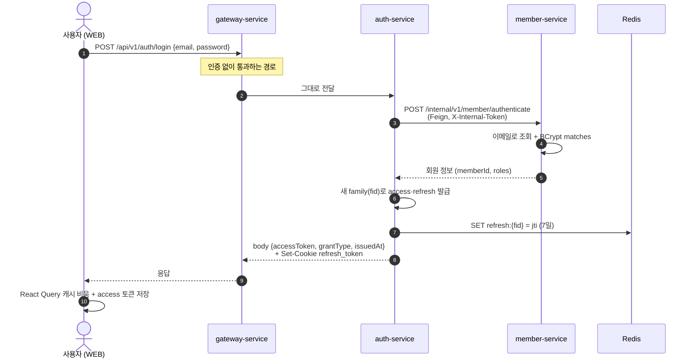
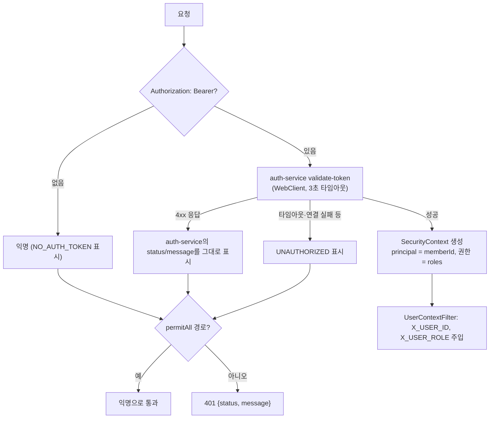

# 인증 스펙

이 문서는 로그인, 인가, 토큰 재발급, 로그아웃, 서비스 간 인증이 **현재 소스 기준으로** 어떻게 동작하는지 정의합니다.

⚠️ 이 문서가 기준입니다. 코드가 이 문서와 다르면 코드를 고치고, 동작을 바꾸려면 이 문서를 먼저 고칩니다.

> 기준 소스 (2026-09-24): API `dev` (f16377a), WEB `dev` (b607b54)
> - API: gateway `SecurityConfig`, `CustomServerSecurityContextRepository`, `AuthClient`, `WebClientConfig`, `UserContextFilter`, `CsrfOriginGuardFilter`, `CustomAuthenticationEntryPoint`, `RouteConfig`, `FallbackController` / auth-service `LoginService`, `ValidateTokenService`, `ReissueTokenService`, `LogoutService`, `TokenManager`, `RedisTokenStore`, `rotate-refresh-token.lua`, `RefreshTokenCookieFactory`, `MemberClient` / member-service `AuthenticateMemberService`, `InternalTokenFilter` / file·storage-service `InternalTokenFilter`, `InternalTokenRequestInterceptorConfig`
> - WEB: `lib/api-client.ts`, `stores/auth-store.ts`, `features/auth/api/login.ts`, `logout.ts`

알려진 문제는 각 장 끝에 **⚠️ 알려진 문제**로 적었습니다. 고칠지는 이슈로 따로 정합니다.

---

## 목차

- [1. 구성 요소](#1-구성-요소)
  - [1-1. 인증 토큰](#1-1-인증-토큰)
- [2. 로그인](#2-로그인)
  - [2-1. 장애 시 동작](#2-1-장애-시-동작)
- [3. 인가](#3-인가)
  - [3-1. 장애 시 동작](#3-1-장애-시-동작)
- [4. 토큰 재발급](#4-토큰-재발급)
  - [4-1. 장애 시 동작](#4-1-장애-시-동작)
- [5. 로그아웃](#5-로그아웃)
- [6. 서비스 간 인증](#6-서비스-간-인증)

---

## 1. 구성 요소

| 구성 요소 | 역할 |
|---|---|
| **gateway-service** | 외부에 열린 유일한 서비스. 모든 요청의 Bearer 토큰을 auth-service에 물어 검증하고, 통과하면 `X_USER_ID` / `X_USER_ROLE` 헤더를 붙여 내부 서비스로 넘긴다 |
| **auth-service** | JWT 발급·검증, refresh token 회전, 로그아웃. 사용자 DB는 없고 member-service에 묻는다. 토큰 상태는 Redis로 관리 |
| **member-service** | 비밀번호 확인(BCrypt, 기본 강도 10) |
| **각 내부 서비스** | 사용자 신원은 `X_USER_ID` 헤더만 믿는다. 토큰을 직접 보지 않는다 |
| **Redis** | 토큰 상태 저장 |
| **인증 토큰** | JWT(HS256) 두 종류. access(1시간)는 `Authorization: Bearer`로 API 호출에, refresh(7일)는 `HttpOnly` 쿠키로 재발급에만 쓴다 ([1-1](#1-1-인증-토큰)) |

- 내부 서비스는 compose/ECS 내부 네트워크에만 있고 **호스트 포트를 열지 않는다** (`docker-compose.service.yml`에서 `ports`는 gateway뿐). 그래서 `X_USER_ID`를 위조하려면 내부 네트워크에 들어와야 한다.
- 게이트웨이는 클라이언트가 보낸 `X_USER_ID` / `X_USER_ROLE` 헤더를 **무조건 지운 뒤**, 토큰 검증에 성공한 경우에만 토큰의 memberId·roles로 다시 채운다 (`UserContextFilter`). 따라서 클라이언트가 헤더를 위조해도 내부 서비스에 전달되지 않는다.

### 1-1. 인증 토큰

인증 토큰은 **JWT(JSON Web Token)** 이다. 두 종류를 쓴다.

| 토큰 | 종류 | 용도 | 수명 |
|---|---|---|---|
| **access token** | JWT | API 호출 시 `Authorization: Bearer`로 보내 사용자를 증명한다 | 1시간 |
| **refresh token** | JWT | access 토큰이 만료되면 새 토큰 쌍을 받는 데만 쓴다 (`/api/v1/auth/reissue`) | 7일 |

- 서명 알고리즘: **HS256** (HMAC-SHA256, 대칭키). 두 토큰 모두 같은 비밀키 `JWT_SECRET_KEY`(Base64)로 서명·검증한다. 비밀키는 auth-service만 가진다 — 게이트웨이는 직접 검증하지 않고 auth-service에 묻는다 (3장).
- 발급·검증: auth-service `TokenManager` (jjwt).
- JWT 자체는 서버에 저장하지 않는다(stateless). 대신 회전·로그아웃·폐기를 위해 `jti` / `fid` 상태만 Redis에 둔다 ([1-1-3](#1-1-3-redis-키)).

#### 1-1-1. claim 구성

| claim | access | refresh |
|---|---|---|
| `sub` | memberId | memberId |
| `jti` | 무작위 UUID (서버에서 쓰지 않음) | 무작위 UUID (회전 CAS 키) |
| `fid` | family id | family id |
| `roles` | `MEMBER` 등, 쉼표 구분 | 같음 |
| `type` | `access` | `refresh` |
| `exp` | 발급 + 1시간 (`JWT_ACCESS_TOKEN_EXPIRATION`) | 발급 + 7일 (`JWT_REFRESH_TOKEN_EXPIRATION`) |

- **`type` 검사**: 검증 시 기대한 `type`이 아니면 `TOKEN_INVALID`. refresh 토큰을 Bearer로 보내거나 access 토큰으로 재발급을 시도하면 막힌다.
- **family(`fid`)**: 로그인 1번 = family 1개. 재발급은 같은 family 안에서 토큰만 바꾼다. 로그아웃·재사용 감지는 family 단위로 끊는다.

#### 1-1-2. 전달·보관

| 토큰 | 서버 → 클라이언트 | WEB 보관 | 클라이언트 → 서버 |
|---|---|---|---|
| access | 응답 body `accessToken` | `localStorage` (`modudrive.accessToken`) | `Authorization: Bearer` |
| refresh | `Set-Cookie: refresh_token` | 브라우저 쿠키 (JS 접근 불가) | 쿠키 자동 전송 (`withCredentials`) |

refresh 쿠키 속성 (`RefreshTokenCookieFactory`):

| 속성 | 값 |
|---|---|
| `HttpOnly` | 항상 |
| `Path` | `/api/v1/auth` — 인증 API에만 실려 간다 |
| `Max-Age` | 7일 (로그아웃 시 0) |
| `Secure` / `SameSite` | `Secure; SameSite=Strict` — HTTPS에서만 전송, 같은 사이트(등록 도메인)에서 보낸 요청에만 실린다. WEB과 API는 한 사이트에서만 서비스한다 |

#### 1-1-3. Redis 키

| 키 | 값 | TTL | 용도 |
|---|---|---|---|
| `refresh:{fid}` | 현재 유효한 refresh `jti` | 로그인 시 7일, **회전해도 늘어나지 않음** | 회전 CAS |
| `prev:{fid}` | 직전에 회전된 `jti` | 10초 | 동시 재발급 유예 (4장) |
| `revoked:{fid}` | `1` | access 수명(1시간) | family 폐기 표시 — 그 family의 access 토큰도 거부 |

- 세션의 **절대 수명은 로그인 후 7일**이다. 회전할 때 남은 TTL을 그대로 옮기므로(`PTTL` → `SET PX`) 계속 쓰더라도 7일이 지나면 다시 로그인해야 한다.
- `revoked:`의 TTL이 1시간인 이유: 폐기 직전에 발급된 access 토큰도 최대 1시간 뒤엔 스스로 만료되므로, 그보다 오래 둘 필요가 없다.

> ⚠️ 알려진 문제
> - access 토큰을 `localStorage`에 보관 — XSS가 있으면 토큰을 가져갈 수 있다 (refresh는 httpOnly라 안전).

---

## 2. 로그인

이메일·비밀번호를 받아 auth-service가 member-service에 확인을 맡기고, 맞으면 access·refresh 토큰 한 쌍을 발급한다. refresh 토큰의 현재 `jti`는 Redis에 저장해 이후 재발급·로그아웃 때 대조한다. access는 응답 본문으로, refresh는 `HttpOnly` 쿠키로 내려준다.

1. `POST /api/v1/auth/login {email, password}` — 인증 없음.
2. auth-service → member-service `POST /internal/v1/member/authenticate` (Feign, `X-Internal-Token`).
   - member-service가 이메일로 찾고 `BCryptPasswordEncoder.matches`로 확인.
   - 없는 이메일 → `MEMBER_NOT_FOUND`(400), 비밀번호 틀림 → `PASSWORD_NOT_MATCHED`(400). auth-service는 이 Feign 400을 **그대로 클라이언트에 전달**한다 (`GlobalExceptionHandler`의 FeignException 처리).
   - `isValid = false`면 auth-service가 `MEMBER_NOT_VALID`(401).
3. 새 family로 토큰 쌍 발급, `SET refresh:{fid} = jti` (7일).
4. 응답: body `{accessToken, grantType: "Bearer", issuedAt}` + refresh 쿠키.

WEB은 로그인 성공 시 React Query 캐시를 비우고(이전 계정 데이터가 잠깐 보이지 않게) access 토큰을 저장한다.

### 2-1. 장애 시 동작

| 장애 | 결과 |
|---|---|
| auth-service 다운 | 게이트웨이 라우트 서킷브레이커 → fallback 503 |
| member-service 다운 | Feign connect 3초 / read 5초, 연결 실패·503은 500ms 간격 최대 3번 재시도 → 서킷브레이커(10건 중 50% 실패 시 10초 open) → `SERVICE_UNAVAILABLE` / `SERVICE_IS_OPEN` 503 |
| Redis 다운 | `refresh:` 저장 실패 → 로그인 불가 |

> ⚠️ 알려진 문제
> - 로그인 실패 메시지가 "회원 정보를 찾을 수 없습니다" / "비밀번호가 일치하지 않습니다"로 **구분됨** — 가입 여부를 확인할 수 있다 (계정 열거). 같은 메시지·코드로 통일해야 함.
> - 로그인에 **속도 제한 없음** — 비밀번호 대입 가능.

---

## 3. 인가

### 검증 과정

`CustomServerSecurityContextRepository.load`가 **모든 요청**마다 돈다.

auth-service의 `POST /api/v1/auth/validate-token`(게이트웨이 전용)은:
1. 서명·만료·`type=access` 확인 — 만료 `TOKEN_EXPIRED`, 형식/서명 오류 `TOKEN_INVALID`
2. `revoked:{fid}` 있음 → `ACCESS_TOKEN_REVOKED`
3. `{memberId, memberRoles}` 반환

- Redis 조회 1번(`revoked:{fid}`)이 요청마다 일어난다. 게이트웨이에 캐시는 없다.
- **회원 상태(`isValid`)는 여기서 보지 않는다.** 재발급 때만 본다 (4장). 비활성 처리된 회원도 access 만료(최대 1시간)까지는 통과한다.
- 에러는 모두 401: `NO_AUTH_TOKEN`(보호 경로에 Bearer 없음), `TOKEN_EXPIRED`, `TOKEN_INVALID`, `ACCESS_TOKEN_REVOKED`. body는 `{status, message}` (`CustomAuthenticationEntryPoint`).

### 인증 없이 통과하는 경로 (`SecurityConfig`)

| 경로 | 이유 |
|---|---|
| `/api/v1/member/sign-up` (+ 가입 전 이메일 인증 API) | 가입 전 |
| `/api/v1/auth/login`, `/reissue`, `/logout` | refresh 쿠키로 스스로 인증 |
| `GET /api/v1/files/public/**`, `GET /api/v1/storage/public/**`, `POST /api/v1/storage/public/archive` | 링크 공유 익명 열람 ([003 공유](003-file-sharing-spec.md)) |
| `GET /api/v1/storage/view/**` | `<video>`/`<audio>`는 헤더를 못 붙이므로 `streamToken`(30분) 쿼리로 대신 인증 — 검사는 storage-service가 한다 ([002 다운로드](002-file-download-spec.md#6-미리보기-인라인-보기)) |
| Swagger (`/webjars/swagger-ui/**`, `/v3/api-docs/**`) | 문서 |
| `/actuator/**` | 관리 포트(9464)에만 있고 호스트에 안 열림 — 네트워크 격리가 방어선 |

permitAll 경로라도 Bearer가 있으면 검증하고 `X_USER_ID`를 붙인다 (로그인한 사용자가 공개 링크를 열 때 등).

### CORS

- 허용 Origin은 `CLIENT_URL` 하나, `allowCredentials=true` (refresh 쿠키 때문).
- 메서드: GET, POST, PUT, PATCH, DELETE, OPTIONS. 헤더: 전부.

### 3-1. 장애 시 동작

| 장애 | 결과 |
|---|---|
| auth-service 무응답 | 게이트웨이 WebClient connect/read/write 3초 + `Mono.timeout(3s)` → 인증 실패로 처리 → 보호 경로 **401** (#206). 이전에는 모든 요청이 무한 대기했다 |
| auth-service 다운 | 위와 같이 401 → WEB이 재발급 시도 → 실패 → **WEB이 로그아웃** (4-1) |
| Redis 다운 | 폐기 조회 실패 → 보호 경로 401 |

> ⚠️ 알려진 문제
> - auth-service·Redis 장애가 **401**로 보인다 — WEB이 세션 만료로 판단해 재발급 → 실패 → 전 사용자 로그아웃. 게이트웨이가 503으로 구분하고, WEB은 503에서 로그아웃하지 않아야 함.
> - 요청마다 게이트웨이 → auth-service HTTP + Redis 2회 — 인증된 요청의 지연·부하가 auth-service에 몰린다. 서명 검증을 게이트웨이에서 하고 폐기 여부만 Redis로 보면 HTTP 한 단계를 줄일 수 있다.
> - 회원 비활성화가 access 토큰에 즉시 반영되지 않음 — 최대 1시간 계속 사용 가능.
> - 401 응답 body가 `{status, message}`로 `ApiResponse`와 모양이 달라, 클라이언트가 두 형식을 모두 다뤄야 한다.

---

## 4. 토큰 재발급

### 과정

1. `POST /api/v1/auth/reissue` (쿠키만, body 없음).
2. 게이트웨이 `CsrfOriginGuardFilter`: `Origin`이 `CLIENT_URL`과 같아야 함 (없으면 `Referer`가 `CLIENT_URL`로 시작해야 함). 아니면 **403** (본문 없음). — CSRF 토큰 없이 쿠키만으로 인증하는 경로라서, `SameSite=Strict`에 더한 두 번째 방어선 (#205).
3. refresh 서명·만료·`type=refresh` 확인. 쿠키가 없거나 유효하지 않으면 `TOKEN_INVALID`(401).
4. member-service `GET /internal/v1/member/{id}/status` → `isValid=false`면 `MEMBER_NOT_VALID`(401). **roles도 여기서 최신 값으로 다시 받는다.**
5. 같은 family로 새 토큰 쌍 생성.
6. `rotate-refresh-token.lua` (원자적 CAS) — 결과가 0이면 `REFRESH_TOKEN_REUSED`(401).
7. 새 access(body) + 새 refresh 쿠키.

### 회전 스크립트 (`rotate-refresh-token.lua`)

| 제시한 jti | 동작 | 결과 |
|---|---|---|
| `refresh:{fid}`의 현재 값 | `prev = 현재`, `refresh = 새 jti` (남은 TTL 유지) | 성공 |
| 현재 값은 아니지만 `prev:{fid}`와 같음 (10초 이내) | 동시 요청으로 보고 똑같이 회전 | 성공 |
| 둘 다 아님 | **재사용 공격으로 판단** — `refresh:{fid}` 삭제, `revoked:{fid}` 설정 | 실패 → family 전체 폐기 |
| `refresh:{fid}`가 없거나 TTL이 끝남 | family 폐기 | 실패 |

- **재사용 감지**: 탈취된 refresh 토큰이 한 번이라도 쓰이면, 공격자·정상 사용자 중 늦게 쓰는 쪽이 감지를 일으키고 family 전체가 죽는다. `revoked:`가 남아 있어 그 family의 access 토큰도 즉시 거부된다.
- **10초 유예 (#207, `RedisTokenStore.ROTATION_GRACE_WINDOW_MS`)**: 탭 여러 개나 재시도로 같은 refresh 토큰이 거의 동시에 두 번 오면, 늦은 쪽이 공격으로 오판돼 정상 세션이 로그아웃되던 문제를 막는다.
- **7일 절대 수명**: 계속 사용 중이어도 로그인 7일 뒤 `refresh:` 키가 만료돼 재발급이 실패한다 → 재로그인.

### WEB 동작 (`api-client.ts`)

| 상황 | 동작 |
|---|---|
| API가 401 (첫 번째) | 재발급 1번 → 성공하면 원래 요청을 새 토큰으로 재시도 |
| 한 탭에서 여러 요청이 동시에 401 | 재발급을 하나로 합친다 (`refreshPromise`). 탭 간 동시 재발급은 서버 10초 유예가 흡수한다 |
| 재발급 실패 | `localStorage` 토큰 삭제 → 로그인 화면 |
| 재시도한 요청도 401 | 로그아웃 |

재발급은 axios가 아닌 `fetch`로 호출한다 — axios 인터셉터를 타면 재발급 실패의 401이 다시 재발급을 부르며 스스로를 기다리게 된다.

### 4-1. 장애 시 동작

| 장애 | 결과 |
|---|---|
| auth-service 다운 | 게이트웨이 라우트 서킷브레이커 → fallback 503 → WEB은 재발급 실패로 보고 **로그아웃** |
| member-service 다운 | 상태 조회에서 로그인과 같은 재시도·서킷브레이커 → 503 → WEB 로그아웃 |
| Redis 다운 | 회전 스크립트 실패 → 재발급 불가 → WEB 로그아웃 |

> ⚠️ 알려진 문제
> - 의존 서비스 장애가 모두 **로그아웃**으로 끝난다 — WEB이 재발급 실패 이유를 구분하지 않는다 (3-1과 같은 문제).
> - 10초 유예로 회전할 때 먼저 회전한 쪽의 jti는 `prev`에만 10초 남는다. 두 응답이 순서가 바뀌어 도착해 브라우저 쿠키가 먼저 회전한 쪽 값으로 남으면, 10초 뒤 다음 재발급에서 재사용으로 감지돼 로그아웃될 수 있다 (드묾).

---

## 5. 로그아웃

1. `POST /api/v1/auth/logout` (refresh 쿠키만. Bearer는 보내도 쓰지 않는다). 게이트웨이 Origin 검사는 재발급과 같다 — 다른 사이트의 form이 POST해도 403.
2. refresh 쿠키가 없거나 유효하지 않으면 `TOKEN_INVALID`(401) — 로그아웃 자체가 실패한다.
3. `refresh:{fid}` 삭제 + `revoked:{fid}` (1시간) → 같은 family의 모든 access 토큰 거부.
4. 쿠키를 `Max-Age=0`으로 지움.

- 로그아웃은 **그 기기(family)만** 끊는다. 다른 기기의 세션은 그대로다.
- 로그아웃 직후 그 기기의 access 토큰으로 호출하면 `ACCESS_TOKEN_REVOKED` — `revoked:{fid}`가 family 전체 access를 막는다. `revoked`의 TTL(1시간)이 access 수명 이상이라 토큰 한 장 단위 블랙리스트는 두지 않는다 (#428).

---

## 6. 서비스 간 인증

### 공유 비밀 (`X-Internal-Token`)

- 모든 서비스가 같은 `INTERNAL_SERVICE_TOKEN`을 가진다.
- **받는 쪽**: member / file / storage-service의 `InternalTokenFilter`가 `/internal/*`에만 걸림.
  - 상수 시간 비교(`MessageDigest.isEqual`).
  - 틀리면 그 서비스의 "없음" 응답을 그대로 흉내 낸다 (member `MEMBER_NOT_FOUND`, file `FILE_NOT_FOUND`, storage `FILE_NOT_FOUND_IN_STORAGE`) — 내부 경로가 있다는 사실도 드러내지 않는다.
  - 토큰이 비어 있으면 **서비스가 뜨지 않는다** (빈 헤더가 비밀번호가 되는 것 방지).
- **보내는 쪽**: Feign `RequestInterceptor`가 경로가 `/internal/`로 시작할 때만 헤더를 붙인다 — 비밀이 다른 경로로 새지 않게.
- 게이트웨이는 `/internal/**`을 라우팅하지 않는다. 필터는 그 위의 두 번째 방어선이다 (#314, #332).

### 호출 목록

| 호출하는 쪽 → 받는 쪽 | 경로 | 인증 |
|---|---|---|
| auth → member | `POST /internal/v1/member/authenticate` | 내부 토큰 |
| auth → member | `GET /internal/v1/member/{id}/status` | 내부 토큰 |
| file → storage | `DELETE /internal/storage/{fileId}` | 내부 토큰 |
| storage → file | `GET/POST /internal/files/...` (버전·zip 항목 조회) | 내부 토큰 + 원래 사용자 `X_USER_ID` |
| storage → file | `PUT /api/v1/files/{fileId}/uploaded` | `X_USER_ID`만 (공개 경로) |
| file → member | `GET /api/v1/member/find-by-email`, `/find` | `X_USER_ID`만 (공개 경로) |

> ⚠️ 알려진 문제
> - `PUT /api/v1/files/{fileId}/uploaded`(업로드 완료 콜백)가 **공개 경로**라 게이트웨이를 통해 사용자가 직접 호출할 수 있다. 소유자 확인과 s3Path 접두어 확인은 있지만 `fileSize`·`blockCount`는 클라이언트 값을 그대로 씀 → 용량 사용량을 속이거나 블록 없는 파일을 UPLOADED로 만들 수 있다. `/internal/`로 옮겨야 함.
> - file → member 조회(`find-by-email`, `find`)가 공개 경로 — 로그인한 사용자라면 누구나 게이트웨이로 이메일 → 회원 조회 가능 (공유 대상 입력 UX용). 내부 호출은 `/internal/`로 분리하는 게 맞다.
> - 내부 인증이 **모든 서비스 공용 비밀 하나** — 한 서비스가 뚫리면 모든 내부 경로가 열린다. 서비스별 권한 구분 없음.
