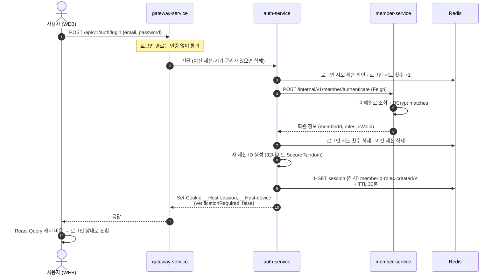
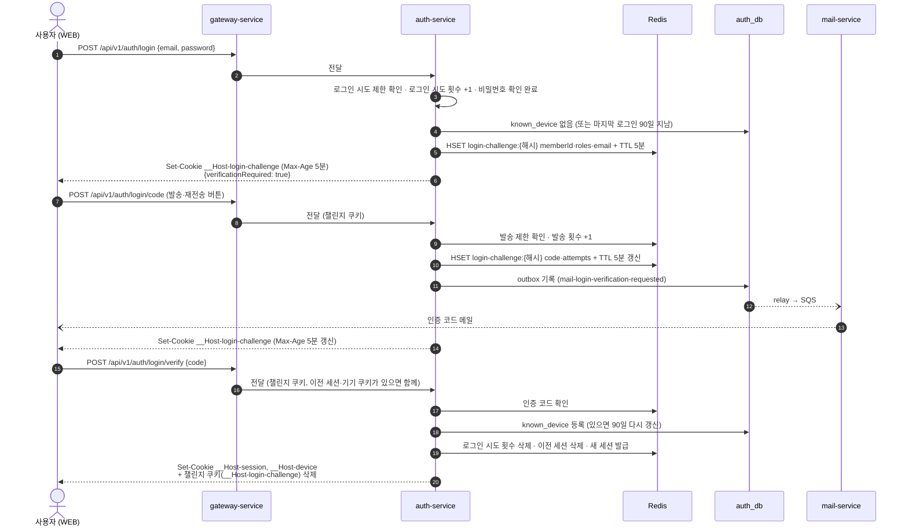
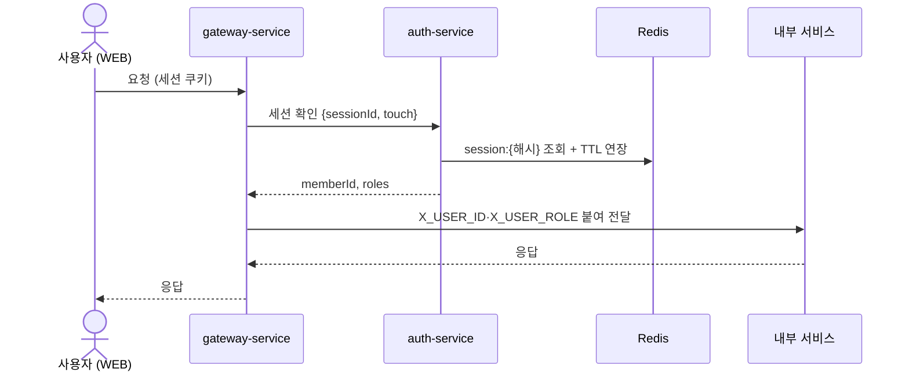
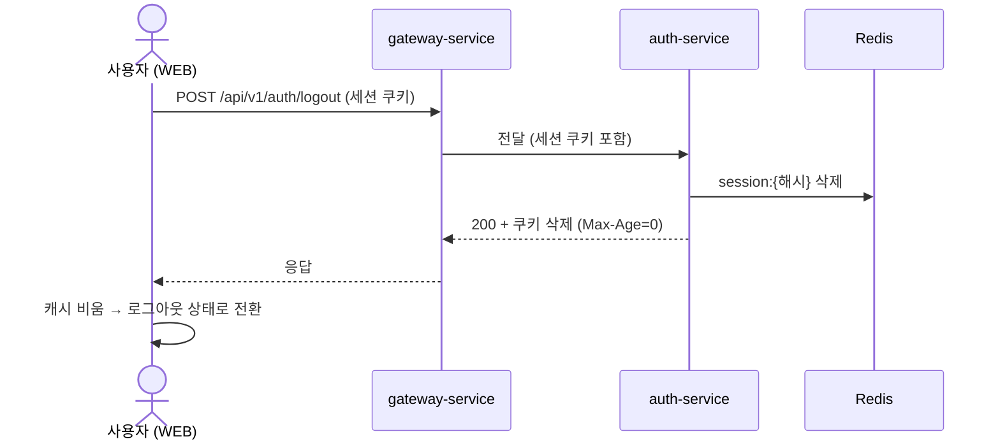

# 인증 스펙

이 문서는 로그인, 요청 검증, 로그아웃이 어떻게 동작하는지 정의합니다.

⚠️ 이 문서가 기준입니다. 코드가 이 문서와 다르면 코드를 고치고, 동작을 바꾸려면 이 문서를 먼저 고칩니다.

---

## 목차

- [1. 구성 요소](#1-구성-요소)
  - [1-1. 세션](#1-1-세션)
- [2. 로그인](#2-로그인)
  - [2-1. 로그인 시도 횟수 제한](#2-1-로그인-시도-횟수-제한)
  - [2-2. 새 기기 로그인 확인](#2-2-새-기기-로그인-확인)
- [3. 요청 검증](#3-요청-검증)
- [4. 로그아웃](#4-로그아웃)
- [5. 위협별 방어 요약](#5-위협별-방어-요약)
- [6. TODO](#6-todo)

---

## 1. 구성 요소

| 구성 요소 | 역할 |
|---|---|
| **gateway-service** | 외부에 열린 유일한 서비스. 요청의 세션 쿠키를 auth-service에 물어 확인하고, 통과하면 `X_USER_ID` / `X_USER_ROLE` 헤더를 붙여 내부 서비스로 넘긴다. |
| **auth-service** | 세션 발급·확인·삭제, 새 기기 인증 코드 메일 요청 (outbox → mail-service). 회원 정보는 없고 비밀번호 확인은 member-service에 맡긴다 |
| **member-service** | 비밀번호 확인(BCrypt, 기본 강도 10) |
| **각 내부 서비스** | 사용자 신원은 `X_USER_ID` 헤더만 믿는다. 세션 쿠키는 받지도 않는다 (게이트웨이에서 지움) |
| **Redis** | 세션([1-1-3](#1-1-3-redis-키)), 로그인 시도 횟수([2-1](#2-1-로그인-시도-횟수-제한)), 로그인 챌린지([2-2-2](#2-2-2-로그인-챌린지)) 저장 |
| **auth_db** | 인증을 마친 기기([2-2-1](#2-2-1-기기를-식별하는-방법)) |
| **세션** | 로그인 상태(누가, 어떤 권한으로)를 서버에 보관하고, 쿠키의 세션 ID로 요청한 사람을 식별한다 |

### 1-1. 세션

#### 1-1-1. 세션 ID

- **32바이트 `SecureRandom` → base64url** (패딩 없음, 43자). 추측 불가능한 값이며 그 자체로는 아무 의미가 없다.
- 로그인할 때마다 **항상 새로 만든다.** 기존 ID를 이어 쓰는 경로는 없다 (세션 고정 공격 방지).
- **Redis에는 원본이 아니라 SHA-256 해시로 저장한다.** Redis 덤프·백업이 새어도 거기서 쓸 수 있는 세션 쿠키를 만들 수 없다.
- 세션 ID는 쿠키로만 오간다. URL·응답 본문·로그에 남기지 않는다.

#### 1-1-2. 세션 쿠키

auth-service가 로그인 응답에서 `Set-Cookie`로 내려준다 (`SessionCookieFactory`).

| 속성 | 값 | 이유 |
|---|---|---|
| 이름 | `__Host-session` | `__Host-` 접두어: 브라우저가 `Secure` + `Path=/` + `Domain` 없음일 때만 받아 준다 → 형제 서브도메인이 이 쿠키를 덮어쓰거나 심을 수 없다 |
| `HttpOnly` | 있음 | JS(XSS 포함)가 읽을 수 없다 |
| `Secure` | 있음 | HTTPS에서만 전송 |
| `SameSite` | `Strict` | 다른 사이트에서 시작된 요청에는 실리지 않는다 (CSRF 1차 방어). WEB과 API는 한 사이트(등록 도메인)에서만 서비스한다 |
| `Path` | `/` | 모든 API에 실린다 |
| `Domain` | 없음 | API 호스트에만 전송 (host-only) |
| `Max-Age` / `Expires` | 없음 | 만료는 Redis TTL로만 판단한다 — 쿠키에 수명을 두면 유휴 연장 때마다 다시 내려줘야 한다. 브라우저를 닫으면 쿠키도 사라진다 |

- auth-service(쿠키를 심음)와 gateway(쿠키를 읽음)는 common:api `SessionCookie`에 정의된 같은 이름을 쓴다. 게이트웨이는 `__Host-session`만 읽으므로 다른 이름으로 심은 쿠키는 무시된다.

#### 1-1-3. Redis 키

| 키 | 타입 | 값 | TTL | 용도 |
|---|---|---|---|---|
| `session:{SHA-256(세션 ID) hex}` | hash | `memberId`, `roles`(쉼표 구분), `createdAt`(epoch ms) | 30분 (최대 로그인 후 12시간) | 로그인 상태 |

- 로그인 1번에 세션 키 1개. 로그아웃은 세션 키 삭제, 만료는 TTL이 알아서 지운다.
- **동시 로그인 허용** — 한 계정이 여러 기기·브라우저에 로그인하면 세션도 로그인한 곳마다 하나씩 따로 있다. 새로 로그인해도 다른 곳의 세션은 그대로다.

#### 1-1-4. 세션 만료

| 종류 | 값 | 규칙 |
|---|---|---|
| **유휴 만료** | 30분 | 마지막 **사용자 요청**으로부터 30분 동안 요청이 없으면 만료 |
| **절대 만료** | 12시간 | 계속 사용 중이어도 로그인 12시간 뒤에는 만료 → 다시 로그인 |

- 세션 확인 때마다 TTL을 `min(30분, createdAt + 12시간 − 지금)`으로 다시 건다. 이 값이 0 이하면 키를 지우고 만료로 처리한다.
- **백그라운드 요청은 유휴 시간을 늘리지 않는다.** 알림 폴링처럼 사용자가 아무것도 안 해도 주기적으로 나가는 요청이 세션을 영원히 살려 두지 않게 하기 위함이다.
  - WEB이 이런 요청에 `X-Background-Request: true` 헤더를 붙인다.
  - 게이트웨이는 이 헤더가 있으면 세션 확인을 `touch=false`로 요청한다 → 확인만 하고 TTL은 그대로.
  - 클라이언트가 조작할 수 있는 헤더지만, 할 수 있는 일은 **자기 세션을 연장하지 않는 것**뿐이라 신뢰해도 안전하다.
- 탭을 연 채 자리를 비우면 30분 뒤 다음 요청이 401이 되고 WEB은 로그인 화면으로 간다.

---

## 2. 로그인

이메일·비밀번호를 받아 auth-service가 member-service에 확인을 맡기고, 맞으면 새 세션을 Redis에 만들고 세션 쿠키를 내려준다.

```mermaid
sequenceDiagram
    autonumber
    actor U as 사용자 (WEB)
    participant G as gateway-service
    participant A as auth-service
    participant M as member-service
    participant R as Redis

    U->>G: POST /api/v1/auth/login {email, password}
    Note over G: 로그인 경로는 인증 없이 통과
    G->>A: 전달 (이전 세션·기기 쿠키가 있으면 함께)
    A->>R: 로그인 시도 제한 확인 · 로그인 시도 횟수 +1
    A->>M: POST /internal/v1/member/authenticate (Feign)
    M->>M: 이메일로 조회 + BCrypt matches
    M-->>A: 회원 정보 (memberId, roles, isValid)
    A->>R: 로그인 시도 횟수 삭제 · 이전 세션 삭제
    A->>A: 새 세션 ID 생성 (32바이트 SecureRandom)
    A->>R: HSET session:{해시} memberId·roles·createdAt<br/>+ TTL 30분
    A-->>G: Set-Cookie __Host-session, __Host-device<br/>{verificationRequired: false}
    G-->>U: 응답
    U->>U: React Query 캐시 비움 → 로그인 상태로 전환
```

1. **요청** — 사용자가 이메일·비밀번호를 보낸다. 로그인 경로라 세션이 없어도 게이트웨이가 auth-service로 넘긴다.
   - 비밀번호를 확인하기 전에 로그인 시도 횟수를 1 올린다. 이 이메일로 인증을 마친 기기에서 온 요청은 그 기기 몫으로 따로 세고, 나머지는 이메일 하나로 함께 센다 ([2-1](#2-1-로그인-시도-횟수-제한)).
2. **비밀번호 확인** — auth-service가 member-service에 이메일·비밀번호 확인을 맡긴다. 없는 이메일·틀린 비밀번호는 둘 다 같은 400("이메일 또는 비밀번호가 일치하지 않습니다")으로 답한다 — 어느 쪽인지 알려 주면 그 이메일의 가입 여부가 드러난다. 없는 이메일도 가짜 해시로 BCrypt 비교를 한 번 해서 응답 시간으로도 구분되지 않게 한다. 비활성 회원은 401 (비밀번호가 맞아야만 여기까지 온다).
3. **기기 확인** — 기기 쿠키(`__Host-device`)의 기기가 이 회원의 `known_device`에 있으면 90일을 다시 걸고 계속한다. 없거나 쿠키가 없으면 세션을 만들지 않고 메일 인증으로 넘어간다.
4. **이전 세션 정리** — 같은 브라우저에 이전 세션 쿠키가 남아 있으면 그 세션을 먼저 지운다. 다시 로그인해도 옛 세션이 Redis에 쌓이지 않게.
5. **새 세션 발급** — 무작위 세션 ID를 만들어 Redis에 회원 ID·권한·로그인 시각을 저장하고(30분), 세션 ID를 쿠키로 내려준다. 기기 쿠키도 다시 내려 수명(1년)을 연장한다.
6. **WEB** — 이전 사용자의 화면 데이터(캐시)를 비우고 로그인 상태로 바꾼다.

### 2-1. 로그인 시도 횟수 제한

비밀번호 대입을 막기 위해 이메일마다 로그인 시도 횟수를 Redis에 센다. 인증을 마친 기기([2-2-1](#2-2-1-기기를-식별하는-방법))에서 온 시도는 따로 센다 (OWASP "Device Cookies") — 남이 그 이메일로 일부러 틀려도 회원은 평소 쓰던 기기에서 계속 로그인할 수 있게.

| 키 | 타입 | 값 | TTL | 용도 |
|---|---|---|---|---|
| `login-attempts:{이메일(소문자)}` | string | 로그인 시도 횟수 | 15분 (첫 시도부터, 연장 없음). 세션 발급 시 삭제 | 모르는 기기·기기 쿠키 없음이 함께 쓰는 한도 — 5번을 넘으면 429 |
| `login-attempts:{이메일(소문자)}:{SHA-256(기기 ID) hex}` | string | 로그인 시도 횟수 | 위와 같음 | 그 이메일로 인증을 마친 기기 하나의 한도 — 5번을 넘으면 429 |

1. **인증된 기기인지 확인** — 기기 쿠키가 있고 그 기기가 **이 이메일로** 90일 안에 인증을 마쳤으면(`known_device`의 `email` + `device_hash`) 그 기기의 시도 횟수로 세고, 아니면 이메일의 공용 시도 횟수로 센다.
   - 비밀번호 확인 전이라 회원 ID를 모르므로 `known_device`를 이메일로 찾는다.
   - 쿠키를 지우거나 지어내도 인증된 기기가 아니므로 공용 시도 횟수로 센다 → 쿠키를 바꿔 가며 한도를 늘릴 수 없다.
2. **횟수 세기** — 로그인 요청이 오면 비밀번호를 확인하기 **전에** 시도 횟수를 1 올린다. 이메일은 대소문자를 구분하지 않는다.
   - 비밀번호 확인 전에 세는 이유: 틀린 뒤에 세면, 동시에 여러 요청을 보냈을 때 모두 검사를 통과해 버린다.
   - 횟수를 올리는 일과 15분 타이머를 거는 일은 스크립트 하나(`count-login-attempt.lua`)로 한 번에 한다.
3. **5번 넘으면 차단** — 첫 시도부터 15분 안에 5번을 넘으면, 비밀번호를 확인하지 않고 429("로그인 시도가 너무 많습니다") 에러를 준다.
4. **15분 뒤 차단 해제** — 첫 시도부터 15분이 지나면 다시 로그인할 수 있다. 차단된 동안 계속 시도해도 15분이 늘어나지 않는다.
5. **로그인 성공하면 횟수 삭제** — 세션이 실제로 발급될 때 **이번에 센 쪽의** 시도 횟수(기기 것 또는 공용)를 지운다. 새 기기라면 비밀번호가 맞았을 때가 아니라 메일 코드까지 맞았을 때 공용 시도 횟수를 지운다.

### 2-2. 새 기기 로그인 확인

처음 보는 기기에서의 로그인은 비밀번호가 맞아도 바로 세션을 주지 않는다. 계정 이메일로 보낸 6자리 코드를 확인한 뒤에야 세션을 만든다.

```mermaid
sequenceDiagram
    autonumber
    actor U as 사용자 (WEB)
    participant G as gateway-service
    participant A as auth-service
    participant R as Redis
    participant D as auth_db
    participant Mail as mail-service

    U->>G: POST /api/v1/auth/login {email, password}
    G->>A: 전달
    A->>A: 로그인 시도 제한 확인 · 로그인 시도 횟수 +1 · 비밀번호 확인 완료
    A->>D: known_device 없음 (또는 마지막 로그인 90일 지남)
    A->>R: HSET login-challenge:{해시} memberId·roles·email + TTL 5분
    A-->>U: Set-Cookie __Host-login-challenge (Max-Age 5분)<br/>{verificationRequired: true}
    U->>G: POST /api/v1/auth/login/code (발송·재전송 버튼)
    G->>A: 전달 (챌린지 쿠키)
    A->>R: 발송 제한 확인 · 발송 횟수 +1
    A->>R: HSET login-challenge:{해시} code·attempts + TTL 5분 갱신
    A->>D: outbox 기록 (mail-login-verification-requested)
    D--)Mail: relay → SQS
    Mail--)U: 인증 코드 메일
    A-->>U: Set-Cookie __Host-login-challenge (Max-Age 5분 갱신)
    U->>G: POST /api/v1/auth/login/verify {code}
    G->>A: 전달 (챌린지 쿠키, 이전 세션·기기 쿠키가 있으면 함께)
    A->>R: 인증 코드 확인
    A->>D: known_device 등록 (있으면 90일 다시 갱신)
    A->>R: 로그인 시도 횟수 삭제 · 이전 세션 삭제 · 새 세션 발급
    A-->>U: Set-Cookie __Host-session, __Host-device<br/>+ 챌린지 쿠키(__Host-login-challenge) 삭제
```

#### 2-2-1. 기기를 식별하는 방법

기기는 IP가 아니라 **브라우저에 오래 남는 쿠키**로 알아본다. IP는 LTE↔Wi-Fi·VPN만 바꿔도 달라져서 메일 인증이 계속 뜨고, AWS 이관 전에는 실제 IP를 믿을 수도 없다.

| 쿠키 | 들어 있는 것 | 언제까지 | 역할 |
|---|---|---|---|
| `__Host-device` | 기기 ID (무작위 32바이트) | 1년. 로그인할 때마다 같은 값으로 다시 1년 | "이 브라우저는 메일 인증을 마쳤다"는 표시. 이것만 훔쳐서는 로그인 못 한다 (비밀번호가 필요) |

- 서버에는 기기 ID 원본이 아니라 **SHA-256 해시만** 저장한다 (`known_device`). DB가 새도 그걸로 쿠키를 만들 수 없다.
- 기기는 **회원마다 따로** 기억한다. 한 브라우저를 두 계정이 쓰면 계정마다 한 번씩 인증한다.
- 인증한 기기라도 **90일 동안 그 기기로 로그인하지 않으면** 다시 메일 인증을 한다.

**`known_device` 테이블** (auth_db) — 인증을 마친 기기 목록

| 컬럼 | 값 |
|---|---|
| `member_id` | 기기를 인증한 회원 ID |
| `device_hash` | 기기 ID(`__Host-device` 쿠키 값)의 SHA-256 해시 |
| `email` | 인증할 때 쓴 이메일. 비밀번호 확인 전에 인증된 기기인지 확인할 때 쓴다 ([2-1](#2-1-로그인-시도-횟수-제한)) |
| `created_at` | 처음 인증한 시각 |
| `last_used_at` | 이 기기로 마지막 로그인한 시각. **90일 안이면 아는 기기** |

- 기본키는 `(member_id, device_hash)` 두 컬럼의 조합이다. 한 브라우저를 여러 계정이 쓰면 계정마다 행이 따로 있고, 같은 회원·같은 기기는 행이 하나다.
- **아는 기기인지 확인:** `last_used_at`이 90일 안이면 지금 시각으로 바꾸고 "아는 기기"로 답한다 (확인과 90일 연장을 쿼리 하나로).
- **기기 등록:** 없으면 새로 넣고, 있으면(만료됐어도) `last_used_at`만 지금으로 바꾼다.

#### 2-2-2. 로그인 챌린지

비밀번호는 맞았지만 코드 확인 전인 로그인을 로그인마다 따로 보관한다 — 계정당 하나로 두면 내 비밀번호를 아는 사람이 로그인할 때마다 내 코드가 덮어쓰기 때문에 필요

| 쿠키 | 들어 있는 것 | 언제까지 | 역할 |
|---|---|---|---|
| `__Host-login-challenge` | 확인 ID (무작위 32바이트) | 5분. 코드를 보낼 때마다 다시 5분, 코드 확인이 끝나면 삭제 | 메일 코드를 로그인을 시작한 이 브라우저에 묶는다. 이것만 훔쳐서는 로그인 못 한다 (메일 코드가 필요) |

챌린지 내용은 Redis에 둔다.

| 키 | 타입 | 값 | TTL | 용도 |
|---|---|---|---|---|
| `login-challenge:{SHA-256(확인 ID) hex}` | hash | `memberId`, `roles`, `email`, `code`(보내기 전에는 없음), `attempts` | 5분 (코드를 보낼 때마다 다시) | 새 기기 로그인에서 메일 코드 확인을 기다리는 로그인 |
| `login-code-requests:{이메일(소문자)}` | string | 코드 발송 횟수 | 15분 (첫 발송부터, 연장 없음) | 이메일별 발송 한도 — 5번을 넘으면 429 |
| `login-code-cooldown:{이메일(소문자)}` | string | `1` | 30초. 코드를 맞히거나 5번 틀리면 삭제 | 연속 발송 방지 — 있으면 429 (발송 횟수에 세지 않음) |

코드는 챌린지와 함께 5분 산다 — 마지막 발송부터 5분이 지나면 챌린지째 끝나 다시 로그인한다. 5번 틀리면 코드만 끝나(410, 인증 코드 입력 횟수 제한) 재전송하면 된다. 이메일별 발송 15분에 5번 + 30초 간격과 에러 문구는 회원가입 이메일 인증(member-service)과 같다.

1. **챌린지 만들기** — 비밀번호는 맞았는데 모르는 기기면, 세션을 주지 않고 챌린지를 5분 동안 저장한다. 이때는 코드를 만들지도 메일을 보내지도 않는다.
   - 확인 ID를 쿠키로 내려주고, 응답 본문에 `verificationRequired: true`를 담는다 → WEB은 인증 화면을 띄우고, 사용자가 "인증"을 누른다 (회원가입 인증과 같은 모양).
   - 챌린지 저장과 5분 타이머를 거는 일은 스크립트 하나(`create-login-challenge.lua`)로 한 번에 한다 — 타이머 없는 챌린지가 남지 않게.
2. **코드 보내기** — `POST /api/v1/auth/login/code`(챌린지 쿠키)가 오면 6자리 코드를 새로 만들어 챌린지에 저장하고 메일로 보낸다. 처음 보내기와 재전송이 같은 요청이다.
   - 발송 한도: 이메일마다 30초에 한 번, 15분에 5번. 30초 안이면 "요청이 너무 빈번합니다. 잠시 후 다시 시도해 주세요.", 15분 한도면 "요청 횟수를 초과했습니다. 잠시 후 다시 시도해 주세요." (30초 안의 요청은 15분 횟수에 세지 않는다).
   - 새 코드는 이전 코드를 덮어쓰고, 틀린 횟수와 챌린지의 5분을 새로 시작한다 (`issue-login-challenge-code.lua`). 챌린지 쿠키도 다시 5분으로 내려준다.
3. **틀린 코드 입력** — 400("인증 코드가 일치하지 않습니다.")을 주고 틀린 횟수를 1 올린다.
   - 코드 비교와 틀린 횟수 올리기는 스크립트 하나(`confirm-login-challenge.lua`)로 한 번에 한다 — 동시에 여러 번 보내도 5번 제한을 넘지 못하게.
4. **인증 코드 입력 횟수 제한** — 5번째로 틀리면 410("인증 코드 입력 횟수를 초과했습니다. 코드를 다시 받아 주세요.")을 주고, 그 뒤로는 맞는 코드를 넣어도 같은 410을 준다. 챌린지는 남으므로 재전송만 하면 되고(새 코드로 횟수 초기화), 30초 간격도 바로 풀린다.
5. **인증 코드·챌린지 만료** — 챌린지가 없거나 로그인(또는 마지막 발송)부터 5분이 지났으면 400("인증 시간이 지났습니다. 다시 로그인해 주세요.")을 준다. 코드는 챌린지와 함께 만료되므로 코드 만료도 같은 답이고, 재전송이 아니라 다시 로그인해야 한다.

#### 2-2-3. 한계

- 쿠키를 지우거나 시크릿 창을 쓰면 매번 메일 인증을 한다.
- 메일이 늦거나 막히면 새 기기에서는 로그인할 수 없다 — 메일 발송 장애가 새 기기 로그인 장애가 된다.

---

## 3. 요청 검증

게이트웨이가 요청마다 세션 쿠키를 auth-service에 물어 확인하고, 통과하면 회원 정보를 헤더로 붙여 내부 서비스로 넘긴다.

```mermaid
sequenceDiagram
    actor U as 사용자 (WEB)
    participant G as gateway-service
    participant A as auth-service
    participant R as Redis
    participant S as 내부 서비스

    U->>G: 요청 (세션 쿠키)
    G->>A: 세션 확인 {sessionId, touch}
    A->>R: session:{해시} 조회 + TTL 연장
    A-->>G: memberId, roles
    G->>S: X_USER_ID·X_USER_ROLE 붙여 전달
    S-->>G: 응답
    G-->>U: 응답
```

1. **요청** — 게이트웨이가 쿠키에서 세션 ID를 꺼낸다. 알림 폴링 같은 백그라운드 요청이면 세션을 연장하지 않도록 표시한다.
2. **세션 확인** — 게이트웨이가 auth-service에 세션 ID를 보내 확인을 요청한다. 요청당 1번, 3초 안에 답이 없으면 실패로 본다.
3. **Redis 조회** — auth-service가 Redis에서 세션을 찾는다. 로그인 후 12시간이 지났으면 지우고, 아니면 유휴 만료를 30분 뒤로 미룬다 (백그라운드 요청은 미루지 않는다).
4. **결과**
   - 유효 → 게이트웨이가 회원 ID와 권한을 헤더에 붙여 내부 서비스로 넘긴다.
   - 없음 (auth-service가 401로 답함) → WEB은 로그인 화면으로 가면서 "로그인이 필요합니다." 경고창을 띄운다.
   - 만료 (auth-service가 401로 답함) → WEB은 로그인 화면으로 가면서 "로그인이 만료되었습니다. 다시 로그인해 주세요." 경고창을 띄운다.

**설계 메모**

- 세션 ID는 주소가 아니라 요청 본문에 담아 보낸다 — 접근 로그에 남지 않게.
- 게이트웨이는 확인 결과를 저장해 두지 않는다 — 로그아웃이 다음 요청부터 바로 반영되게.
- 세션 쿠키는 auth-service로 가는 요청에만 남기고, 다른 내부 서비스로 가는 요청에서는 뺀다 — 내부 서비스는 헤더의 회원 ID만 알면 되고, 쿠키를 받지 않으면 그 서비스의 로그나 버그로 세션이 새어 나갈 일도 없다.

---

## 4. 로그아웃

그 브라우저의 세션을 Redis에서 지우고 세션 쿠키를 없앤다.

```mermaid
sequenceDiagram
    actor U as 사용자 (WEB)
    participant G as gateway-service
    participant A as auth-service
    participant R as Redis

    U->>G: POST /api/v1/auth/logout (세션 쿠키)
    G->>A: 전달 (세션 쿠키 포함)
    A->>R: session:{해시} 삭제
    A-->>G: 200 + 쿠키 삭제 (Max-Age=0)
    G-->>U: 응답
    U->>U: 캐시 비움 → 로그아웃 상태로 전환
```

1. **요청** — 사용자가 로그아웃을 보낸다. 본문은 없고 세션 쿠키만 실린다.
2. **세션 삭제** — auth-service가 쿠키의 세션을 Redis에서 지운다. 쿠키가 없거나 세션이 이미 만료됐어도 실패하지 않는다.
3. **쿠키 삭제** — 응답에 같은 이름의 쿠키를 수명 0으로 다시 내려보내 브라우저가 지우게 한다. 세션 쿠키는 JS가 건드릴 수 없어서(HttpOnly) 이 방법으로만 지울 수 있다.
4. **WEB** — 이전 사용자의 화면 데이터(캐시)를 비우고 로그아웃 상태로 바꾼다. 요청이 실패하면 로그아웃된 것처럼 보이지 않게 오류를 알린다 — 공용 PC에 살아 있는 세션이 남지 않게.

**설계 메모**

- 로그아웃은 그 브라우저의 세션만 끊는다. 다른 기기의 세션은 그대로다.
- 세션을 지우면 그 세션으로 오는 다음 요청부터 바로 401이다 — 게이트웨이가 확인 결과를 저장해 두지 않기 때문.

---

## 5. 위협별 방어 요약

| 위협 | 방어 | 관련 |
|---|---|---|
| 세션 ID 추측 | 256비트 무작위 | [1-1-1](#1-1-1-세션-id) |
| 세션 고정 | 로그인마다 새 ID, 기존 세션은 삭제 | [1-1-1](#1-1-1-세션-id) |
| Redis 유출로 세션 재사용 | Redis엔 SHA-256 해시만 저장 | [1-1-1](#1-1-1-세션-id) |
| 세션 ID가 로그·URL로 유출 | 쿠키로만 전달, 검증 호출은 본문, 내부 서비스로는 쿠키를 넘기지 않음 | [1-1-1](#1-1-1-세션-id), [3](#3-요청-검증) |
| XSS로 자격 증명 탈취 | 브라우저에 JS가 읽을 수 있는 자격 증명이 없다 (`HttpOnly` 쿠키만) | [1-1-2](#1-1-2-세션-쿠키) |
| 몰래 심은 코드가 사용자인 척 요청 | 우리 코드만 실행되게 브라우저에 알림(CSP). HTML·SVG 파일은 다운로드만 | [1-1-2](#1-1-2-세션-쿠키) |
| CSRF (다른 사이트가 요청을 보내게 함) | `SameSite=Strict` + 모든 변경 요청 Origin 검사 | [1-1-2](#1-1-2-세션-쿠키) |
| 서브도메인에서 쿠키 심기·덮어쓰기 | `__Host-` 접두어 (Domain 없음, Path=/, Secure 강제) | [1-1-2](#1-1-2-세션-쿠키) |
| 탈취된 세션을 오래 악용 | 유휴 30분 · 절대 12시간. 로그아웃 즉시 서버에서 삭제 | [1-1-4](#1-1-4-세션-만료), [4](#4-로그아웃) |
| 방치된 탭이 폴링으로 세션 유지 | 백그라운드 요청은 유휴 시간을 연장하지 않음 | [1-1-4](#1-1-4-세션-만료) |
| 비밀번호 대입 | 이메일별 15분에 5번까지만 시도 허용 | [2-1](#2-1-로그인-시도-횟수-제한) |
| 남이 일부러 틀려 계정을 잠금 | 인증된 기기는 시도 횟수를 따로 센다 — 잠기는 건 모르는 기기의 공용 시도 횟수뿐 | [2-1](#2-1-로그인-시도-횟수-제한) |
| 훔친 비밀번호로 로그인 | 새 기기는 가입 이메일로 보낸 코드를 확인해야 세션을 받는다. 코드 발송이 이메일별 15분에 5번이라 추측은 15분에 25번까지 | [2-2](#2-2-새-기기-로그인-확인) |
| DB 유출로 기기 쿠키 재사용 | `known_device`엔 기기 ID의 SHA-256 해시만 저장 | [2-2-1](#2-2-1-기기를-식별하는-방법) |
| `X_USER_ID` 위조 | 게이트웨이가 항상 지우고 세션 확인 후에만 채움, 내부 서비스는 외부에 포트를 열지 않음 | [3](#3-요청-검증) |

---

## 6. TODO

- [ ] **서비스 간 인증** 도입 — 지금은 내부 API(`/internal/**`)에 인증이 없고, 게이트웨이가 이 경로를 외부에 열지 않는 것에만 기댄다. 내부 네트워크 안에서는 누구나 부를 수 있다. AWS 이관 때 서비스별 보안 그룹으로 호출 관계를 네트워크에서 먼저 막고, 이관이 안정된 뒤 **VPC Lattice + IAM**(각 서비스가 자기 역할로 서명, 정책으로 "누가 어떤 경로를 부를 수 있나")으로 경로 단위까지 막는다.
- [ ] 요청마다 게이트웨이 → auth-service 세션 확인 HTTP 1번을 줄일지 판단 — 인증된 요청의 지연·부하가 auth-service에 몰린다. 게이트웨이가 Redis를 직접 보면 한 단계 줄지만 세션 규칙이 두 서비스에 나뉜다. 지금은 로그아웃 즉시 반영과 규칙 한 곳 유지를 우선해 그대로 두고, AWS 이관 뒤 실제 지연·부하를 재서 결정한다 (#448).
- [ ] **패스키(WebAuthn) 도입 검토** — 새 기기 메일 인증은 메일 계정까지 털리면 뚫린다. 패스키는 개인키가 기기 밖으로 나가지 않고 서명에 사이트 주소가 들어가 메일 탈취·피싱을 막는다. 회원이 선택하는 기능으로 두고, 켠 회원은 새 기기에서 메일 대신 패스키(잃었을 때는 복구 코드)로 확인하는 방식을 고려할 수 있다. 걸림돌: 패스키와 복구 코드를 모두 잃은 회원을 메일로 풀어 주면 보안이 메일 수준으로 돌아가고, 안 풀어 주면 계정을 잃는다.
