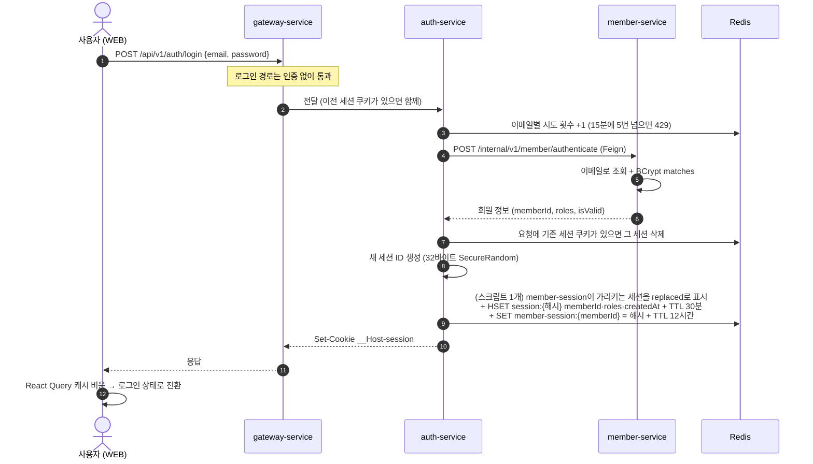
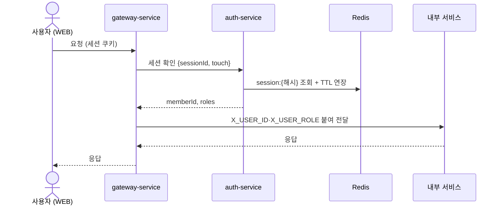
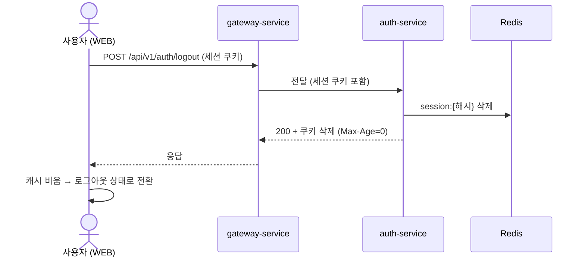

# 인증 스펙

이 문서는 로그인, 요청 검증, 로그아웃이 어떻게 동작하는지 정의합니다.

⚠️ 이 문서가 기준입니다. 코드가 이 문서와 다르면 코드를 고치고, 동작을 바꾸려면 이 문서를 먼저 고칩니다.

---

## 목차

- [1. 구성 요소](#1-구성-요소)
  - [1-1. 세션](#1-1-세션)
  - [1-2. 중복 로그인 방지](#1-2-중복-로그인-방지)
- [2. 로그인](#2-로그인)
- [3. 요청 검증](#3-요청-검증)
  - [3-1. 검증 과정](#3-1-검증-과정)
- [4. 로그아웃](#4-로그아웃)
- [5. 위협별 방어 요약](#5-위협별-방어-요약)
- [6. TODO](#6-todo)

---

## 1. 구성 요소

| 구성 요소 | 역할 |
|---|---|
| **gateway-service** | 외부에 열린 유일한 서비스. 요청의 세션 쿠키를 auth-service에 물어 확인하고, 통과하면 `X_USER_ID` / `X_USER_ROLE` 헤더를 붙여 내부 서비스로 넘긴다. 모든 변경 요청의 Origin을 검사한다 (CSRF) |
| **auth-service** | 세션 발급·확인·삭제. 사용자 DB는 없고 비밀번호 확인은 member-service에 맡긴다 |
| **member-service** | 비밀번호 확인(BCrypt, 기본 강도 10) |
| **각 내부 서비스** | 사용자 신원은 `X_USER_ID` 헤더만 믿는다. 세션 쿠키는 받지도 않는다 (게이트웨이에서 지움) |
| **Redis** | 세션 저장 |
| **세션** | 로그인 상태(누가, 어떤 권한으로)를 서버에 보관하고, 쿠키의 세션 ID로 요청한 사람을 식별한다 |

### 1-1. 세션

#### 1-1-1. 세션 ID

- **32바이트 `SecureRandom` → base64url** (패딩 없음, 43자). 추측 불가능한 값이며 그 자체로는 아무 의미가 없다.
- 로그인할 때마다 **항상 새로 만든다.** 기존 ID를 이어 쓰는 경로는 없다 (세션 고정 공격 방지).
- **Redis에는 원본이 아니라 SHA-256 해시로 저장한다.** Redis 덤프·백업이 새어도 거기서 쓸 수 있는 세션 쿠키를 만들 수 없다.
- 세션 ID는 쿠키로만 오간다. URL·응답 본문·로그에 남기지 않는다.

#### 1-1-2. 세션 쿠키

auth-service가 로그인 응답에서 `Set-Cookie`로 내려준다 (`SessionCookieFactory`).

| 속성 | 값 | 이유 |
|---|---|---|
| 이름 | `__Host-session` | `__Host-` 접두어: 브라우저가 `Secure` + `Path=/` + `Domain` 없음일 때만 받아 준다 → 형제 서브도메인이 이 쿠키를 덮어쓰거나 심을 수 없다 |
| `HttpOnly` | 있음 | JS(XSS 포함)가 읽을 수 없다 |
| `Secure` | 있음 | HTTPS에서만 전송 |
| `SameSite` | `Strict` | 다른 사이트에서 시작된 요청에는 실리지 않는다 (CSRF 1차 방어). WEB과 API는 한 사이트(등록 도메인)에서만 서비스한다 |
| `Path` | `/` | 모든 API에 실린다 |
| `Domain` | 없음 | API 호스트에만 전송 (host-only) |
| `Max-Age` / `Expires` | 없음 | 만료는 Redis TTL로만 판단한다 ([1-1-4](#1-1-4-세션-만료)) — 쿠키에 수명을 두면 유휴 연장 때마다 다시 내려줘야 한다. 브라우저를 닫으면 쿠키도 사라진다 |

- auth-service(쿠키를 심음)와 gateway(쿠키를 읽음)는 common:api `SessionCookie`에 정의된 같은 이름을 쓴다. 게이트웨이는 `__Host-session`만 읽으므로 다른 이름으로 심은 쿠키는 무시된다.

#### 1-1-3. Redis 키

| 키 | 타입 | 값 | TTL |
|---|---|---|---|
| `session:{SHA-256(세션 ID) hex}` | hash | `memberId`, `roles`(쉼표 구분), `createdAt`(epoch ms). 밀려난 세션은 `memberId`·`roles` 대신 `replaced`=`1` ([1-2](#1-2-중복-로그인-방지)) | 30분 (최대 로그인 후 12시간, [1-1-4](#1-1-4-세션-만료)) |
| `member-session:{memberId}` | string | 그 회원의 현재 세션 해시 (`session:` 뒤의 값) | 12시간 (절대 만료와 같음) |

- 로그인 1번에 세션 키 1개. 로그아웃은 세션 키 삭제, 만료는 TTL이 알아서 지운다.
- `member-session`은 로그아웃 때 지우지 않는다 — 이미 없는 세션을 가리켜도 다음 로그인이 없는 키를 건드릴 뿐이고, 12시간 TTL로 사라진다.
- 세션 생성은 Lua 스크립트(`create-session.lua`)로 **기존 세션 밀어내기 + 새 세션 저장 + `member-session` 갱신을 원자적으로** 한다.
- 세션 확인·연장은 Lua 스크립트(`touch-session.lua`)로 **읽기 + 절대 만료 확인 + TTL 연장을 원자적으로** 한다.

#### 1-1-4. 세션 만료

| 종류 | 값 | 규칙 |
|---|---|---|
| **유휴 만료** | 30분 | 마지막 **사용자 요청**으로부터 30분 동안 요청이 없으면 만료 |
| **절대 만료** | 12시간 | 계속 사용 중이어도 로그인 12시간 뒤에는 만료 → 다시 로그인 |

- 세션 확인 때마다 TTL을 `min(30분, createdAt + 12시간 − 지금)`으로 다시 건다. 이 값이 0 이하면 키를 지우고 만료로 처리한다.
- **백그라운드 요청은 유휴 시간을 늘리지 않는다.** 알림 폴링처럼 사용자가 아무것도 안 해도 주기적으로 나가는 요청이 세션을 영원히 살려 두지 않게 하기 위함이다.
  - WEB이 이런 요청에 `X-Background-Request: true` 헤더를 붙인다.
  - 게이트웨이는 이 헤더가 있으면 세션 확인을 `touch=false`로 요청한다 → 확인만 하고 TTL은 그대로.
  - 클라이언트가 조작할 수 있는 헤더지만, 할 수 있는 일은 **자기 세션을 연장하지 않는 것**뿐이라 신뢰해도 안전하다.
- 탭을 연 채 자리를 비우면 30분 뒤 다음 요청이 401이 되고 WEB은 로그인 화면으로 간다.

### 1-2. 중복 로그인 방지

한 계정은 한 곳에서만 로그인되어 있다. 새로 로그인하면 그 계정의 기존 세션은 끝나고, 다른 기기·브라우저는 다음 요청에서 로그아웃된다.

- **나중 로그인이 이긴다.** 기존 세션이 있다고 새 로그인을 거절하지 않는다 — 공용 PC에 로그아웃을 잊고 온 사용자가 최대 12시간 동안 자기 계정에 못 들어가게 되기 때문이다.
- **밀어내기** — 로그인할 때 `member-session:{memberId}`가 가리키는 세션이 아직 있으면, 그 세션에서 `memberId`·`roles`를 지우고 `replaced`=`1`만 남긴다. 남은 TTL은 그대로 두므로 원래 세션이 살아 있었을 시간(최대 30분)만큼만 남는다. 그 뒤 새 세션을 저장하고 `member-session`이 새 세션을 가리키게 한다. 이 전부가 스크립트 하나라서, 두 곳에서 동시에 로그인해도 차례로 처리되어 마지막 로그인의 세션만 남는다.
- **밀려난 세션 확인** — `replaced`인 세션은 회원 정보가 없으니 쓸 수 없다. 확인 요청에는 "없음"과 구분되는 401(`reason`=`SESSION_REPLACED`)로 답하고 TTL은 늘리지 않는다. 여러 요청이 한꺼번에 와도 같은 답이 나오도록 확인할 때 지우지 않고 TTL에 맡긴다.
  - 이 표시가 TTL로 사라진 뒤 돌아온 브라우저는 일반 "만료"로 안내된다.
  - "없음"과 다르게 답해도 새는 정보는 없다 — 이 답은 한때 진짜였던 세션 ID를 가진 사람, 즉 밀려난 본인만 받을 수 있다.
- **같은 브라우저의 이전 세션**은 따로 지운다 ([2장](#2-로그인) 3번). 다른 계정으로 다시 로그인하는 경우라 밀어내기로는 잡히지 않는다.
- **제약** — 스크립트가 `member-session` 값으로 만든 세션 키를 건드리므로 Redis Cluster(키가 여러 슬롯으로 나뉨)에서는 돌지 않는다. AWS에서는 ElastiCache를 cluster mode disabled로 쓴다.

---

## 2. 로그인

이메일·비밀번호를 받아 auth-service가 member-service에 확인을 맡기고, 맞으면 새 세션을 Redis에 만들고 세션 쿠키를 내려준다.

```mermaid
sequenceDiagram
    autonumber
    actor U as 사용자 (WEB)
    participant G as gateway-service
    participant A as auth-service
    participant M as member-service
    participant R as Redis

    U->>G: POST /api/v1/auth/login {email, password}
    Note over G: 로그인 경로는 인증 없이 통과
    G->>A: 전달 (이전 세션 쿠키가 있으면 함께)
    A->>R: 이메일별 시도 횟수 +1 (15분에 5번 넘으면 429)
    A->>M: POST /internal/v1/member/authenticate (Feign)
    M->>M: 이메일로 조회 + BCrypt matches
    M-->>A: 회원 정보 (memberId, roles, isValid)
    A->>R: 요청에 기존 세션 쿠키가 있으면 그 세션 삭제
    A->>A: 새 세션 ID 생성 (32바이트 SecureRandom)
    A->>R: (스크립트 1개) member-session이 가리키는 세션을 replaced로 표시<br/>+ HSET session:{해시} memberId·roles·createdAt + TTL 30분<br/>+ SET member-session:{memberId} = 해시 + TTL 12시간
    A-->>G: Set-Cookie __Host-session
    G-->>U: 응답
    U->>U: React Query 캐시 비움 → 로그인 상태로 전환
```

1. **요청** — 사용자가 이메일·비밀번호를 보낸다. 로그인 경로라 세션이 없어도 게이트웨이가 auth-service로 넘긴다.
   - **시도 횟수 제한** — auth-service는 비밀번호를 확인하기 전에 그 이메일의 시도를 1번 센다. 첫 시도부터 15분 안에 5번을 넘으면 비밀번호를 확인하지 않고 429("로그인 시도가 너무 많습니다")로 거절하고, 15분이 지나면 풀린다. 로그인에 성공하면 횟수를 지운다. 이메일은 대소문자를 구분하지 않고 센다.
     - 확인 전에 세는 이유: 실패한 뒤에 세면 동시에 보낸 요청들이 모두 검사를 통과한다.
     - 대가: 남이 일부러 5번 틀리면 그 계정은 15분 동안 로그인할 수 없다. 여러 계정에 흔한 비밀번호 하나씩 넣어 보는 공격은 이메일별 제한으로 막지 못한다 (IP별 제한은 실제 클라이언트 IP를 믿을 수 있는 AWS 이관 뒤 검토).
2. **비밀번호 확인** — auth-service가 member-service에 이메일·비밀번호 확인을 맡긴다. 없는 이메일·틀린 비밀번호는 둘 다 같은 400("이메일 또는 비밀번호가 일치하지 않습니다")으로 답한다 — 어느 쪽인지 알려 주면 그 이메일의 가입 여부가 드러난다. 없는 이메일도 가짜 해시로 BCrypt 비교를 한 번 해서 응답 시간으로도 구분되지 않게 한다. 비활성 회원은 401 (비밀번호가 맞아야만 여기까지 온다).
3. **이전 세션 정리** — 같은 브라우저에 이전 세션 쿠키가 남아 있으면 그 세션을 먼저 지운다. 다시 로그인해도 옛 세션이 Redis에 쌓이지 않게.
4. **새 세션 발급** — 그 계정이 다른 곳에 로그인해 있으면 그 세션을 밀어내고([1-2](#1-2-중복-로그인-방지)), 무작위 세션 ID를 만들어 Redis에 회원 ID·권한·로그인 시각을 저장하고(30분), 세션 ID를 쿠키로 내려준다.
5. **WEB** — 이전 사용자의 화면 데이터(캐시)를 비우고 로그인 상태로 바꾼다.

---

## 3. 요청 검증

### 3-1. 검증 과정

게이트웨이가 요청마다 세션 쿠키를 auth-service에 물어 확인하고, 통과하면 회원 정보를 헤더로 붙여 내부 서비스로 넘긴다.

```mermaid
sequenceDiagram
    actor U as 사용자 (WEB)
    participant G as gateway-service
    participant A as auth-service
    participant R as Redis
    participant S as 내부 서비스

    U->>G: 요청 (세션 쿠키)
    G->>A: 세션 확인 {sessionId, touch}
    A->>R: session:{해시} 조회 + TTL 연장
    A-->>G: memberId, roles
    G->>S: X_USER_ID·X_USER_ROLE 붙여 전달
    S-->>G: 응답
    G-->>U: 응답
```

1. **요청** — 게이트웨이가 쿠키에서 세션 ID를 꺼낸다. 알림 폴링 같은 백그라운드 요청이면 세션을 연장하지 않도록 표시한다.
2. **세션 확인** — 게이트웨이가 auth-service에 세션 ID를 보내 확인을 요청한다. 요청당 1번, 3초 안에 답이 없으면 실패로 본다.
3. **Redis 조회** — auth-service가 Redis에서 세션을 찾는다. 로그인 후 12시간이 지났으면 지우고, 아니면 유휴 만료를 30분 뒤로 미룬다 (백그라운드 요청은 미루지 않는다).
4. **결과**
   - 유효 → 게이트웨이가 회원 ID와 권한을 헤더에 붙여 내부 서비스로 넘긴다.
   - 없음 (auth-service가 401로 답함) → WEB은 로그인 화면으로 가면서 "로그인이 필요합니다." 경고창을 띄운다.
   - 만료 (auth-service가 401로 답함) → WEB은 로그인 화면으로 가면서 "로그인이 만료되었습니다. 다시 로그인해 주세요." 경고창을 띄운다.
   - 밀려남 (auth-service가 401 + `data.reason`=`SESSION_REPLACED`로 답함, [1-2](#1-2-중복-로그인-방지)) → 게이트웨이는 `reason`을 그대로 실어 401로 답하고, WEB은 로그인 화면으로 가면서 "다른 곳에서 로그인되어 로그아웃되었습니다." 경고창을 띄운다. WEB은 문구가 아니라 `reason`으로 구분한다.

**설계 메모**

- 세션 ID는 주소가 아니라 요청 본문에 담아 보낸다 — 접근 로그에 남지 않게.
- 게이트웨이는 확인 결과를 저장해 두지 않는다 — 로그아웃이 다음 요청부터 바로 반영되게.
- 세션 쿠키는 auth-service로 가는 요청에만 남기고, 다른 내부 서비스로 가는 요청에서는 뺀다 — 내부 서비스는 헤더의 회원 ID만 알면 되고, 쿠키를 받지 않으면 그 서비스의 로그나 버그로 세션이 새어 나갈 일도 없다.

---

## 4. 로그아웃

그 브라우저의 세션을 Redis에서 지우고 세션 쿠키를 없앤다.

```mermaid
sequenceDiagram
    actor U as 사용자 (WEB)
    participant G as gateway-service
    participant A as auth-service
    participant R as Redis

    U->>G: POST /api/v1/auth/logout (세션 쿠키)
    G->>A: 전달 (세션 쿠키 포함)
    A->>R: session:{해시} 삭제
    A-->>G: 200 + 쿠키 삭제 (Max-Age=0)
    G-->>U: 응답
    U->>U: 캐시 비움 → 로그아웃 상태로 전환
```

1. **요청** — 사용자가 로그아웃을 보낸다. 본문은 없고 세션 쿠키만 실린다.
2. **세션 삭제** — auth-service가 쿠키의 세션을 Redis에서 지운다. 쿠키가 없거나 세션이 이미 만료됐어도 실패하지 않는다.
3. **쿠키 삭제** — 응답에 같은 이름의 쿠키를 수명 0으로 다시 내려보내 브라우저가 지우게 한다. 세션 쿠키는 JS가 건드릴 수 없어서(HttpOnly) 이 방법으로만 지울 수 있다.
4. **WEB** — 이전 사용자의 화면 데이터(캐시)를 비우고 로그아웃 상태로 바꾼다. 요청이 실패하면 로그아웃된 것처럼 보이지 않게 오류를 알린다 — 공용 PC에 살아 있는 세션이 남지 않게.

**설계 메모**

- 로그아웃은 그 브라우저의 세션만 끊는다. 한 계정은 세션이 하나뿐이라([1-2](#1-2-중복-로그인-방지)) 따로 끊을 다른 기기 세션도 없다.
- 세션을 지우면 그 세션으로 오는 다음 요청부터 바로 401이다 — 게이트웨이가 확인 결과를 저장해 두지 않기 때문.

---

## 5. 위협별 방어 요약

| 위협 | 방어 |
|---|---|
| XSS로 자격 증명 탈취 | 브라우저에 JS가 읽을 수 있는 자격 증명이 없다 (`HttpOnly` 쿠키만) |
| 몰래 심은 코드가 사용자인 척 요청 | 우리 코드만 실행되게 브라우저에 알림(CSP). HTML·SVG 파일은 다운로드만 |
| 탈취된 세션을 오래 악용 | 유휴 30분 · 절대 12시간. 로그아웃 즉시 서버에서 삭제 |
| CSRF (다른 사이트가 요청을 보내게 함) | `SameSite=Strict` + 모든 변경 요청 Origin 검사 |
| 비밀번호 대입 | 이메일별 15분에 5번까지만 시도 허용 |
| 세션 고정 | 로그인마다 새 ID, 기존 세션은 삭제 |
| 탈취된 세션이 본인 모르게 계속 살아 있음 | 중복 로그인 방지 — 본인이 다시 로그인하면 다른 곳의 세션은 끝나고, 밀려난 쪽에는 이유를 알린다 |
| 서브도메인에서 쿠키 심기·덮어쓰기 | `__Host-` 접두어 (Domain 없음, Path=/, Secure 강제) |
| 세션 ID 추측 | 256비트 무작위 |
| Redis 유출로 세션 재사용 | Redis엔 SHA-256 해시만 저장 |
| 세션 ID가 로그·URL로 유출 | 쿠키로만 전달, 검증 호출은 본문, 내부 서비스로는 쿠키를 넘기지 않음 |
| `X_USER_ID` 위조 | 게이트웨이가 항상 지우고 세션 확인 후에만 채움, 내부 서비스는 외부에 포트를 열지 않음 |
| 방치된 탭이 폴링으로 세션 유지 | 백그라운드 요청은 유휴 시간을 연장하지 않음 |

---

## 6. TODO

- [ ] **서비스 간 인증** 도입 — 지금은 내부 API(`/internal/**`)에 인증이 없고, 게이트웨이가 이 경로를 외부에 열지 않는 것에만 기댄다. 내부 네트워크 안에서는 누구나 부를 수 있다. AWS 이관 때 서비스별 보안 그룹으로 호출 관계를 네트워크에서 먼저 막고, 이관이 안정된 뒤 **VPC Lattice + IAM**(각 서비스가 자기 역할로 서명, 정책으로 "누가 어떤 경로를 부를 수 있나")으로 경로 단위까지 막는다 ([aws-migration 2-13](../aws-migration.md#2-13--서비스-간-접근-제어-서비스별-보안-그룹-필수)).
- [ ] 요청마다 게이트웨이 → auth-service 세션 확인 HTTP 1번을 줄일지 판단 — 인증된 요청의 지연·부하가 auth-service에 몰린다. 게이트웨이가 Redis를 직접 보면 한 단계 줄지만 세션 규칙이 두 서비스에 나뉜다. 지금은 로그아웃 즉시 반영과 규칙 한 곳 유지를 우선해 그대로 두고, AWS 이관 뒤 실제 지연·부하를 재서 결정한다 (#448).
- [ ] **중복 로그인 방지**([1-2](#1-2-중복-로그인-방지)) 구현 — 스펙만 먼저 정했다.
- [ ] **새 기기 로그인은 이메일 인증** — 중복 로그인 방지만으로는 비밀번호를 훔친 사람과 본인이 서로를 번갈아 밀어낼 수 있다. 오래 가는 기기 쿠키로 처음 보는 기기를 가려, 그 기기에서의 로그인은 메일로 보낸 코드를 확인한 뒤에야 세션을 준다. IP는 기준으로 쓰지 않는다 — 같은 사람도 LTE↔Wi-Fi·VPN으로 수시로 바뀌고, 실제 클라이언트 IP는 AWS 이관 전엔 믿을 수 없다.
