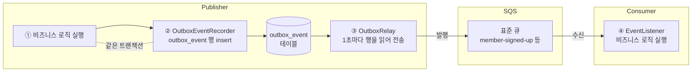
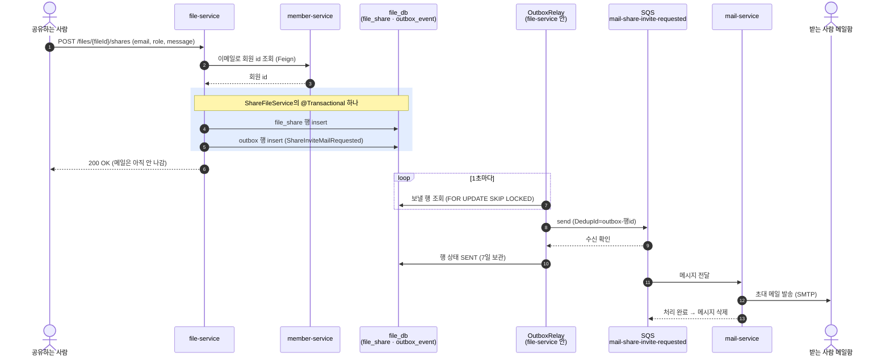
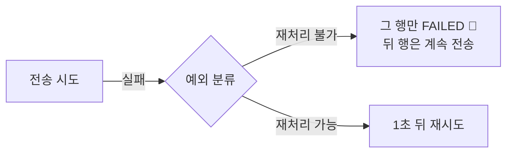
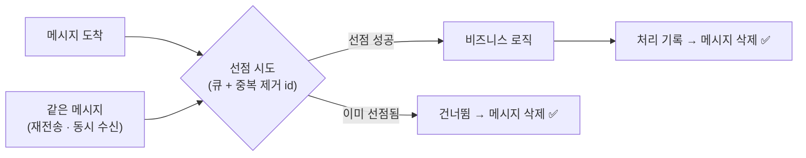
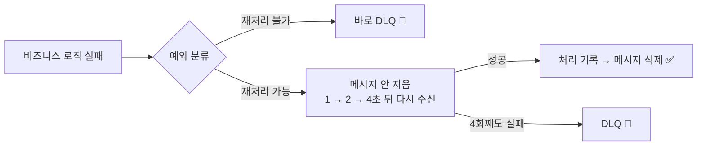
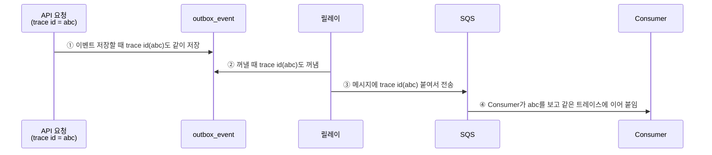

# 비동기 메시징 스펙

이 문서는 서비스 간 비동기 메시징(SQS)의 동작 규칙을 정의합니다.

⚠️ 이 문서가 기준입니다. 코드가 이 문서와 다르면 코드를 고치고, 동작을 바꾸려면 이 문서를 먼저 고칩니다.

---

## 목차

- [1. 인프라](#1-인프라)
  - [1-1. SQS 사용 이유](#1-1-sqs-사용-이유)
  - [1-2. 운영 (AWS)](#1-2-운영-aws)
  - [1-3. 로컬](#1-3-로컬)
- [2. 전체 흐름](#2-전체-흐름)
  - [2-1. 예시 — 파일을 공유하면 초대 메일이 나가기까지](#2-1-예시--파일을-공유하면-초대-메일이-나가기까지)
- [3. Publisher](#3-publisher)
  - [3-1. Transaction Outbox](#3-1-transaction-outbox)
  - [3-2. 이벤트 발행 과정](#3-2-이벤트-발행-과정)
  - [3-3. 전송 실패](#3-3-전송-실패)
- [4. Consumer](#4-consumer)
  - [4-1. 이벤트 처리 과정](#4-1-이벤트-처리-과정)
  - [4-2. 처리 실패](#4-2-처리-실패)
- [5. 재처리 (replay)](#5-재처리-replay)
- [6. 트레이싱](#6-트레이싱)
- [7. 사용 큐 목록](#7-사용-큐-목록)
- [8. TODO](#8-todo)

---

## 1. 인프라

### 1-1. SQS 사용 이유

AWS SQS는 완전관리형 큐 서비스로 시간당 과금이 아닌 월 100만 요청까지 무료로 사용할 수 있다.
**현재 시스템의 메시징은 "한 서비스가 보내고 한 서비스가 받는" 작은 작업 큐 뿐이며, 비용 및 운영 부담이 적은 SQS 도입한다.**

#### 1-1-1. 다른 선택지와 비교

관리형 서비스만 비교한다. Kafka·RabbitMQ를 EC2 등에 **직접 설치해 운영하는 방식은 비용 및 운영 부담 문제로 고려하지 않는다**
(서버를 24시간 띄워야 하고, 설치·디스크·백업·패치·업그레이드를 직접 해야 하며, 1대로 돌리면 그 서버가 곧 메시징 전체의 장애 지점이 된다).

| | **SQS** | Kafka (MSK) | RabbitMQ (Amazon MQ) |
|---|---|---|---|
| 성격 | 작업 큐 — 받아서 처리하면 지움 | 이벤트 로그 — 메시지를 기간 동안 쌓아두고 여러 구독자가 각자 읽음 | 작업 큐 + 라우팅(exchange) |
| 비용 | 매달 100만 건 무료, 초과분 100만 건당 **USD 0.40** (표준 큐) | 프로비저닝: m7g.large 브로커 3대(3 AZ) **USD 0.75/시간** Serverless: 클러스터 1개 **USD 0.92/시간** (+ 파티션 요금) | m7g.large 3노드 클러스터(여러 AZ) **USD 1.01/시간** |
| 운영 | 없음 — 서버·디스크·버전 관리가 AWS 몫 | (프로비저닝 기준) 브로커 수·디스크 크기 결정, 버전 업그레이드 실행. OS 패치는 AWS | 인스턴스 크기 결정, 버전 업그레이드 |
| 재시도/DLQ | **기본 기능** (redrive policy) + 재시도 간격은 visibility로 조절 | 브로커엔 없음 — 클라이언트 라이브러리로 구성 (예: Spring Kafka `DeadLetterPublishingRecoverer` → `-dlt`) | DLQ는 기본 기능(dead-letter exchange). 단 **간격 두고 재시도하는 기능은 없음** — 보통 쓰는 delayed-message 플러그인을 Amazon MQ가 지원 안 함 |
| 순서 보장 | 표준: 없음 / FIFO: 그룹 단위 — 실패한 메시지가 끝날 때까지 뒤 메시지가 기다림. DLQ로 빠지면 깨짐 | 파티션 단위 — 실패한 메시지를 제자리에서 재시도하면 뒤 메시지가 기다려 유지. 재시도 토픽·DLT로 빼면 깨짐 | 큐 단위 — 실패한 메시지를 재시도하는 동안 뒤 메시지가 먼저 처리돼 깨짐 |
| replay | 없음 (처리하면 삭제) | **있음** — offset 되감기 | 없음 |
| fan-out | SNS 붙이면 가능 | 기본 (컨슈머 그룹) | 기본 (exchange) |
| 인증 | ECS task role(IAM) 그대로 | IAM 인증 가능 — 클라이언트에 `aws-msk-iam-auth` 라이브러리 + 설정 추가 | 사용자/비밀번호, OAuth 2.0·LDAP·mTLS. IAM은 STS 토큰을 비밀번호로 넘기는 방식(OAuth 2.0 경유)이라 설정 추가 |

비용은 서울 리전 온디맨드 단가(2026-09-23 AWS Price List, 스토리지·데이터 전송 제외)이며, SQS처럼 여러 AZ에 복제되도록 Kafka·RabbitMQ는 여러 AZ 클러스터(m7g.large) 가격으로 맞췄다.

- **SQS로 부족해지는 때**
  - 한 이벤트를 여러 서비스가 받아야 할 때 → **SNS 토픽 → SQS 큐 여러 개**로 확장 (코드 구조는 그대로).
  - 지난 이벤트를 다시 처리해야 할 때 → 실패분은 DLQ redrive, 성공분은 outbox에 7일 남은 행을 `PENDING`으로 되돌려 재발행 ([5장](#5-재처리-replay)).
  - 초당 수천 건 이상의 이벤트 스트림, 여러 팀이 같은 이벤트를 각자 읽는 구조가 생기면 그때 다른 메시지 큐 사용을 다시 검토.

#### 1-1-2. FIFO가 아니라 STANDARD를 사용하는 이유

현재 순서 보장이 필요한 큐가 없기 때문이다.

| | STANDARD | FIFO |
|---|---|---|
| 순서 | 보장 안 함 | 같은 그룹 안에서 보장 |
| 중복 | 가끔 두 번 올 수 있음 → **Consumer 멱등성 체크가 거름** ([4-1-1](#4-1-1-멱등성-체크)) | 5분 안의 중복 제거 |
| 처리량 | 사실상 무제한 | 초당 300건 상한 (배치 시 3,000) |
| 재시도 중 | 다른 메시지는 계속 처리 | **같은 그룹 뒤 메시지가 전부 대기** (head-of-line blocking) |

- FIFO의 두 장점 중 중복 제거는 멱등성 체크가 이미 하고 있고, 순서 보장은 쓸 곳이 없다 — 남는 건 처리량 상한과 head-of-line blocking뿐.
- 알림 피드는 소비 시각(`created_at`) 순으로 보이므로, 같은 사람에게 1초 간격으로 두 건이 가면 순서가 뒤집혀 보일 수 있다 —
  그 순서에 의미가 생기면 FIFO로 바꾸기보다 이벤트에 발생 시각을 실어 그걸로 정렬한다.

### 1-2. 운영 (AWS)

| 항목 | 내용 |
|---|---|
| 브로커 | Amazon SQS (표준 큐) |
| 큐/DLQ/redrive 정의 | Terraform (예정) — [1-2-1](#1-2-1-큐-설정) |
| 접속 | endpoint·키 **미설정** → SDK 기본 체인이 ECS task role + `AWS_REGION`을 쓴다 |

#### 1-2-1. 큐 설정

Terraform으로 만들 때 `init-aws.sh`와 **똑같이** 맞춘다 — 로컬에서 테스트한 재시도 동작이 운영에서도 그대로 나오도록.
큐마다 아래 설정 한 벌 + 짝 DLQ(`<이름>-dlq`) 하나.

| 옵션 | 값 | 의미 |
|---|---|---|
| 큐 종류 | 표준(standard) | 순서 보장·중복 제거 없음. 중복은 Consumer 멱등성 체크가 거른다 ([1-1-2](#1-1-2-fifo가-아니라-standard를-사용하는-이유)) |
| `VisibilityTimeout` | 10초 | 메시지를 가져간 Consumer에게 주는 **처리 시간**. 10초 안에 못 끝내면 큐에 다시 나타난다 |
| `RedrivePolicy.maxReceiveCount` | 4 | 같은 메시지를 4번 받고도 못 지우면 SQS가 DLQ로 옮긴다 = 첫 시도 1 + 재시도 3. 에러 핸들러는 이 값을 큐에서 읽어서, 마지막 시도에 실패하면 사유를 달아 직접 DLQ로 옮긴다 ([4-2](#4-2-처리-실패)) |
| `RedrivePolicy.deadLetterTargetArn` | `<이름>-dlq`의 ARN | 옮겨갈 DLQ. SQS 규칙상 원래 큐와 **같은 종류**(표준)여야 한다 |
| DLQ `MessageRetentionPeriod` | 기본값(4일) | DLQ 메시지는 이 기간이 지나면 사라진다 — 알림([4-2-1](#4-2-1-dlq에-들어간-뒤))을 받으면 그 안에 redrive. 최대 14일까지 늘릴 수 있음 |

#### 1-2-2. task role 권한

로컬 LocalStack은 권한을 검사하지 않아서, 하나라도 빠지면 운영에서만 `AccessDenied`가 난다.
서비스마다 **자기가 쓰는 큐에만** 준다(최소 권한 — 한 서비스가 뚫려도 남의 큐는 못 건드리게).

| 누가 | 권한 | 왜 |
|---|---|---|
| Publisher | `SendMessage` | outbox 릴레이가 큐로 전송 |
| Consumer | `ReceiveMessage` | 큐에서 메시지 가져오기 |
| | `DeleteMessage` | 처리 성공 시 삭제 — 없으면 같은 메시지가 계속 다시 옴 |
| | `ChangeMessageVisibility` | 재시도 백오프(1s/2s/4s 뒤 다시 받기) |
| | DLQ에 `SendMessage` | 재처리 불가 실패를 에러 핸들러가 바로 DLQ로 옮김 |
| | `GetQueueUrl`, `GetQueueAttributes` | 큐 이름 → 주소 조회, redrive 설정(DLQ·최대 수신 횟수)과 DLQ 건수 읽기 |

### 1-3. 로컬

| 항목 | 내용 |
|---|---|
| 브로커 | LocalStack 컨테이너 (`.docker/docker-compose.infra.yml`, 포트 4566) |
| 큐/DLQ/redrive 정의 | `.docker/localstack/init-aws.sh` — LocalStack이 뜰 때마다 큐 + DLQ + 버킷을 만든다 |
| 접속 | `SPRING_CLOUD_AWS_SQS_ENDPOINT=http://localstack:4566` + 더미 키(`test`) |
| 인증 토큰 | `.docker/.env`의 `LOCALSTACK_AUTH_TOKEN` (app.localstack.cloud → Auth Tokens). `./gradlew test`의 큐 테스트도 여기서 읽는다 |

- **토큰 필수** — LocalStack은 2026-03-23부터 토큰 없이는 안 뜬다. 무료(Hobby) 플랜은 비상업 용도 한정.
- **메모리 저장** — 무료 플랜엔 영속화가 없어서, 재시작하면 큐에 떠 있던 메시지가 전부 사라진다. Postgres의 파일 행은 남으니 재시작 후엔 `make reset` 필요.
- 큐 상태 보기: `docker exec modudrive-infra-localstack-1 awslocal sqs get-queue-attributes --queue-url http://localhost:4566/000000000000/<큐> --attribute-names All`

---

## 2. 전체 흐름

이벤트는 **DB에 먼저 적고(outbox) → 나중에 SQS로 보내고 → Consumer가 처리**한다. 세 단계가 서로 다른 시점에 일어난다.

- **①②는 한 트랜잭션**: 회원이 저장되면 이벤트도 반드시 남고, 롤백되면 이벤트도 없음.
- **③은 따로 돈다**: SQS가 잠깐 죽어 있어도 행이 테이블에 남아 있다가 다음 틱에 전송됨.
- **④가 처리에 성공하면** 메시지가 큐에서 삭제됨.

### 2-1. 예시 — 파일을 공유하면 초대 메일이 나가기까지

- **파란 박스가 핵심**: 공유 행과 메일 이벤트가 한 트랜잭션. 공유가 저장되면 메일은
  반드시 나가고, 커밋이 실패하면 둘 다 없음 → "공유는 됐는데 메일이 안 감"도, "메일은 왔는데 공유가 없음"도 불가능.
- 이벤트 기록은 `ShareFileService`가 공유 행 저장 직후 이벤트 포트(`PublishMailEventPort`)를 직접 불러서 한다 — 같은 `@Transactional` 안.
- 사용자 응답(200 OK)은 메일 발송(SMTP)을 기다리지 않음. 메일은 보통 수 초 안에 도착.

---

## 3. Publisher

Publisher는 이벤트를 만들어 큐로 내보낸다.

### 3-1. Transaction Outbox

트랜잭션 아웃박스 패턴은 데이터베이스 업데이트와 메시지 브로커 발행 간의 이중 쓰기(Dual Write) 문제를 해결하고 데이터 일관성을 보장하는 디자인 패턴이다.

비즈니스 로직 안에서 SQS로 곧장 보내면 막을 수 없는 실패가 둘 있다.

| 상황 | 결과 |
|---|---|
| DB는 커밋됐는데 전송이 실패 | 파일은 공유됐는데 초대 메일이 영영 안 나간다 |
| 전송은 나갔는데 트랜잭션이 롤백 | 없던 일이 된 공유의 초대 메일이 상대에게 도착한다 |

둘 다 **DB 커밋과 SQS 전송이 서로 다른 시스템**이라 한 트랜잭션으로 묶이지 않아서 생긴다. SQS는 2단계
커밋을 지원하지 않으므로 묶을 방법도 없다.

그래서 전송을 **같은 DB에 적는 일로 바꾼다.** 보낼 내용을 `outbox_event` 테이블에 한 행으로 적어두면
비즈니스 데이터와 같은 트랜잭션이라 같이 커밋되고 같이 롤백된다. 실제 전송은 그 행을 읽는 별도 스레드가
맡는다. 전송이 실패해도 행은 남아 있으니 다음 틱에 다시 나간다 — "전송에 성공해야 한다"는 문제가
"행을 적어야 한다"는 문제로 바뀌는 것이 이 패턴의 전부다.

`outbox_event`가 갖게되는 상태는 다음과 같다.

| 상태 | 뜻 | 언제 사라지나 |
|---|---|---|
| `PENDING` | 기록됨, 아직 안 보냄 (전송될 때까지 계속 재시도) | 전송되면 `SENT` |
| `SENT` | SQS가 받음 (`sent_at`) | **7일 보관** 후 relay가 1시간마다 정리 |
| `FAILED` | 그 메시지 하나가 잘못됨 (`failed_at`, `failure_reason`) | 정리하지 않음, 사람이 처리 |

### 3-2. 이벤트 발행 과정

#### 3-2-1. 이벤트 기록

- 비즈니스 코드는 SQS로 직접 보내지 않고 `OutboxEventRecorder.record(queue, key, event)`를 부른다 → `outbox_event` 행 insert.
- 기록은 **유스케이스 서비스가 자기 `@Transactional` 안에서 이벤트 포트를 직접 호출**해서 한다. 
  비즈니스 데이터 저장과 같은 트랜잭션이라 같이 커밋되거나 같이 롤백된다.
- 호출자 트랜잭션이 없으면(예: 가입 인증 메일 요청 — 인증 코드는 Redis) 기록기가 outbox insert만 담은 트랜잭션을 스스로 연다.

#### 3-2-2. 이벤트 전송

- `OutboxRelay`가 1초마다(한 틱) `PENDING` 행을 id 순으로 **최대 100개 읽어**(`FOR UPDATE SKIP LOCKED`) **1건씩** 동기 전송한다.
  SQS 일괄 전송(`SendMessageBatch`)은 쓰지 않는다 — 100개를 읽으면 SQS 호출도 100번.
- `SKIP LOCKED`라 인스턴스가 여러 대여도 같은 행을 두 번 보내지 않는다.
- **중복 제거 id = `outbox-<행 id>`**: `DeduplicationId` 메시지 속성으로 같이 나간다. SQS가 받았는데 SENT 표시 커밋
  전에 죽어 재전송되면 같은 id로 다시 가므로, Consumer가 그걸 보고 재전송인 줄 안다([4-1-1](#4-1-1-멱등성-체크)).
- 성공하면 `status = SENT`, `sent_at` 기록.

#### 3-2-3. 이벤트 정리

`SENT` 행은 **7일 보관** 후 relay가 1시간마다 지운다. 바로 지우지 않는 이유는 재처리([5장](#5-재처리-replay))와
사고 조사 때 "그 이벤트가 정말 나갔나"를 확인할 곳이 현재 이 테이블뿐이기 때문이다.

### 3-3. 전송 실패

전송 실패는 2가지 분류로 나누어 처리한다.

| 구분 | 실패 | 무엇 |
|---|---|---|
| **재처리 불가** | payload 복원 실패 | 이벤트 클래스가 바뀌어 저장된 payload를 객체로 못 되살림 |
| 〃 | 직렬화 실패 | 객체를 JSON으로 못 바꿈 — SQS에 닿기도 전 |
| 〃 | SQS가 거절 | 큐 없음 · 크기 초과 · 잘못된 값 (400) |
| **재처리 가능** | 일시 장애 | 연결 실패 · 5xx · 스로틀링 · 권한 거부 |

**재처리에 왜 횟수 제한이 없나** — 여기서 실패하는 건 그 메시지가 아니라 인프라다. 장애가 나면 모든 행이 똑같이 실패하므로,
N번에 `FAILED`로 보내면 멀쩡한 이벤트가 무더기로 빠지고 복구 후 사람이 일일이 되돌려야 한다.
저절로 복구될 일을 수동 작업으로 바꾸는 셈이다. 행이 `PENDING`으로 남아 있는 것 자체가 이미 안전한 보관 상태다.

**전송 시 SDK가 먼저 재시도한다** — relay가 `publish()`를 한 번 부르면 SDK가 그 안에서 최대 4번 시도한다
(기본 LEGACY 모드, 100ms부터 지수 백오프 + jitter). 다 합쳐도 1초가 안 된다.
그 안에 성공하면 relay는 실패가 있었는지도 모르고 넘어간다. **위 표의 "일시 장애"는 1초를 넘게 끊겼다는 뜻이다.**

#### 3-3-1. 전송 실패 시 알림

`outbox_event`의 `FAILED` 발생과 인프라 장애로 이벤트 전송 지체가 지속될 경우, 다음과 같은 알림을 보낸다.

| 지표 | 알림 조건 | 무슨 뜻인가 |
|---|---|---|
| `modudrive_outbox_lag_seconds` — 가장 오래 기다린 `PENDING` 행의 나이(초, 큐별) | `> 120`이 5분 지속 | 전송이 막혔다 (SQS 장애 등) |
| `modudrive_outbox_failed` — 현재 `FAILED` 행 수 (큐·사유별) | `> 0` 즉시 | 사람이 손대야 하는 행이 있다 |

(상세 내용은 [005-discord-alert-spec.md 7장](005-discord-alert-spec.md#7-사용-알림) 참고)

---

## 4. Consumer

Consumer는 큐에서 메시지를 받아 처리한다.

### 4-1. 이벤트 처리 과정

#### 4-1-1. 멱등성 체크

SQS 표준 큐는 at-least-once라 같은 메시지가 두 번 올 수 있다(outbox 재전송, 처리 후 삭제 전 Consumer 다운, 브로커 자체 중복 등).
그래서 **처리 전에 "이미 처리한 메시지인가"를 확인**하고, 처리했으면 건너뛰고 메시지만 지운다.

- **키**: 큐 이름 + 중복 제거 id(`outbox-<행 id>`). 같은 이벤트면 항상 같은 값이고,
  큐 이름을 붙여야 행 id가 서비스끼리 겹쳐도 안 부딪친다.
- **확인이 아니라 선점이다.** 묻지 않고 바로 쓰고, 쓰기 성공 여부로 판단한다.
  - DB: `processed_event`에 insert → `uk_processed_event`가 두 번째를 막는다
  - Redis: `SETNX processed:<큐>:<중복 제거 id>` → 키가 없을 때만 써진다
- 처리에 실패하면 선점도 같이 풀린다([4-1-2](#4-1-2-처리-기록)).
- 구현: `common:infrastructure:messaging`의 `ProcessedEvents` 포트 + JPA/Redis 구현.

#### 4-1-2. 처리 기록

비즈니스 로직이 예외 없이 끝나면 **처리 기록을 남기고 메시지를 삭제한다(ACK).**

- DB: `processed_event` 테이블에 insert — 비즈니스 처리와 같은 트랜잭션
- Redis: 선점 키의 TTL을 10초 → 7일로 늘려 **"처리 완료"로 굳힌다** — 그동안 오는 재전송은 전부 선점에서
  걸러진다. 실패하면 키를 지워 재시도에 넘긴다

#### 4-1-3. 처리 기록 정리

처리 기록은 **7일 보관**(= outbox SENT 보관 기간) 뒤 정리한다. 그보다 오래된 재전송은 없기 때문이다.
DB 쪽은 각 서비스에서 1시간마다 지우고, Redis 쪽은 키 TTL로 알아서 사라진다.

### 4-2. 처리 실패

| 구분 | 예 | 처리 |
|---|---|---|
| 재처리 가능 | SMTP·네트워크 타임아웃, DB 락, **분류에 없는 모든 예외** | 지수 백오프(1s → 2s → 4s)로 재시도, 4번째도 실패하면 DLQ — 사유 `Retries exhausted after 4 attempts: <마지막 예외>` |
| 재처리 불가 | `IllegalArgumentException`, `NullPointerException`, `ClassCastException`, 검증 실패(`ValidationException`), 페이로드 타입 변환 실패 | 한 번 실패하면 바로 DLQ, 원본 본문 + 사유(`DeadLetterReason`) 보관 |

- 분류에 없는 예외는 **재처리 가능**으로 본다 — 잘못 버려서 사람이 되살리는 쪽이 더 비싸다.
- 재시도 횟수와 DLQ 이름은 앱에 안 적고 **큐 설정에서 읽는다**.
- 컨슈머가 죽거나 본문이 JSON이 아니면 앱을 안 거치고 **SQS가 알아서 DLQ로 보낸다** (사유 없음, 약 40초).
- DLQ로 옮기는 것 자체가 실패하면 재시도로 돌린다 — 유실 없음.
- 구현: `PermanentFailures`(분류) + `DeadLetteringErrorHandler`(모든 `@SqsListener`에 자동 적용).

#### 4-2-1. DLQ에 들어간 뒤

**DLQ에서 메시지를 꺼내 자동으로 다시 처리하는 코드는 없고, 두지 않는다.** DLQ에 있다는 건 "재시도로는 안 되는
것을 확인했다"는 뜻이라, 자동으로 다시 넣으면 같은 실패를 무한히 돈다. DLQ는 **사람이 볼 때까지 안전하게
세워두는 주차장**이고, 처리는 사람이 한다.

| 단계 | 하는 일 |
|---|---|
| 1. 알림 | DLQ에 한 건이라도 쌓이면 디스코드로 알린다 (아래) |
| 2. 확인 | DLQ 메시지의 `DeadLetterReason` 속성과 원본 본문을 본다 — 왜 실패했는지가 거기 적혀 있다 |
| 3. 수정 | 원인을 고친다 (코드 배포 · 데이터 정정 · 설정 변경) |
| 4. redrive | DLQ → 원래 큐로 되돌린다. AWS 콘솔의 `Start DLQ redrive` 버튼 또는 `aws sqs start-message-move-task --source-arn <dlq-arn>` |
| 5. 재처리 | 멱등성 기록(`processed_event`)은 처리에 성공했을 때만 남으므로, DLQ로 빠진 메시지는 기록이 없어 그대로 다시 처리된다 ([4-1-2](#4-1-2-처리-기록)) |

버릴 메시지는 DLQ에서 지우면 끝이다. 아무것도 안 하면 SQS 보관 기간(기본 4일, 최대 14일)이 지나 사라진다.

#### 4-2-2. 처리 실패 시 알림

DLQ로 옮겨지고 나면 원래 큐는 다시 비어 보여서, 알림이 없으면 아무도 모른 채 보관 기간이 지나 사라진다.

| 지표 | 알림 조건 | 무슨 뜻인가 |
|---|---|---|
| `modudrive_dlq_messages` — DLQ에 쌓인 건수(큐별) | `> 0` 즉시 | 컨슈머가 포기한 메시지가 있다 |

(상세 내용은 [005-discord-alert-spec.md 7장](005-discord-alert-spec.md#7-사용-알림) 참고)

---

## 5. 재처리 (replay)

- **Publisher 실패 재처리**: `FAILED` 행을 `PENDING`으로 되돌림 ([3-3](#3-3-전송-실패)).
- **Consumer 실패 재처리**: DLQ → 원래 큐로 redrive ([4-2-1](#4-2-1-dlq에-들어간-뒤)).
- **성공한 과거 이벤트 replay**: SQS는 처리 후 삭제라 Kafka식 offset 되감기는 불가. 대신 보낸 행이 outbox에 **7일간 SENT로 남아 있으므로**,
  그 기간 안이면 `PENDING`으로 되돌려 다시 발행할 수 있다. 단, Consumer 멱등성 체크 때문에 처리 기록 삭제 필요.

---

## 6. 트레이싱

**한 줄 요약: API 요청의 trace id를 Consumer까지 들고 가서, Tempo에서 요청부터 소비까지 한 트레이스로 보이게 한다.**

outbox를 거치면 요청과 전송이 따로 일어나서(요청은 이미 끝났고 전송은 1초 뒤 다른 스레드) trace id가 그냥은 안 넘어간다. 그래서 **DB에 적어뒀다가 꺼내 쓴다.**

| 단계 | 누가 | 코드 |
|---|---|---|
| ① 저장 | `OutboxEventRecorder.record()` | 현재 trace id → `trace_headers` 컬럼 |
| ② 꺼냄 | `OutboxRelay.send()` | `trace_headers`로 Observation 열기 |
| ③④ 전달 | Spring Cloud AWS | `observation-enabled: true` 한 줄이면 자동 |

---

## 7. 사용 큐 목록

큐는 4개, 전부 **표준(standard) 큐**. 큐마다 실패 메시지가 옮겨지는 DLQ(`<이름>-dlq`)가 하나씩 짝으로 있다.

| 큐 | Publisher | Consumer | 무슨 일 |
|---|---|---|---|
| `mail-verification-requested` | member-service — 가입 인증 코드를 Redis에 넣고 기록 | mail-service — 코드 메일 발송 | 가입 화면에서 "인증 코드 받기" |
| `mail-share-invite-requested` | file-service — 공유 행 저장과 같은 트랜잭션 | mail-service — 초대 메일 발송 | 파일/폴더를 이메일로 공유 (비회원이면 로그인 없이 여는 링크) |
| `notification-file-shared` | file-service — 초대 메일 이벤트와 같이 기록 | notification-service — 알림 행 저장 | 공유 대상이 **회원**일 때 벨 아이콘 알림 |
| `member-signed-up` | member-service — 가입 트랜잭션 안에서 기록 | file-service — 대기 공유를 새 회원에게 연결 | 가입 전에 받은 초대가 "공유 문서함"에 나타남 |

---

## 8. TODO

### 성능 개선

- [ ] **일괄 전송(`SendMessageBatch`)** ([3-2-2](#3-2-2-이벤트-전송))

  **지금 방식** — `OutboxRelay`가 1건씩 보낸다.

  | 항목 | 현재 코드 |
  |---|---|
  | 한 번에 읽는 행 | 최대 100개 (`BATCH_SIZE`), 한 트랜잭션 |
  | 전송 | 1건씩 동기 전송 → 100행이면 SQS 호출 100번 |
  | 다음 틱 | 이번 틱이 **끝난 뒤** 1초 쉬고 시작 (`scheduleWithFixedDelay`) |
  | 여러 인스턴스 | `SKIP LOCKED`로 서로 다른 행을 가져가서 나눠 보낸다 |

  **일괄 전송으로 바꾸면** — 같은 큐의 행을 최대 10건씩 묶어 `SqsTemplate.sendMany`로 보낸다.
  - SQS 한도: 한 번에 최대 10건, 합계 1 MiB.
  - SQS 호출 수가 최대 1/10로 준다. 과금도 호출(64KB 단위) 기준이라 전송 요청 비용도 같이 준다.

  **바꿀 때 다시 짜야 하는 것**

  | 문제 | 왜 |
  |---|---|
  | 부분 실패 | `sendMany`는 성공 목록과 실패 목록을 따로 돌려준다(`SendResult.Batch`). 지금은 "재처리 가능한 실패가 나면 그 행부터 다음 틱으로"인데, 묶음에선 실패한 행 뒤의 행이 이미 나갔을 수 있다 → 성공 행만 `SENT`, 실패 행은 사유에 따라 `PENDING` 유지 / `FAILED` |
  | 큐별 묶음 | 한 틱에 읽은 행에는 여러 큐가 섞여 있는데, 한 번의 일괄 전송은 큐 하나에만 보낼 수 있다 |
  | 트레이싱 | 지금은 행마다 저장된 trace를 이어서 보낸다([6장](#6-트레이싱)). 묶어 보낼 때도 메시지마다 자기 trace가 붙는지 확인 필요 |

  **도입 신호** — 인스턴스를 늘려도 적체 알림(`modudrive_outbox_lag_seconds`, [3-3-1](#3-3-1-전송-실패-시-알림))이 계속 울릴 때.

