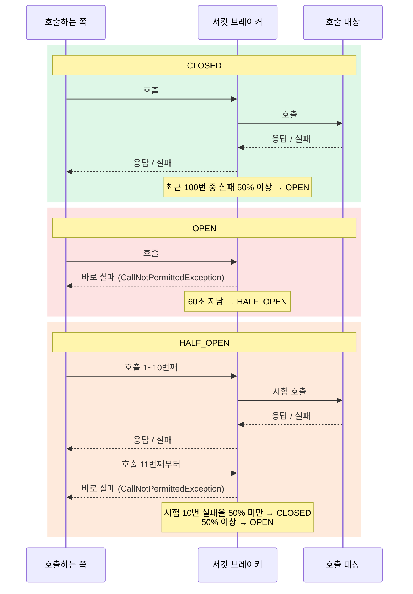
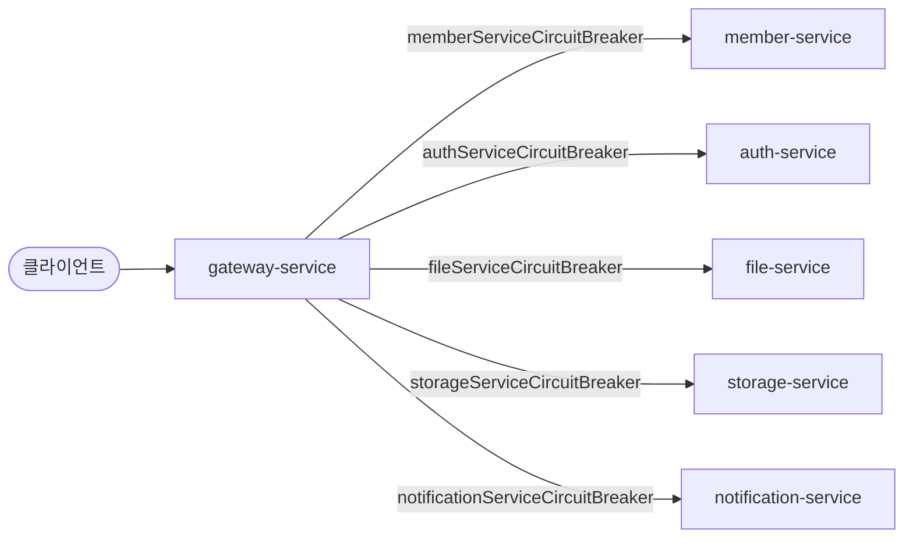
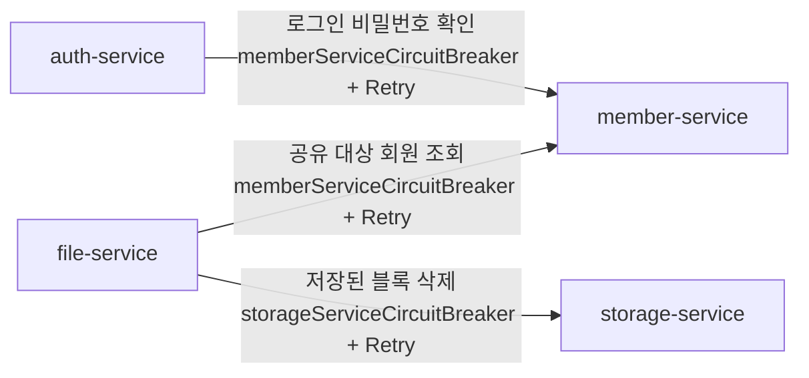

# 서킷 브레이커 스펙

이 문서는 다른 서비스 장애에 대비한 **서킷 브레이커·재시도·시간 제한** 규칙을 정한 문서입니다.

⚠️ 이 문서가 기준입니다. 코드가 이 문서와 다르면 코드를 고치고, 동작을 바꾸려면 이 문서를 먼저 고칩니다.

---

## 목차

- [1. Resilience4j](#1-resilience4j)
  - [1-1. 서킷 브레이커](#1-1-서킷-브레이커)
  - [1-2. 재시도](#1-2-재시도)
  - [1-3. 시간 제한](#1-3-시간-제한)
- [2. 적용 위치](#2-적용-위치)
  - [2-1. 게이트웨이 라우트](#2-1-게이트웨이-라우트)
  - [2-2. 게이트웨이 세션 확인](#2-2-게이트웨이-세션-확인)
  - [2-3. 서비스 간 호출 (Feign)](#2-3-서비스-간-호출-feign)
- [3. 로그](#3-로그)
- [4. TODO](#4-todo)

---

## 1. Resilience4j

[Resilience4j](https://resilience4j.readme.io/)는 다른 서비스를 부를 때 장애에 버티게 해 주는 라이브러리다.
기능마다 모듈이 따로 있고(서킷 브레이커, 재시도, 시간 제한 등), 필요한 것만 골라 한 호출에 겹쳐 건다.

### 1-1. 서킷 브레이커

다른 서비스가 죽었는데 계속 부르면, 호출하는 쪽은 응답을 기다리느라 요청이 쌓이고 결국 같이 느려지거나 죽는다.
서킷 브레이커는 실패가 이어지는 서비스를 **잠시 부르지 않고 바로 실패**시켜, 한 서비스의 장애가 다른 서비스로 번지지 않게 막는다.

#### 1-1-1. 상태 전환

평소엔 닫혀(`CLOSED`) 호출을 보내다가, 실패가 많아지면 열려(`OPEN`) 호출을 보내지 않고 바로 실패시킨다.
잠시 뒤 반쯤 열어(`HALF_OPEN`) 몇 번만 보내 보고, 살아났으면 다시 닫는다.
열려 있는 동안 상대는 쉬며 회복할 시간을 얻고, 호출하는 쪽은 응답을 기다리지 않는다.



#### 1-1-2. 설정값

| 항목 | 기본값 | 뜻 |
|---|---|---|
| `slidingWindowType` / `slidingWindowSize` | `COUNT_BASED` / 100 | 실패율을 **최근 호출 100번** 기준으로 계산한다 (시간 기준이 아니라 횟수 기준) |
| `minimumNumberOfCalls` | 100 | 호출이 100번 쌓이기 전에는 실패율을 계산하지 않는다 — 처음 몇 번 실패로 바로 열리지 않게 |
| `failureRateThreshold` | 50% | 최근 100번 중 절반 이상 실패하면 `OPEN` |
| `slowCallDurationThreshold` / `slowCallRateThreshold` | 60초 / 100% | 60초 넘긴 호출은 "느린 호출"로 센다. 최근 100번이 **전부** 느리면 실패가 없어도 `OPEN` |
| `waitDurationInOpenState` | 60초 | `OPEN`으로 60초 쉰 뒤 `HALF_OPEN`으로 바뀐다 |
| `permittedNumberOfCallsInHalfOpenState` | 10 | `HALF_OPEN`에서 시험 삼아 보내는 호출 수. 이 10번의 실패율로 `CLOSED`/`OPEN`을 정한다 |
| `registerHealthIndicator` | `false` | `true`면 서킷 상태가 `/actuator/health`에 나온다 |

### 1-2. 재시도

실패한 호출을 정해진 간격으로 정해진 횟수만큼 다시 보낸다. 네트워크 순단처럼 **일시적인 실패**만 재시도하고,
요청 자체가 잘못된 실패(4xx 등 — 다시 보내도 결과가 똑같다)는 재시도하지 않는다.

#### 1-2-1. 설정값

| 항목 | 기본값 | 뜻 |
|---|---|---|
| `maxAttempts` | 3 | 처음 호출을 **포함한** 최대 시도 횟수 (처음 1 + 재시도 2) |
| `waitDuration` | 500ms | 재시도 사이 대기 시간 |
| `enableExponentialBackoff` | `false` | `true`면 대기 시간을 재시도마다 늘린다 (500ms → 1초 → 2초…) |
| `enableRandomizedWait` | `false` | `true`면 대기 시간에 무작위 값을 섞는다 — 여러 인스턴스가 같은 박자로 몰려 재시도하는 것을 막는다 |
| `retryExceptions` | 비어 있음 (**모든 예외** 재시도) | 이 예외일 때만 재시도한다 |
| `ignoreExceptions` | 비어 있음 | 이 예외는 재시도하지 않는다 |

#### 1-2-2. 서킷 브레이커와 조합

재시도와 서킷 브레이커는 서로를 모르는 별개 기능이라, **어느 쪽이 바깥인지**로 동작이 정해진다. 이 프로젝트는
Resilience4j 기본 순서대로 재시도가 바깥, 서킷 브레이커가 안쪽이다.

```
재시도 ( 서킷 브레이커 ( 실제 호출 ) )
```

- 서킷 브레이커는 **시도 하나하나**를 기록한다 — 상대가 실제로 받은 호출 수와 서킷이 보는 수가 같다.
- 서킷이 열려 있으면 바로 실패하고, 그 실패(`CallNotPermittedException`)는 재시도 대상이 아니라 다시 보내지 않는다.

### 1-3. 시간 제한

응답이 오지 않는 호출을 끝없이 기다리지 않게, 정해진 시간이 지나면 `TimeoutException`으로 끊는다.
서킷 브레이커는 호출을 끊지 않고 결과를 기록만 하므로, 상대가 멈춰 응답이 아예 안 오면 시간 제한이 있어야 실패로 셀 수 있다.

#### 1-3-1. 설정값

| 항목 | 기본값 | 뜻 |
|---|---|---|
| `timeoutDuration` | 1초 | 이 시간 안에 응답이 없으면 `TimeoutException`으로 실패시킨다 |
| `cancelRunningFuture` | `true` | 시간을 넘긴 호출을 실제로 취소한다 |

---

## 2. 적용 위치

| 호출 | 방식 | 서킷 브레이커 | 설명 |
|---|---|---|---|
| 게이트웨이 → 각 서비스 | Spring Cloud Gateway 라우트 필터 (리액티브) | 서비스마다 하나 | [2-1](#2-1-게이트웨이-라우트) |
| 게이트웨이 → auth 세션 확인 | `WebClient` + Resilience4j Reactor 연산자 | auth 라우트와 같은 것을 같이 씀 | [2-2](#2-2-게이트웨이-세션-확인) |
| auth / file → member, file → storage | OpenFeign + `@CircuitBreaker` · `@Retry` | 호출 대상마다 하나 | [2-3](#2-3-서비스-간-호출-feign) |

서비스 간 비동기 메시지(SQS)는 서킷 브레이커 대신 재시도·DLQ로 버틴다 ([005-messaging-spec.md 4-2](005-messaging-spec.md#4-2-처리-실패)).

### 2-1. 게이트웨이 라우트



`RouteConfig`가 라우트마다 `circuitBreaker` 필터를 건다. 필터는 **시간 제한 15초**(TimeLimiter)와 서킷 브레이커를 함께 적용하고,
실패하면 `forward:/fallback/default`로 넘긴다.

| 라우트 | 경로 | 서킷 브레이커 |
|---|---|---|
| member-service | `/api/v1/member/**` | `memberServiceCircuitBreaker` |
| auth-service | `/api/v1/auth/**` | `authServiceCircuitBreaker` |
| file-service | `/api/v1/files/**`, `/api/v1/directories/**` | `fileServiceCircuitBreaker` |
| storage-service | `/api/v1/storage/**` | `storageServiceCircuitBreaker` |
| notification-service | `/api/v1/notifications/**` | `notificationServiceCircuitBreaker` |

#### 2-1-1. 실패로 세는 것

| 결과 | 실패로 세나 |
|---|---|
| 15초 안에 응답 없음 (`TimeoutException`) | 센다 |
| 연결 거부 — 서비스가 떠 있지 않음 (`AnnotatedConnectException`) | 센다 |
| `NotFoundException` | 센다 (설정엔 있지만 지금은 나지 않는다 — [4](#4-todo)) |
| 서비스가 돌려준 HTTP 응답 (**4xx·5xx 모두**) | 세지 않음 — 그대로 클라이언트에 전달 |

서비스가 500을 돌려줘도 게이트웨이 입장에선 "응답이 왔다"이므로 성공이다. 게이트웨이 서킷 브레이커는
**서비스가 죽었거나 멈췄을 때**만 연다.

#### 2-1-2. 응답

`FallbackController`가 원인을 보고 답한다.

| 원인 | HTTP | 메시지 |
|---|---|---|
| `TimeoutException` | 504 `CONNECTION_TIMEOUT` | 서비스 요청 시간이 초과되었습니다. 잠시 후 다시 시도해 주세요. |
| `CallNotPermittedException` (열려 있음) | 503 `SERVICE_IS_OPEN` | 서비스가 일시적으로 차단되었습니다. 잠시 후 다시 시도해 주세요. |
| 그 밖 (연결 거부 등) | 503 `SERVICE_UNAVAILABLE` | 서비스가 연결 불가능합니다. 잠시 후 다시 시도해 주세요. |

### 2-2. 게이트웨이 세션 확인

게이트웨이가 요청마다 auth-service에 세션을 확인하는 호출(`POST /internal/v1/auth/sessions/validate`, [004-auth-spec.md 3](004-auth-spec.md#3-요청-검증))은
`AuthClient`가 시간 제한(TimeLimiter)과 서킷 브레이커를 Resilience4j Reactor 연산자로 직접 건다. 라우트 필터를 거치지 않는 호출이라서다.

- 서킷 브레이커는 auth-service 라우트와 **같은 인스턴스**(`authServiceCircuitBreaker`)를 쓴다 — 호출 대상이 같으므로.
  어느 쪽이든 auth-service가 죽은 걸 보면 둘 다 바로 실패한다.
- 시간 제한은 전용 인스턴스 `authSessionTimeLimiter`(3초)를 쓴다 — 라우트의 15초는 요청마다 거치는 확인에 너무 길다.
- 재시도는 없다.

| 제한 | 값 | 위치 |
|---|---|---|
| 연결 / 읽기 / 쓰기 | 3초씩 | `WebClientConfig` |
| 전체 응답 | 3초 | `authSessionTimeLimiter` (`gateway-service/application.yml`) |

| 결과 | 실패로 세나 |
|---|---|
| 3초 안에 응답 없음 (`TimeoutException`) | 센다 |
| 연결 실패·읽기 시간 초과 (`WebClientRequestException`) | 센다 |
| auth-service가 돌려준 HTTP 응답 (4xx·5xx) | 세지 않음 ([2-1-1](#2-1-1-실패로-세는-것)과 같은 기준) |

| 원인 | 응답 |
|---|---|
| 서킷이 열려 있음 (`CallNotPermittedException`)·연결 실패·시간 초과·5xx | 503 `AUTH_UNAVAILABLE` ("일시적으로 로그인 상태를 확인할 수 없습니다.") |
| 4xx | 세션 없음으로 보고 401 |

### 2-3. 서비스 간 호출 (Feign)



Feign 클라이언트 메서드에 `@CircuitBreaker`와 `@Retry`를 같이 단다.

```java
@PostMapping("/internal/v1/member/authenticate")
@CircuitBreaker(name = "memberServiceCircuitBreaker")
@Retry(name = "memberServiceRetry", fallbackMethod = "authenticateMemberFallback")
ApiResponse<AuthenticateMemberResponse> authenticateMember(AuthenticateMemberRequest request);
```

감싸는 순서는 Resilience4j 기본값인 **재시도(바깥) → 서킷 브레이커(안쪽)**다 (aspect order를 따로 설정하지 않는다, [1-2-2](#1-2-2-서킷-브레이커와-조합)).
시도마다 서킷 브레이커에 기록되고, 열려 있으면 재시도 없이 바로 fallback으로 간다.

#### 2-3-1. 재시도

| 항목 | 값 |
|---|---|
| 최대 시도 | 3번 (처음 1 + 재시도 2) |
| 간격 | 500ms |
| 재시도하는 예외 | `RetryableException` (연결·읽기 시간 초과 등 I/O 오류), 503 |
| Feign 시간 제한 | 연결 3초 · 읽기 5초 |

그 밖의 응답(4xx, 500 등)은 다시 보내도 같은 답일 것이므로 재시도하지 않는다.
최악의 경우 한 호출이 `(3 + 5)초 × 3 + 0.5초 × 2 ≈ 25초` 걸린다.

#### 2-3-2. 실패로 세는 것

| 결과 | 실패로 세나 |
|---|---|
| `RetryableException` (연결 실패·시간 초과) | 센다 |
| 502 · 503 · 504 · 429 | 센다 |
| 4xx (위 429 제외) | 세지 않음 — 요청이 잘못된 것이지 상대가 아픈 게 아니다 |
| 500 | **세지 않음** ([4](#4-todo)) |

목록에 없는 예외는 성공으로 센다(Resilience4j 기본 동작).

#### 2-3-3. 응답

재시도까지 실패하면 fallback 메서드가 `FeignFallbackUtils.handleFallback`을 부른다.

| 원인 | 결과 |
|---|---|
| `CallNotPermittedException` (열려 있음) | 503 `SERVICE_IS_OPEN` |
| 502 · 503 · 504 · 429 · `RetryableException` | 503 `SERVICE_UNAVAILABLE` |
| 그 밖의 `FeignException` (4xx, 500) | 예외를 그대로 다시 던진다 — 호출한 어댑터가 판단 |
| 그 밖 | 503 `SERVICE_UNAVAILABLE` |

4xx를 그대로 던지는 건 어댑터가 업무상 의미로 바꾸게 하기 위해서다. 예: file-service의 `MemberClientAdapter`는
member-service의 400·404를 "회원이 아님"(게스트 초대 대상)으로 읽는다.

---

## 3. 로그

공통 모듈의 `CircuitBreakerEventConfig`·`RetryEventConfig`가 인스턴스마다 로그를 건다. 시작할 때 있는 인스턴스와,
그 뒤에 새로 생기는 인스턴스(`onEntryAdded`) 모두에 건다.

사람이 봐야 할 일(서킷이 열림, 재시도를 다 씀)만 WARN으로 남기고, 호출마다 생기는 일은 DEBUG로 내린다.
실패가 몇 번인지는 로그가 아니라 지표(`resilience4j-micrometer` → Prometheus)로 본다.

| 이벤트 | 레벨 | 예 |
|---|---|---|
| `OPEN`으로 전환 | WARN | `CircuitBreaker 'memberServiceCircuitBreaker' state changed from CLOSED to OPEN` |
| 그 밖의 상태 전환 (`HALF_OPEN`, `CLOSED`) | INFO | `CircuitBreaker '...' state changed from HALF_OPEN to CLOSED` |
| 재시도를 다 쓰고 실패 | WARN | `Retry 'memberServiceRetry' gave up after 3 attempts: feign.RetryableException: ...` |
| 재시도 한 번 | DEBUG | `Retry for 'memberServiceRetry' attempt number: 1` |
| 실패 기록 | DEBUG | `CircuitBreaker '...' recorded an error: feign.RetryableException: ...` |
| fallback 실행 | DEBUG | `Fallback triggered for CallNotPermittedException` |

---

## 4. TODO

- [ ] **500을 실패로 셀지 결정** — 지금은 게이트웨이·Feign 모두 500을 성공으로 센다. 서비스가 계속 500만 내도 서킷이 열리지 않는다.
  500이 버그(요청마다 다름)인지 장애(DB 끊김 등)인지 구분이 안 돼서 그대로 뒀다. 게이트웨이는 `statusCodes`, Feign은
  `record-exceptions`에 `FeignException.InternalServerError`를 넣으면 된다.
- [ ] **`NotFoundException` 정리** — 서비스 레지스트리(Eureka)를 쓸 때 "인스턴스를 못 찾음"을 뜻하던 예외다.
  고정 URL로 바꾼 뒤로는 나지 않으므로 게이트웨이 `record-exceptions`에서 빼도 된다. 게이트웨이의 `circuit-breaker-aspect-order`도
  애너테이션을 안 써서 의미가 없다.
- [ ] **서킷이 열리면 알림** — 지금은 WARN 로그만 남는다. 지표(`resilience4j_circuitbreaker_state`)로
  [007-discord-alert-spec.md](007-discord-alert-spec.md)의 `service` 채널에 알릴지 정한다.
