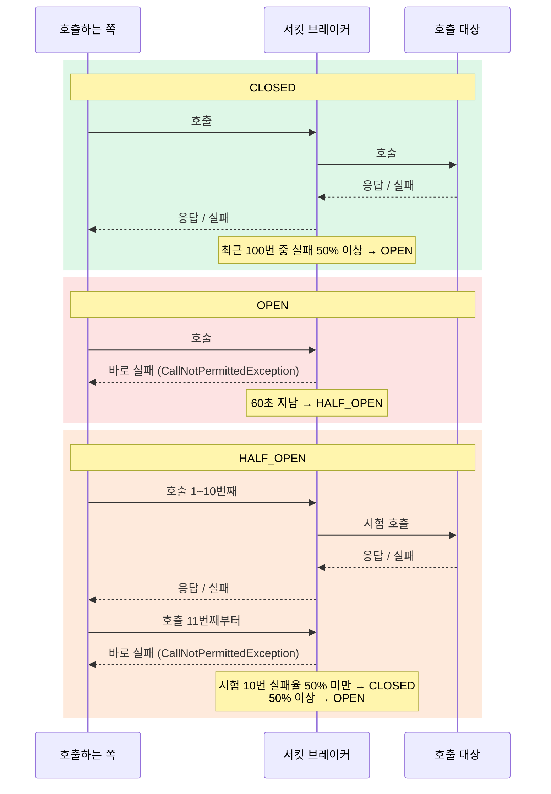
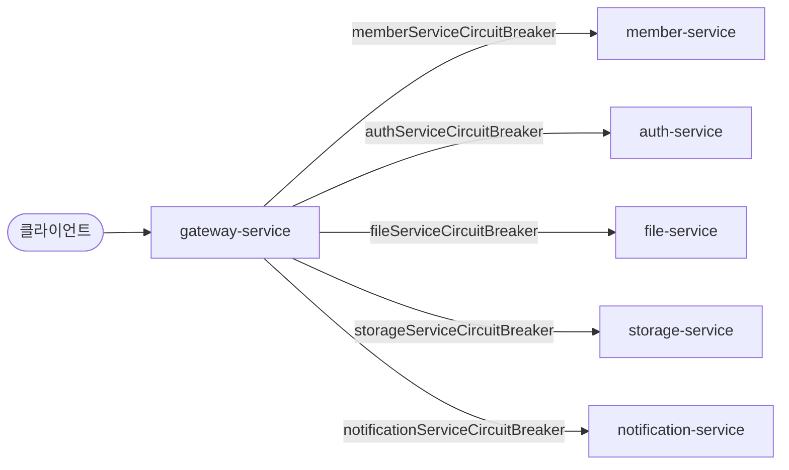
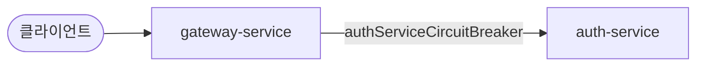
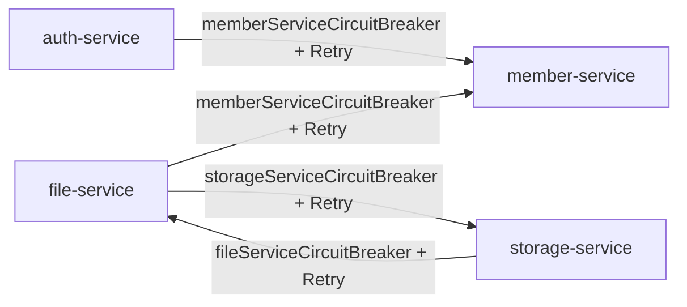
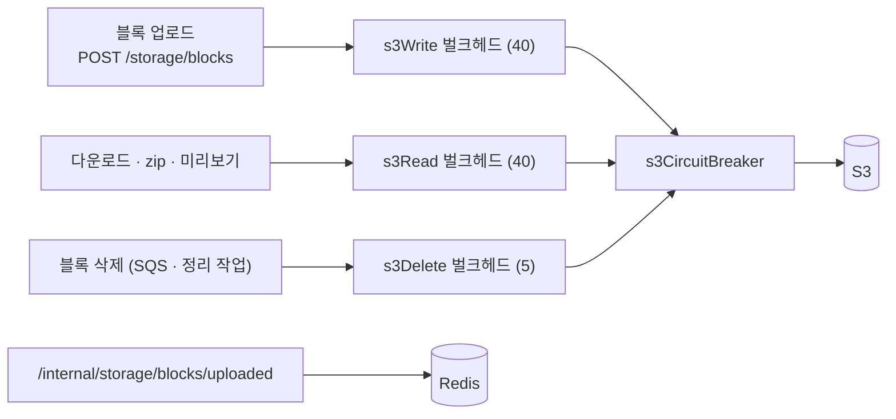

# 장애 대응 (Resilience) 스펙

이 문서는 다른 서비스·S3 장애에 대비한 **서킷 브레이커·재시도·시간 제한·벌크헤드** 규칙을 정한 문서입니다.

⚠️ 이 문서가 기준입니다. 코드가 이 문서와 다르면 코드를 고치고, 동작을 바꾸려면 이 문서를 먼저 고칩니다.

---

## 목차

- [1. Resilience4j](#1-resilience4j)
  - [1-1. 서킷 브레이커](#1-1-서킷-브레이커)
  - [1-2. 재시도](#1-2-재시도)
  - [1-3. 시간 제한](#1-3-시간-제한)
  - [1-4. 벌크헤드](#1-4-벌크헤드)
- [2. 적용 위치](#2-적용-위치)
  - [2-1. 게이트웨이 라우트](#2-1-게이트웨이-라우트)
  - [2-2. 게이트웨이 세션 확인](#2-2-게이트웨이-세션-확인)
  - [2-3. 서비스 간 호출 (Feign)](#2-3-서비스-간-호출-feign)
  - [2-4. S3 호출 (storage-service)](#2-4-s3-호출-storage-service)
- [3. 로그](#3-로그)
- [4. 알림](#4-알림)

---

## 1. Resilience4j

[Resilience4j](https://resilience4j.readme.io/)는 다른 서비스를 부를 때 장애에 버티게 해 주는 라이브러리다.
기능마다 모듈이 따로 있고(서킷 브레이커, 재시도, 시간 제한 등), 필요한 것만 골라 한 호출에 겹쳐 건다.

### 1-1. 서킷 브레이커

다른 서비스가 죽었는데 계속 부르면, 호출하는 쪽은 응답을 기다리느라 요청이 쌓이고 결국 같이 느려지거나 죽는다.
서킷 브레이커는 실패가 이어지는 서비스를 **잠시 부르지 않고 바로 실패**시켜, 한 서비스의 장애가 다른 서비스로 번지지 않게 막는다.

#### 1-1-1. 상태 전환

평소엔 닫혀(`CLOSED`) 호출을 보내다가, 실패가 많아지면 열려(`OPEN`) 호출을 보내지 않고 바로 실패시킨다.
잠시 뒤 반쯤 열어(`HALF_OPEN`) 몇 번만 보내 보고, 살아났으면 다시 닫는다.
열려 있는 동안 상대는 쉬며 회복할 시간을 얻고, 호출하는 쪽은 응답을 기다리지 않는다.



#### 1-1-2. 설정값

| 항목 | 기본값 | 뜻 |
|---|---|---|
| `slidingWindowType` / `slidingWindowSize` | `COUNT_BASED` / 100 | 실패율을 **최근 호출 100번** 기준으로 계산한다 (시간 기준이 아니라 횟수 기준) |
| `minimumNumberOfCalls` | 100 | 호출이 100번 쌓이기 전에는 실패율을 계산하지 않는다 — 처음 몇 번 실패로 바로 열리지 않게 |
| `failureRateThreshold` | 50% | 최근 100번 중 절반 이상 실패하면 `OPEN` |
| `slowCallDurationThreshold` / `slowCallRateThreshold` | 60초 / 100% | 60초 넘긴 호출은 "느린 호출"로 센다. 최근 100번이 **전부** 느리면 실패가 없어도 `OPEN` |
| `waitDurationInOpenState` | 60초 | `OPEN`으로 60초 쉰 뒤 `HALF_OPEN`으로 바뀐다 |
| `permittedNumberOfCallsInHalfOpenState` | 10 | `HALF_OPEN`에서 시험 삼아 보내는 호출 수. 이 10번의 실패율로 `CLOSED`/`OPEN`을 정한다 |
| `registerHealthIndicator` | `false` | `true`면 서킷 상태가 `/actuator/health`에 나온다 |

### 1-2. 재시도

실패한 호출을 정해진 간격으로 정해진 횟수만큼 다시 보낸다. 네트워크 순단처럼 **일시적인 실패**만 재시도하고,
요청 자체가 잘못된 실패(4xx 등 — 다시 보내도 결과가 똑같다)는 재시도하지 않는다.

#### 1-2-1. 설정값

| 항목 | 기본값 | 뜻 |
|---|---|---|
| `maxAttempts` | 3 | 처음 호출을 **포함한** 최대 시도 횟수 (처음 1 + 재시도 2) |
| `waitDuration` | 500ms | 재시도 사이 대기 시간 |
| `enableExponentialBackoff` | `false` | `true`면 대기 시간을 재시도마다 늘린다 (500ms → 1초 → 2초…) |
| `enableRandomizedWait` | `false` | `true`면 대기 시간에 무작위 값을 섞는다 — 여러 인스턴스가 같은 박자로 몰려 재시도하는 것을 막는다 |
| `retryExceptions` | 비어 있음 (**모든 예외** 재시도) | 이 예외일 때만 재시도한다 |
| `retryExceptionPredicate` | 없음 | 예외를 받아 재시도할지 정하는 클래스 — 예외 종류만으로 못 가를 때 쓴다 |
| `ignoreExceptions` | 비어 있음 | 이 예외는 재시도하지 않는다 |

#### 1-2-2. 서킷 브레이커와 조합

재시도와 서킷 브레이커는 서로를 모르는 별개 기능이라, **어느 쪽이 바깥인지**로 동작이 정해진다. 이 프로젝트는
Resilience4j 기본 순서대로 재시도가 바깥, 서킷 브레이커가 안쪽이다.

```
재시도 ( 서킷 브레이커 ( 실제 호출 ) )
```

- 서킷 브레이커는 **시도 하나하나**를 기록한다 — 상대가 실제로 받은 호출 수와 서킷이 보는 수가 같다.
- 서킷이 열려 있으면 바로 실패하고, 그 실패(`CallNotPermittedException`)는 재시도 대상이 아니라 다시 보내지 않는다.

### 1-3. 시간 제한

응답이 오지 않는 호출을 끝없이 기다리지 않게, 정해진 시간이 지나면 `TimeoutException`으로 끊는다.
서킷 브레이커는 호출을 끊지 않고 결과를 기록만 하므로, 상대가 멈춰 응답이 아예 안 오면 시간 제한이 있어야 실패로 셀 수 있다.

#### 1-3-1. 설정값

| 항목 | 기본값 | 뜻 |
|---|---|---|
| `timeoutDuration` | 1초 | 이 시간 안에 응답이 없으면 `TimeoutException`으로 실패시킨다 |
| `cancelRunningFuture` | `true` | 시간을 넘긴 호출을 실제로 취소한다 |

### 1-4. 벌크헤드

한 종류의 호출이 동시에 쓸 수 있는 자리 수를 정한다. 자리가 다 차면 기다리지 않고 바로 `BulkheadFullException`으로 거절한다.
느린 의존 대상 하나가 요청 스레드를 전부 붙잡아, 그 대상과 무관한 요청까지 멈추는 일을 막는다.

| 항목 | 뜻 |
|---|---|
| `maxConcurrentCalls` | 동시에 들어갈 수 있는 호출 수 |
| `maxWaitDuration` | 자리가 날 때까지 기다리는 시간. 0이면 바로 거절 |

---

## 2. 적용 위치

| 호출 | 방식 | 서킷 브레이커 | 설명 |
|---|---|---|---|
| 게이트웨이 라우트 | 게이트웨이 `circuitBreaker` 필터 | 서비스마다 하나 | [2-1](#2-1-게이트웨이-라우트) |
| 게이트웨이 세션 확인 | `WebClient` + Resilience4j Reactor 연산자 | auth 라우트와 같은 것을 같이 씀 | [2-2](#2-2-게이트웨이-세션-확인) |
| 서비스 간 호출 | OpenFeign + `@CircuitBreaker` · `@Retry` | 호출 대상마다 하나 | [2-3](#2-3-서비스-간-호출-feign) |
| storage-service → S3 | SDK 시간 제한 + Resilience4j 서킷 브레이커·벌크헤드 (코드로 감쌈) | `s3CircuitBreaker` 하나 | [2-4](#2-4-s3-호출-storage-service) |

서비스 간 비동기 메시지(SQS — 파일 영구 삭제 시 블록 삭제 요청 등)는 서킷 브레이커 대신 재시도·DLQ로 버틴다 ([005-messaging-spec.md 4-2](005-messaging-spec.md#4-2-처리-실패)).

### 2-1. 게이트웨이 라우트



| 라우트 | 경로 | 서킷 브레이커 |
|---|---|---|
| member-service | `/api/v1/member/**` | `memberServiceCircuitBreaker` |
| auth-service | `/api/v1/auth/**` | `authServiceCircuitBreaker` |
| file-service | `/api/v1/files/**`, `/api/v1/directories/**` | `fileServiceCircuitBreaker` |
| storage-service | `/api/v1/storage/**` | `storageServiceCircuitBreaker` |
| notification-service | `/api/v1/notifications/**` | `notificationServiceCircuitBreaker` |

- `RouteConfig`가 라우트마다 `circuitBreaker` 필터를 건다.
- 필터는 시간 제한(TimeLimiter)과 서킷 브레이커를 함께 적용한다.
- 재시도는 없다. 게이트웨이는 업로드·삭제 같은 모든 요청을 넘기므로, 시간 초과 뒤 다시 보내면 이미 처리된 요청이
  두 번 처리될 수 있다. 일시적인 실패는 클라이언트가 다시 요청한다.

#### 2-1-1. 시간 제한

| 제한 | 값 | 위치 |
|---|---|---|
| 라우트 호출 | 15초 | TimeLimiter `default` (`gateway-service/application.yml`) |

#### 2-1-2. 서킷에 실패로 기록되는 경우

| 결과 | 기록하나 |
|---|---|
| 15초 안에 응답 없음 (`TimeoutException`) | 기록 |
| 연결 거부 (`AnnotatedConnectException`) | 기록 |
| 호스트에 도달 못 함 — 대상 IP가 사라짐 (`NoRouteToHostException`) | 기록 |
| 호스트를 못 찾음 (`UnknownHostException`) | 기록 |
| 서비스가 돌려준 HTTP 응답 502 · 503 · 504 (`CircuitBreakerStatusCodeException`) | 기록 |
| 서비스가 돌려준 그 밖의 HTTP 응답 (4xx · 500) | 기록 안 함 |

#### 2-1-3. 응답

실패하면 `FallbackController`가 답한다(`forward:/fallback/default`).

| 원인 | HTTP | 메시지 |
|---|---|---|
| 서킷이 열려 있음 (`CallNotPermittedException`) | 503 `SERVICE_IS_OPEN` | 서비스가 일시적으로 차단되었습니다. 잠시 후 다시 시도해 주세요. |
| 15초 안에 응답 없음 (`TimeoutException`) | 504 `CONNECTION_TIMEOUT` | 서비스 요청 시간이 초과되었습니다. 잠시 후 다시 시도해 주세요. |
| 연결 거부 (`AnnotatedConnectException`) | 503 `SERVICE_UNAVAILABLE` | 서비스가 연결 불가능합니다. 잠시 후 다시 시도해 주세요. |
| 호스트에 도달 못 함 (`NoRouteToHostException`) | 503 `SERVICE_UNAVAILABLE` | 서비스가 연결 불가능합니다. 잠시 후 다시 시도해 주세요. |
| 호스트를 못 찾음 (`UnknownHostException`) | 503 `SERVICE_UNAVAILABLE` | 서비스가 연결 불가능합니다. 잠시 후 다시 시도해 주세요. |
| 서비스가 돌려준 HTTP 응답 504 (`CircuitBreakerStatusCodeException`) | 504 `CONNECTION_TIMEOUT` | 서비스 요청 시간이 초과되었습니다. 잠시 후 다시 시도해 주세요. |
| 서비스가 돌려준 HTTP 응답 502 · 503 (`CircuitBreakerStatusCodeException`) | 503 `SERVICE_UNAVAILABLE` | 서비스가 연결 불가능합니다. 잠시 후 다시 시도해 주세요. |

### 2-2. 게이트웨이 세션 확인

게이트웨이는 요청마다 auth-service에 세션을 확인한다([004-auth-spec.md 3](004-auth-spec.md#3-요청-검증)).
라우트를 거치지 않는 호출이라 `AuthClient`가 시간 제한과 서킷 브레이커를 직접 건다.



- 서킷 브레이커는 auth-service 라우트와 **같은 인스턴스**(`authServiceCircuitBreaker`)를 쓴다 — 호출 대상이 같으므로.
  어느 쪽이든 auth-service가 죽은 걸 보면 둘 다 바로 실패한다.
- 재시도는 없다.

#### 2-2-1. 시간 제한

| 제한 | 값 | 위치 |
|---|---|---|
| 세션 확인 호출 | 3초 | TimeLimiter `authSessionTimeLimiter` (`gateway-service/application.yml`) |

#### 2-2-2. 서킷에 실패로 기록되는 경우

| 결과 | 기록하나 |
|---|---|
| 3초 안에 응답 없음 (`TimeoutException`) | 기록 |
| 연결 거부 (`WebClientRequestException`) | 기록 |
| 서비스가 돌려준 HTTP 응답 502 · 503 · 504 (`WebClientResponseException.BadGateway` · `ServiceUnavailable` · `GatewayTimeout`) | 기록 |
| 서비스가 돌려준 그 밖의 HTTP 응답 (4xx · 500) | 기록 안 함 |

#### 2-2-3. 응답

실패하면 `SessionAuthenticationFailureHandler`가 답한다.

| 원인 | HTTP | 메시지 |
|---|---|---|
| 서킷이 열려 있음 (`CallNotPermittedException`) | 503 `SERVICE_IS_OPEN` | 서비스가 일시적으로 차단되었습니다. 잠시 후 다시 시도해 주세요. |
| 3초 안에 응답 없음 (`TimeoutException`) | 504 `CONNECTION_TIMEOUT` | 서비스 요청 시간이 초과되었습니다. 잠시 후 다시 시도해 주세요. |
| 연결 거부 (`WebClientRequestException`) | 503 `SERVICE_UNAVAILABLE` | 서비스가 연결 불가능합니다. 잠시 후 다시 시도해 주세요. |
| 서비스가 돌려준 HTTP 응답 504 (`WebClientResponseException.GatewayTimeout`) | 504 `CONNECTION_TIMEOUT` | 서비스 요청 시간이 초과되었습니다. 잠시 후 다시 시도해 주세요. |
| 서비스가 돌려준 HTTP 응답 502 · 503 (`WebClientResponseException.BadGateway` · `ServiceUnavailable`) | 503 `SERVICE_UNAVAILABLE` | 서비스가 연결 불가능합니다. 잠시 후 다시 시도해 주세요. |

### 2-3. 서비스 간 호출 (Feign)



Feign 클라이언트 메서드에 `@CircuitBreaker`와 `@Retry`를 같이 단다.

```java
@PostMapping("/internal/v1/member/authenticate")
@CircuitBreaker(name = "memberServiceCircuitBreaker")
@Retry(name = "memberServiceRetry", fallbackMethod = "authenticateMemberFallback")
ApiResponse<AuthenticateMemberResponse> authenticateMember(AuthenticateMemberRequest request);
```

감싸는 순서는 Resilience4j 기본값인 **재시도(바깥) → 서킷 브레이커(안쪽)**다.
시도마다 서킷 브레이커에 기록되고, 열려 있으면 재시도 없이 바로 fallback으로 간다.

#### 2-3-1. 시간 제한

| 제한 | 값 | 위치 |
|---|---|---|
| 연결 | 3초 | `spring.cloud.openfeign.client.config.default.connect-timeout` (`application-resilience4j.yml`) |
| 읽기 | 10초 | `spring.cloud.openfeign.client.config.default.read-timeout` (`application-resilience4j.yml`) |

#### 2-3-2. 재시도

| 항목 | 값 |
|---|---|
| 최대 시도 | 3번 (처음 1 + 재시도 2) |
| 첫 재시도 전 대기 | 250~750ms 중 무작위 |
| 두 번째 재시도 전 대기 | 500~1,500ms 중 무작위 |
| 재시도하는 경우 | 연결 실패(연결 거부·연결 시간 초과·호스트를 못 찾음), 503 — `RetryOnConnectFailure` |

- 요청이 상대에 닿지 않은 실패만 재시도한다. 요청이 나가지 않았으니 다시 보내도 안전하다.
- 간격을 점점 늘리고 무작위로 흔드는 건, 회복 중인 서비스에 여러 인스턴스가 같은 박자로 한꺼번에 다시 몰리지 않게 하려는 것이다.
- 읽기 시간 초과는 재시도하지 않는다. 상대가 요청을 받아 처리하는 중이라, 다시 보내면 느린 서버에 일만 더 쌓인다.
  Feign은 연결 실패와 읽기 시간 초과를 둘 다 `RetryableException`으로 감싸므로, 원인 예외(cause)를 보고 가른다.
- 그 밖의 응답(4xx, 500 등)은 다시 보내도 같은 답일 것이므로 재시도하지 않는다.

#### 2-3-3. 서킷에 실패로 기록되는 경우

| 결과 | 기록하나 |
|---|---|
| 연결 거부·호스트를 못 찾음·시간 초과 (`RetryableException`) | 기록 |
| 서비스가 돌려준 HTTP 응답 502 · 503 · 504 (`FeignException.BadGateway` · `ServiceUnavailable` · `GatewayTimeout`) | 기록 |
| 서비스가 돌려준 그 밖의 HTTP 응답 (4xx · 500) | 기록 안 함 |

#### 2-3-4. 응답

재시도까지 실패하면 `FeignFallbackUtils.handleFallback`이 답한다.

| 원인 | HTTP | 메시지 |
|---|---|---|
| 서킷이 열려 있음 (`CallNotPermittedException`) | 503 `SERVICE_IS_OPEN` | 서비스가 일시적으로 차단되었습니다. 잠시 후 다시 시도해 주세요. |
| 3초 안에 연결 안 됨·10초 안에 응답 없음 (`RetryableException`) | 504 `CONNECTION_TIMEOUT` | 서비스 요청 시간이 초과되었습니다. 잠시 후 다시 시도해 주세요. |
| 연결 거부·호스트를 못 찾음 (`RetryableException`) | 503 `SERVICE_UNAVAILABLE` | 서비스가 연결 불가능합니다. 잠시 후 다시 시도해 주세요. |
| 서비스가 돌려준 HTTP 응답 504 (`FeignException.GatewayTimeout`) | 504 `CONNECTION_TIMEOUT` | 서비스 요청 시간이 초과되었습니다. 잠시 후 다시 시도해 주세요. |
| 서비스가 돌려준 HTTP 응답 502 · 503 (`FeignException.BadGateway` · `ServiceUnavailable`) | 503 `SERVICE_UNAVAILABLE` | 서비스가 연결 불가능합니다. 잠시 후 다시 시도해 주세요. |

### 2-4. S3 호출 (storage-service)

S3가 느려지거나 멈춰도 **S3를 쓰지 않는 요청은 그대로 돌아가야 한다.** 특히 file-service의 commit이 부르는 `/internal/storage/blocks/uploaded`(Redis만 봄)가 S3 때문에 느려지면, file-service까지 장애가 번진다.



- S3 호출 하나하나(`PutObject`, `GetObject`, `HeadObject`, `DeleteObject`)를 **벌크헤드 → 서킷 브레이커** 순으로 감싼다 (`S3StorageAdapter`). 다운로드 하나가 블록을 여러 개 읽어도 자리는 블록을 읽는 동안만 잡는다. 느린 클라이언트가 응답을 받는 동안에는 자리를 잡지 않는다.
- 업로드·다운로드·삭제의 자리를 나눠, 한쪽이 몰리거나 느려져도 다른 쪽 자리는 남는다. 세 벌크헤드 합(85)이 Tomcat 요청 스레드(200)보다 작아서, S3가 완전히 멈춰도 S3를 쓰지 않는 요청을 받을 스레드가 남는다.
- 서킷은 하나다. 업로드든 다운로드든 S3 자체가 아프면 같이 막는다.
- `/internal/storage/blocks/uploaded`는 어느 벌크헤드도 거치지 않는다. S3 쪽 자리가 다 차도 이 조회는 남은 요청 스레드로 바로 답한다.
- file-service는 S3를 직접 부르지 않는다. commit은 storage-service의 Redis 조회만 쓰고, 그 조회를 **DB 트랜잭션 밖에서** 한다 ([001 2장](001-file-upload-spec.md#2-파일-업로드)). 그래서 S3 장애가 file-service DB 잠금으로 번지지 않는다.
- storage-service 자체가 죽어 그 조회가 실패해도 commit 요청 전체가 실패하지 않는다. 이미 commit된 블록만으로 된 파일은 버전을 만들고, 나머지 파일만 그 503으로 답한다.

#### 2-4-1. 시간 제한

| 제한 | 값 | 위치 |
|---|---|---|
| 시도 한 번 | 5초 | `storage.s3.api-call-attempt-timeout` (`S3Config`의 `apiCallAttemptTimeout`) |
| 재시도 포함 전체 | 15초 | `storage.s3.api-call-timeout` (`apiCallTimeout`) |

SDK 기본값에는 시간 제한이 없어서, 멈춘 S3에 요청 스레드가 무한정 묶일 수 있다.

#### 2-4-2. 재시도

SDK 표준 재시도에 맡기고, 최대 시도는 **2번**(처음 1 + 재시도 1)으로 줄인다. 연결 실패·5xx·스로틀링만 재시도하고, 시간 제한 15초 안에서만 한다.
그 위에 Resilience4j 재시도는 걸지 않는다. 업로드는 WEB이, 삭제는 SQS가 다시 보낸다.

#### 2-4-3. 서킷에 실패로 기록되는 경우

| 결과 | 기록하나 |
|---|---|
| 시간 초과·연결 실패 (`SdkClientException`) | 기록 |
| S3가 돌려준 5xx (`S3Exception`, 500 · 503 SlowDown) | 기록 |
| S3가 돌려준 그 밖의 응답 (404 없는 객체, 412 조건 불일치 등) | 기록 안 함 |

설정값은 `default`를 그대로 쓴다 ([1-1-2](#1-1-2-설정값)). 판정은 `S3Unavailable`(`record-failure-predicate`)이 한다.

#### 2-4-4. 벌크헤드

| 벌크헤드 | 자리 | 기다림 | 감싸는 호출 |
|---|---|---|---|
| `s3Write` | 40 | 0 (바로 거절) | 블록 업로드 `PutObject` |
| `s3Read` | 40 | 0 | 다운로드·zip·미리보기 `GetObject` |
| `s3Delete` | 5 | 1초 | 블록 삭제 `HeadObject` + `DeleteObject` |

삭제는 사용자가 기다리는 요청이 아니라 SQS 소비·정리 작업이라, 자리가 날 때까지 조금 기다린다.

#### 2-4-5. 응답

| 원인 | HTTP | 메시지 |
|---|---|---|
| 서킷이 열려 있음 (`CallNotPermittedException`) | 503 `STORAGE_UNAVAILABLE` | 저장소에 일시적으로 연결할 수 없습니다. 잠시 후 다시 시도해 주세요. |
| 벌크헤드가 가득 참 (`BulkheadFullException`) | 503 `STORAGE_UNAVAILABLE` | (같음) |
| 시간 초과·연결 실패·5xx | 500 `STORAGE_ERROR` | 스토리지 오류가 발생했습니다. |

- 모든 서비스의 503에는 `Retry-After: 10`이 붙는다 (`GlobalExceptionHandler`, 서킷이 열려 있는 시간 `waitDurationInOpenState`). gateway 자신이 만드는 503(라우트 서킷 폴백 `FallbackController`, 세션 확인 실패 `CustomAuthenticationEntryPoint`)에도 같은 값이 붙고, gateway CORS가 이 헤더를 노출한다.
- 503은 WEB 업로드가 자동으로 다시 보내는 응답이다 (1·2·4초에 0~50% 지터 — S3가 돌아오는 순간 모든 클라이언트가 같은 박자로 몰리지 않게 — 단 `Retry-After`보다 일찍은 아니다). 그래도 실패하면 30초 간격으로 최대 10분 **일시 중지 후 자동 재개**하고, 그때도 안 되면 그 파일만 실패한다. 나중에 다시 올리면 commit이 이어 올리기로 받은 블록을 건너뛴다 ([001 2-1](001-file-upload-spec.md#2-1-이어-올리기)).
- 미확정 블록 정리 작업은 실패하면 꺼낸 블록을 다시 정리 대상에 넣고 그 회차를 멈춘다. 다음 회차(1시간 뒤)에 다시 한다.

#### 2-4-6. Redis 분리

Redis를 용도별 클러스터로 나눈다 (`.infra/redis.tf`, 어느 서비스가 어느 클러스터를 쓰는지는 `.infra/envs/*.tfvars`의 `redis_clusters`). 한 용도의 부하나 메모리 부족이 다른 용도로 번지지 않게 한다 — 예를 들어 업로드 기록은 사용자당 하루 최대 25,600개 키라, 세션과 같은 Redis에 두면 대량 업로드가 메모리를 채워 로그인까지 위협한다.

| 클러스터 | 쓰는 서비스 · 키 | `prod` (MemoryDB) | `demo` (ElastiCache) |
|---|---|---|---|
| `auth` | auth — 세션, 로그인 시도 제한, 새 기기 인증 코드 | 전용, 샤드 1 × 노드 3(AZ마다) | 모든 서비스 공용, 노드 1개 |
| `member` | member — 회원가입 이메일 인증 코드 | 전용, 샤드 1 × 노드 3 | (`auth`에) |
| `mail` | mail — SQS 소비 멱등성(`processed:*`) | 전용, 샤드 1 × 노드 3 | (`auth`에) |
| `storage` | storage — 업로드 기록·업로드 수·다운로드 한도·zip 토큰 | 전용, **샤드 2** × 노드 3 | (`auth`에) |

- **`prod`는 MemoryDB for Valkey**(`redis_engine = "memorydb"`)다. 쓰기는 AZ 여러 곳에 걸친 트랜잭션 로그에 남은 뒤에야 확인되므로, 주 노드를 잃거나 그 노드와 끊겨 복제본이 넘겨받아도 **확인된 쓰기를 잃지 않는다** — 세션·인증 코드·업로드 기록·한도가 쓴 그대로다. ElastiCache는 복제가 비동기라 장애 조치 순간 직전 쓰기 몇 건이 사라질 수 있다(재로그인, 블록 재전송) — `demo`는 이걸 감수한다.
- MemoryDB는 **클러스터 모드**다. 키 여러 개를 한 명령·스크립트에서 쓰려면 같은 해시 슬롯에 있어야 해서(아니면 `CROSSSLOT`), 함께 쓰는 키는 공통 부분을 `{}` 해시 태그로 감싼다 — 단일 Redis(로컬·`demo`)에서는 그냥 키 이름의 일부다.
  - member `email-verify-*:{<sha256(주소)>}`, auth `login-code-requests:{<sha256(주소)>}`·`login-code-cooldown:{<sha256(주소)>}` — 정규화한 주소(소문자·공백 제거)의 SHA-256을 태그로 쓴다. 주소에 중괄호가 있어도(`}a@x.com`도 유효한 주소) 태그가 깨지지 않고, 키에 주소가 그대로 남지 않는다.
  - storage `uploaded-block:{<ownerId>}:<hash>` — commit의 조회(MGET)가 한 소유자의 키를 한 번에 읽는다. 기록과 정리 대상 목록(`uploaded-blocks`)은 슬롯이 달라 스크립트 대신 두 명령으로 쓴다(순서는 상관없다 — 001 2장 4번).
  - 그 밖의 스크립트·명령은 키 하나만 쓴다. 테스트가 함께 쓰는 키의 슬롯이 같은지 확인한다(`SlotHash`).
  - 클라이언트는 환경 변수 두 개로 클러스터 모드가 된다: `SPRING_DATA_REDIS_CLUSTER_NODES`(클러스터 엔드포인트)·`SPRING_DATA_REDIS_USERNAME`(ACL 사용자). 장애 조치로 토폴로지가 바뀌면 MOVED·재연결 오류에 바로, 그 밖에는 30초마다 다시 읽는다(`application-redis.yml`).
- 모두 `maxmemory-policy noeviction`이다. 메모리가 차면 쓰기가 실패한다. 기본값(`volatile-lru`)이면 TTL이 있는 키 — 세션, 인증 코드, 다운로드 한도, zip 토큰 — 가 소리 없이 밀려난다.
- 클러스터마다 보안 그룹과 비밀번호가 따로다 — 서비스는 자기 클러스터에만 닿고(네트워크), 다른 클러스터의 비밀번호도 모른다. 비밀번호는 SSM `/<project>/REDIS_PASSWORD`(`auth`)·`REDIS_PASSWORD_<클러스터>`이고, 서비스에는 늘 `REDIS_PASSWORD`로 들어간다(ElastiCache는 AUTH 토큰, MemoryDB는 그 클러스터 ACL 사용자의 비밀번호).
- 로컬(compose)과 `demo`는 Redis 하나를 모두 같이 쓴다. 나눠서 얻는 격리와 일관성은 `prod`의 설계로 보여 주고, 실제로 띄우는 쪽은 비용을 줄인다.

---

## 3. 로그

공통 모듈의 `CircuitBreakerEventConfig`·`RetryEventConfig`가 인스턴스마다 로그를 건다.

사람이 봐야 할 일(서킷이 열림, 재시도를 다 씀)만 WARN으로 남기고, 호출마다 생기는 일은 DEBUG로 내린다.

| 이벤트 | 레벨 | 예 |
|---|---|---|
| `OPEN`으로 전환 | WARN | `CircuitBreaker 'memberServiceCircuitBreaker' state changed from CLOSED to OPEN` |
| 그 밖의 상태 전환 (`HALF_OPEN`, `CLOSED`) | INFO | `CircuitBreaker '...' state changed from HALF_OPEN to CLOSED` |
| 재시도를 다 쓰고 실패 | WARN | `Retry 'memberServiceRetry' gave up after 3 attempts: feign.RetryableException: ...` |
| 재시도 한 번 | DEBUG | `Retry for 'memberServiceRetry' attempt number: 1` |
| 실패 기록 | DEBUG | `CircuitBreaker '...' recorded an error: feign.RetryableException: ...` |
| fallback 실행 | DEBUG | `Fallback triggered for CallNotPermittedException` |

---

## 4. 알림

서비스는 떠 있는데 그 서비스로 가는 호출이 계속 실패해 서킷이 닫히지 않을 경우, 다음과 같은 알림을 보낸다.

| 지표 | 알림 조건 | 무슨 뜻인가 |
|---|---|---|
| `resilience4j_circuitbreaker_state` — 서킷의 현재 상태 (서비스·서킷별) | `open` 또는 `half_open`이 2분 지속 | 대상 서비스 호출이 계속 실패한다 (502·503·504 · 타임아웃 · 연결 실패) |

(상세 내용은 [007-discord-alert-spec.md 4](007-discord-alert-spec.md#4-사용-알림) 참고)

