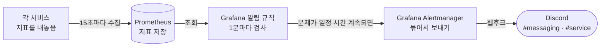

# 디스코드 알림 스펙

서비스에 문제가 생겼을 때 알림이 디스코드 채널까지 어떻게 전달되는지 정리한 문서입니다.

⚠️ 이 문서가 기준입니다. 코드가 이 문서와 다르면 코드를 고치고, 동작을 바꾸려면 이 문서를 먼저 고칩니다.

---

## 목차

- [1. 알림 발송 과정](#1-알림-발송-과정)
  - [1-1. 알림이 오기까지 걸리는 시간](#1-1-알림이-오기까지-걸리는-시간)
- [2. 알림 설정](#2-알림-설정)
  - [2-1. 지표](#2-1-지표)
  - [2-2. 규칙](#2-2-규칙)
  - [2-3. 알림 메시지](#2-3-알림-메시지)
  - [2-4. 그룹핑과 재발송](#2-4-그룹핑과-재발송)
- [3. 사용 디스코드 채널](#3-사용-디스코드-채널)
- [4. 사용 알림](#4-사용-알림)
  - [4-1. 이벤트 전송 적체](#4-1-이벤트-전송-적체)
  - [4-2. 이벤트 전송 실패](#4-2-이벤트-전송-실패)
  - [4-3. 이벤트 처리 실패](#4-3-이벤트-처리-실패)
  - [4-4. 서비스 응답 없음](#4-4-서비스-응답-없음)
  - [4-5. 서킷 열림](#4-5-서킷-열림)
  - [4-6. 요청 실패율 높음](#4-6-요청-실패율-높음)
  - [4-7. 느린 요청 많음](#4-7-느린-요청-많음)
- [5. TODO](#5-todo)

---

## 1. 알림 발송 과정

각 서비스는 자기 상태를 숫자로 내놓는다. 예를 들어 "아직 못 보낸 이벤트가 몇 초째 밀려 있다", "서킷이 열려 있다" 같은 것이다.
이 숫자를 **지표**라고 부른다. Prometheus가 지표를 모아 두고, Grafana가 그걸 보다가 이상하면 디스코드로 보낸다.



| 단계 | 하는 일 |
|---|---|
| 각 서비스 | `:9464/actuator/prometheus` 주소에 지표를 내놓는다 |
| Prometheus | 15초마다 모든 서비스의 지표를 가져가 저장한다 |
| 알림 규칙 | 1분마다 "이 값이 기준을 넘었나"를 확인한다. 정해 둔 시간(`for`) 동안 계속 넘어야 알림을 보낸다 |
| Alertmanager | 비슷한 알림을 한 메시지로 묶어 보낸다. 고칠 때까지 4시간마다 다시 보낸다 |
| Discord | 알림에 적힌 채널(`#messaging` 또는 `#service`)로 도착한다 |

Alertmanager는 Grafana 안에 들어 있는 기능을 쓴다. 컨테이너를 따로 띄우지 않는다.

### 1-1. 알림이 오기까지 걸리는 시간

문제가 생겨도 알림은 바로 오지 않는다. 문제가 생긴 뒤 🚨 알림이 오기까지는 아래 단계를 차례로 거친다.

| 순서 | 걸리는 시간 | 이유 |
|---|---|---|
| 1. 지표 수집 | 최대 15초 | Prometheus가 15초마다 가져간다 |
| 2. 발견 | 최대 1분 | 규칙을 1분마다 검사한다. 처음 발견하면 "대기(Pending)" 상태가 된다 |
| 3. 지속 확인 | `for` (알림마다 다름) | 이 시간 동안 계속 문제여야 "발생(Firing)"이 된다. 중간에 한 번이라도 괜찮아지면 처음부터 다시 센다 |
| 4. 발송 대기 | 30초 | 같이 묶을 알림이 더 있는지 잠깐 기다렸다 보낸다 |

예를 들어 서킷 열림은 `for`가 2분이라, 서킷이 열리고 2분 반에서 4분 사이에 알림이 온다.

문제가 사라진 뒤 ✅ 해제 알림이 오기까지는 이렇다.

| 순서 | 걸리는 시간 | 이유 |
|---|---|---|
| 1. 지표 수집 | 최대 15초 | 위와 같다 |
| 2. 발견 | 최대 1분 | 다음 검사에서 괜찮아진 걸 보면 바로 해제한다. 해제할 때는 `for`만큼 기다리지 않는다 |
| 3. 발송 대기 | 최대 1분 | 이미 보낸 알림은 1분 간격으로만 다시 보낼 수 있다([2-4](#2-4-그룹핑과-재발송)) |

보통 고치고 2분 안에 해제 알림이 온다. 여기서 "고친 시점"은 지표 값이 실제로 바뀐 때다.
서킷은 상대 서비스가 살아나도 요청이 한 번 와야 닫히기 때문에, 요청이 없으면 해제가 더 늦어진다([4-5](#4-5-서킷-열림)).

---

## 2. 알림 설정

알림을 고치거나 새로 만들 때 보는 장이다. 알림 하나는 네 가지로 정해진다.

1. 무엇을 볼지 (지표)
2. 언제 울릴지 (규칙)
3. 무슨 내용을 보낼지 (메시지)
4. 어떻게 묶어서 보낼지 (그룹핑)

설정은 전부 `.docker/observability/grafana/alerting/alerts.yaml` 파일 하나에 있다.
Grafana 화면에서 만든 알림은 데이터를 지우면 함께 사라지기 때문에, 파일로만 관리한다.

### 2-1. 지표

서비스가 내놓는 지표 한 줄은 **이름, 라벨, 값**으로 되어 있다.

```
modudrive_outbox_failed{instance="member-service",queue="mail-verification-requested",reason="QueueDoesNotExistException",detail="The specified queue does not exist."} 1
```

- 이름: `modudrive_outbox_failed` (전송에 실패한 이벤트 수)
- 라벨: 중괄호 안의 값들. 어느 서비스의 어느 큐에서 왜 실패했는지를 나타낸다
- 값: 맨 끝의 `1` (1건)

규칙은 이 지표를 PromQL이라는 조회 문법으로 읽는다.

```
max by (instance, queue, reason, detail) (modudrive_outbox_failed) > 0
```

지표나 규칙을 만들 때 지킬 것이 있다.

- **`by (...)` 안에 적은 라벨만 알림 메시지에 쓸 수 있다.** 여기서 빠진 라벨은 조회 결과에 남지 않는다.
- **라벨 값은 짧고 가짓수가 적어야 한다.** 라벨 값이 하나 달라질 때마다 Prometheus는 따로 저장하고, 알림도 따로 만든다.
  그래서 요청 ID나 바이트 수처럼 매번 바뀌는 값은 라벨에 넣지 않는다.
- 라벨 조합이 사라지면 그 알림은 해제된다. 예를 들어 FAILED 행을 고쳐서 그 큐의 실패가 0건이 되면 해당 지표가 없어지고, 알림이 풀린다.

### 2-2. 규칙

`alerts.yaml`의 `rules:` 아래 항목 하나가 알림 하나다.

```yaml
- title: 이벤트 전송 실패                      # 알림 이름
  for: 0m                                    # 이 시간 동안 계속 문제여야 보낸다
  labels: {channel: messaging}               # 보낼 채널 (3장)
  annotations: {summary: ..., action: ..., query: ...}   # 메시지에 들어갈 문구 (2-3)
  data:
    - expr: max by (instance, queue, reason, detail) (modudrive_outbox_failed)   # 볼 지표 (2-1)
    - conditions: [{evaluator: {type: gt, params: [0]}}]                 # 0보다 크면 문제
```

새 알림을 만들 때 가장 고민할 것은 `for`다.

- **기다리면 저절로 풀릴 수 있는 문제**는 몇 분을 준다. 재배포나 잠깐의 네트워크 끊김까지 알리면, 정작 중요한 알림이 묻힌다.
- **사람이 손대야만 풀리는 문제**는 `0m`으로 바로 보낸다. 기다려도 나아지지 않기 때문이다.

조건이 다시 정상으로 돌아오면 같은 채널로 ✅ 해제 알림이 간다. 다만 Grafana는 숫자만 볼 뿐이라, 사람이 제대로 고쳤는지까지는 알지 못한다.

### 2-3. 알림 메시지

Grafana의 기본 메시지는 값을 전부 늘어놓아서 필요한 내용이 잘 안 보인다. 그래서 메시지 양식을 직접 만들었다.
새벽에 휴대폰으로 봐도 바로 알아볼 수 있는 것이 기준이다.

```
🚨 서킷 열림

서비스: gateway-service
서킷: `memberServiceCircuitBreaker`
사유: 2분째 닫히지 않음 — 대상 서비스 호출이 계속 실패 중 (502·503·504 · 타임아웃 · 연결 실패)
조치: 서킷이 부르는 서비스의 상태와 로그로 실패 원인 확인
확인 명령어
  docker logs <container> 2>&1 | grep "memberServiceCircuitBreaker"

Grafana에서 보기 · 알림 일시 중지
```

메시지에 넣을 수 있는 내용은 세 가지다.

| 내용 | 어디서 오나 |
|---|---|
| 서비스, 큐, 서킷 이름 | 지표의 라벨. `by (...)`에 넣은 것만 쓸 수 있다([2-1](#2-1-지표)) |
| 사유, 조치, 확인 명령어, 조회·복구 SQL 등 | 규칙의 `annotations`에 적어 둔 문구 |
| "Grafana에서 보기", "알림 일시 중지" 링크 | Grafana가 알림마다 만들어 준다 |

양식을 고칠 때 알아 둘 것이 있다.

- 같은 알림이 여러 건 동시에 생기면 한 메시지로 묶인다([2-4](#2-4-그룹핑과-재발송)). 이때는 위 예시처럼 다 쓰지 않고,
  건마다 "서비스 · 큐 또는 서킷 — 사유"를 한 줄씩만 쓴다. 건마다 명령어와 링크까지 달면 몇 건만 모여도 디스코드 글자 수 제한(2000자)을 넘기 때문이다.
  건별 명령어와 "알림 일시 중지"는 Grafana 링크로 들어가서 본다.
- "알림 일시 중지" 링크는 그 알림 하나만 조용히 시킨다. 그래서 한 건일 때만 붙인다.
- 디스코드는 줄바꿈 한 번을 같은 문단으로 이어 붙인다. 항목 사이는 빈 줄로 띄운다.
  단, 코드 블록 뒤에는 디스코드가 여백을 알아서 넣기 때문에 빈 줄을 넣지 않는다.
- 명령어는 조치 문장 속에 섞지 않고 따로 코드 블록으로 뺀다. 휴대폰에서 길게 눌러 바로 복사할 수 있다.

### 2-4. 그룹핑과 재발송

알림이 한꺼번에 여러 개 생겼을 때 몇 통으로 나눠 보낼지, 얼마나 자주 다시 보낼지를 정한다.

| 설정 | 값 | 뜻 |
|---|---|---|
| `group_by` | `alertname` | 알림 이름이 같으면 한 메시지로 묶는다. 서비스 세 개가 동시에 죽으면 "서비스 응답 없음 (3건)" 한 통이 온다 |
| `group_wait` | 30초 (Grafana 기본값) | 처음 보낼 때 같이 묶을 알림이 더 있는지 30초 기다린다 |
| `group_interval` | 1분 | 이미 보낸 묶음은 1분 간격으로만 다시 보낸다. 해제 알림도 이 간격을 따른다 |
| `repeat_interval` | 4시간 | 고치지 않으면 4시간마다 다시 알린다 |

알림 이름 단위로 묶는 이유가 있다. 예전에는 서비스·큐마다 따로 보냈는데, 여러 건이 한꺼번에 생기면 디스코드가
"너무 자주 보낸다"(429)며 막았고 Grafana는 그 알림을 다시 보내지 않고 버렸다. 재배포로 서비스 일곱 개가 같이 내려갔을 때
실제로 세 건이 사라졌다. 큰 장애일수록 알림이 많이 사라지는 구조라서 묶어 보내도록 바꿨다.

---

## 3. 사용 디스코드 채널

| 채널 | 받는 알림 | 웹후크 주소 환경 변수 |
|---|---|---|
| `#messaging` | 이벤트가 제대로 오가는지: 전송 적체, 전송 실패, 처리 실패 | `DISCORD_MESSAGING_WEBHOOK_URL` |
| `#service` | 서비스가 제대로 돌고 있는지: 응답 없음, 서킷 열림, 요청 실패율, 느린 요청 (나중에 CPU, 메모리) | `DISCORD_SERVICE_WEBHOOK_URL` |

웹후크 주소는 `.docker/.env`에 넣는다. 레포에는 올리지 않는다.

---

## 4. 사용 알림

지금 쓰는 알림은 일곱 개다.

| 알림 | 채널 | 언제 울리나 | 조건 | 기다리는 시간 (`for`) |
|---|---|---|---|---|
| 이벤트 전송 적체 | `#messaging` | 이벤트가 SQS로 못 나가고 2분 넘게 밀려 있을 때 | `max by (instance, queue) (modudrive_outbox_lag_seconds) > 120` | 5분 |
| 이벤트 전송 실패 | `#messaging` | SQS가 거절해서 사람이 직접 처리해야 할 이벤트가 생겼을 때 | `max by (instance, queue, reason, detail) (modudrive_outbox_failed) > 0` | 바로 |
| 이벤트 처리 실패 | `#messaging` | 받는 쪽 서비스가 처리를 포기한 메시지가 DLQ에 있을 때 | `max by (instance, queue) (modudrive_dlq_messages) > 0` | 바로 |
| 서비스 응답 없음 | `#service` | 서비스가 응답하지 않을 때 (프로세스가 죽음) | `min by (instance) (up{job="services"}) < 1` | 2분 |
| 서킷 열림 | `#service` | 서비스는 떠 있지만, 그 서비스로 가는 호출이 계속 실패할 때 | `max by (instance, name) (resilience4j_circuitbreaker_state{state=~"open\|half_open"}) > 0` | 2분 |
| 요청 실패율 높음 | `#service` | 게이트웨이를 지난 요청이 5xx로 많이 실패할 때 | 5xx 비율 `> 5%` 이면서 5분간 5xx `>= 10`건 (`spring_cloud_gateway_requests_seconds_count`, 경로별) | 2분 |
| 느린 요청 많음 | `#service` | 게이트웨이를 지난 요청이 에러 없이 느려졌을 때 | 1초 초과 비율 `> 5%` 이면서 5분간 1초 초과 `>= 10`건 (`spring_cloud_gateway_requests_seconds_bucket{le="1.0"}`, 경로별, storage-service 제외) | 2분 |

### 4-1. 이벤트 전송 적체

서비스는 다른 서비스에 보낼 이벤트를 먼저 DB(`outbox_event` 테이블)에 적어 두고, 1초마다 SQS로 보낸다([005-messaging-spec.md 3-3](005-messaging-spec.md#3-3-전송-실패)).
SQS가 막히면 이벤트가 나가지 못하고 테이블에 쌓인다. 가장 오래 기다린 이벤트가 2분을 넘긴 상태가 5분 동안 이어지면 알린다.
SQS가 잠깐 끊긴 것이면 저절로 다시 나가기 때문에 5분을 기다린다.

**받으면:** 왜 막혔는지는 지표에 없고 로그에만 남는다. 알림에 함께 온 로그 쿼리를 Grafana → Explore → Loki에 붙여 넣어 원인을 보고, SQS를 복구한다.

### 4-2. 이벤트 전송 실패

SQS가 "이 메시지는 받을 수 없다"며 거절한 이벤트다. 큐가 없거나 메시지가 너무 큰 경우다([005-messaging-spec.md 3-3](005-messaging-spec.md#3-3-전송-실패)).
다시 보내도 똑같이 거절되므로 `FAILED` 상태로 따로 빼 둔다. 사람이 손대기 전까지 그대로 남아 있으니 한 건이라도 생기면 바로 알린다.

**받으면:** 알림에 함께 온 조회 SQL로 해당 이벤트를 찾아 원인을 고친다. 그다음 복구 SQL로 다시 보낼 대기 상태로 돌린다.

### 4-3. 이벤트 처리 실패

이벤트를 받은 서비스가 처리에 계속 실패하면, 그 메시지는 `<큐 이름>-dlq`라는 별도 큐로 옮겨진다([005-messaging-spec.md 4-2](005-messaging-spec.md#4-2-처리-실패)).
옮겨지고 나면 원래 큐는 비어 보여서 아무도 모르고 지나치기 쉽다. 받는 쪽 서비스가 30초마다 DLQ의 메시지 수를 재고, 한 건이라도 있으면 바로 알린다.

**받으면:** 알림의 확인 명령어로 DLQ 메시지를 꺼내 `DeadLetterReason`(왜 포기했는지)을 본다. 원인을 고친 뒤 리드라이브 명령어로 원래 큐에 다시 넣는다.

### 4-4. 서비스 응답 없음

Prometheus가 15초마다 지표를 가져가는데, 2분 내내 응답이 없으면 알린다. 대부분 프로세스가 죽은 경우다.
재배포할 때도 잠깐 내려가기 때문에, 그 정도로는 울리지 않도록 2분을 기다린다.

**받으면:** 컨테이너가 떠 있는지, 앱 로그에 에러가 있는지 본다.

### 4-5. 서킷 열림

서킷 브레이커는 다른 서비스 호출이 계속 실패하면 잠시 호출을 막아 두는 장치다([006-resilience-spec.md 4](006-resilience-spec.md#4-알림)).
상대 서비스가 떠 있어도 502·503·504를 돌려주거나 제한 시간 안에 답하지 않으면 서킷이 열린다. 이런 경우는 서비스 응답 없음 알림으로는 잡히지 않는다.
500은 세지 않는다. 500은 대개 그 요청의 문제라 상대가 아픈 게 아니기 때문이다. 500은 [4-6](#4-6-요청-실패율-높음)이 잡는다.

서킷은 10초 뒤 스스로 다시 시도해 보기 때문에, 한 번 열린 것만으로는 알리지 않는다. 2분 동안 계속 닫히지 않을 때 알린다.
메시지의 "서비스"는 호출하는 쪽, "서킷"은 호출받는 쪽이다. 예를 들어 member-service가 아프면 gateway, auth, file의 서킷이 모두 열려, 한 메시지에 세 줄로 온다.

**받으면:** 서킷 이름에 적힌 서비스(호출받는 쪽)의 상태와 로그를 본다.
상대가 살아난 뒤에도 요청이 없으면 서킷이 닫히지 않아 해제 알림이 늦게 올 수 있다.

### 4-6. 요청 실패율 높음

사용자가 실제로 에러를 보고 있는지를 보는 알림이다. 위 두 알림은 원인 쪽만 본다. 프로세스가 죽었는지([4-4](#4-4-서비스-응답-없음)), 502·503·504나 연결 실패가 이어지는지([4-5](#4-5-서킷-열림)).
DB나 Redis에 연결할 수 없을 때는 서비스가 503을 돌려주므로 서킷 알림이 잡는다. 하지만 코드 버그나 처리하지 못한 예외는 500으로 나가는데,
500은 서킷이 실패로 세지 않고 서비스도 떠 있으니 두 알림 모두 조용하다.

그래서 게이트웨이를 지난 요청 중 5xx 비율을 경로(대상 서비스)별로 본다. 최근 5분 동안 5%를 넘고 5xx가 10건 이상인 상태가 2분 이어지면 알린다.
건수 조건은 요청이 거의 없을 때 한두 건의 에러로 울리지 않게 하려고 넣었다. 메시지의 "서비스"는 에러를 낸 쪽이다.
클라이언트 실수(잘못된 메서드 등)는 4xx로 답해야 이 알림이 잘못 울리지 않는다. 공통 예외 처리(`GlobalExceptionHandler`)에 없는 예외는 전부 500이 되므로, 클라이언트 실수인 예외는 거기에 따로 등록한다.

**받으면:** 그 서비스의 에러 로그를 본다.
5분 동안의 비율을 보기 때문에, 고친 뒤에도 해제까지 최대 5분 정도 더 걸린다.

### 4-7. 느린 요청 많음

에러 없이 느려지는 경우를 보는 알림이다. 느린 쿼리, 커넥션 풀 고갈, 하위 서비스 지연은 결국 200으로 답하기 때문에 위 알림들이 모두 조용하다.

게이트웨이를 지난 요청 중 1초를 넘긴 비율을 경로(대상 서비스)별로 본다. 최근 5분 동안 5%를 넘고 1초 넘은 요청이 10건 이상인 상태가 2분 이어지면 알린다.
건수 조건은 [4-6](#4-6-요청-실패율-높음)과 같은 이유다.

- **1초 기준**: 트레이스 샘플링(otel-collector)의 "느린 요청은 전부 보관" 기준과 같다. 그래서 이 알림에 걸린 요청은 trace가 반드시 남아 있다.
- **storage-service 제외**: 업로드·다운로드는 파일 크기만큼 오래 걸리는 게 정상이라 1초 기준이 맞지 않는다.
- 요청 시간은 히스토그램 버킷(100ms, 300ms, 1s, 3s, 10s)으로 낸다(`application-observability.yml`의 `slo`). 1s 버킷을 빼면 이 알림이 조용히 동작하지 않는다.

**받으면:** 알림의 TraceQL을 Grafana → Explore → Tempo에 붙여 느린 trace를 열고, 가장 긴 span(DB 쿼리, 하위 서비스 호출, S3)을 본다.
Explore에서 `spring_cloud_gateway_requests_seconds_bucket` 그래프를 띄우면 점(exemplar)이 찍혀 있어, 눌러서 그 시점의 trace로 바로 갈 수도 있다.

---

## 5. TODO

- [ ] **AWS로 옮기면**: 서비스 응답 없음(`up`)을 뺀 나머지 지표는 모두 앱이 직접 내놓는 값이라, AWS CloudWatch는 이 값을 모른다.
  OTel Collector에 CloudWatch EMF exporter를 붙이거나 ADOT를 쓰는 방법이 있다.
  [aws-migration.md 2-10](../aws-migration.md#2-10--모니터링--알림)의 모니터링 항목과 함께 정한다.
  DLQ 메시지 수는 예외다. CloudWatch가 `ApproximateNumberOfMessagesVisible`로 이미 알고 있으므로,
  Terraform으로 큐를 만들 때 CloudWatch Alarm을 같이 걸면 앱이 30초마다 세는 코드를 없앨 수 있다.
- [ ] **알림 시스템 자체가 죽었을 때**: Prometheus나 Grafana가 멈추면 알림이 하나도 오지 않는데, 이를 알려 줄 장치가 없다.
  모든 규칙이 "데이터 없음·조회 실패는 정상으로 본다"(`noDataState: OK`, `execErrState: OK`)로 되어 있어서 조회가 실패해도 조용하다.
  로컬에서는 감수하고, AWS로 옮길 때 바깥에서 알림 시스템이 살아 있는지 확인하는 방법(CloudWatch 등)을 위 항목과 함께 정한다.
