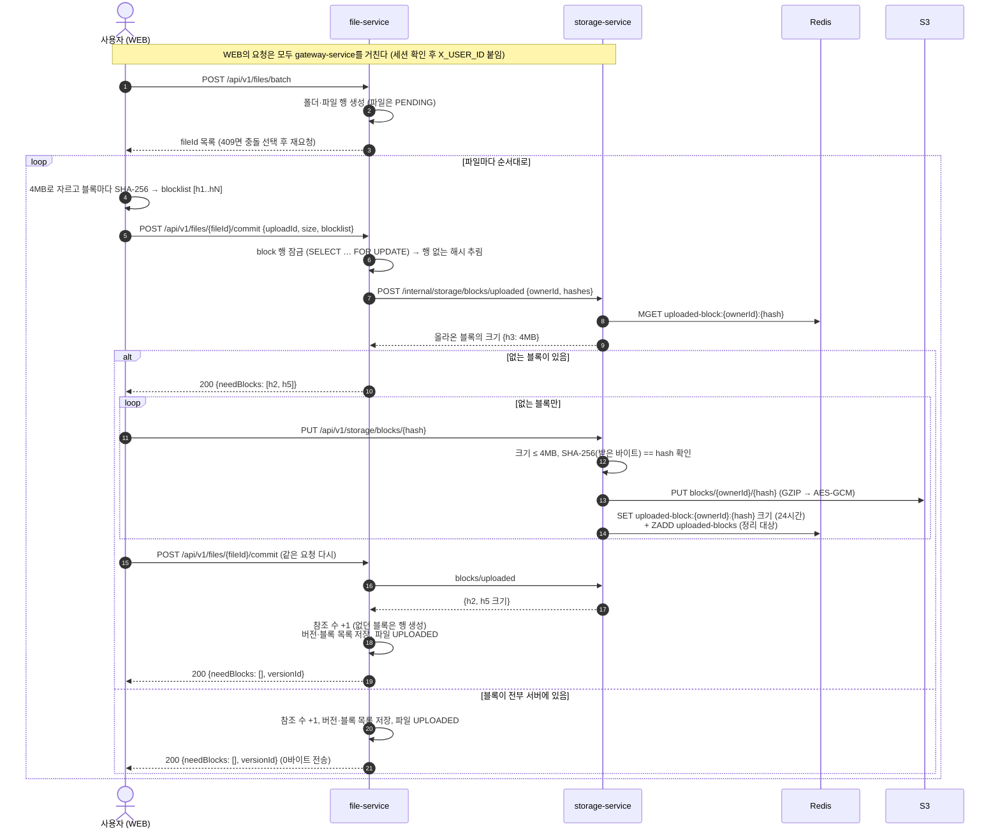
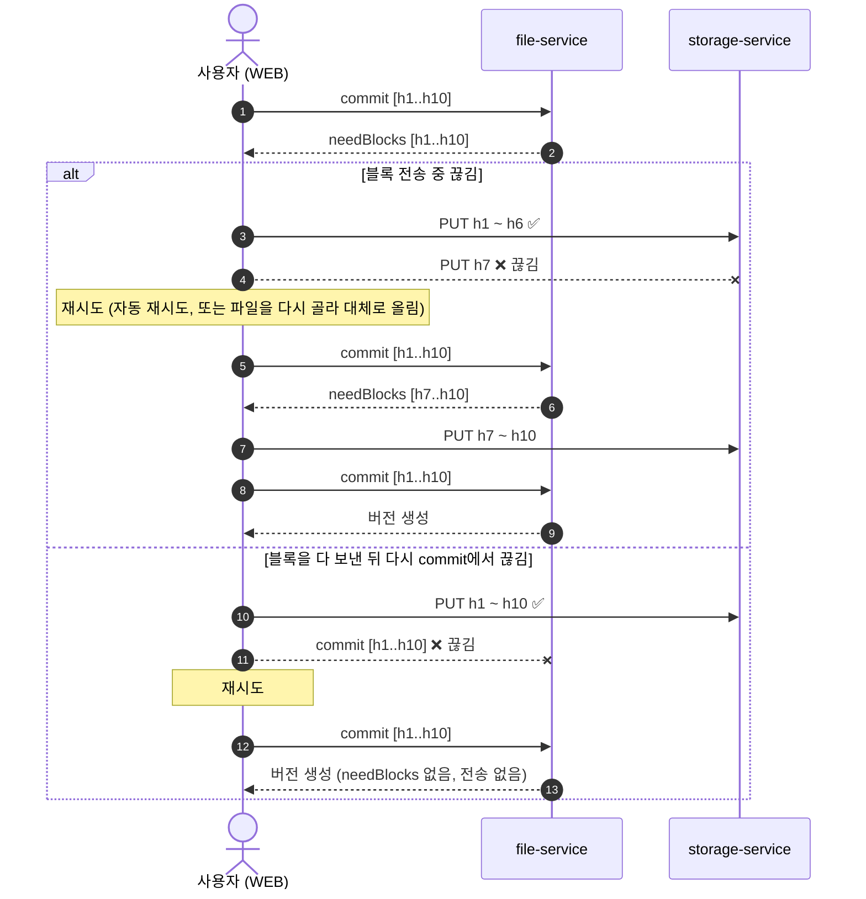
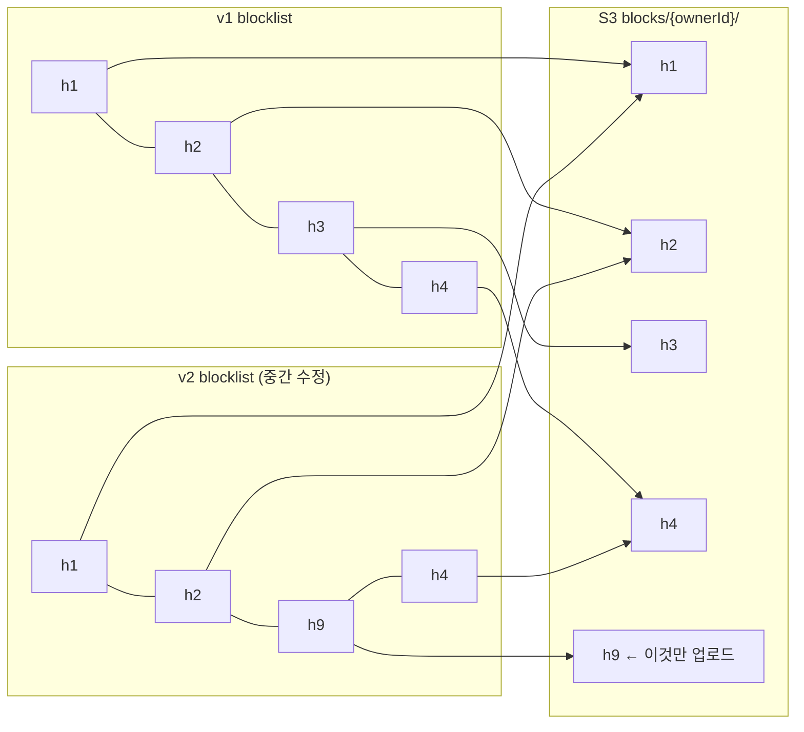

# 파일 업로드 스펙

이 문서는 파일 업로드가 어떻게 동작하는지 정의합니다.

⚠️ 이 문서가 기준입니다. 코드가 이 문서와 다르면 코드를 고치고, 동작을 바꾸려면 이 문서를 먼저 고칩니다.

> 참고: [Dropbox — Streaming File Synchronization](https://dropbox.tech/infrastructure/streaming-file-synchronization). [001](001-file-upload-spec.md)의 바이트 전송(5~8장, 간단 업로드·이어 올리기 세션·완료 콜백)을 대체합니다.

---

## 목차

- [1. 구성 요소](#1-구성-요소)
- [2. 파일 업로드](#2-파일-업로드)
  - [2-1. 이어 올리기](#2-1-이어-올리기)
  - [2-2. 대체 업로드](#2-2-대체-업로드)

---

## 1. 구성 요소

| 구성 요소 | 역할 |
|---|---|
| **WEB** | 파일을 블록으로 나눠 서버에 없는 블록만 보낸다 |
| **gateway-service** | 세션을 확인하고 요청을 서비스로 넘긴다 |
| **file-service** | 파일·버전 메타데이터를 관리하고 업로드를 확정한다 |
| **storage-service** | 블록을 S3에 저장한다 |
| **S3** | 블록 저장 |
| **Redis** | 아직 확정되지 않은 블록 기록 |
| **file_db** | 파일·버전·블록 메타데이터 저장 |

---

## 2. 파일 업로드

파일은 **4MB 블록의 해시 목록(blocklist)** 이다. WEB이 해시 목록으로 commit하면 file-service가 서버에 없는 블록을 알려 주고, WEB은 그것만 보낸 뒤 다시 commit한다. 크기에 따른 업로드 방식 구분은 없다.

1. **배치 생성** — 001 3·4장 그대로다. 폴더와 파일 행을 한 트랜잭션으로 만들고, 이름 충돌은 409로 묻는다.
2. **해시 계산** — WEB이 파일을 4MB씩 잘라(마지막 블록만 작음) 블록마다 SHA-256을 계산한다 (`crypto.subtle.digest`). 순서대로 늘어놓은 해시가 blocklist다.
3. **commit** — WEB이 `uploadId`(이번 업로드 시도마다 새 UUID), `size`, `blocklist`를 보낸다. file-service는 이 사용자 공간에 없는 블록을 `needBlocks`로 답한다. 없는 블록이 없으면 이 commit에서 바로 버전을 만들고 끝난다 (4·5번 생략, 0바이트 전송).
   - 이미 commit된 블록은 file_db `block` 테이블로 안다. 이 행들은 commit이 끝날 때까지 잠가, 그 사이 참조 없는 블록 정리가 지우지 못하게 한다.
   - 올라왔지만 아직 commit되지 않은 블록은 storage-service에 묻는다 (Redis 표시).
4. **블록 전송** (없는 블록이 있을 때만) — WEB이 `needBlocks`만 하나씩 순서대로 보낸다 (한 파일에 같은 블록이 여러 번 나와도 한 번만). storage-service는 받은 바이트의 해시를 **다시 계산**해 경로의 해시와 다르면 거절한다. 클라이언트가 보낸 해시는 믿지 않는다.
   - 해시가 다르거나 빈 블록: 400 `INVALID_BLOCK`
   - 4MB 초과: 413 `BLOCK_TOO_LARGE`
   - 사용자당 24시간에 블록 25,600개(4MB 기준 100GB) 초과: 429 `UPLOAD_LIMIT_EXCEEDED` (`STORAGE_UPLOAD_BLOCKS_PER_WINDOW`). commit되지 않은 블록은 용량 한도에 잡히지 않으므로, 이 한도가 없으면 S3와 세션을 같이 쓰는 Redis를 무한히 채울 수 있다
5. **다시 commit** (없는 블록이 있을 때만) — 같은 요청을 다시 보낸다. 빠진 블록이 없으면 file-service가 한 트랜잭션에서 버전을 만들고 파일을 `UPLOADED`로 바꾼다. 그래도 빠진 블록이 있으면(그 사이 24시간이 지난 경우) WEB은 그 파일을 실패로 표시한다.
6. **응답** — commit 응답이 곧 완료다. storage-service → file-service 완료 콜백은 없다.

**commit 검증** (file-service)

| 확인 | 실패 |
|---|---|
| 파일이 있음 | 404 `FILE_NOT_FOUND` |
| 호출자가 파일 소유자 | 403 `FILE_ACCESS_DENIED` |
| 휴지통에 있거나 영구 삭제된 파일이 아님 | 404 `FILE_NOT_FOUND` |
| 폴더가 아님 | 400 `INVALID_BLOCKLIST` |
| `uploadId`로 만든 버전이 있다면 같은 파일의 것 | 400 `INVALID_BLOCKLIST` |
| `size` ≤ 5GB | 413 `FILE_TOO_LARGE` |
| 해시 형식 (소문자 hex 64자), 1,280개 이하 | 400 (요청 검증) |
| `blocklist` 길이 = `ceil(size / 4MB)` (빈 파일은 0) | 400 `INVALID_BLOCKLIST` |
| 마지막을 뺀 블록은 모두 정확히 4MB, 마지막은 1바이트~4MB, 합 = `size` | 400 `INVALID_BLOCKLIST` — 크기는 `block` 행·Redis 표시에 저장된 실제 값 |

- **같은 `uploadId`로 이미 버전이 있으면** 그 버전을 그대로 돌려준다. 응답이 유실된 commit을 다시 보내도 버전이 둘 생기지 않는다 (`file_version.upload_id` unique).
- 같은 해시를 다시 PUT하면 그냥 덮어쓴다. 내용이 같으므로 무해하다.
- storage-service 메모리는 요청당 블록 하나(4MB)만 쓴다.
- 파일 하나가 실패해도 그 파일만 실패한다. 폴더와 다른 파일은 남는다.
- 같은 파일을 다른 폴더에 또 올리면 `needBlocks`가 비어 **0바이트 전송**으로 끝난다. 블록은 소유자별로 저장하므로(`blocks/{ownerId}/{hash}`) 중복 제거도 같은 사용자 안에서만 된다.
- 빈 파일은 블록 없이(`blocklist: []`) 한 번의 commit으로 끝난다.

### 2-1. 이어 올리기

서버에 업로드 세션이 없다. **다시 commit하는 것이 곧 "어디까지 받았나" 조회**다.

- 블록 PUT·commit이 네트워크 오류, 429, 5xx로 실패하면 1초/2초/4초 간격으로 3번 다시 보낸다 (001 8장과 같음).
- 끝내 실패한 파일을 다시 고르면 해시를 다시 계산하고 commit한다. 이미 받은 블록은 건너뛰고, 블록을 다 받은 상태였다면 그 commit 한 번으로 버전이 생긴다. WEB이 `localStorage`에 기억할 것이 없다.
- 올라온 블록은 **24시간** 안에 commit해야 한다. 그 뒤에는 Redis 표시가 사라져 `needBlocks`에 다시 나온다. commit되지 않은 채 남은 블록은 storage-service 정리 작업(1시간마다)이 올라온 지 25시간 뒤 지운다 — 그 사이 다른 업로드가 commit한 블록이면 file-service에 물어 보고 남긴다.
- storage-service가 여러 대이거나 재시작돼도 상관없다. 상태가 S3·Redis·file_db에만 있다.

### 2-2. 대체 업로드

이름 충돌에서 **대체**를 고르면 기존 fileId에 새 버전을 commit한다. 이전 버전과 같은 블록은 이미 있으므로 **바뀐 블록만** 올라간다.

- 흐름은 2장 다이어그램과 같다. 위 예에서 commit하면 `needBlocks`가 `[h9]`라 "없는 블록이 있음" 갈래로 h9만 보내고 다시 commit한다.
- 내용이 똑같은 파일로 대체하면 `needBlocks`가 비어 "블록이 전부 서버에 있음" 갈래로 첫 commit에서 새 버전이 생긴다 (0바이트 전송).
- 이전 버전은 그대로 남고 블록도 공유한다. 업로드 중에는 이전 버전이 열린다.
- 블록 경계가 고정 4MB라서 **앞쪽에 바이트를 끼워 넣으면** 뒤 블록이 전부 밀려 다 다시 올라간다. 덮어쓰기·뒤에 덧붙이기에서만 이득이 있다 (Dropbox도 같은 한계).

