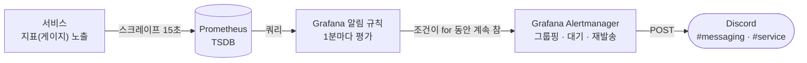

# 디스코드 알림 스펙

이 문서는 **서비스에 문제가 생겼을 때 사람에게 알리는 기능**이 어떤 규칙으로 동작하는지 정의한 문서입니다.
현재 받는 곳은 디스코드 채널입니다.

1~6장은 알림을 거는 **공통 규칙**이고, 지금 걸려 있는 알림은 [7장](#7-사용-알림)에 정리했습니다.

⚠️ 이 문서가 기준입니다. 코드가 이 문서와 다르면 코드를 고치고, 동작을 바꾸려면 이 문서를 먼저 고칩니다.

---

## 1. 알림 발송 과정



| 단계 | 하는 일 |
|---|---|
| 서비스 | 알릴 값을 게이지로 내놓는다 |
| Prometheus | 15초마다 긁어 저장 |
| 알림 규칙 | 1분마다 조건 확인 — `for` 동안 계속 맞으면 알림 (중간에 안 맞으면 없던 일) |
| Alertmanager | 같은 알림끼리 한 그룹으로 발송, 안 고치면 4시간마다 다시 |
| Discord | `channel` 라벨이 가리키는 채널의 웹후크로 도착 |

**울리기까지** = `for` + 최대 1분 + 30초.

Alertmanager 컨테이너는 따로 안 띄운다 — Grafana에 내장된 것을 쓴다.

---

## 2. 지표

앱이 `:9464/actuator/prometheus`에 이런 줄을 내놓는 것이 전부다 — **이름 + 라벨 + 숫자**.

```
modudrive_outbox_failed{instance="member-service",queue="mail-verification-requested",reason="SqsException"} 1
```

Prometheus가 15초마다 긁어 시계열로 쌓고, 규칙은 그걸 PromQL로 본다.

```
max by (instance, queue, reason) (modudrive_outbox_failed) > 0
```

- **`by (...)`에 넣은 라벨만 알림 문구에 쓸 수 있다.** 나머지는 집계에 묻혀 사라진다.
- 라벨 값은 **짧고 종류가 적게**. 값이 다르면 시계열이 하나씩 새로 생기므로 id나 바이트 수 같은 건 넣지 않는다.
- 라벨 조합이 바뀌는 지표는 값만 갱신할 수 없어 등록을 다시 한다(Micrometer `MultiGauge`).
  사라진 조합 = 시계열 소멸 = **알림 해제**.

---

## 3. 규칙

알림 하나 = 프로비저닝 파일의 `rules:` 항목 하나. 정할 건 **조건**과 **`for`** 둘뿐이다.

```yaml
- title: 이벤트 전송 실패                      # 알림 제목
  for: 0m                                    # 얼마나 버텨야 알릴지
  labels: {channel: messaging}               # 어느 채널로 → 6장
  annotations: {summary: ..., action: ..., query: ...}   # 메시지 문구 → 4장
  data:
    - expr: max by (instance, queue, reason) (modudrive_outbox_failed)   # 무엇을 보나 → 2장
    - conditions: [{evaluator: {type: gt, params: [0]}}]                 # 조건
```

- **`for`**: 저절로 복구될 수 있는 문제는 몇 분을 준다(그 시간을 버티면 사람이 볼 일이라는 뜻).
  사람이 손대야 없어지는 문제는 `0m`.
- **해제 알림**: 조건이 거짓이 되거나 그 시계열이 사라지면 같은 채널로 ✅ 해제 메시지가 나간다.
  Grafana가 보는 건 조건뿐이라, 사람이 진짜 고쳤는지는 모른다.

---

## 4. 알림 메시지

기본 템플릿은 값을 통째로 쏟아내서 정작 필요한 게 안 보인다. 그래서 항목을 직접 세웠다.
문구에 쓸 수 있는 재료는 셋뿐이다.

| 재료 | 무엇 |
|---|---|
| `.Labels.*` | 시계열 라벨 — `by (...)`에 넣은 것만 ([2장](#2-지표)) |
| `.Annotations.*` | 규칙에 적어둔 문구(사유·조치·로그 쿼리·조회 SQL·복구 SQL). 평가 시점에 `$labels`·`$values`가 박혀 굳는다 |
| `.GeneratorURL` / `.SilenceURL` | 규칙 상세 / 무음(Silence) 화면 링크 |

---

## 5. 그룹핑과 재발송

| 항목 | 값 | 뜻 |
|---|---|---|
| `group_by` | `alertname, instance, queue, reason` | 넷이 같으면 한 그룹 = 메시지 하나 |
| `group_wait` | 30초 | 첫 발송 전 같은 그룹을 기다려 모은다 |
| `repeat_interval` | 4시간 | 안 고치면 4시간마다 한 번 더 |

---

## 6. 디스코드 채널

| 채널 | 무엇을 받나 | 웹후크 |
|---|---|---|
| `messaging` | 이벤트가 제대로 전달되는가 — 적체·실패, 나중에 DLQ | `DISCORD_MESSAGING_WEBHOOK_URL` |
| `service` | 서비스가 살아 있는가 — 응답 없음, 나중에 CPU·메모리 | `DISCORD_SERVICE_WEBHOOK_URL` |

---

## 7. 사용 알림

`.docker/observability/grafana/alerting/alerts.yaml`에 있다.

| 알림 | 채널 | 조건 | 무슨 뜻인가 |
|---|---|---|---|
| 이벤트 전송 적체 | `messaging` | `max by (instance) (modudrive_outbox_lag_seconds) > 120` · `for: 5m` | 이벤트가 SQS로 안 나가고 쌓인다 |
| 이벤트 전송 실패 | `messaging` | `max by (instance, queue, reason, detail) (modudrive_outbox_failed) > 0` | 사람이 손대야 하는 행이 있다 |
| 서비스 응답 없음 | `service` | `min by (instance) (up{job="services"}) < 1` · `for: 2m` | 스크레이프 실패 = 프로세스가 죽었다 |

1. **이벤트 전송 적체** — 전송 실패에 횟수 제한이 없어 장애가 나도 `FAILED` 행이 안 생긴다
([messaging 2-2](messaging-spec.md#2-2-전송-실패)). 테이블만 봐서는 멀쩡해 보이므로 감지는 이 알림뿐이다.
정상값이 0~1초(relay가 1초마다 돈다)라 120초면 명백히 비정상이고, 5분을 버티면 저절로 복구될 장애가 아니다.
지표가 아는 건 **밀린 초뿐이고 왜 막혔는지는 모른다** — `OutboxRelay`는 일시적 실패를 로그로만 남기고
재시도하기 때문이다([messaging 2-2](messaging-spec.md#2-2-전송-실패)). 그래서 사유 대신 그 로그로 가는
LogQL(`logs` 문구)을 알림에 실어 보낸다. 원인까지 알림이 말하게 하려면 실패 사유를 지표 라벨로 내보내야 한다.

2. **이벤트 전송 실패** — `FAILED`는 사람이 손대기 전까지 사라지지 않으니 지속 조건 없이 바로 알린다. 큐·사유별로
쪼개서 "이 큐의 이벤트가 이래서 멈췄다"라고 말하게 했고, 그 라벨이 알림 문구와 조회 SQL에 그대로 들어간다.
사유는 라벨로 나가므로 저장할 때부터 100자로 자른다(`OutboxEventJpaEntity.FAILURE_REASON_LENGTH`).

3. **서비스 응답 없음** — Prometheus가 15초마다 긁는 액추에이터가 2분 내내 응답하지 않으면 울린다.
프로세스가 죽었거나 액추에이터가 막힌 경우다. 2분을 주는 건 재배포로 잠깐 내려가는 것까지 알리지 않기
위해서다.

---

## 8. TODO

- [ ] **DLQ 알림**: Consumer에서 실패한 메시지는 `<큐>-dlq`로 옮겨지기만 하고 알려주는 곳이 없다
  ([messaging 3-3](messaging-spec.md#3-3-실패-처리)). DLQ에도 보관 기간(기본 4일, 최대 14일)이 있어 방치하면
  결국 사라진다. DLQ마다 "`ApproximateNumberOfMessagesVisible > 0`이면 알림"을 걸어서, 사유(`DeadLetterReason`)를
  보고 원인을 고친 뒤 원래 큐로 redrive할 수 있게 한다. Terraform으로 큐를 만들 때(CloudWatch Alarm) 같이 넣는다.
- [ ] **AWS로 가면**: 두 지표 모두 앱이 내보내는 커스텀 메트릭이라 CloudWatch가 저절로 알지 못한다.
  OTel Collector에 CloudWatch EMF exporter를 붙이거나 ADOT를 쓰는 선택이 남아 있다 —
  [.docs/aws-migration.md](../aws-migration.md)의 모니터링 항목과 같이 정한다.
