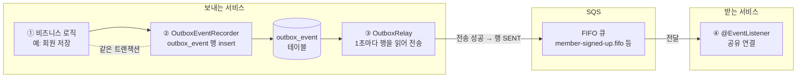
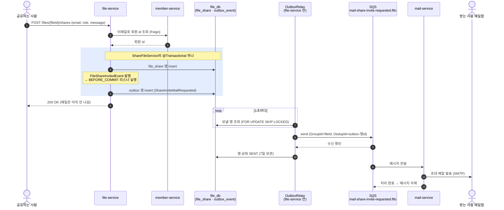
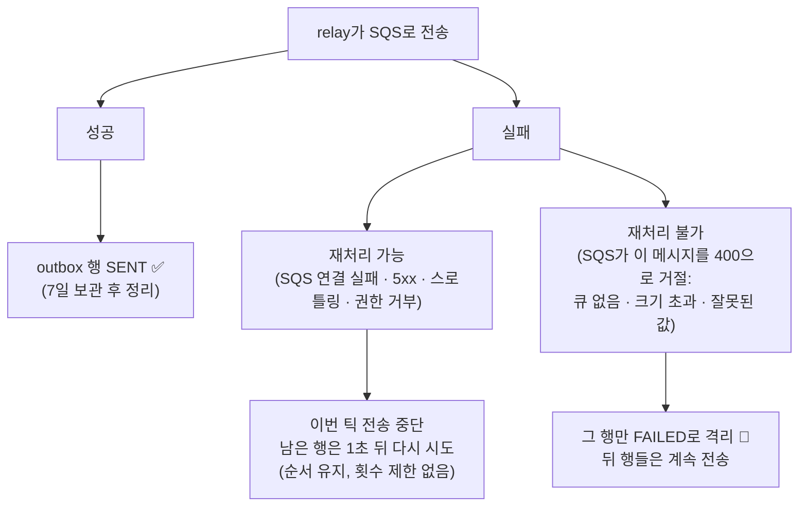
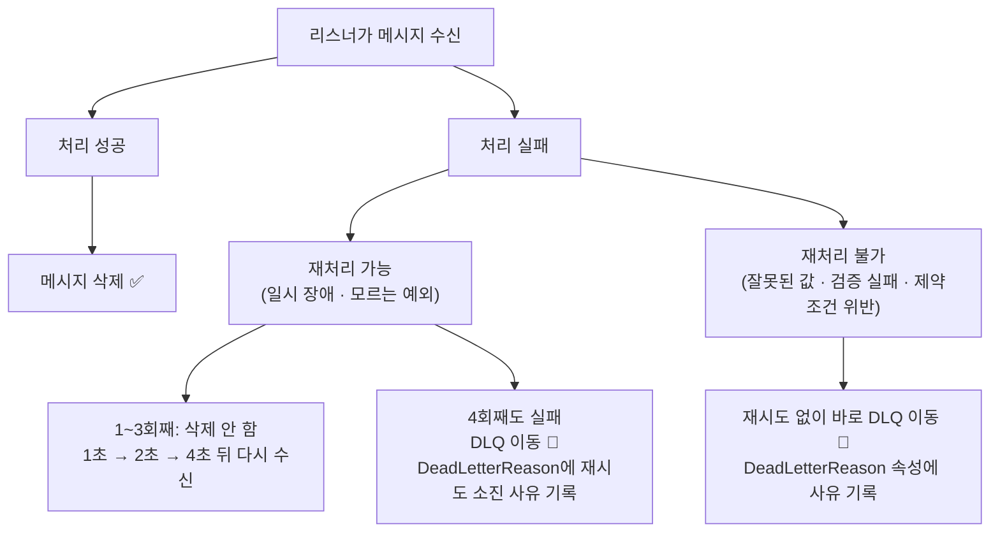

# 비동기 메시징 스펙

이 문서는 서비스끼리 AWS SQS로 이벤트를 주고받는 기능(메일 발송, 인앱 알림, 가입 후 대기 공유 연결)이
어떤 규칙으로 동작하는지 정의한 문서입니다.

⚠️ 이 문서가 기준입니다. 코드가 이 문서와 다르면 코드를 고치고, 동작을 바꾸려면 이 문서를 먼저 고칩니다.

---

## 1. 이벤트 처리 과정

### 1-1. 전체 흐름

이벤트는 **DB에 먼저 적고(outbox) → 나중에 SQS로 보내고 → 받는 쪽이 처리**한다. 세 단계가 서로 다른 시점에 일어난다.



- **①②는 한 트랜잭션**: 회원이 저장되면 이벤트도 반드시 남고, 롤백되면 이벤트도 없음.
- **③은 따로 돈다**: SQS가 잠깐 죽어 있어도 행이 테이블에 남아 있다가 다음 틱에 전송됨.
- **④가 처리에 성공하면** 메시지가 큐에서 삭제됨. 실패했을 때의 재시도·DLQ는 [1-3](#1-3-실패-처리).

### 1-2. 예시: 파일을 공유하면 초대 메일이 나가기까지



- 받는 사람이 **회원**인 경우를 그렸다. 회원이면 인앱 알림 이벤트(`FileSharedNotified`)도 같은 트랜잭션에서
  함께 기록되지만 그림에선 생략 ([2-3](#2-3-인앱-공유-알림)). 비회원이면 대기(pending) 공유 행 + 초대 토큰을 만들고
  메일 이벤트만 기록하며, 메일 링크가 로그인 없이 여는 `/files/{fileId}?key=초대토큰`이 된다.
- **파란 박스가 핵심**: 공유 행과 메일 이벤트가 한 트랜잭션. 공유가 저장되면 메일은
  반드시 나가고, 커밋이 실패하면 둘 다 없음 → "공유는 됐는데 메일이 안 감"도, "메일은 왔는데 공유가 없음"도 불가능.
- 이벤트 기록은 서비스 코드가 아니라 `FileShareInvitedEventListener`(`BEFORE_COMMIT`)가 함 — 커밋 직전, 아직 같은 트랜잭션 안.
- 사용자 응답(200 OK)은 메일 발송(SMTP)을 기다리지 않음. 메일은 보통 수 초 안에 도착.
- SMTP가 실패하면(일시 장애 = 재처리 가능) 메시지가 삭제되지 않음 → 1초 → 2초 → 4초 뒤 재시도, 4번 실패하면 DLQ ([1-3](#1-3-실패-처리)).

### 1-3. 실패 처리

실패는 **재처리 가능(일시적)**과 **재처리 불가(영구적)**로 나눠서 다르게 처리한다.
다시 해도 절대 성공하지 않는 실패를 재시도하면 시간만 쓰고, FIFO라 같은 그룹의 뒤 메시지까지 막히기 때문.

#### 보내는 쪽 (outbox relay)



- 재처리 가능한 실패는 **횟수 제한 없이** 재시도한다. SQS가 몇 분 장애 나는 동안 이벤트를 DLQ로 빼면 전부 사람이 되살려야 하기 때문.
- 권한 거부(403)도 재처리 가능 쪽: 모든 메시지가 똑같이 실패하므로 격리하면 전부 격리됨 → IAM을 고치면 그대로 이어서 전송되는 편이 낫다.
- 격리된 행은 outbox 테이블에 `FAILED`로 남는다(= 보내는 쪽 DLQ, 정리 대상 아님). 언제(`failed_at`), 왜(`failure_reason`) 실패했는지 행에 같이 기록됨. 원인을 고친 뒤 상태를 `PENDING`으로 되돌리면 다시 전송됨 ([4장](#4-프로듀서--transactional-outbox)).

#### 받는 쪽 (리스너)



| 구분 | 예 | 처리 |
|---|---|---|
| 재처리 가능 | SMTP·네트워크 타임아웃, DB 락, **분류에 없는 모든 예외** | 지수 백오프(1s → 2s → 4s)로 재시도, 4번째도 실패하면 DLQ — 사유 `Retries exhausted after 4 attempts: <마지막 예외>` |
| 재처리 불가 | `IllegalArgumentException`, `NullPointerException`, `ClassCastException`, 검증 실패(`ValidationException`), 제약조건 위반(`DataIntegrityViolationException`), 페이로드 타입 변환 실패 | 한 번 실패하면 바로 DLQ, 원본 본문 + 사유(`DeadLetterReason`) 보관 |
| JSON 자체가 깨진 메시지 | `{not json` | 리스너까지 오지 않음(Spring Cloud AWS가 변환 단계에서 버림) → 큐 visibility(10초)마다 다시 와서 4번째 뒤 **redrive로 DLQ** (약 40초, 사유 속성 없음) |

- 분류는 예외의 원인 체인을 끝까지 따라가서 판단하고, **모르면 재처리 가능 쪽**으로 둔다 — 쓸데없는 재시도 몇 초보다 잘못 버려서 사람이 되살리는 쪽이 비싸다.
- 구현: `common:infrastructure:sqs`의 `SqsFailures`(분류) + `DeadLetteringErrorHandler`(모든 `@SqsListener`에 자동 적용).

#### 실패 지점별 정리

| 어디서 실패? | 무슨 일이 일어나나 |
|---|---|
| 보내는 서비스의 DB 트랜잭션 | 비즈니스 데이터와 outbox 행이 같이 롤백 → 이벤트 자체가 없음 |
| Relay → SQS 전송 (일시적) | 행이 테이블에 남음 → 1초 뒤 다시 시도 (순서 유지를 위해 그 뒤 행들도 대기) |
| Relay → SQS 전송 (영구적) | 그 행만 `FAILED`로 격리, 나머지는 계속 전송 |
| SQS는 받았는데 행을 SENT로 바꾸기 전에 서버 다운 | 재시작 후 같은 행을 다시 보냄 → 5분 안이면 SQS가 DedupId로 버림 |
| 리스너 처리 | 위 "받는 쪽" 그림대로 — 일시적이면 백오프 재시도 후 DLQ, 영구적이면 바로 DLQ |

---

## 2. 큐 목록

큐는 4개, 전부 **FIFO**. 큐마다 실패 메시지가 옮겨지는 DLQ(`<이름>-dlq.fifo`)가 하나씩 짝으로 있음.

| 기능 | 언제 | 결과 |
|---|---|---|
| [가입 인증 메일](#2-1-가입-인증-메일) | "인증 코드 받기" 클릭 | 인증 코드 메일 발송 |
| [공유 초대 메일](#2-2-공유-초대-메일) | 이메일로 파일/폴더 공유 | 초대 메일 발송 |
| [인앱 공유 알림](#2-3-인앱-공유-알림) | 회원에게 공유 | 벨 아이콘 알림 생성 |
| [가입 후 대기 공유 연결](#2-4-가입-후-대기-공유-연결) | 가입 완료 | 가입 전에 받은 초대가 "공유 문서함"에 나타남 |

### 2-1. 가입 인증 메일

| | |
|---|---|
| 큐 | `mail-verification-requested.fifo` |
| 언제 | 가입 화면에서 "인증 코드 받기" — `POST /api/v1/member/verify-email/request` |
| 보내는 쪽 | member-service `OutboxMailEventPublisher` — 인증 코드를 Redis에 저장하고 이벤트 기록 |
| 받는 쪽 | mail-service `MailEventListener` — 코드가 담긴 메일 발송 |
| 이벤트 / 키 | `VerificationMailRequested` / email |

사용자는 메일로 받은 코드를 입력(`verify-email/confirm`)해야 가입할 수 있음.

### 2-2. 공유 초대 메일

| | |
|---|---|
| 큐 | `mail-share-invite-requested.fifo` |
| 언제 | 파일/폴더를 이메일로 공유 — `POST /api/v1/files/{fileId}/shares` |
| 보내는 쪽 | file-service `OutboxMailEventPublisher` — 공유 행 저장과 같은 트랜잭션에서 기록 |
| 받는 쪽 | mail-service `MailEventListener` — 초대 메일 발송 |
| 이벤트 / 키 | `ShareInviteMailRequested` / fileId |

받는 사람에 따라 메일이 다름:
- **회원** — "OO님이 파일을 공유했습니다" 메일, 로그인해서 열람
- **비회원** — `inviteToken`이 담긴 **로그인 없이 여는 링크**. 공유는 가입 전까지 "대기(pending)" 상태 → [2-4](#2-4-가입-후-대기-공유-연결)

공유할 때 메시지를 적었으면 메일 본문에 같이 들어감.

### 2-3. 인앱 공유 알림

| | |
|---|---|
| 큐 | `notification-file-shared.fifo` |
| 언제 | 공유 대상이 **회원**일 때만 (비회원은 계정이 없어 메일만 감) |
| 보내는 쪽 | file-service `OutboxNotificationEventPublisher` — 초대 메일 이벤트와 같은 트랜잭션에서 함께 기록 |
| 받는 쪽 | notification-service `NotificationEventListener` — 알림 행 저장, `eventId`로 중복 제거 |
| 이벤트 / 키 | `FileSharedNotified` / recipientId |

사용자는 헤더 벨 아이콘과 `/notifications` 목록에서 확인 (WEB이 30초마다 폴링).

### 2-4. 가입 후 대기 공유 연결

| | |
|---|---|
| 큐 | `member-signed-up.fifo` |
| 언제 | 가입 완료 — `POST /api/v1/member/sign-up` |
| 보내는 쪽 | member-service `OutboxMemberEventPublisher` — 가입 트랜잭션 안에서 기록 |
| 받는 쪽 | file-service `MemberEventListener` — 그 이메일로 걸려 있던 대기 공유를 새 회원에게 연결(claim) |
| 이벤트 / 키 | `MemberSignedUp` / email |

연결 전 확인 사항:
- member-service에 "이 memberId가 정말 이 이메일 주인인지" 다시 물어봄 (메시지 내용을 그대로 믿지 않음)
- 그 사이 소유자가 같은 파일을 이 회원에게 따로 공유했다면, 남은 대기 초대는 삭제

가입 시 네임스페이스(내 드라이브) 생성은 큐가 아니라 커밋 후 Feign 동기 호출이라 여기 없음.

### 참고

- 큐 이름 상수(`MailQueues`, `MemberQueues`, `NotificationQueues`)와 이벤트 레코드는 `common:event`.
- SQS 큐 이름엔 `.`을 못 써서(`.fifo` 접미사 제외) 하이픈으로 이름 지음.
- 키는 FIFO의 `MessageGroupId` — 같은 키끼리만 순서가 보장됨 (자세한 건 4장).

## 3. 인프라

| | 로컬 | AWS |
|---|---|---|
| SQS | ElasticMQ 컨테이너 (`.docker/docker-compose.infra.yml`, 포트 9324) | Amazon SQS |
| 큐/DLQ/redrive 정의 | `.docker/elasticmq/elasticmq.conf` | Terraform (conf와 똑같이 맞출 것) |
| 접속 | `SPRING_CLOUD_AWS_SQS_ENDPOINT=http://elasticmq:9324` + 더미 키 | endpoint/키 미설정 → ECS task role, `AWS_REGION` |

- LocalStack이 아니라 ElasticMQ인 이유: LocalStack 이미지가 2026-03-23부터 auth token 필수가 됨. ElasticMQ는 무료·가입 불필요, FIFO/redrive 지원.
- ElasticMQ는 **메모리 저장** — 재시작하면 큐에 떠 있던 메시지는 사라짐. 아직 안 보낸 건 outbox 테이블에 남아 있으니 유실은 "전송 완료 후 소비 전"인 것만.
- 앱은 큐를 만들지 않음(`queue-not-found-strategy: fail`) — 없으면 기동 실패. 자동 생성하면 DLQ/redrive 없는 큐가 생기기 때문.
- 큐 상태 보기: `curl "http://localhost:9324/?Action=GetQueueAttributes&QueueUrl=http://localhost:9324/000000000000/<큐>&AttributeName.1=All"`

## 4. 프로듀서 — Transactional Outbox

`OutboxEventRecorder.record(queue, key, event)` → 호출자 트랜잭션 안에서 `outbox_event` 행 insert →
`OutboxRelay`가 1초마다(한 틱) `PENDING` 행을 id 순으로 **최대 100개 읽어**(`FOR UPDATE SKIP LOCKED`) **1건씩** `SqsTemplate`으로 동기 전송하고, 성공하면 `SENT`로 표시.
SQS 일괄 전송(`SendMessageBatch`)은 쓰지 않는다 — 100개를 읽으면 SQS 호출도 100번.

**행 상태** (`status` 컬럼, `OutboxEventStatus`)

| 상태 | 뜻 | 언제 사라지나 |
|---|---|---|
| `PENDING` | 기록됨, 아직 안 보냄 (relay가 가져가는 대상) | 전송되면 SENT, 영구 실패면 FAILED |
| `SENT` | SQS가 받음 (`sent_at`) | **7일 보관** 후 relay가 1시간마다 정리 |
| `FAILED` | 다시 보내도 안 되는 행 (`failed_at`, `failure_reason`) — 보내는 쪽 DLQ | 정리하지 않음, 사람이 처리 |

```sql
-- FAILED 행 원인 확인
select id, topic, payload_type, failed_at, failure_reason from outbox_event where status = 'FAILED';
-- 원인을 고친 뒤 다시 보내기
update outbox_event set status = 'PENDING', failed_at = null, failure_reason = null where id = 123;
```

- **MessageGroupId = 행의 key**: 같은 키끼리 순서 보장. 128자 넘는 키(긴 이메일)는 UUID로 해시(같은 키 → 같은 그룹).
- **MessageDeduplicationId = `outbox-<행 id>`**: SQS가 받았는데 SENT 표시 커밋 전에 죽어서 재전송돼도, 5분 안이면 SQS가 버림. 그 이후엔 at-least-once → 컨슈머 멱등성 필요(notification은 `eventId` dedupe, 대기 공유 claim은 멱등, 메일 중복은 허용).
- 전송 실패: 일시적(연결 실패·5xx·스로틀링·권한 거부)이면 그 자리에서 멈추고 다음 틱에 재시도(순서 유지). SQS가 그 메시지를 400으로 거절하면(영구적) 그 행만 `FAILED`로 격리하고 다음 행 계속 전송. 복원 불가 행(이벤트 클래스가 바뀜 등)도 `FAILED`. ([1-3](#1-3-실패-처리))
- 컬럼명 `topic`은 Kafka 시절 이름 그대로 — 값은 큐 이름.
- 기록 시점: `@TransactionalEventListener(phase = BEFORE_COMMIT)` (`FileShareInvitedEventListener`, `MemberSignedUpEventListener`).

## 5. 컨슈머

`@SqsListener(큐)` 메서드. 페이로드 타입은 메서드 파라미터에서 추론(Jackson 3) — Kafka 때의 `trusted.packages` 불필요.

**재시도/DLQ** ([1-3](#1-3-실패-처리)):
- 모든 리스너에 `DeadLetteringErrorHandler`가 자동 적용(서비스가 직접 `AsyncErrorHandler` 빈을 두면 그쪽 우선).
- 재처리 불가 실패 → 에러 핸들러가 `<큐>-dlq.fifo`로 원본 본문 + `DeadLetterReason` 속성을 보내고 원래 메시지 삭제. DLQ 전송 자체가 실패하면 재시도 경로로 넘김(유실 없음).
- 재처리 가능 실패 → 메시지를 지우지 않고 visibility를 1s → 2s → 4s로 늘려 다시 수신. **마지막 수신**(수신 횟수 = 큐의 `maxReceiveCount`)에서도
  실패하면 에러 핸들러가 `Retries exhausted after N attempts: <마지막 예외>` 사유와 함께 직접 DLQ로 옮김.
  (그냥 두면 다음 수신 때 SQS redrive가 옮기는데, 서버가 옮기는 거라 사유를 붙일 수 없음.)
- 수신 한도와 DLQ 이름은 앱에 적지 않고 **큐의 `RedrivePolicy`를 읽어서** 씀(큐별 캐시) — 설정은 elasticmq.conf / Terraform 한 곳뿐.
- 큐의 redrive policy는 **안전망**으로 남음: 에러 핸들러까지 오지 못한 메시지(컨슈머가 죽음, 깨진 JSON)는 여전히 redrive로 DLQ에 감(사유 없음).
- JSON 자체가 깨진 메시지는 에러 핸들러를 거치지 않음 → 큐 visibility(10s)마다 재수신, redrive로 DLQ (원본 그대로).
- FIFO라 같은 그룹의 뒤 메시지는 앞 메시지가 처리되거나 DLQ로 갈 때까지 대기.

## 6. 재처리 (replay)

- **실패 메시지 재처리**: DLQ → 원래 큐로 redrive (AWS 콘솔 버튼 / `StartMessageMoveTask`). 로컬은 DLQ에서 받아 다시 보내면 됨.
- **성공한 과거 이벤트 replay**: SQS는 처리 후 삭제라 Kafka식 offset 되감기는 불가. 대신 보낸 행이 outbox에 **7일간 SENT로 남아 있으므로**,
  그 기간 안이면 상태를 `PENDING`으로 되돌려 다시 발행할 수 있다(5분 넘게 지난 행이면 SQS dedup에 걸리지 않고 다시 전달됨).
  메일 이벤트는 되돌리면 사용자에게 메일이 다시 나가니 주의. 현재 이 기능을 쓰는 곳은 없음.

## 7. 트레이싱

- `spring.cloud.aws.sqs.observation-enabled: true` — `traceparent`가 SQS 메시지 속성으로 전달돼 컨슈머 스팬이 원래 요청 트레이스에 붙음.
- 기록 시 요청의 trace 헤더를 `outbox_event.trace_headers`에 저장 → 릴레이가 그걸로 **Observation**(`ReceiverContext`)을 열고 그 안에서 전송.
  bare span이 아니라 Observation이어야 하는 이유: `SqsTemplate`은 현재 Observation을 부모로 잡는데, 큐별 첫 전송은 큐 URL 조회 때문에 SDK 스레드에서 이어져서 thread-local span이 안 보임 → 첫 메시지만 트레이스가 끊겼었음.

## 8. 테스트

- `ElasticMqQueueConfigTest` (sqs 모듈, Testcontainers): 실제 `elasticmq.conf`로 dedup 1회 전달, 재처리 가능 실패 → 백오프 4회 후 재시도 소진 사유와 함께 DLQ, 재처리 불가 실패 → 1회 만에 사유와 함께 DLQ, 깨진 JSON → redrive로 DLQ.
- `SqsFailuresTest`: 컨슈머·전송 실패 분류, DLQ 이름 규칙.
- `OutboxRelayTest` (outbox 모듈, Postgres Testcontainers): 순서, group/dedup 헤더, 일시 실패 시 중단, SQS가 거절한 행만 격리, 복원 불가 행, SKIP LOCKED, 전송 중 현재 Observation.

## 9. TODO

- [ ] **outbox 적체 알람**: relay는 일시적 실패를 횟수 제한 없이 재시도하므로([1-3](#1-3-실패-처리)), SQS가 오래 죽어
  있으면 이벤트가 `outbox_event`에 조용히 쌓이기만 하고 아무도 모른다. "outbox에서 가장 오래된 `PENDING` 행(`created_at`)이
  N분 넘게 남아 있으면 알람"을 붙여야 한다. `FAILED` 행이 생겨도 알람 대상.
  AWS 모니터링(CloudWatch 등) 결정 때 같이 넣는다.
