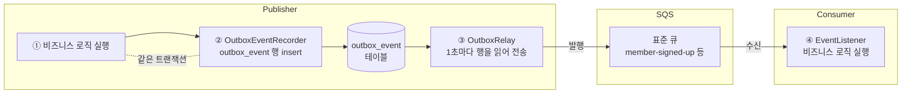
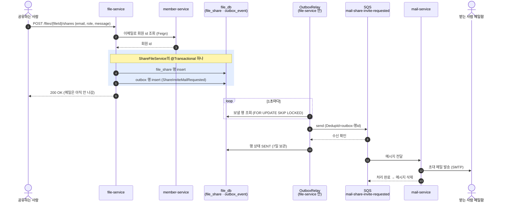
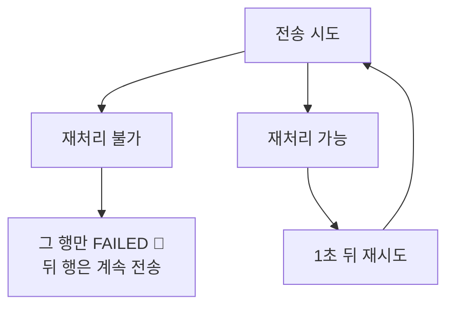
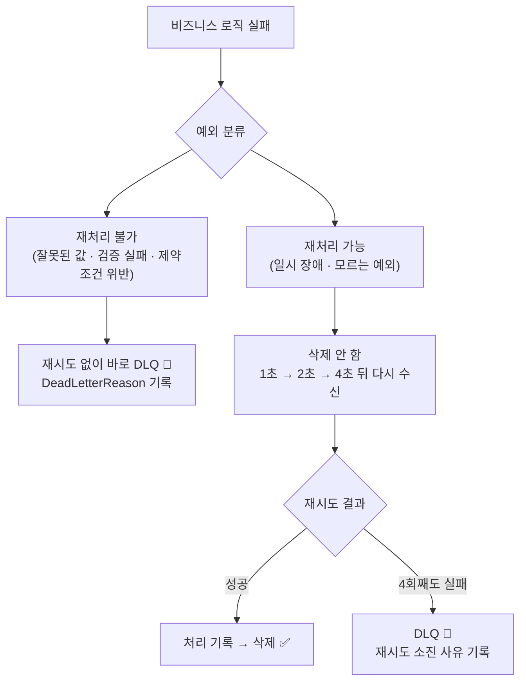

# 비동기 메시징 스펙

이 문서는 서비스끼리 AWS SQS로 이벤트를 주고받는 기능(메일 발송, 인앱 알림, 가입 후 대기 공유 연결)이
어떤 규칙으로 동작하는지 정의한 문서입니다.

⚠️ 이 문서가 기준입니다. 코드가 이 문서와 다르면 코드를 고치고, 동작을 바꾸려면 이 문서를 먼저 고칩니다.
지금은 문서와 코드가 일치하며, 아직 손대지 않은 성능·운영 항목만 [9장](#9-todo)에 남아 있습니다.

---

## 1. 이벤트 처리 과정

### 1-1. Transaction Outbox

트랜잭션 아웃박스 패턴은 데이터베이스 업데이트와 메시지 브로커 발행 간의 이중 쓰기(Dual Write) 문제를 해결하고 데이터 일관성을 보장하는 디자인 패턴이다.

비즈니스 로직 안에서 SQS로 곧장 보내면 막을 수 없는 실패가 둘 있다.

| 상황 | 결과 |
|---|---|
| DB는 커밋됐는데 전송이 실패 | 파일은 공유됐는데 초대 메일이 영영 안 나간다 |
| 전송은 나갔는데 트랜잭션이 롤백 | 없던 일이 된 공유의 초대 메일이 상대에게 도착한다 |

둘 다 **DB 커밋과 SQS 전송이 서로 다른 시스템**이라 한 트랜잭션으로 묶이지 않아서 생긴다. SQS는 2단계
커밋을 지원하지 않으므로 묶을 방법도 없다.

그래서 전송을 **같은 DB에 적는 일로 바꾼다.** 보낼 내용을 `outbox_event` 테이블에 한 행으로 적어두면
비즈니스 데이터와 같은 트랜잭션이라 같이 커밋되고 같이 롤백된다. 실제 전송은 그 행을 읽는 별도 스레드가
맡는다. 전송이 실패해도 행은 남아 있으니 다음 틱에 다시 나간다 — "전송에 성공해야 한다"는 문제가
"행을 적어야 한다"는 문제로 바뀌는 것이 이 패턴의 전부다.

`outbox_event`가 갖게되는 상태는 다음과 같다.

| 상태 | 뜻 | 언제 사라지나 |
|---|---|---|
| `PENDING` | 기록됨, 아직 안 보냄 (전송될 때까지 계속 재시도) | 전송되면 `SENT` |
| `SENT` | SQS가 받음 (`sent_at`) | **7일 보관** 후 relay가 1시간마다 정리 |
| `FAILED` | 그 메시지 하나가 잘못됨 (`failed_at`, `failure_reason`) | 정리하지 않음, 사람이 처리 |

### 1-2. 전체 흐름

이벤트는 **DB에 먼저 적고(outbox) → 나중에 SQS로 보내고 → Consumer가 처리**한다. 세 단계가 서로 다른 시점에 일어난다.

- **①②는 한 트랜잭션**: 회원이 저장되면 이벤트도 반드시 남고, 롤백되면 이벤트도 없음.
- **③은 따로 돈다**: SQS가 잠깐 죽어 있어도 행이 테이블에 남아 있다가 다음 틱에 전송됨.
- **④가 처리에 성공하면** 메시지가 큐에서 삭제됨.

### 1-3. 예시: 파일을 공유하면 초대 메일이 나가기까지

- **파란 박스가 핵심**: 공유 행과 메일 이벤트가 한 트랜잭션. 공유가 저장되면 메일은
  반드시 나가고, 커밋이 실패하면 둘 다 없음 → "공유는 됐는데 메일이 안 감"도, "메일은 왔는데 공유가 없음"도 불가능.
- 이벤트 기록은 `ShareFileService`가 공유 행 저장 직후 이벤트 포트(`PublishMailEventPort`)를 직접 불러서 한다 — 같은 `@Transactional` 안.
- 사용자 응답(200 OK)은 메일 발송(SMTP)을 기다리지 않음. 메일은 보통 수 초 안에 도착.

---

## 2. Publisher

Publisher는 **이벤트를 만들어 내보내는 쪽**이다(member-service, file-service). 하는 일은 둘뿐이다 —
비즈니스 트랜잭션 안에서 "보낼 이벤트"를 자기 DB에 적고, 별도 스레드가 그 행을 읽어 SQS로 보낸다.

### 2-1. 이벤트 발행 과정

#### 2-1-1. 이벤트 기록

- 비즈니스 코드는 SQS로 직접 보내지 않고 `OutboxEventRecorder.record(queue, key, event)`를 부른다 → `outbox_event` 행 insert.
- 기록은 **유스케이스 서비스가 자기 `@Transactional` 안에서 이벤트 포트를 직접 호출**해서 한다. 
  비즈니스 데이터 저장과 같은 트랜잭션이라 같이 커밋되거나 같이 롤백된다.
- 호출자 트랜잭션이 없으면(예: 가입 인증 메일 요청 — 인증 코드는 Redis) 기록기가 outbox insert만 담은 트랜잭션을 스스로 연다.

#### 2-1-2. 이벤트 전송

- `OutboxRelay`가 1초마다(한 틱) `PENDING` 행을 id 순으로 **최대 100개 읽어**(`FOR UPDATE SKIP LOCKED`) **1건씩** 동기 전송한다.
  SQS 일괄 전송(`SendMessageBatch`)은 쓰지 않는다 — 100개를 읽으면 SQS 호출도 100번.
- `SKIP LOCKED`라 인스턴스가 여러 대여도 같은 행을 두 번 보내지 않는다.
- **중복 제거 id = `outbox-<행 id>`**: `DeduplicationId` 메시지 속성으로 같이 나간다. SQS가 받았는데 SENT 표시 커밋
  전에 죽어 재전송되면 같은 id로 다시 가므로, Consumer가 그걸 보고 재전송인 줄 안다([3-1](#3-1-멱등성-체크)).
  표준 큐는 브로커가 중복을 지우지 않으니 **중복 차단은 전적으로 Consumer 몫**이다.
- **행의 key(`message_key`)는 순서와 무관하다** — 표준 큐엔 순서라는 개념이 없다. 키는 그 이벤트의 결과를 받는
  대상(메일·알림은 받는 사람, 가입은 가입한 사람)이고, 한 사람의 이벤트를 `outbox_event`에서 찾을 때 쓴다.
- 성공하면 `status = SENT`, `sent_at` 기록.

#### 2-1-3. 이벤트 정리

`SENT` 행은 **7일 보관** 후 relay가 1시간마다 지운다. 바로 지우지 않는 이유는 재처리([6장](#6-재처리-replay))와
사고 조사 때 "그 이벤트가 정말 나갔나"를 확인할 곳이 현재 이 테이블뿐이기 때문이다.

### 2-2. 전송 실패

전송 실패는 2가지 분류로 나누어 처리한다.

| 구분 | 실패 | 무엇 |
|---|---|---|
| **재처리 불가** | payload 복원 실패 | 이벤트 클래스가 바뀌어 저장된 payload를 객체로 못 되살림 |
| 〃 | 직렬화 실패 | 객체를 JSON으로 못 바꿈 — SQS에 닿기도 전 |
| 〃 | SQS가 거절 | 큐 없음 · 크기 초과 · 잘못된 값 (400) |
| **재처리 가능** | 일시 장애 | 연결 실패 · 5xx · 스로틀링 · 권한 거부 |

**재처리에 왜 횟수 제한이 없나** — 여기서 실패하는 건 그 메시지가 아니라 인프라다. 장애가 나면 모든 행이 똑같이 실패하므로,
N번에 `FAILED`로 보내면 멀쩡한 이벤트가 무더기로 빠지고 복구 후 사람이 일일이 되돌려야 한다.
저절로 복구될 일을 수동 작업으로 바꾸는 셈이다. 행이 `PENDING`으로 남아 있는 것 자체가 이미 안전한 보관 상태다.

**전송 시 SDK가 먼저 재시도한다** — relay가 `publish()`를 한 번 부르면 SDK가 그 안에서 최대 4번 시도한다
(기본 LEGACY 모드, 100ms부터 지수 백오프 + jitter). 다 합쳐도 1초가 안 된다.
그 안에 성공하면 relay는 실패가 있었는지도 모르고 넘어간다. **위 표의 "일시 장애"는 1초를 넘게 끊겼다는 뜻이다.**

#### 2-2-1. 전송 실패 시 알림

`outbox_event`의 `FAILED` 발생과 인프라 장애로 이벤트 전송 지체가 지속될 경우, 다음과 같은 알림을 보낸다.

| 지표 | 알림 조건 | 무슨 뜻인가 |
|---|---|---|
| `modudrive_outbox_lag_seconds` — 가장 오래 기다린 `PENDING` 행의 나이(초) | `> 120`이 5분 지속 | 전송이 막혔다 (SQS 장애 등) |
| `modudrive_outbox_failed` — 현재 `FAILED` 행 수 (큐·사유별) | `> 0` 즉시 | 사람이 손대야 하는 행이 있다 |

(상세 내용은 [.docs/spec/discord-alert-spec.md 7장](discord-alert-spec.md#7-사용-알림) 참고)

---

## 3. Consumer

### 3-1. 멱등성 체크

SQS 표준 큐는 at-least-once라 같은 메시지가 두 번 올 수 있다(outbox 재전송, 처리 후 삭제 전 Consumer 다운, 브로커 자체 중복 등).
그래서 **처리 전에 "이미 처리한 메시지인가"를 확인**하고, 처리했으면 건너뛰고 메시지만 지운다.

- **키**: 큐 이름 + `DeduplicationId` 속성(`outbox-<행 id>`). SQS 메시지 id는 보낼 때마다 바뀌지만 이 값은 같은 이벤트면 항상 같다.
  큐마다 Publisher가 하나라 큐 이름을 붙이면 행 id가 서비스끼리 겹쳐도 충돌하지 않는다.
- **처리 기록 시점** — 비즈니스 결과와 함께 남긴다:

| Consumer | 기록 위치 | 방식 |
|---|---|---|
| file / notification (DB 있음) | 자기 DB의 `processed_event` 테이블 | 비즈니스 처리와 **같은 트랜잭션**에서 insert → 처리가 실패해 롤백되면 기록도 없음(재시도 때 다시 처리됨) |
| mail (DB 없음, SMTP는 트랜잭션 불가) | Redis (`processed:<큐>:<dedupId>`, TTL 7일) | 메일 발송 **성공 후** 기록. 발송과 기록 사이에 죽으면 메일이 한 번 더 갈 수 있음(허용) |

- 처리 기록은 7일(= outbox SENT 보관 기간) 뒤 정리한다. 그보다 오래된 재전송은 없기 때문.
  DB 쪽은 각 서비스에서 1시간마다 지우고, Redis 쪽은 키 TTL로 알아서 사라진다.
- 재처리 불가로 DLQ에 간 메시지는 기록이 남지 않으므로, 원인을 고친 뒤 redrive하면 **다시 처리된다**.
- 구현: `common:infrastructure:messaging`의 `ProcessedEvents`(포트) + JPA/Redis 구현. 리스너가 `DeduplicationId`
  속성(`SqsAttributes.DEDUPLICATION_ID`)을 받아 `isProcessed` → 비즈니스 처리 → `markProcessed` 순으로 부른다.

### 3-2. 처리 성공

비즈니스 로직이 예외 없이 끝나면 처리 기록을 남기고 메시지를 삭제한다(ACK).

### 3-3. 실패 처리

| 구분 | 예 | 처리 |
|---|---|---|
| 재처리 가능 | SMTP·네트워크 타임아웃, DB 락, **분류에 없는 모든 예외** | 지수 백오프(1s → 2s → 4s)로 재시도, 4번째도 실패하면 DLQ — 사유 `Retries exhausted after 4 attempts: <마지막 예외>` |
| 재처리 불가 | `IllegalArgumentException`, `NullPointerException`, `ClassCastException`, 검증 실패(`ValidationException`), 제약조건 위반(`DataIntegrityViolationException`), 페이로드 타입 변환 실패 | 한 번 실패하면 바로 DLQ, 원본 본문 + 사유(`DeadLetterReason`) 보관 |
| JSON 자체가 깨진 메시지 | `{not json` | 리스너까지 오지 않음(Spring Cloud AWS가 변환 단계에서 버림) → 큐 visibility(10초)마다 다시 와서 4번째 뒤 **redrive로 DLQ** (약 40초, 사유 없음) |

- 분류는 예외의 원인 체인을 끝까지 따라가서 판단하고, **모르면 재처리 가능 쪽**으로 둔다 — 쓸데없는 재시도 몇 초보다 잘못 버려서 사람이 되살리는 쪽이 비싸다.
- 수신 한도(4회)와 DLQ 이름은 앱에 적지 않고 **큐의 `RedrivePolicy`를 읽어서** 쓴다 — 설정은 elasticmq.conf / Terraform 한 곳뿐.
- 큐의 redrive policy는 **안전망**: 에러 핸들러까지 오지 못한 메시지(Consumer가 죽음, 깨진 JSON)도 결국 DLQ로 간다(사유 없음).
- DLQ로 옮기는 것 자체가 실패하면 재시도 경로로 넘긴다(유실 없음).
- 표준 큐라 한 메시지가 재시도 중이어도 다른 메시지는 그대로 처리된다 — 한 건이 앞을 막지 않는다.
- 구현: `common:infrastructure:sqs`의 `SqsFailures`(분류) + `DeadLetteringErrorHandler`(모든 `@SqsListener`에 자동 적용).

---

## 6. 재처리 (replay)

- **Consumer 실패 재처리**: DLQ → 원래 큐로 redrive (AWS 콘솔 버튼 / `StartMessageMoveTask`). 로컬은 DLQ에서 받아 다시 보내면 됨.
- **Publisher 실패 재처리**: `FAILED` 행을 `PENDING`으로 되돌림 ([1-1](#1-1-transaction-outbox)).
- **성공한 과거 이벤트 replay**: SQS는 처리 후 삭제라 Kafka식 offset 되감기는 불가. 대신 보낸 행이 outbox에 **7일간 SENT로 남아 있으므로**,
  그 기간 안이면 `PENDING`으로 되돌려 다시 발행할 수 있다. 단 중복 제거 id가 같아서 **Consumer 멱등성 체크에 걸려 건너뛴다** —
  정말 다시 처리시키려면 Consumer의 처리 기록도 지워야 한다. 현재 이 기능을 쓰는 곳은 없음.

---

## 7. 트레이싱

- `spring.cloud.aws.sqs.observation-enabled: true` — `traceparent`가 SQS 메시지 속성으로 전달돼 Consumer 스팬이 원래 요청 트레이스에 붙음.
- 기록 시 요청의 trace 헤더를 `outbox_event.trace_headers`에 저장 → 릴레이가 그걸로 **Observation**(`ReceiverContext`)을 열고 그 안에서 전송.
  bare span이 아니라 Observation이어야 하는 이유: `SqsTemplate`은 현재 Observation을 부모로 잡는데, 큐별 첫 전송은 큐 URL 조회 때문에 SDK 스레드에서 이어져서 thread-local span이 안 보임 → 첫 메시지만 트레이스가 끊겼었음.

---

## 5. 인프라

| | 로컬 | AWS |
|---|---|---|
| SQS | ElasticMQ 컨테이너 (`.docker/docker-compose.infra.yml`, 포트 9324) | Amazon SQS |
| 큐/DLQ/redrive 정의 | `.docker/elasticmq/elasticmq.conf` | Terraform (conf와 똑같이 맞출 것) |
| 접속 | `SPRING_CLOUD_AWS_SQS_ENDPOINT=http://elasticmq:9324` + 더미 키 | endpoint/키 미설정 → ECS task role, `AWS_REGION` |

- LocalStack이 아니라 ElasticMQ인 이유: LocalStack 이미지가 2026-03-23부터 auth token 필수가 됨. ElasticMQ는 무료·가입 불필요, 표준/FIFO 큐와 redrive 지원.
- ElasticMQ는 **메모리 저장** — 재시작하면 큐에 떠 있던 메시지는 사라짐. 아직 안 보낸 건 outbox 테이블에 남아 있으니 유실은 "전송 완료 후 소비 전"인 것만.
- 앱은 큐를 만들지 않음(`queue-not-found-strategy: fail`) — 없으면 기동 실패. 자동 생성하면 DLQ/redrive 없는 큐가 생기기 때문.
- 큐 상태 보기: `curl "http://localhost:9324/?Action=GetQueueAttributes&QueueUrl=http://localhost:9324/000000000000/<큐>&AttributeName.1=All"`

**왜 FIFO가 아닌가** — 순서 보장이 필요한 큐가 하나도 없기 때문이다(메일·알림은 받는 사람별로 1건씩, 가입은
사람당 1건). FIFO가 주던 5분 중복 제거는 Consumer 멱등성 체크가 이미 하고 있고([3-1](#3-1-멱등성-체크)),
대신 FIFO는 300 TPS 상한과 **같은 그룹 머리 막힘**(한 건이 재시도하는 동안 뒤가 대기)을 물고 온다.

---

## 6. 사용 큐 목록

큐는 4개, 전부 **표준(standard) 큐**. 큐마다 실패 메시지가 옮겨지는 DLQ(`<이름>-dlq`)가 하나씩 짝으로 있다.

| 큐 | Publisher | Consumer | 무슨 일 |
|---|---|---|---|
| `mail-verification-requested` | member-service — 가입 인증 코드를 Redis에 넣고 기록 | mail-service — 코드 메일 발송 | 가입 화면에서 "인증 코드 받기" |
| `mail-share-invite-requested` | file-service — 공유 행 저장과 같은 트랜잭션 | mail-service — 초대 메일 발송 | 파일/폴더를 이메일로 공유 (비회원이면 로그인 없이 여는 링크) |
| `notification-file-shared` | file-service — 초대 메일 이벤트와 같이 기록 | notification-service — 알림 행 저장 | 공유 대상이 **회원**일 때 벨 아이콘 알림 |
| `member-signed-up` | member-service — 가입 트랜잭션 안에서 기록 | file-service — 대기 공유를 새 회원에게 연결 | 가입 전에 받은 초대가 "공유 문서함"에 나타남 |

---

## 7. TODO

### 성능 개선

- [ ] **일괄 전송(`SendMessageBatch`)** ([2-1-2](#2-1-2-이벤트-전송)): 지금은 한 행씩 동기 전송이라 SQS 호출 한 번에 5~20ms,
  한 틱(1초)에 보낼 수 있는 양이 대략 50~200건이다. 초당 50건을 꾸준히 넘기면 outbox가 밀리기 시작한다.
  `SqsTemplate.sendMany`로 10건씩 묶으면 호출 수와 비용이 1/10이 되지만, **부분 실패**(10건 중 일부만 실패) 처리가
  생겨 "실패하면 멈춘다"는 지금 규칙을 다시 짜야 한다.
  **도입 신호**: 적체 알림([2-2](#2-2-전송-실패))이 울리기 시작할 때.

### 운영

- [ ] **DLQ 알림**: Consumer에서 실패해 DLQ로 옮겨진 메시지를 알려주는 곳이 없다 —
  [.docs/spec/discord-alert-spec.md 8장](discord-alert-spec.md#8-todo).
