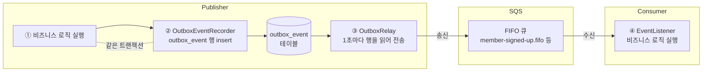
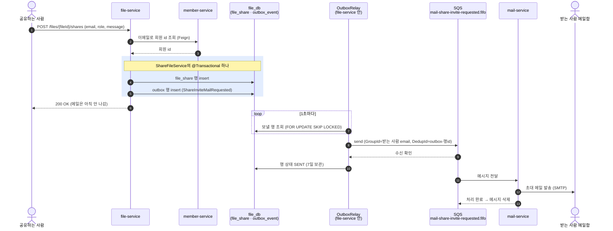
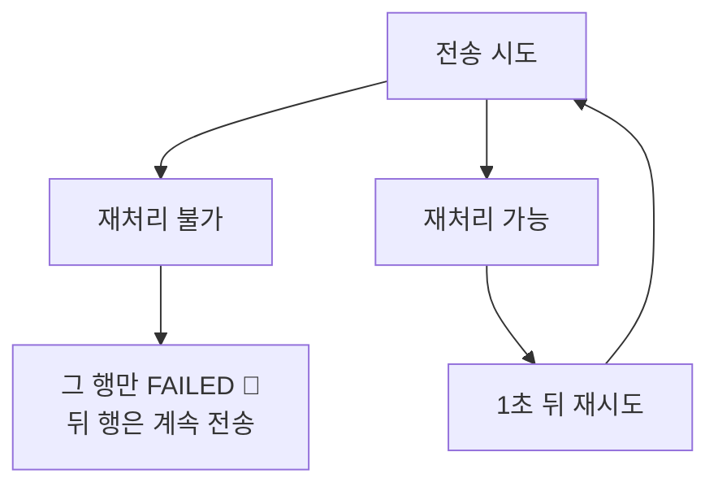
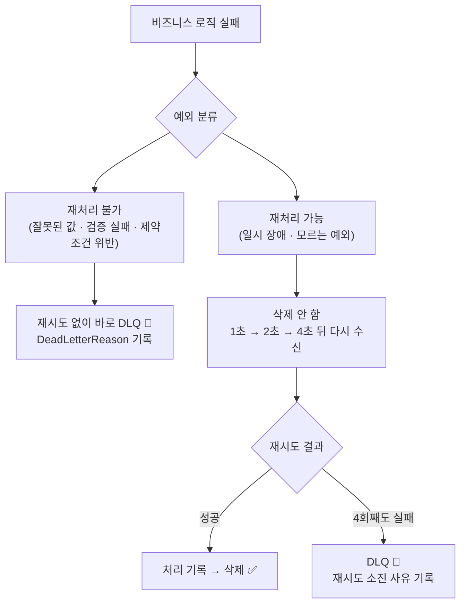

# 비동기 메시징 스펙

이 문서는 서비스끼리 AWS SQS로 이벤트를 주고받는 기능(메일 발송, 인앱 알림, 가입 후 대기 공유 연결)이
어떤 규칙으로 동작하는지 정의한 문서입니다.

⚠️ 이 문서가 기준입니다. 코드가 이 문서와 다르면 코드를 고치고, 동작을 바꾸려면 이 문서를 먼저 고칩니다.
지금은 문서와 코드가 일치하며, 아직 손대지 않은 성능·운영 항목만 [9장](#9-todo)에 남아 있습니다.

---

## 1. 이벤트 처리 과정

### 1-1. 전체 흐름

이벤트는 **DB에 먼저 적고(outbox) → 나중에 SQS로 보내고 → Consumer가 처리**한다. 세 단계가 서로 다른 시점에 일어난다.



- **①②는 한 트랜잭션**: 회원이 저장되면 이벤트도 반드시 남고, 롤백되면 이벤트도 없음.
- **③은 따로 돈다**: SQS가 잠깐 죽어 있어도 행이 테이블에 남아 있다가 다음 틱에 전송됨.
- **④가 처리에 성공하면** 메시지가 큐에서 삭제됨.

### 1-2. 예시: 파일을 공유하면 초대 메일이 나가기까지



- **파란 박스가 핵심**: 공유 행과 메일 이벤트가 한 트랜잭션. 공유가 저장되면 메일은
  반드시 나가고, 커밋이 실패하면 둘 다 없음 → "공유는 됐는데 메일이 안 감"도, "메일은 왔는데 공유가 없음"도 불가능.
- 이벤트 기록은 `ShareFileService`가 공유 행 저장 직후 이벤트 포트(`PublishMailEventPort`)를 직접 불러서 한다 — 같은 `@Transactional` 안.
- 사용자 응답(200 OK)은 메일 발송(SMTP)을 기다리지 않음. 메일은 보통 수 초 안에 도착.

---

## 2. Publisher — Transactional Outbox

### 2-1. 기록

- 비즈니스 코드는 SQS로 직접 보내지 않고 `OutboxEventRecorder.record(queue, key, event)`를 부른다 → `outbox_event` 행 insert.
- 기록은 **유스케이스 서비스가 자기 `@Transactional` 안에서 이벤트 포트를 직접 호출**해서 한다
  (`ShareFileService` → `PublishMailEventPort`·`PublishNotificationEventPort`, `SignUpMemberService` → `PublishMemberEventPort`).
  비즈니스 데이터 저장과 같은 트랜잭션이라 같이 커밋되거나 같이 롤백된다.
- 호출자 트랜잭션이 없으면(예: 가입 인증 메일 요청 — 인증 코드는 Redis) 기록기가 outbox insert만 담은 트랜잭션을 스스로 연다.
  이때 보장은 "insert가 끝나면 결국 전송된다" 하나뿐.

### 2-2. 전송

- `OutboxRelay`가 1초마다(한 틱) `PENDING` 행을 id 순으로 **최대 100개 읽어**(`FOR UPDATE SKIP LOCKED`) **1건씩** 동기 전송한다.
  SQS 일괄 전송(`SendMessageBatch`)은 쓰지 않는다 — 100개를 읽으면 SQS 호출도 100번.
- `SKIP LOCKED`라 인스턴스가 여러 대여도 같은 행을 두 번 보내지 않는다.
- **MessageGroupId = 행의 key**: 같은 키끼리만 순서를 지키고, 키가 다르면 동시에 처리된다(= 키 하나가 동시 처리 단위).
  키는 **그 이벤트의 결과를 받는 대상**으로 잡는다 — 메일·알림은 받는 사람, 가입은 가입한 사람.
  그래서 한 사람의 메시지가 실패해 재시도 중이어도 다른 사람은 막히지 않는다.
  128자 넘는 키(긴 이메일)는 UUID로 해시(같은 키 → 같은 그룹).
- **MessageDeduplicationId = `outbox-<행 id>`**: SQS가 받았는데 SENT 표시 커밋 전에 죽어서 재전송돼도 5분 안이면 SQS가 버린다.
  Consumer 멱등성 체크의 키로도 쓴다([3-1](#3-1-멱등성-체크)).
- 성공하면 `status = SENT`, `sent_at` 기록. SENT 행은 **7일 보관** 후 relay가 1시간마다 정리한다.

### 2-3. 전송 실패

실패는 **"이 메시지가 잘못됐나, 인프라가 잘못됐나"** 딱 둘로 갈린다.



| 구분 | 실패 | 무엇 |
|---|---|---|
| **재처리 불가** | payload 복원 실패 | 이벤트 클래스가 바뀌어 저장된 payload를 객체로 못 되살림 |
| 〃 | 직렬화 실패 | 객체를 JSON으로 못 바꿈 — SQS에 닿기도 전 |
| 〃 | SQS가 거절 | 큐 없음 · 크기 초과 · 잘못된 값 (400) |
| **재처리 가능** | 일시 장애 | 연결 실패 · 5xx · 스로틀링 · 권한 거부 |

재처리 불가는 다시 해도 결과가 같으니 그 행만 버린다. 재처리 가능만 다시 보내고, **횟수 제한이 없다.**

**왜 횟수 제한이 없나** — 여기서 실패하는 건 그 메시지가 아니라 인프라다. 장애가 나면 모든 행이 똑같이 실패하므로,
N번에 `FAILED`로 보내면 멀쩡한 이벤트가 무더기로 빠지고 복구 후 사람이 일일이 되돌려야 한다.
저절로 복구될 일을 수동 작업으로 바꾸는 셈이다. 행이 `PENDING`으로 남아 있는 것 자체가 이미 안전한 보관 상태다.

**그럼 장애를 어떻게 알아채나** — `FAILED` 행이 안 생기니 테이블만 봐서는 모른다.
대신 **가장 오래 기다린 행이 몇 초째 기다리는지**를 숫자로 내보낸다(`modudrive.outbox.lag`).
평소엔 1초 근처에 머물고, 전송이 막히면 계속 올라간다. 여기에 알람을 건다([9장 운영](#운영)).

**SDK가 먼저 재시도한다** — relay가 `publish()`를 한 번 부르면 SDK가 그 안에서 최대 4번 시도한다
(기본 LEGACY 모드, 100ms부터 지수 백오프 + jitter). 다 합쳐도 1초가 안 된다.
그 안에 성공하면 relay는 실패가 있었는지도 모르고 넘어간다. **위 표의 "일시 장애"는 1초를 넘게 끊겼다는 뜻이다.**

### 2-4. 행 상태

| 상태 | 뜻 | 언제 사라지나 |
|---|---|---|
| `PENDING` | 기록됨, 아직 안 보냄 (전송될 때까지 계속 재시도) | 전송되면 SENT |
| `SENT` | SQS가 받음 (`sent_at`) | **7일 보관** 후 relay가 1시간마다 정리 |
| `FAILED` | 그 메시지 하나가 잘못됨 (`failed_at`, `failure_reason`) | 정리하지 않음, 사람이 처리 |

`FAILED`가 되는 경우는 [2-3](#2-3-전송-실패)의 **재처리 불가** 3가지다.
셋 다 그 행 하나만의 문제이고 **인프라 장애로는 생기지 않으므로**, 한 번에 한두 건이다.

```sql
-- FAILED 행 원인 확인
select id, queue, failed_at, failure_reason from outbox_event where status = 'FAILED';
-- 원인을 고친 뒤 다시 보내기
update outbox_event set status = 'PENDING', failed_at = null, failure_reason = null where id = 123;
```

---

## 3. Consumer

모든 리스너 클래스는 `@EventListener`(클래스용), 메서드는 `@SqsListener(큐)`. 페이로드 타입은 메서드 파라미터에서 추론한다(Jackson 3).

### 3-1. 멱등성 체크

SQS는 at-least-once라 같은 메시지가 두 번 올 수 있다(5분이 지난 outbox 재전송, 처리 후 삭제 전 Consumer 다운 등).
그래서 **처리 전에 "이미 처리한 메시지인가"를 확인**하고, 처리했으면 건너뛰고 메시지만 지운다.

- **키**: 큐 이름 + `MessageDeduplicationId`(`outbox-<행 id>`). SQS 메시지 id는 재전송 때마다 바뀌지만 이 값은 같은 이벤트면 항상 같다.
  큐마다 Publisher가 하나라 큐 이름을 붙이면 행 id가 서비스끼리 겹쳐도 충돌하지 않는다.
- **처리 기록 시점** — 비즈니스 결과와 함께 남긴다:

| Consumer | 기록 위치 | 방식 |
|---|---|---|
| file / notification (DB 있음) | 자기 DB의 `processed_event` 테이블 | 비즈니스 처리와 **같은 트랜잭션**에서 insert → 처리가 실패해 롤백되면 기록도 없음(재시도 때 다시 처리됨) |
| mail (DB 없음, SMTP는 트랜잭션 불가) | Redis (`processed:<큐>:<dedupId>`, TTL 7일) | 메일 발송 **성공 후** 기록. 발송과 기록 사이에 죽으면 메일이 한 번 더 갈 수 있음(허용) |

- 처리 기록은 7일(= outbox SENT 보관 기간) 뒤 정리한다. 그보다 오래된 재전송은 없기 때문.
  DB 쪽은 각 서비스에서 1시간마다 지우고, Redis 쪽은 키 TTL로 알아서 사라진다.
- 재처리 불가로 DLQ에 간 메시지는 기록이 남지 않으므로, 원인을 고친 뒤 redrive하면 **다시 처리된다**.
- 구현: `common:infrastructure:sqs`의 `ProcessedEvents`(포트) + JPA/Redis 구현. 리스너가 `MessageDeduplicationId`
  헤더를 받아 `isProcessed` → 비즈니스 처리 → `markProcessed` 순으로 부른다.
- notification의 `notification.event_id` 고유 제약은 그대로 둔다 — DB 레벨의 마지막 방어선.

### 3-2. 처리 성공

비즈니스 로직이 예외 없이 끝나면 처리 기록을 남기고 메시지를 삭제한다(ACK).

### 3-3. 실패 처리



| 구분 | 예 | 처리 |
|---|---|---|
| 재처리 가능 | SMTP·네트워크 타임아웃, DB 락, **분류에 없는 모든 예외** | 지수 백오프(1s → 2s → 4s)로 재시도, 4번째도 실패하면 DLQ — 사유 `Retries exhausted after 4 attempts: <마지막 예외>` |
| 재처리 불가 | `IllegalArgumentException`, `NullPointerException`, `ClassCastException`, 검증 실패(`ValidationException`), 제약조건 위반(`DataIntegrityViolationException`), 페이로드 타입 변환 실패 | 한 번 실패하면 바로 DLQ, 원본 본문 + 사유(`DeadLetterReason`) 보관 |
| JSON 자체가 깨진 메시지 | `{not json` | 리스너까지 오지 않음(Spring Cloud AWS가 변환 단계에서 버림) → 큐 visibility(10초)마다 다시 와서 4번째 뒤 **redrive로 DLQ** (약 40초, 사유 없음) |

- 분류는 예외의 원인 체인을 끝까지 따라가서 판단하고, **모르면 재처리 가능 쪽**으로 둔다 — 쓸데없는 재시도 몇 초보다 잘못 버려서 사람이 되살리는 쪽이 비싸다.
- 수신 한도(4회)와 DLQ 이름은 앱에 적지 않고 **큐의 `RedrivePolicy`를 읽어서** 쓴다 — 설정은 elasticmq.conf / Terraform 한 곳뿐.
- 큐의 redrive policy는 **안전망**: 에러 핸들러까지 오지 못한 메시지(Consumer가 죽음, 깨진 JSON)도 결국 DLQ로 간다(사유 없음).
- DLQ로 옮기는 것 자체가 실패하면 재시도 경로로 넘긴다(유실 없음).
- FIFO라 같은 그룹의 뒤 메시지는 앞 메시지가 처리되거나 DLQ로 갈 때까지 대기.
- 구현: `common:infrastructure:sqs`의 `SqsFailures`(분류) + `DeadLetteringErrorHandler`(모든 `@SqsListener`에 자동 적용).

---

## 4. 큐 목록

큐는 4개, 전부 **FIFO**. 큐마다 실패 메시지가 옮겨지는 DLQ(`<이름>-dlq.fifo`)가 하나씩 짝으로 있음.

| 기능 | 언제 | 결과 |
|---|---|---|
| [가입 인증 메일](#4-1-가입-인증-메일) | "인증 코드 받기" 클릭 | 인증 코드 메일 발송 |
| [공유 초대 메일](#4-2-공유-초대-메일) | 이메일로 파일/폴더 공유 | 초대 메일 발송 |
| [인앱 공유 알림](#4-3-인앱-공유-알림) | 회원에게 공유 | 벨 아이콘 알림 생성 |
| [가입 후 대기 공유 연결](#4-4-가입-후-대기-공유-연결) | 가입 완료 | 가입 전에 받은 초대가 "공유 문서함"에 나타남 |

### 4-1. 가입 인증 메일

| | |
|---|---|
| 큐 | `mail-verification-requested.fifo` |
| 언제 | 가입 화면에서 "인증 코드 받기" — `POST /api/v1/member/verify-email/request` |
| Publisher | member-service `OutboxMailEventPublisher` — 인증 코드를 Redis에 저장하고 이벤트 기록 |
| Consumer | mail-service `MailEventListener` — 코드가 담긴 메일 발송 |
| 이벤트 / 키 | `VerificationMailRequested` / email |

사용자는 메일로 받은 코드를 입력(`verify-email/confirm`)해야 가입할 수 있음.

### 4-2. 공유 초대 메일

| | |
|---|---|
| 큐 | `mail-share-invite-requested.fifo` |
| 언제 | 파일/폴더를 이메일로 공유 — `POST /api/v1/files/{fileId}/shares` |
| Publisher | file-service `OutboxMailEventPublisher` — 공유 행 저장과 같은 트랜잭션에서 기록 |
| Consumer | mail-service `MailEventListener` — 초대 메일 발송 |
| 이벤트 / 키 | `ShareInviteMailRequested` / 받는 사람 email |

받는 사람에 따라 메일이 다름:
- **회원** — "OO님이 파일을 공유했습니다" 메일, 로그인해서 열람
- **비회원** — `inviteToken`이 담긴 **로그인 없이 여는 링크**. 공유는 가입 전까지 "대기(pending)" 상태 → [4-4](#4-4-가입-후-대기-공유-연결)

공유할 때 메시지를 적었으면 메일 본문에 같이 들어감.

### 4-3. 인앱 공유 알림

| | |
|---|---|
| 큐 | `notification-file-shared.fifo` |
| 언제 | 공유 대상이 **회원**일 때만 (비회원은 계정이 없어 메일만 감) |
| Publisher | file-service `OutboxNotificationEventPublisher` — 초대 메일 이벤트와 같은 트랜잭션에서 함께 기록 |
| Consumer | notification-service `NotificationEventListener` — 알림 행 저장 |
| 이벤트 / 키 | `FileSharedNotified` / recipientId |

사용자는 헤더 벨 아이콘과 `/notifications` 목록에서 확인 (WEB이 30초마다 폴링).

### 4-4. 가입 후 대기 공유 연결

| | |
|---|---|
| 큐 | `member-signed-up.fifo` |
| 언제 | 가입 완료 — `POST /api/v1/member/sign-up` |
| Publisher | member-service `OutboxMemberEventPublisher` — 가입 트랜잭션 안에서 기록 |
| Consumer | file-service `MemberEventListener` — 그 이메일로 걸려 있던 대기 공유를 새 회원에게 연결(claim) |
| 이벤트 / 키 | `MemberSignedUp` / email |

연결 전 확인 사항:
- member-service에 "이 memberId가 정말 이 이메일 주인인지" 다시 물어봄 (메시지 내용을 그대로 믿지 않음)
- 그 사이 소유자가 같은 파일을 이 회원에게 따로 공유했다면, 남은 대기 초대는 삭제

가입 시 네임스페이스(내 드라이브) 생성은 큐가 아니라 커밋 후 Feign 동기 호출이라 여기 없음.

### 참고

- 큐 이름 상수(`MailQueues`, `MemberQueues`, `NotificationQueues`)와 이벤트 레코드는 `common:event`.
- SQS 큐 이름엔 `.`을 못 써서(`.fifo` 접미사 제외) 하이픈으로 이름 지음.
- 키는 FIFO의 `MessageGroupId` — 같은 키끼리만 순서가 보장됨 ([2-2](#2-2-전송)).

## 5. 인프라

| | 로컬 | AWS |
|---|---|---|
| SQS | ElasticMQ 컨테이너 (`.docker/docker-compose.infra.yml`, 포트 9324) | Amazon SQS |
| 큐/DLQ/redrive 정의 | `.docker/elasticmq/elasticmq.conf` | Terraform (conf와 똑같이 맞출 것) |
| 접속 | `SPRING_CLOUD_AWS_SQS_ENDPOINT=http://elasticmq:9324` + 더미 키 | endpoint/키 미설정 → ECS task role, `AWS_REGION` |

- LocalStack이 아니라 ElasticMQ인 이유: LocalStack 이미지가 2026-03-23부터 auth token 필수가 됨. ElasticMQ는 무료·가입 불필요, FIFO/redrive 지원.
- ElasticMQ는 **메모리 저장** — 재시작하면 큐에 떠 있던 메시지는 사라짐. 아직 안 보낸 건 outbox 테이블에 남아 있으니 유실은 "전송 완료 후 소비 전"인 것만.
- 앱은 큐를 만들지 않음(`queue-not-found-strategy: fail`) — 없으면 기동 실패. 자동 생성하면 DLQ/redrive 없는 큐가 생기기 때문.
- 큐 상태 보기: `curl "http://localhost:9324/?Action=GetQueueAttributes&QueueUrl=http://localhost:9324/000000000000/<큐>&AttributeName.1=All"`

## 6. 재처리 (replay)

- **Consumer 실패 재처리**: DLQ → 원래 큐로 redrive (AWS 콘솔 버튼 / `StartMessageMoveTask`). 로컬은 DLQ에서 받아 다시 보내면 됨.
- **Publisher 실패 재처리**: `FAILED` 행을 `PENDING`으로 되돌림 ([2-4](#2-4-행-상태)).
- **성공한 과거 이벤트 replay**: SQS는 처리 후 삭제라 Kafka식 offset 되감기는 불가. 대신 보낸 행이 outbox에 **7일간 SENT로 남아 있으므로**,
  그 기간 안이면 `PENDING`으로 되돌려 다시 발행할 수 있다. 단 같은 `DedupId`라 **Consumer 멱등성 체크에 걸려 건너뛴다** —
  정말 다시 처리시키려면 Consumer의 처리 기록도 지워야 한다. 현재 이 기능을 쓰는 곳은 없음.

## 7. 트레이싱

- `spring.cloud.aws.sqs.observation-enabled: true` — `traceparent`가 SQS 메시지 속성으로 전달돼 Consumer 스팬이 원래 요청 트레이스에 붙음.
- 기록 시 요청의 trace 헤더를 `outbox_event.trace_headers`에 저장 → 릴레이가 그걸로 **Observation**(`ReceiverContext`)을 열고 그 안에서 전송.
  bare span이 아니라 Observation이어야 하는 이유: `SqsTemplate`은 현재 Observation을 부모로 잡는데, 큐별 첫 전송은 큐 URL 조회 때문에 SDK 스레드에서 이어져서 thread-local span이 안 보임 → 첫 메시지만 트레이스가 끊겼었음.

## 8. 테스트

- `ElasticMqQueueConfigTest` (sqs 모듈, Testcontainers): 실제 `elasticmq.conf`로 dedup 1회 전달, 재처리 가능 실패 → 백오프 4회 후 재시도 소진 사유와 함께 DLQ, 재처리 불가 실패 → 1회 만에 사유와 함께 DLQ, 깨진 JSON → redrive로 DLQ.
- `SqsFailuresTest`: 전송 실패 분류(400·직렬화 실패는 영구, 장애·SDK가 던지는 IAE/NPE는 재시도), redrive 설정 파싱, 사유 추출, 그룹 id 해시, DLQ 이름 규칙. `PermanentFailuresTest`(messaging): Consumer 실패 분류 + Publisher는 변환 계열만 영구로 본다는 것.
- `JpaProcessedEventsTest` (messaging 모듈, Postgres Testcontainers): 같은 id 재인식, 호출자 롤백 시 기록 없음, 보관 기간 지난 것만 정리.
- `OutboxRelayTest` (messaging 모듈, Postgres Testcontainers): 순서, group/dedup 헤더, 일시 실패 시 중단, 브로커가 거절한 행만 격리, 복원 불가 행, SENT 정리, SKIP LOCKED, 전송 중 현재 Observation, 적체 게이지(대기 없으면 0 / 가장 오래된 행의 나이 / 막혀 있으면 FAILED 없이 올라감).

## 9. TODO

### 성능 (필요해지면)

- [ ] **일괄 전송(`SendMessageBatch`)** ([2-2](#2-2-전송)): 지금은 한 행씩 동기 전송이라 SQS 호출 한 번에 5~20ms,
  한 틱(1초)에 보낼 수 있는 양이 대략 50~200건이다. 초당 50건을 꾸준히 넘기면 outbox가 밀리기 시작한다.
  `SqsTemplate.sendMany`로 10건씩 묶으면 호출 수와 비용이 1/10이 되지만, **부분 실패**(10건 중 일부만 실패) 처리가
  생겨 "실패하면 멈춘다"는 지금 규칙을 다시 짜야 한다.
  **도입 신호**: 아래 적체 알람이 울리기 시작할 때.

### 운영

- [ ] **outbox 적체 알람**: 게이지 `modudrive.outbox.lag`(초)는 나가고 있으니, **알람 규칙만 남았다** —
  N분 넘게 올라가 있거나 `FAILED` 행이 생기면 알람.
  Publisher는 전송 실패에 횟수 제한을 두지 않으므로([2-3](#2-3-전송-실패)) **이게 유일한 감지 수단**이다 —
  규칙이 없으면 SQS가 죽어도 아무도 모른 채 테이블만 쌓인다.
  지금은 Prometheus에 규칙을 걸고, AWS 모니터링 결정 때 CloudWatch로 옮길지 정한다.
- [ ] **DLQ 알람**: Consumer에서 실패한 메시지는 `<큐>-dlq.fifo`로 옮겨지기만 하고 알려주는 곳이 없다.
  DLQ에도 보관 기간(기본 4일, 최대 14일)이 있어 방치하면 결국 사라진다. DLQ마다 "`ApproximateNumberOfMessagesVisible > 0`이면
  알람"을 걸어서, 사유(`DeadLetterReason`)를 보고 원인을 고친 뒤 원래 큐로 redrive할 수 있게 한다.
  Terraform으로 큐를 만들 때(CloudWatch Alarm) 같이 넣는다.
